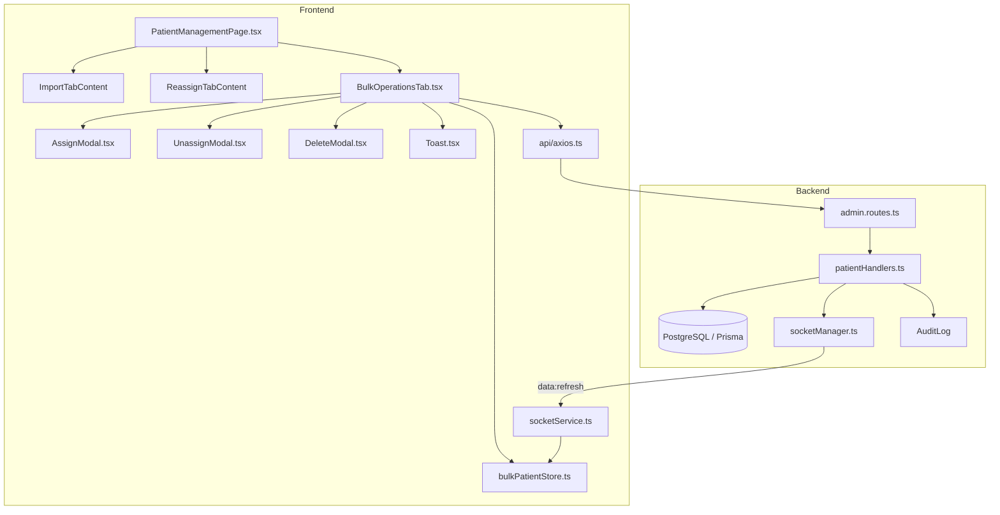
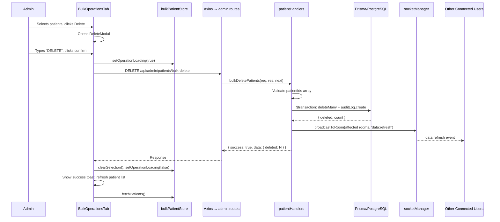
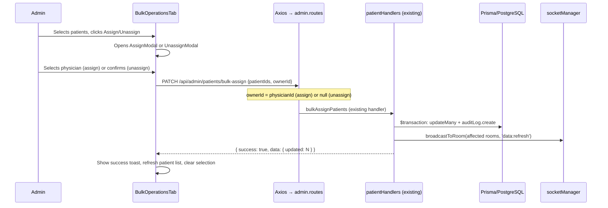

# Design Document: Bulk Patient Management

## Overview

This feature extends the existing Patient Management page (`PatientManagementPage.tsx`) with a new admin-only "Bulk Operations" tab. The tab provides a comprehensive patient management view where admins can see all patients (assigned and unassigned), filter by multiple dimensions, and perform bulk assign, unassign, and delete operations. The design follows existing patterns: standard HTML table (not AG Grid), Tailwind CSS, Zustand state management, Axios HTTP client, and Express route handlers with Prisma.

The feature requires two new backend endpoints (`GET /api/admin/patients` and `DELETE /api/admin/patients/bulk-delete`), reuses the existing `PATCH /api/admin/patients/bulk-assign` endpoint for both assign and unassign, and introduces Socket.IO broadcasts for concurrent operation handling.

## Steering Document Alignment

### Technical Standards (tech.md)

| Standard | How This Design Follows It |
|----------|---------------------------|
| React 18 + TypeScript | All new components are TypeScript functional components |
| Tailwind CSS | All styling uses Tailwind utility classes, no custom CSS files |
| Zustand for global state | New `bulkPatientStore.ts` follows the `authStore.ts` pattern (no persist needed) |
| Axios for HTTP | All API calls use the existing `api` instance from `frontend/src/api/axios.ts` |
| Express + Prisma | New route handlers follow the `try/catch + createError + next(error)` pattern |
| ESM modules | All backend files use ESM imports (`.js` extensions in imports) |
| Socket.IO | Broadcasts use existing `broadcastToRoom` and `data:refresh` event pattern |
| Zod validation | Not used in existing `patientHandlers.ts`; new handlers follow the same inline validation pattern for consistency |

### Project Structure (structure.md)

| Convention | Applied Here |
|------------|-------------|
| Pages: PascalCase + Page suffix | `BulkOperationsTab.tsx` (tab content component, not a standalone page) |
| Handlers: camelCase | `patientHandlers.ts` (extended, not new file) |
| Routes: kebab-case + .routes | `admin.routes.ts` (extended, not new file) |
| Tests: Same name + .test | `BulkOperationsTab.test.tsx`, `patientHandlers.test.ts` |
| Stores: camelCase + Store | `bulkPatientStore.ts` |
| Types: camelCase | `bulkPatient.ts` in `frontend/src/types/` |
| E2E (Cypress): kebab-case + .cy | `bulk-operations.cy.ts` |
| E2E (Playwright): kebab-case + .spec | `bulk-operations.spec.ts` |

## Code Reuse Analysis

### Existing Components to Leverage

- **`PatientManagementPage.tsx`**: Extended to add the "Bulk Operations" tab alongside "Import Patients" and "Reassign Patients". Uses the same tab bar pattern (URL search params, `useSearchParams`).
- **`PatientAssignmentPage.tsx` (`ReassignTabContent`)**: Reference pattern for the table layout, checkbox selection with `Set<number>`, row click toggling, physician dropdown, and Assign button UX. The new tab follows the same component structure.
- **`ConfirmModal.tsx`**: Reference for modal overlay/backdrop pattern (fixed positioning, z-50, click-to-dismiss backdrop). The new bulk modals are more complex (patient preview list, confirm input) but use the same shell.
- **`authStore.ts`**: Zustand store pattern reference. The new `bulkPatientStore` follows the same `create<State>()((set, get) => ({ ... }))` shape.
- **`api` (axios instance)**: All HTTP calls use the existing `api` object which auto-attaches JWT tokens and Socket.IO IDs via interceptors.
- **`socketService.ts`**: Existing `data:refresh` event handler on the frontend already triggers data reloads; bulk operations will emit this event to notify other tabs/users.

### Existing Backend to Leverage

- **`patientHandlers.ts`**: Extended with two new handler functions (`getAllPatients`, `bulkDeletePatients`). The existing `bulkAssignPatients` handler already supports `ownerId: null` for unassigning.
- **`admin.routes.ts`**: Extended with two new route registrations. The file already applies `requireAuth` and `requireRole(['ADMIN'])` middleware at the router level, so new endpoints automatically inherit authentication and authorization.
- **`socketManager.ts`**: `broadcastToRoom`, `getRoomName`, and `getIO` are used to broadcast `data:refresh` events after bulk operations.
- **`errorHandler.ts`**: `createError` utility used for validation and error responses in new handlers.
- **Prisma schema**: No schema changes needed. Uses existing `Patient` model (with `ownerId` foreign key and `measures` relation) and `AuditLog` model. `PatientMeasure` already has `onDelete: Cascade` on the `patient` relation.

### Integration Points

- **Authentication/Authorization**: All new endpoints are registered under `admin.routes.ts`, which already applies `requireAuth` + `requireRole(['ADMIN'])`. The frontend hides the tab for non-ADMIN users using the same `user?.roles.includes('ADMIN')` check already in `PatientManagementPage.tsx`.
- **Socket.IO Real-time**: After bulk operations, the backend broadcasts `data:refresh` events to affected physician rooms. The frontend `socketService.ts` already handles `data:refresh` events and triggers data reloads in the main grid.
- **Audit Log**: Bulk operations create `AuditLog` entries within the same transaction, following the pattern established in `bulkAssignPatients`.
- **Toast Notifications**: A new lightweight `Toast` component is introduced (project has no existing toast system). It replaces the inline success/error messages used in `ReassignTabContent`.

## Architecture

### High-Level Component Diagram



### Data Flow: Bulk Delete Operation



### Data Flow: Bulk Assign / Unassign



## Components and Interfaces

### 1. PatientManagementPage.tsx (Modified)

- **Purpose:** Add "Bulk Operations" tab to the existing tab bar.
- **Changes:**
  - Add `'bulk-ops'` to `validTabs` array (admin-only, same pattern as `'reassign'`)
  - Add `{ id: 'bulk-ops', label: 'Bulk Operations' }` to `tabs` array (admin-only)
  - Add `<BulkOperationsTabContent>` in the tab content area
  - Update `document.title` for the new tab
- **Dependencies:** `BulkOperationsTab`, `useAuthStore`
- **Reuses:** Existing tab bar pattern, URL search params routing

### 2. BulkOperationsTab.tsx (New)

- **Purpose:** Main component for the Bulk Operations tab. Contains summary cards, toolbar, filters, patient table (all patients, no pagination), and orchestrates modals.
- **Location:** `frontend/src/pages/BulkOperationsTab.tsx`
- **Interface:**
  ```typescript
  interface BulkOperationsTabProps {
    isActive: boolean;  // Same pattern as ReassignTabContent
  }
  export function BulkOperationsTab({ isActive }: BulkOperationsTabProps)
  ```
- **Responsibilities:**
  - Lazy-loads data on first activation (same `hasActivated` ref pattern as `ReassignTabContent`)
  - Renders summary cards (Total, Assigned, Unassigned, Insurance Systems)
  - Renders toolbar with Select All / Deselect All / Assign / Unassign / Delete buttons
  - Renders filter bar (Physician, Insurance, Measure, Search)
  - Renders HTML table with sticky headers, checkboxes (all patients in single scrollable table, no pagination)
  - Manages modal open/close state
  - Handles toast notifications
- **Dependencies:** `bulkPatientStore`, `useAuthStore`, `AssignModal`, `UnassignModal`, `DeleteModal`, `Toast`
- **Reuses:** `ReassignTabContent` layout pattern, `api` for HTTP

### 3. bulkPatientStore.ts (New Zustand Store)

- **Purpose:** Global state for the Bulk Operations tab. Holds patient data, filters, selection, and loading state.
- **Location:** `frontend/src/stores/bulkPatientStore.ts`
- **Interface:**
  ```typescript
  interface BulkPatientState {
    // Data
    patients: BulkPatient[];
    summary: PatientSummary;
    physicians: Physician[];

    // Filters
    filters: PatientFilters;

    // Selection
    selectedIds: Set<number>;

    // Loading
    loading: boolean;
    operationLoading: boolean;
    error: string | null;

    // Computed (via getters)
    filteredPatients: () => BulkPatient[];
    totalFilteredCount: () => number;

    // Actions
    fetchPatients: () => Promise<void>;
    fetchPhysicians: () => Promise<void>;
    setFilter: (key: keyof PatientFilters, value: string) => void;
    clearFilters: () => void;
    toggleSelection: (id: number) => void;
    selectAllFiltered: () => void;
    deselectAll: () => void;
    toggleAllFiltered: () => void;
    clearSelection: () => void;
    setOperationLoading: (loading: boolean) => void;
    setError: (error: string | null) => void;
  }
  ```
- **Dependencies:** `api` (Axios instance)
- **Reuses:** `authStore.ts` Zustand pattern (no persist)

### 4. AssignModal.tsx (New)

- **Purpose:** Confirmation modal for bulk assign. Shows patient preview, physician dropdown, audit note.
- **Location:** `frontend/src/components/modals/AssignModal.tsx`
- **Interface:**
  ```typescript
  interface AssignModalProps {
    isOpen: boolean;
    patients: BulkPatient[];           // Selected patients (for preview)
    physicians: Physician[];           // Active physicians for dropdown
    totalCount: number;                // Total selected count
    adminEmail: string;                // For audit note display
    loading: boolean;                  // Disable confirm while in progress
    onConfirm: (physicianId: number) => void;
    onClose: () => void;
  }
  ```
- **Dependencies:** None (pure presentational with callbacks)
- **Reuses:** `ConfirmModal.tsx` overlay/backdrop pattern, Lucide icons

### 5. UnassignModal.tsx (New)

- **Purpose:** Confirmation modal for bulk unassign. Shows warning, patient preview, audit note.
- **Location:** `frontend/src/components/modals/UnassignModal.tsx`
- **Interface:**
  ```typescript
  interface UnassignModalProps {
    isOpen: boolean;
    patients: BulkPatient[];
    totalCount: number;
    adminEmail: string;
    loading: boolean;
    onConfirm: () => void;
    onClose: () => void;
  }
  ```
- **Dependencies:** None (pure presentational with callbacks)
- **Reuses:** `ConfirmModal.tsx` overlay/backdrop pattern, amber/warning color scheme

### 6. DeleteModal.tsx (New)

- **Purpose:** Confirmation modal for bulk delete. Shows danger warning, patient preview, "DELETE" confirmation input, audit note.
- **Location:** `frontend/src/components/modals/DeleteModal.tsx`
- **Interface:**
  ```typescript
  interface DeleteModalProps {
    isOpen: boolean;
    patients: BulkPatient[];
    totalCount: number;
    adminEmail: string;
    loading: boolean;
    onConfirm: () => void;
    onClose: () => void;
  }
  ```
- **Internal State:**
  - `confirmText: string` -- tracks the confirmation input value
  - Confirm button enabled only when `confirmText === 'DELETE'`
  - `confirmText` resets to `''` when modal opens (via `useEffect` on `isOpen`)
- **Dependencies:** None (pure presentational with callbacks)
- **Reuses:** `ConfirmModal.tsx` overlay/backdrop pattern, red/danger color scheme

### 7. Toast.tsx (New)

- **Purpose:** Lightweight toast notification component for success/error messages.
- **Location:** `frontend/src/components/layout/Toast.tsx`
- **Interface:**
  ```typescript
  interface ToastProps {
    message: string;
    type: 'success' | 'error';
    isVisible: boolean;
    onDismiss: () => void;
  }
  ```
- **Behavior:**
  - Renders in bottom-right corner (fixed position)
  - Auto-dismisses after 5 seconds via `useEffect` + `setTimeout`
  - Green background for success, red for error
  - Replaces any existing toast when a new one is triggered (managed by parent)
- **Dependencies:** None
- **Reuses:** None (new utility component)

### 8. patientHandlers.ts (Extended -- Backend)

- **Purpose:** Add two new handler functions to the existing file.
- **Location:** `backend/src/routes/handlers/patientHandlers.ts`
- **New Functions:**

  **`getAllPatients`** -- Handler for `GET /api/admin/patients`
  ```typescript
  export async function getAllPatients(
    req: Request, res: Response, next: NextFunction
  ): Promise<void>
  ```
  - Queries all patients with owner relation and measure aggregation
  - Returns structured response with summary counts

  **`bulkDeletePatients`** -- Handler for `DELETE /api/admin/patients/bulk-delete`
  ```typescript
  export async function bulkDeletePatients(
    req: Request, res: Response, next: NextFunction
  ): Promise<void>
  ```
  - Validates `patientIds` array (non-empty, integers, max 5,000)
  - Executes `deleteMany` in a Prisma transaction with audit log
  - Broadcasts `data:refresh` to affected physician rooms via Socket.IO
- **Dependencies:** `prisma`, `createError`, `broadcastToRoom`, `getRoomName`, `getIO`
- **Reuses:** Existing `bulkAssignPatients` handler as pattern reference

### 9. admin.routes.ts (Extended -- Backend)

- **Purpose:** Register two new routes.
- **Changes:**
  ```typescript
  import { bulkAssignPatients, getUnassignedPatients, getAllPatients, bulkDeletePatients } from './handlers/patientHandlers.js';

  // Add before bulk-assign to avoid route conflicts
  router.get('/patients', getAllPatients);
  router.delete('/patients/bulk-delete', bulkDeletePatients);
  ```
- **Note:** Route order matters. `/patients` must come before `/patients/unassigned` is not an issue since both are GET with different paths. The delete route uses a distinct path `/patients/bulk-delete`.

## Data Models

### BulkPatient (Frontend Type)

```typescript
// frontend/src/types/bulkPatient.ts

export interface BulkPatient {
  id: number;
  memberName: string;
  memberDob: string;           // ISO date string (YYYY-MM-DD)
  memberTelephone: string | null;
  ownerId: number | null;
  ownerName: string | null;    // Physician display name, null if unassigned
  insuranceGroup: string | null;
  measureCount: number;
  latestMeasure: string | null;    // Most recent quality measure label
  latestStatus: string | null;     // Most recent measure status
  updatedAt: string;           // ISO datetime string
}

export interface PatientSummary {
  totalPatients: number;
  assignedCount: number;
  unassignedCount: number;
  insuranceSystemCount: number;
}

export interface PatientFilters {
  physician: string;     // '' = all, '__unassigned__' = unassigned, else physician display name
  insurance: string;     // '' = all, else insurance group name
  measure: string;       // '' = all, else quality measure code
  search: string;        // '' = no search, else case-insensitive substring
}

export interface Physician {
  id: number;
  displayName: string;
  email: string;
  role: string;
}
```

### API Response Schemas

**GET /api/admin/patients -- Response**
```typescript
{
  success: true,
  data: {
    patients: BulkPatient[],
    summary: PatientSummary
  }
}
```

**DELETE /api/admin/patients/bulk-delete -- Request**
```typescript
{
  patientIds: number[]   // Non-empty array of patient IDs, max 5,000
}
```

**DELETE /api/admin/patients/bulk-delete -- Response**
```typescript
{
  success: true,
  data: {
    deleted: number      // Count of actually deleted records
  },
  message: "Successfully deleted N patient(s)"
}
```

**PATCH /api/admin/patients/bulk-assign -- (Existing, reused)**
```typescript
// Request
{
  patientIds: number[],
  ownerId: number | null  // null = unassign
}

// Response
{
  success: true,
  data: {
    updated: number,
    newOwnerId: number | null
  },
  message: "Successfully assigned/unassigned N patient(s)"
}
```

### Database Queries (No Schema Changes)

**getAllPatients query:**
```typescript
const patients = await prisma.patient.findMany({
  select: {
    id: true,
    memberName: true,
    memberDob: true,
    memberTelephone: true,
    ownerId: true,
    insuranceGroup: true,
    updatedAt: true,
    owner: {
      select: { displayName: true }
    },
    measures: {
      select: {
        qualityMeasure: true,
        measureStatus: true,
        updatedAt: true,
      },
      orderBy: { updatedAt: 'desc' },
      take: 1,
    },
    _count: {
      select: { measures: true }
    },
  },
  orderBy: { memberName: 'asc' },
});
```

**bulkDeletePatients query:**
```typescript
await prisma.$transaction(async (tx) => {
  // PatientMeasure records cascade-delete automatically
  const result = await tx.patient.deleteMany({
    where: { id: { in: patientIds } },
  });

  await tx.auditLog.create({
    data: {
      action: 'BULK_DELETE_PATIENTS',
      entity: 'Patient',
      entityId: null,
      userId: req.user!.id,
      userEmail: req.user!.email,
      details: {
        patientIds,
        count: result.count,
      },
      ipAddress: req.ip || req.socket.remoteAddress,
    },
  });

  return result;
});
```

## Client-Side Filtering Logic

All filtering is performed client-side on the full patient array fetched from the backend. All patients are displayed in a single scrollable table (no pagination), consistent with the main patient grid. This is appropriate for the expected dataset size (under 10,000 patients per deployment).

### Filtering Strategy

Filters are applied as AND conditions in the store's `filteredPatients()` getter:

```typescript
filteredPatients: () => {
  const { patients, filters } = get();
  return patients.filter(p => {
    // Physician filter
    if (filters.physician === '__unassigned__' && p.ownerId !== null) return false;
    if (filters.physician && filters.physician !== '__unassigned__' && p.ownerName !== filters.physician) return false;

    // Insurance filter
    if (filters.insurance && p.insuranceGroup !== filters.insurance) return false;

    // Measure filter
    if (filters.measure && p.latestMeasure !== filters.measure) return false;

    // Text search (case-insensitive substring on memberName)
    if (filters.search && !p.memberName.toLowerCase().includes(filters.search.toLowerCase())) return false;

    return true;
  });
}
```

### Display Strategy (No Pagination)

All filtered patients are displayed in a single scrollable table with sticky headers, consistent with the main patient grid. No pagination controls are needed.

The table body has a `max-height: 600px` with `overflow-y: auto` for vertical scrolling. Table headers use `position: sticky; top: 0` to remain visible during scroll.

### Selection Strategy

Selection uses a `Set<number>` of patient IDs (same as `ReassignTabContent`).

- **Individual toggle:** Add/remove single ID from set
- **Header checkbox:** Toggle all IDs from `filteredPatients()` (all visible patients)
- **Select All button:** Add all IDs from `filteredPatients()` to set
- **Deselect All button:** Clear the entire set
- **Filter change:** Clear the set (selection is tied to filter state)
- **Performance:** `Set.has()` is O(1) lookup; selecting 5,000 patients is under 1ms

## Socket.IO Event Handling

### Backend Broadcasts After Bulk Operations

After a bulk delete completes, the handler identifies affected physician rooms and broadcasts `data:refresh`:

```typescript
// Determine affected rooms from the patients being deleted
// Query the ownerIds before deletion, then broadcast to each room
const affectedPatients = await tx.patient.findMany({
  where: { id: { in: patientIds } },
  select: { ownerId: true },
});

const affectedOwnerIds = [...new Set(
  affectedPatients.map(p => p.ownerId).filter(Boolean)
)];

// After deletion, broadcast to affected rooms
const io = getIO();
if (io) {
  for (const ownerId of affectedOwnerIds) {
    broadcastToRoom(
      getRoomName(ownerId as number),
      'data:refresh',
      { reason: 'bulk-delete' },
      req.socketId
    );
  }
  // Also broadcast to 'unassigned' room if any unassigned patients were deleted
  if (affectedPatients.some(p => p.ownerId === null)) {
    broadcastToRoom(
      getRoomName('unassigned'),
      'data:refresh',
      { reason: 'bulk-delete' },
      req.socketId
    );
  }
}
```

For bulk assign/unassign, the existing `bulkAssignPatients` handler is reused. Post-operation Socket.IO broadcasts are added to notify affected physician rooms:

```typescript
// After the transaction, broadcast data:refresh to affected rooms
const io = getIO();
if (io) {
  // Broadcast to the new owner's room (assign) or unassigned room (unassign)
  if (ownerId) {
    broadcastToRoom(getRoomName(ownerId), 'data:refresh', { reason: 'bulk-assign' }, req.socketId);
  } else {
    broadcastToRoom(getRoomName('unassigned'), 'data:refresh', { reason: 'bulk-unassign' }, req.socketId);
  }

  // Broadcast to previous owners' rooms (patients may have been reassigned from other physicians)
  for (const prevOwnerId of previousOwnerIds) {
    if (prevOwnerId !== ownerId) {
      broadcastToRoom(getRoomName(prevOwnerId), 'data:refresh', { reason: 'bulk-reassign' }, req.socketId);
    }
  }
}
```

**Note on existing handler modification:** The existing `bulkAssignPatients` handler currently does not broadcast Socket.IO events. This design adds the broadcast after the transaction completes. This requires querying the previous `ownerId` values before the update (within the transaction) to know which rooms to notify.

### Frontend Handling

The `BulkOperationsTab` does not join a physician room (it shows all patients). Instead, it simply re-fetches the patient list after its own operations complete. Other tabs and users viewing the main grid will receive `data:refresh` events through the existing socket handler infrastructure.

## Error Handling

### Error Scenarios

1. **Network failure during bulk operation**
   - **Handling:** Axios interceptor logs the error. The modal's `catch` block displays an error toast with the message. Modal stays open with selections intact.
   - **User Impact:** Red error toast: "Failed to delete patients: Network Error". Admin can retry.

2. **Partial existence (patients deleted by another admin since selection)**
   - **Handling:** Backend `deleteMany` / `updateMany` silently skips non-existent IDs (Prisma semantics). Response returns actual affected count.
   - **User Impact:** Success toast shows actual count (e.g., "Successfully deleted 48 patients" when 50 were selected but 2 were already gone). Patient list refreshes to show current state.

3. **Validation error (empty patientIds, non-integer IDs)**
   - **Handling:** Backend returns HTTP 400 with `VALIDATION_ERROR` code.
   - **User Impact:** Red error toast with validation message. This should not occur in normal use since the UI disables buttons when no patients are selected.

4. **Payload too large (>5,000 patient IDs)**
   - **Handling:** Backend returns HTTP 400 with `PAYLOAD_TOO_LARGE` code.
   - **User Impact:** Red error toast: "Cannot process more than 5,000 patients in a single operation."

5. **Database transaction failure**
   - **Handling:** Prisma `$transaction` rolls back automatically. Backend returns HTTP 500 with error message.
   - **User Impact:** Red error toast with error details. No partial state change.

6. **Unauthorized access (non-admin tries to call endpoint)**
   - **Handling:** `requireRole(['ADMIN'])` middleware returns HTTP 403 before handler executes.
   - **User Impact:** Should not occur -- the tab is hidden from non-admins. If forced via API, returns 403 error.

7. **Patient list stale (response count differs from expected)**
   - **Handling:** After any bulk operation, the frontend always re-fetches the full patient list, ensuring staleness is resolved.
   - **User Impact:** Transparent -- the list updates to show current state.

## API Endpoint Specifications

### GET /api/admin/patients

| Attribute | Value |
|-----------|-------|
| Method | GET |
| Path | `/api/admin/patients` |
| Auth | JWT + ADMIN role (via router-level middleware) |
| Request Body | None |
| Response (200) | `{ success: true, data: { patients: BulkPatient[], summary: PatientSummary } }` |
| Response (401) | `{ success: false, error: { code: 'UNAUTHORIZED', message: '...' } }` |
| Response (403) | `{ success: false, error: { code: 'FORBIDDEN', message: '...' } }` |

### DELETE /api/admin/patients/bulk-delete

| Attribute | Value |
|-----------|-------|
| Method | DELETE |
| Path | `/api/admin/patients/bulk-delete` |
| Auth | JWT + ADMIN role (via router-level middleware) |
| Request Body | `{ patientIds: number[] }` |
| Validation | `patientIds` must be non-empty array of integers, max 5,000 elements |
| Response (200) | `{ success: true, data: { deleted: number }, message: "Successfully deleted N patient(s)" }` |
| Response (400) | `{ success: false, error: { code: 'VALIDATION_ERROR', message: '...' } }` |
| Response (400) | `{ success: false, error: { code: 'PAYLOAD_TOO_LARGE', message: '...' } }` |
| Side Effects | Creates AuditLog entry, broadcasts `data:refresh` via Socket.IO |

### PATCH /api/admin/patients/bulk-assign (Existing -- Enhanced)

| Attribute | Value |
|-----------|-------|
| Method | PATCH |
| Path | `/api/admin/patients/bulk-assign` |
| Auth | JWT + ADMIN role (via router-level middleware) |
| Request Body | `{ patientIds: number[], ownerId: number \| null }` |
| Enhancement | Add Socket.IO `data:refresh` broadcast after transaction |

## File Inventory

### New Files

| File | Type | Purpose |
|------|------|---------|
| `frontend/src/pages/BulkOperationsTab.tsx` | React Component | Main tab content component |
| `frontend/src/stores/bulkPatientStore.ts` | Zustand Store | State management for bulk operations |
| `frontend/src/types/bulkPatient.ts` | TypeScript Types | Type definitions for bulk patient data |
| `frontend/src/components/modals/AssignModal.tsx` | React Component | Bulk assign confirmation modal |
| `frontend/src/components/modals/UnassignModal.tsx` | React Component | Bulk unassign confirmation modal |
| `frontend/src/components/modals/DeleteModal.tsx` | React Component | Bulk delete confirmation modal |
| `frontend/src/components/layout/Toast.tsx` | React Component | Toast notification utility |

### Modified Files

| File | Change |
|------|--------|
| `frontend/src/pages/PatientManagementPage.tsx` | Add "Bulk Operations" tab and `BulkOperationsTab` rendering |
| `backend/src/routes/handlers/patientHandlers.ts` | Add `getAllPatients` and `bulkDeletePatients` handlers |
| `backend/src/routes/admin.routes.ts` | Register two new routes, update import |

### Test Files (New)

| File | Framework | Purpose |
|------|-----------|---------|
| `frontend/src/pages/BulkOperationsTab.test.tsx` | Vitest | Component rendering, filtering, selection, scrollable table |
| `frontend/src/stores/bulkPatientStore.test.ts` | Vitest | Store actions, filtering logic, selection management |
| `frontend/src/components/modals/AssignModal.test.tsx` | Vitest | Modal open/close, physician selection, confirm/cancel |
| `frontend/src/components/modals/UnassignModal.test.tsx` | Vitest | Modal open/close, confirm/cancel |
| `frontend/src/components/modals/DeleteModal.test.tsx` | Vitest | Modal open/close, "DELETE" input validation, confirm/cancel |
| `frontend/src/components/layout/Toast.test.tsx` | Vitest | Render, auto-dismiss, type variants |
| `backend/src/routes/handlers/__tests__/patientHandlers.test.ts` | Jest | getAllPatients and bulkDeletePatients unit tests |
| `backend/src/routes/__tests__/admin.routes.bulkpatient.test.ts` | Jest | Route-level auth tests for new endpoints |
| `frontend/cypress/e2e/bulk-operations.cy.ts` | Cypress | E2E: selection, filtering, modal flows |
| `frontend/e2e/bulk-operations.spec.ts` | Playwright | E2E: tab navigation, bulk operation flows |

## Testing Strategy

### Unit Testing (Jest -- Backend)

**patientHandlers.test.ts:**
- `getAllPatients`: Returns all patients with correct shape, includes summary counts, handles empty database
- `bulkDeletePatients`: Validates empty array returns 400, validates non-integer IDs return 400, validates >5,000 IDs return 400, successful delete returns count, creates audit log entry, handles non-existent IDs gracefully (deleteMany semantics), calls broadcastToRoom with correct rooms
- Mock Prisma client and socketManager

**admin.routes.bulkpatient.test.ts:**
- Auth guard tests: 401 without token, 403 with non-admin role (for both new endpoints)
- Route registration verification

### Component Testing (Vitest -- Frontend)

**BulkOperationsTab.test.tsx:**
- Renders summary cards with correct counts
- Renders toolbar with disabled buttons when no selection
- Enables buttons when patients are selected
- Filters patients by physician, insurance, measure, search
- Clears selection when filters change
- Renders all filtered patients in scrollable table (no pagination)
- Opens correct modal for each action button
- Shows loading spinner during data fetch
- Shows empty state messages
- Shows error state on API failure

**bulkPatientStore.test.ts:**
- `fetchPatients`: Sets patients and summary, handles errors
- `filteredPatients`: Applies AND-condition filters correctly
- `selectAllFiltered`: Selects all filtered patient IDs
- `toggleSelection`: Adds/removes single IDs
- `deselectAll`: Clears set
- `setFilter`: Clears selection

**Modal tests (AssignModal, UnassignModal, DeleteModal):**
- Renders patient preview (first 10 + "...and N more")
- Shows audit note with admin email
- Assign: Physician dropdown, confirm disabled without selection
- Delete: "DELETE" input validation, confirm disabled until match
- All: Confirm button shows loading spinner when `loading=true`
- All: Close/cancel callbacks fire correctly

**Toast.test.tsx:**
- Renders success variant (green)
- Renders error variant (red)
- Auto-dismisses after 5 seconds
- Calls onDismiss callback

### End-to-End Testing (Cypress)

**bulk-operations.cy.ts:**
- Tab visibility: Admin sees "Bulk Operations" tab; non-admin does not
- Data loads when tab is activated
- Summary cards display correct counts
- Select All / Deselect All toggles correctly
- Individual row selection via click
- Header checkbox toggles all visible patients
- Filter by physician shows filtered results
- Filter by insurance shows filtered results
- Search by name filters in real time
- Clear filters resets all
- Assign flow: select patients, open modal, select physician, confirm, verify toast
- Unassign flow: select patients, open modal, confirm, verify toast
- Delete flow: select patients, open modal, type "DELETE", confirm, verify toast
- Delete modal: confirm button disabled until "DELETE" typed

### End-to-End Testing (Playwright)

**bulk-operations.spec.ts:**
- Navigation to Bulk Operations tab
- Full assign workflow with verification
- Full delete workflow with "DELETE" confirmation
- Toast notification appears and auto-dismisses
- Empty state when no patients exist

### Visual Review (MCP Playwright -- Layer 5)

- Summary cards layout and responsiveness
- Toolbar button states (disabled/enabled/loading)
- Table row hover and selection highlighting
- Modal designs (assign blue, unassign amber, delete red)
- Toast positioning and animation
- Filter bar layout
- Sticky header behavior

## Performance Considerations

| Concern | Mitigation |
|---------|-----------|
| Initial load with 5,000+ patients | Single GET request; data transferred as JSON (~500KB for 5K patients). 3-second SLA. |
| Client-side filtering on 5,000 patients | `Array.filter()` on simple string comparisons. Measured at <10ms for 10K records. |
| Select All on 5,000 patients | `Set` construction from mapped array. O(n) with ~1ms for 5K. |
| Rendering 5,000 rows (all patients) | Single scrollable table with sticky headers via CSS `position: sticky`. No pagination overhead. Consistent with main patient grid pattern. |
| Bulk delete 500 patients | Single `deleteMany` query (not N individual deletes). Prisma cascade handles measures. 10-second SLA. |
| Re-renders on selection change | Selection stored as `Set<number>` in Zustand store. React re-renders only the table body. Individual row highlight via `className` conditional. |
| Number formatting (locale) | `Intl.NumberFormat` used for all patient counts in UI. |

## Security Considerations

| Requirement | Implementation |
|-------------|---------------|
| ADMIN-only access | Router-level `requireRole(['ADMIN'])` middleware on all endpoints; frontend hides tab via `user?.roles.includes('ADMIN')` |
| Defense in depth | Backend handler validates `req.user!.roles` even though middleware already checks (per NFR-SEC-3) |
| Delete confirmation | Frontend requires typing "DELETE" (case-sensitive exact match) before confirm button enables |
| Audit trail | All operations create `AuditLog` entries within the same transaction: action type, admin ID, admin email, IP address, patient IDs, count |
| Payload size limit | Backend rejects `patientIds` arrays larger than 5,000 elements (prevents DoS via large payloads) |
| CSRF | JWT-based auth (not cookie-based), so CSRF is not applicable |
| XSS | React's JSX auto-escapes all rendered values; no `dangerouslySetInnerHTML` used |
