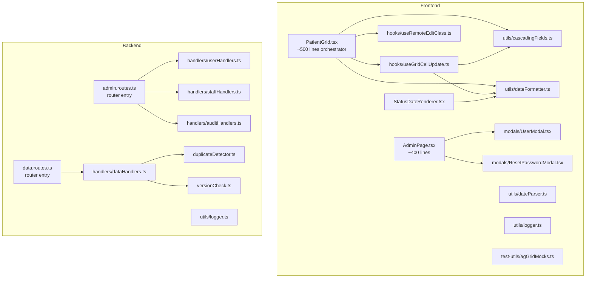
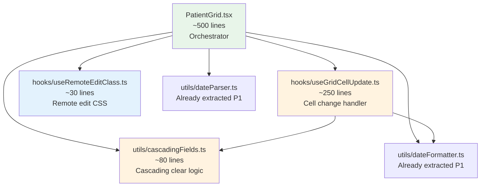
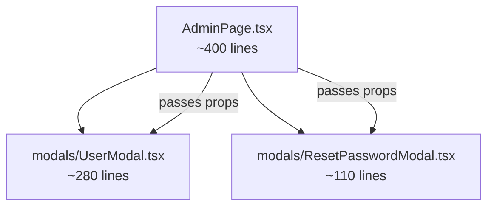
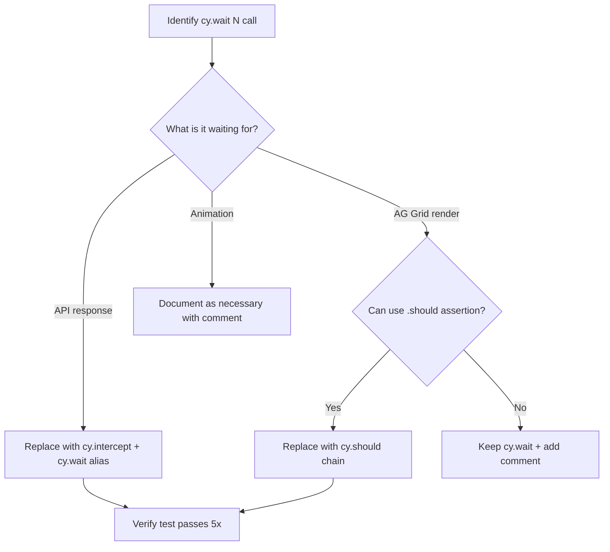

# Design: Code Quality Refactor

## Introduction

This document specifies the technical design for the code-quality-refactor feature (33 requirements across 10 phases). It is a purely internal refactoring effort -- no new features, no API changes, no schema changes beyond additive indexes. The external API, UI behavior, and data model remain identical.

The design follows the execution order defined in the requirements: safest changes first (database indexes, utility extractions), medium risk next (file decompositions), low risk last (CSS, logging, security, performance, tests).

---

## Steering Document Alignment

### Technical Standards (tech.md)
This design follows the project's established tech stack: React 18 + TypeScript frontend, Express + Prisma backend, AG Grid Community for the data grid, PostgreSQL database. No frameworks or libraries are added or replaced. All new modules use the same tooling: Vitest for frontend tests, Jest for backend tests, Cypress for E2E grid tests.

### Project Structure (structure.md)
New files follow the existing directory conventions:
- Frontend utilities: `frontend/src/utils/` (alongside existing `toast.ts`, `apiError.ts`)
- Frontend config: `frontend/src/config/` (alongside existing `dropdownConfig.ts`, `statusColors.ts`)
- Frontend types: `frontend/src/types/` (alongside existing `index.ts`, `socket.ts`)
- Grid hooks: `frontend/src/components/grid/hooks/` (new subdirectory, follows React hook co-location pattern)
- Grid utilities: `frontend/src/components/grid/utils/` (new subdirectory)
- Modal components: `frontend/src/components/modals/` (alongside existing `AddRowModal.tsx`, `ConfirmModal.tsx`)
- Backend route handlers: `backend/src/routes/handlers/` (new subdirectory)
- Backend utilities: `backend/src/utils/` (alongside existing `dateParser.ts`)
- Test utilities: `frontend/src/test-utils/` (new directory)

### Code Reuse Analysis
Existing components leveraged (not recreated):
- `dropdownConfig.ts` — extended with `HGBA1C_STATUSES` and `BP_STATUSES` exports
- `duplicateDetector.ts:checkForDuplicate()` — reused in `data.routes.ts` to replace inline reimplementation
- `apiError.ts:getApiErrorMessage()` — reused for standardized error extraction (Phase 4.4)
- `toast.ts` — existing notification utility, no changes needed
- `statusColors.ts` — already extracted, serves as model for new extractions
- `frontend/src/types/index.ts` — extended with `SaveStatus`, `ConflictData`, `AdminUser`, `Physician` types

---

## Architecture Overview

### Guiding Principles

1. **Behavior-preserving**: Every module extraction maintains the same function signatures and return values. Existing tests pass without logic changes (only import paths may change).
2. **Incremental commits**: Each phase is a single atomic commit. If a phase introduces a regression, it is independently revertable via `git revert`.
3. **No new dependencies**: All utilities wrap native APIs (console, CSS, TypeScript types).
4. **Build on existing patterns**: New modules follow the project's established conventions (named exports, TypeScript interfaces, Vitest/Jest test patterns).

### High-Level Module Dependency Flow (After Refactoring)



---

## Phase 1: Duplicate Code Consolidation

### 1.1 Date Formatting Utilities

**New file:** `frontend/src/utils/dateFormatter.ts`

#### Module Interface

```typescript
// frontend/src/utils/dateFormatter.ts

/**
 * Format an ISO date string for display (M/D/YYYY, no leading zeros).
 * Uses UTC to avoid timezone shifts.
 * @param value - ISO date string or null
 * @returns Formatted string or empty string if null
 */
export function formatDate(value: string | null): string;

/**
 * Format an ISO date string for cell editing (M/D/YYYY).
 * Identical to formatDate for this project but kept separate
 * for semantic clarity (display vs edit context).
 */
export function formatDateForEdit(value: string | null): string;

/**
 * Format today's date for display (M/D/YYYY using local time).
 * Used by StatusDateRenderer's "Today" button.
 */
export function formatTodayDisplay(): string;
```

#### Before/After

**Before** (PatientGrid.tsx lines 125-132, duplicated in StatusDateRenderer.tsx lines 13-20):
```typescript
const formatDate = (value: string | null): string => {
  if (!value) return '';
  const date = new Date(value);
  const year = date.getUTCFullYear();
  const month = date.getUTCMonth() + 1;
  const day = date.getUTCDate();
  return `${month}/${day}/${year}`;
};
```

**After** (PatientGrid.tsx):
```typescript
import { formatDate, formatDateForEdit } from '../../utils/dateFormatter';
// Local definitions removed. All usages reference the import.
```

#### AdminPage Variant (CQR-P1-R1-AC4 via EC1 Exception)

The AdminPage `formatDate` (line 185) uses `toLocaleString()` instead of UTC formatting. This is intentionally different -- it formats timestamps (DateTime), not date-only fields. Per requirement edge case EC1 ("IF the implementations differ, THEN the shared function SHALL accommodate both behaviors OR the AdminPage SHALL use a thin wrapper"), the AdminPage will use a thin local wrapper renamed to `formatTimestamp` for clarity, with a comment referencing `dateFormatter.ts` and noting the distinction. This satisfies CQR-P1-R1-AC4 via the EC1 exception path because the AdminPage's formatting needs (locale-aware DateTime display) are fundamentally different from the grid's UTC date-only formatting.

**New file:** `frontend/src/utils/dateParser.ts`

```typescript
// frontend/src/utils/dateParser.ts

/**
 * Parse a date string with flexible format validation.
 * Returns ISO string at UTC noon, or null if invalid.
 *
 * Supported formats: M/D/YYYY, MM/DD/YYYY, M-D-YYYY, MM-DD-YYYY,
 * M.D.YYYY, YYYY-MM-DD, MMDDYYYY, short year (YY -> 20YY)
 */
export function parseAndValidateDate(input: string): string | null;

/**
 * Show a date format error alert to the user.
 */
export function showDateFormatError(): void;
```

This is a direct extraction of `parseAndValidateDate` (84 lines, PatientGrid.tsx lines 163-240) and `showDateFormatError` (line 243). No logic changes.

#### File Impact Map

| File | Change |
|------|--------|
| `frontend/src/utils/dateFormatter.ts` | **NEW** - Shared date formatting |
| `frontend/src/utils/dateParser.ts` | **NEW** - Date parsing (from PatientGrid) |
| `frontend/src/utils/__tests__/dateFormatter.test.ts` | **NEW** - Unit tests |
| `frontend/src/utils/__tests__/dateParser.test.ts` | **NEW** - Unit tests |
| `frontend/src/components/grid/PatientGrid.tsx` | Remove local `formatDate`, `formatDateForEdit`, `formatTodayDisplay`, `parseAndValidateDate`, `showDateFormatError`; add imports |
| `frontend/src/components/grid/StatusDateRenderer.tsx` | Remove local `formatDate`, `formatTodayDisplay`; add imports |
| `frontend/src/pages/AdminPage.tsx` | Rename local `formatDate` to `formatTimestamp`; add comment |

### 1.2 Status Array Constants

**Modified file:** `frontend/src/config/dropdownConfig.ts`

#### New Exports

```typescript
// Added to frontend/src/config/dropdownConfig.ts

/** HgbA1c-related measure statuses that use dropdown editors for tracking columns. */
export const HGBA1C_STATUSES = [
  'HgbA1c ordered',
  'HgbA1c at goal',
  'HgbA1c NOT at goal',
] as const;

/** Blood pressure call-back statuses that use text input for tracking2. */
export const BP_STATUSES = [
  'Scheduled call back - BP not at goal',
  'Scheduled call back - BP at goal',
] as const;
```

These replace the 9 inline `hgba1cStatuses` and 3 inline `bpStatuses` definitions scattered across PatientGrid.tsx (lines 817, 861, 1064, 1085, 1121, 1154, 1162, 1181, 1201 for hgba1c; lines 1155, 1182, 1202 for BP).

#### Before/After

**Before** (PatientGrid.tsx, repeated 9 times):
```typescript
const hgba1cStatuses = ['HgbA1c ordered', 'HgbA1c at goal', 'HgbA1c NOT at goal'];
```

**After** (PatientGrid.tsx):
```typescript
import { HGBA1C_STATUSES, BP_STATUSES } from '../../config/dropdownConfig';
// All inline definitions removed. Usages: HGBA1C_STATUSES.includes(status)
```

**Verification step**: Before consolidating, each inline definition must be compared to ensure identical values. The Prisma seed data is the source of truth.

### 1.3 CSS Stripe Pattern Consolidation

#### Design

Define a CSS custom property set for the shared stripe pattern, then compose into `.cell-disabled` and `.cell-prompt`.

**Before** (`index.css` lines 102-125):
```css
.ag-theme-alpine .cell-disabled {
  background-image: repeating-linear-gradient(
    -45deg, transparent, transparent 4px,
    rgba(0, 0, 0, 0.06) 4px, rgba(0, 0, 0, 0.06) 8px
  ) !important;
  color: #6B7280 !important;
  font-style: italic;
}

.ag-theme-alpine .cell-prompt {
  background-image: repeating-linear-gradient(
    -45deg, transparent, transparent 4px,
    rgba(0, 0, 0, 0.06) 4px, rgba(0, 0, 0, 0.06) 8px
  ) !important;
  color: #4B5563 !important;
  font-style: italic;
}
```

**After**:
```css
/* Shared stripe overlay pattern for cells that need visual differentiation */
.ag-theme-alpine .stripe-overlay {
  background-image: repeating-linear-gradient(
    -45deg,
    transparent,
    transparent 4px,
    rgba(0, 0, 0, 0.06) 4px,
    rgba(0, 0, 0, 0.06) 8px
  ) !important;
  font-style: italic;
}

/* Disabled cell — N/A, not editable */
.ag-theme-alpine .cell-disabled {
  color: #6B7280 !important;
}

/* Prompt cell — needs data entry */
.ag-theme-alpine .cell-prompt {
  color: #4B5563 !important;
}
```

The `.stripe-overlay` class is applied via AG Grid's `cellClass` callbacks alongside the existing `.cell-disabled` or `.cell-prompt` classes. Each cell that currently gets `cell-disabled` will now get `['stripe-overlay', 'cell-disabled']`, and similarly for `cell-prompt`.

**Risk**: Visual regression if the class is not applied in the correct order or if the `!important` removal for background-image on the sub-classes causes specificity issues. The `.stripe-overlay` class retains `!important` on `background-image` since it overrides AG Grid's inline styles.

### 1.4 Backend Duplicate Check Consolidation

#### Before (data.routes.ts line ~660):

```typescript
// Inline reimplementation in check-duplicate endpoint
const isNullOrEmpty = (value: string | null | undefined) => !value || value.trim() === '';
if (isNullOrEmpty(requestType) || isNullOrEmpty(qualityMeasure)) { ... }
const existingMeasures = await prisma.patientMeasure.findMany({
  where: { patientId: patient.id, requestType, qualityMeasure },
});
```

#### After:

```typescript
import { checkForDuplicate } from '../services/duplicateDetector.js';
// ...
const { isDuplicate, duplicateIds } = await checkForDuplicate(
  patient.id, requestType, qualityMeasure
);
res.json({
  success: true,
  data: { isDuplicate, existingCount: duplicateIds.length },
});
```

The response format remains identical (`isDuplicate` boolean + count). The `checkForDuplicate` service already handles null/empty checks internally.

### 1.5 Auth Verification Documentation

No code changes. Add comments to `backend/src/middleware/auth.ts` and `backend/src/middleware/socketAuth.ts`:

```typescript
// NOTE: This token verification pattern is shared with socketAuth.ts.
// If a third verification site is needed, extract to a shared verifyTokenAndLoadUser() helper.
```

---

## Phase 2: Database and Query Optimization

### 2.1 Batch N+1 Updates in Duplicate Detection

#### Current Problem

In `duplicateDetector.ts`, `updateDuplicateFlags()` lines 71-77 execute individual `prisma.patientMeasure.update()` calls inside a loop for rows with null/empty requestType or qualityMeasure:

```typescript
for (const measure of measures) {
  if (isNullOrEmpty(measure.requestType) || isNullOrEmpty(measure.qualityMeasure)) {
    await prisma.patientMeasure.update({  // N+1: one query per row
      where: { id: measure.id },
      data: { isDuplicate: false },
    });
    continue;
  }
  // ...
}
```

Similarly, `syncAllDuplicateFlags()` (line 152) iterates the entire map with individual updates.

#### Batched Design

```typescript
export async function updateDuplicateFlags(patientId: number): Promise<void> {
  const measures = await prisma.patientMeasure.findMany({
    where: { patientId },
    select: { id: true, requestType: true, qualityMeasure: true },
  });

  // Collect IDs for null/empty rows (always NOT duplicate)
  const nullFieldIds: number[] = [];
  const groups = new Map<string, number[]>();

  for (const measure of measures) {
    if (isNullOrEmpty(measure.requestType) || isNullOrEmpty(measure.qualityMeasure)) {
      nullFieldIds.push(measure.id);
      continue;
    }
    const key = `${measure.requestType}|${measure.qualityMeasure}`;
    const existing = groups.get(key) || [];
    existing.push(measure.id);
    groups.set(key, existing);
  }

  // Batch 1: Mark all null-field rows as not-duplicate in one query
  if (nullFieldIds.length > 0) {
    await prisma.patientMeasure.updateMany({
      where: { id: { in: nullFieldIds } },
      data: { isDuplicate: false },
    });
  }

  // Batch 2-N: One updateMany per group (existing pattern, already batched)
  for (const [, ids] of groups) {
    const isDuplicate = ids.length > 1;
    await prisma.patientMeasure.updateMany({
      where: { id: { in: ids } },
      data: { isDuplicate },
    });
  }
}
```

For `syncAllDuplicateFlags()`:

```typescript
export async function syncAllDuplicateFlags(): Promise<void> {
  const duplicateMap = await detectAllDuplicates();

  // Split into true/false groups for batch update
  const trueIds: number[] = [];
  const falseIds: number[] = [];
  for (const [id, isDuplicate] of duplicateMap) {
    if (isDuplicate) trueIds.push(id);
    else falseIds.push(id);
  }

  // Two batch queries instead of N individual queries
  if (trueIds.length > 0) {
    await prisma.patientMeasure.updateMany({
      where: { id: { in: trueIds } },
      data: { isDuplicate: true },
    });
  }
  if (falseIds.length > 0) {
    await prisma.patientMeasure.updateMany({
      where: { id: { in: falseIds } },
      data: { isDuplicate: false },
    });
  }
}
```

**Complexity**: O(distinct_groups) for `updateDuplicateFlags`, O(2) for `syncAllDuplicateFlags`. Down from O(total_rows).

### 2.2-2.4 Database Index Migration

#### Single Migration Design

All three indexes are added in one Prisma migration file to minimize migration count.

**Schema additions** (in `schema.prisma`):

```prisma
model PatientMeasure {
  // ... existing fields ...

  // NEW indexes for Phase 2
  @@index([patientId, requestType, qualityMeasure])  // CQR-P2-R2: Duplicate detection
  @@index([requestType])                               // CQR-P2-R4: Filter queries
  // Existing indexes remain unchanged:
  // @@index([patientId])
  // @@index([qualityMeasure])
  // @@index([measureStatus])
  // @@index([dueDate])
  // @@index([statusDate])
}

model AuditLog {
  // ... existing fields ...

  // NEW index for Phase 2
  @@index([entity, entityId, action, createdAt])  // CQR-P2-R3: Version check queries
  // Existing indexes remain unchanged:
  // @@index([createdAt])
  // @@index([userId])
  // @@index([userEmail])
  // @@index([entity, entityId])
}
```

**Migration SQL** (generated by `npx prisma migrate dev`):

```sql
-- CreateIndex: Duplicate detection compound
CREATE INDEX "patient_measures_patient_id_request_type_quality_measure_idx"
ON "patient_measures"("patient_id", "request_type", "quality_measure");

-- CreateIndex: Request type standalone
CREATE INDEX "patient_measures_request_type_idx"
ON "patient_measures"("request_type");

-- CreateIndex: Audit log version check compound
CREATE INDEX "audit_log_entity_entity_id_action_created_at_idx"
ON "audit_log"("entity", "entity_id", "action", "created_at");
```

All are additive `CREATE INDEX` statements. No destructive changes. Non-locking on PostgreSQL (concurrent index creation).

### 2.5 Transaction Safety: Bulk Assign

#### Before (admin.routes.ts line ~698-719):

```typescript
// Update all patients (not in transaction)
const result = await prisma.patient.updateMany({
  where: { id: { in: patientIds } },
  data: { ownerId },
});

// Create audit log (not in transaction -- if this fails, patients are already updated)
await prisma.auditLog.create({ ... });
```

#### After:

```typescript
const { result, auditEntry } = await prisma.$transaction(async (tx) => {
  const result = await tx.patient.updateMany({
    where: { id: { in: patientIds } },
    data: { ownerId },
  });

  const auditEntry = await tx.auditLog.create({
    data: {
      action: 'BULK_ASSIGN_PATIENTS',
      entity: 'Patient',
      entityId: null,
      userId: req.user!.id,
      userEmail: req.user!.email,
      details: { patientIds, newOwnerId: ownerId, count: result.count },
      ipAddress: req.ip || req.socket.remoteAddress,
    },
  });

  return { result, auditEntry };
});
```

The API response format and status codes remain identical.

### 2.6 Version Check Field Extraction Simplification

#### Before (versionCheck.ts line ~148-157):

```typescript
for (const log of recentLogs) {
  const changes = log.changes as { fields?: Array<{ field: string }> } | null;
  if (changes?.fields) {
    for (const change of changes.fields) {
      if (!serverChangedFields.includes(change.field)) {
        serverChangedFields.push(change.field);
      }
    }
  }
}
```

#### After:

```typescript
const serverChangedFields = [
  ...new Set(
    recentLogs.flatMap((log) => {
      const changes = log.changes as { fields?: Array<{ field: string }> } | null;
      return changes?.fields?.map((c) => c.field) ?? [];
    })
  ),
];
```

Same behavior, single expression instead of nested loops. The `Set` handles deduplication.

---

## Phase 3: Large File Decomposition

### 3.1 PatientGrid.tsx Decomposition

This is the highest-risk refactoring. PatientGrid.tsx is 1,351 lines containing grid rendering, cell editing, cascading updates, conflict resolution, and remote sync all in one component.

#### Target Architecture



#### Directory Structure (Before/After)

**Before:**
```
frontend/src/components/grid/
  PatientGrid.tsx          (1,351 lines)
  AutoOpenSelectEditor.tsx
  DateCellEditor.tsx
  StatusDateRenderer.tsx
```

**After:**
```
frontend/src/components/grid/
  PatientGrid.tsx          (~500 lines, orchestrator)
  AutoOpenSelectEditor.tsx (unchanged)
  DateCellEditor.tsx       (unchanged)
  StatusDateRenderer.tsx   (updated imports only)
  hooks/
    useGridCellUpdate.ts   (~250 lines)
    useRemoteEditClass.ts  (~30 lines)
  utils/
    cascadingFields.ts     (~80 lines)
```

#### cascadingFields.ts Interface

```typescript
// frontend/src/components/grid/utils/cascadingFields.ts

import type { RowNode } from 'ag-grid-community';
import type { GridRow } from '../PatientGrid';

/**
 * Fields that are cleared when a parent field changes.
 * Hierarchy: requestType -> qualityMeasure -> measureStatus -> tracking/dates
 */
export interface CascadeResult {
  /** Key-value pairs to include in the API update payload */
  updatePayload: Record<string, unknown>;
}

/**
 * Compute the cascading field clears and auto-fills when a parent field changes.
 * Also applies setDataValue calls to the AG Grid row node for immediate UI update.
 *
 * @param field - The field that changed
 * @param newValue - The new value of the changed field
 * @param node - AG Grid RowNode for calling setDataValue
 * @returns CascadeResult with update payload additions
 */
export function applyCascadingUpdates(
  field: string,
  newValue: unknown,
  node: RowNode<GridRow>
): CascadeResult;
```

The function encapsulates the three cascading blocks (requestType, qualityMeasure, measureStatus) from `onCellValueChanged` (lines 520-580). It calls `node.setDataValue()` for each cleared field and returns the accumulated `updatePayload` entries.

**Implementation pattern:**

```typescript
export function applyCascadingUpdates(
  field: string,
  newValue: unknown,
  node: RowNode<GridRow>
): CascadeResult {
  const updatePayload: Record<string, unknown> = {};

  const clearDownstream = (fields: string[]) => {
    for (const f of fields) {
      updatePayload[f] = null;
      node.setDataValue(f, null);
    }
  };

  const DOWNSTREAM_FROM_REQUEST_TYPE = [
    'measureStatus', 'statusDate', 'tracking1', 'tracking2',
    'tracking3', 'dueDate', 'timeIntervalDays',
  ];

  if (field === 'requestType') {
    const autoFillQM = getAutoFillQualityMeasure(newValue as string);
    if (autoFillQM) {
      updatePayload.qualityMeasure = autoFillQM;
      node.setDataValue('qualityMeasure', autoFillQM);
    } else {
      updatePayload.qualityMeasure = null;
      node.setDataValue('qualityMeasure', null);
    }
    clearDownstream(DOWNSTREAM_FROM_REQUEST_TYPE);
  }

  if (field === 'qualityMeasure') {
    clearDownstream(DOWNSTREAM_FROM_REQUEST_TYPE);
  }

  if (field === 'measureStatus') {
    clearDownstream([
      'statusDate', 'tracking1', 'tracking2',
      'tracking3', 'dueDate', 'timeIntervalDays',
    ]);
  }

  return { updatePayload };
}
```

#### useGridCellUpdate.ts Interface

```typescript
// frontend/src/components/grid/hooks/useGridCellUpdate.ts

import type { CellValueChangedEvent } from 'ag-grid-community';
import type { GridRow } from '../PatientGrid';

interface UseGridCellUpdateOptions {
  onRowUpdated?: (row: GridRow) => void;
  onRowDeleted?: (id: number) => void;
  onSaveStatusChange?: (status: 'idle' | 'saving' | 'saved' | 'error') => void;
  getQueryParams: () => string;
  gridRef: React.RefObject<AgGridReact<GridRow>>;
  frozenRowOrderRef: React.MutableRefObject<number[] | null>;
  setConflictData: (data: ConflictData | null) => void;
  setConflictModalOpen: (open: boolean) => void;
}

interface UseGridCellUpdateReturn {
  onCellValueChanged: (event: CellValueChangedEvent<GridRow>) => Promise<void>;
  isCascadingUpdateRef: React.MutableRefObject<boolean>;
}

export function useGridCellUpdate(options: UseGridCellUpdateOptions): UseGridCellUpdateReturn;
```

This hook extracts the `onCellValueChanged` handler (~140 lines) and the `isCascadingUpdateRef`. It receives callbacks and refs as options rather than accessing component state directly, keeping the interface explicit and testable.

#### useRemoteEditClass.ts Interface

```typescript
// frontend/src/components/grid/hooks/useRemoteEditClass.ts

import type { CellClassParams } from 'ag-grid-community';
import type { GridRow } from '../PatientGrid';
import type { ActiveEdit } from '../../../stores/realtimeStore';

/**
 * Returns a cellClass callback that applies 'cell-remote-editing' class
 * when another user is editing the cell.
 */
export function useRemoteEditClass(
  activeEdits: ActiveEdit[]
): (params: CellClassParams<GridRow>) => string | string[];
```

This extracts the `getRemoteEditCellClass` callback (lines 791-803). The hook takes the `activeEdits` array from the realtime store and returns the memoized callback.

#### PatientGrid.tsx Orchestrator (~500 lines)

After extraction, PatientGrid.tsx retains:
- Component props interface and GridRow type exports
- `useImperativeHandle` for remote operations (handleRemoteRowUpdate, handleRemoteRowCreate, handleRemoteRowDelete)
- Column definitions array (using imported callbacks)
- `rowClassRules` definition
- JSX render with `<AgGridReact>` and `<ConflictModal>`
- Conflict modal state and handlers (handleConflictKeepMine, handleConflictKeepTheirs)

The column definitions (~400 lines) remain in PatientGrid.tsx because they reference multiple callbacks and are tightly coupled to the render. Optional future extraction into a `columnDefs.ts` configuration module is noted in the requirements but not required.

#### Risk Assessment

| Risk | Mitigation |
|------|-----------|
| Stale closures after extracting to hooks | Each hook explicitly declares its dependencies. The `useCallback` dependency arrays are verified against all referenced variables. |
| AG Grid API access from extracted modules | `cascadingFields.ts` receives the `RowNode` as a parameter. `useGridCellUpdate` receives `gridRef` as an option. No global grid API singleton. |
| Import circular dependencies | `cascadingFields.ts` (utility) does not import from PatientGrid. `useGridCellUpdate` imports from `cascadingFields` but not vice versa. No cycles. |
| Regression in cascading dropdown behavior | All 30 Cypress `cascading-dropdowns.cy.ts` tests exercise this exact code path. |
| Regression in conflict resolution | Conflict modal handlers remain in PatientGrid.tsx, not extracted. |

### 3.2 AdminPage.tsx Decomposition

#### Target Architecture



#### Directory Structure (After)

```
frontend/src/components/modals/
  AddRowModal.tsx         (existing)
  ConfirmModal.tsx        (existing)
  ConflictModal.tsx       (existing)
  UserModal.tsx           (NEW - extracted from AdminPage)
  ResetPasswordModal.tsx  (NEW - extracted from AdminPage)
```

#### UserModal.tsx Interface

```typescript
// frontend/src/components/modals/UserModal.tsx

export interface UserModalProps {
  user: AdminUser | null;       // null = create mode, object = edit mode
  physicians: Physician[];       // For staff assignment checkboxes
  onClose: () => void;
  onSaved: () => void;
}

export default function UserModal(props: UserModalProps): JSX.Element;
```

The types `AdminUser` and `Physician` will be exported from AdminPage.tsx (or a shared types file) so that both AdminPage and UserModal can reference them.

#### ResetPasswordModal.tsx Interface

```typescript
// frontend/src/components/modals/ResetPasswordModal.tsx

export interface ResetPasswordModalProps {
  userId: number;
  onClose: () => void;
}

export default function ResetPasswordModal(props: ResetPasswordModalProps): JSX.Element;
```

This is a direct extraction of the `ResetPasswordModal` function component (AdminPage.tsx lines 806-917) with no logic changes.

### 3.3 data.routes.ts Decomposition

#### Target Architecture

```
backend/src/routes/
  data.routes.ts              (~120 lines, router + middleware + imports)
  handlers/
    dataHandlers.ts           (~350 lines, GET/POST/PUT/DELETE handlers)
    dataDuplicateHandler.ts   (~60 lines, check-duplicate + duplicate endpoints)
```

#### Handler Function Signatures

```typescript
// backend/src/routes/handlers/dataHandlers.ts

import type { Request, Response, NextFunction } from 'express';

/** GET /api/data - Get all patient measures */
export async function getPatientMeasures(req: Request, res: Response, next: NextFunction): Promise<void>;

/** POST /api/data - Create new row */
export async function createPatientMeasure(req: Request, res: Response, next: NextFunction): Promise<void>;

/** PUT /api/data/:id - Update row */
export async function updatePatientMeasure(req: Request, res: Response, next: NextFunction): Promise<void>;

/** DELETE /api/data/:id - Delete row */
export async function deletePatientMeasure(req: Request, res: Response, next: NextFunction): Promise<void>;
```

```typescript
// backend/src/routes/handlers/dataDuplicateHandler.ts

/** POST /api/data/check-duplicate */
export async function checkDuplicate(req: Request, res: Response, next: NextFunction): Promise<void>;

/** POST /api/data/duplicate - Duplicate a row */
export async function duplicateRow(req: Request, res: Response, next: NextFunction): Promise<void>;
```

The shared helper functions (`getPatientOwnerFilter`, `getPatientOwnerId`) remain in `data.routes.ts` and are exported for use by the handlers.

**Router entry** (data.routes.ts after decomposition):

```typescript
import { Router } from 'express';
import { requireAuth, requirePatientDataAccess } from '../middleware/auth.js';
import { socketIdMiddleware } from '../middleware/socketIdMiddleware.js';
import { getPatientMeasures, createPatientMeasure, updatePatientMeasure, deletePatientMeasure } from './handlers/dataHandlers.js';
import { checkDuplicate, duplicateRow } from './handlers/dataDuplicateHandler.js';

const router = Router();
router.use(requireAuth);
router.use(requirePatientDataAccess);
router.use(socketIdMiddleware);

router.get('/', getPatientMeasures);
router.post('/', createPatientMeasure);
router.put('/:id', updatePatientMeasure);
router.post('/check-duplicate', checkDuplicate);
router.post('/duplicate', duplicateRow);
router.delete('/:id', deletePatientMeasure);

export default router;
```

### 3.4 admin.routes.ts Decomposition

#### Target Architecture

```
backend/src/routes/
  admin.routes.ts             (~80 lines, router + middleware + validation schemas)
  handlers/
    userHandlers.ts           (~250 lines, user CRUD + reset password)
    staffHandlers.ts          (~70 lines, staff assignment CRUD)
    auditHandlers.ts          (~70 lines, audit log query)
    patientHandlers.ts        (~100 lines, bulk assign + unassigned list)
```

#### Handler Function Signatures

```typescript
// userHandlers.ts
export async function listUsers(req: Request, res: Response, next: NextFunction): Promise<void>;
export async function getUser(req: Request, res: Response, next: NextFunction): Promise<void>;
export async function createUser(req: Request, res: Response, next: NextFunction): Promise<void>;
export async function updateUser(req: Request, res: Response, next: NextFunction): Promise<void>;
export async function deleteUser(req: Request, res: Response, next: NextFunction): Promise<void>;
export async function resetPassword(req: Request, res: Response, next: NextFunction): Promise<void>;

// staffHandlers.ts
export async function createStaffAssignment(req: Request, res: Response, next: NextFunction): Promise<void>;
export async function deleteStaffAssignment(req: Request, res: Response, next: NextFunction): Promise<void>;
export async function listPhysicians(req: Request, res: Response, next: NextFunction): Promise<void>;

// auditHandlers.ts
export async function getAuditLog(req: Request, res: Response, next: NextFunction): Promise<void>;

// patientHandlers.ts
export async function bulkAssignPatients(req: Request, res: Response, next: NextFunction): Promise<void>;
export async function getUnassignedPatients(req: Request, res: Response, next: NextFunction): Promise<void>;
```

Validation schemas (`createUserSchema`, `updateUserSchema`, etc.) and helper functions (`isValidRoleCombination`) remain in `admin.routes.ts` and are exported.

### 3.5 ImportPreviewPage.tsx Decomposition

#### Extracted Components

```typescript
// frontend/src/components/import/PreviewSummaryCards.tsx
interface PreviewSummaryCardsProps {
  summary: { inserts: number; updates: number; skips: number; duplicates: number; deletes: number };
  patients: { new: number; existing: number; total: number };
  totalChanges: number;
  warningCount: number;
  activeFilter: string | null;
  onFilterChange: (action: string | null) => void;
}

// frontend/src/components/import/PreviewChangesTable.tsx
interface PreviewChangesTableProps {
  changes: PreviewChange[];
  activeFilter: string | null;
}

// frontend/src/components/import/ImportResultsDisplay.tsx
interface ImportResultsDisplayProps {
  results: ImportResult;
  onImportMore: () => void;
  onGoToGrid: () => void;
}
```

---

## Phase 4: Error Handling and Async Safety

### 4.1 setTimeout Memory Leak Fix

#### Pattern

For each component with `setTimeout` calls, store the timeout ID in a ref and clear it on unmount.

**Affected files and current setTimeout calls:**

| File | Count | Purpose |
|------|-------|---------|
| `PatientGrid.tsx` | 3 | Reset save status after 2-3 seconds |
| `MainPage.tsx` | 6 | Reset save status, copy confirmation |
| `AdminPage.tsx` | 1 | Auto-close reset password modal |
| `Header.tsx` | 3 | Reset copy/save status indicators |
| `ResetPasswordPage.tsx` | 2 | Reset status indicators |

**Design pattern** (applied uniformly):

```typescript
// Before:
setTimeout(() => {
  onSaveStatusChange?.('idle');
}, 2000);

// After:
const saveStatusTimerRef = useRef<ReturnType<typeof setTimeout>>();

// In the handler:
clearTimeout(saveStatusTimerRef.current);
saveStatusTimerRef.current = setTimeout(() => {
  onSaveStatusChange?.('idle');
}, 2000);

// Cleanup on unmount:
useEffect(() => {
  return () => {
    clearTimeout(saveStatusTimerRef.current);
  };
}, []);
```

**Exceptions** (NOT modified per EC1 and EC2 in requirements):
- `AutoOpenSelectEditor.tsx` `setTimeout(() => stopEditing(), 0)` -- microtask delay, fires synchronously in same event loop tick
- `toast.ts` -- DOM-appended elements, cleanup handled by element removal

### 4.2 Unhandled Async in useEffect

**MainPage.tsx socket handler** (line ~232):

```typescript
// Before:
socket.on('data:refresh', () => {
  loadData();  // Unhandled promise
});

// After:
socket.on('data:refresh', () => {
  loadData().catch((err) => {
    showToast(getApiErrorMessage(err, 'Failed to refresh data'), 'error');
  });
});
```

**useEffect async pattern** (applied to MainPage, PatientGrid, AdminPage):

```typescript
// Before:
useEffect(() => {
  loadData();
}, [dependency]);

// After:
useEffect(() => {
  const fetchData = async () => {
    try {
      await loadData();
    } catch (err) {
      showToast(getApiErrorMessage(err, 'Failed to load data'), 'error');
    }
  };
  fetchData();
}, [dependency]);
```

### 4.3 useEffect Dependency Staleness

**MainPage.tsx** -- `loadData()` depends on `getQueryParams()` which is not in the dependency array.

```typescript
// Before:
useEffect(() => {
  loadData();
}, [activeTab]);  // Missing getQueryParams

// After:
useEffect(() => {
  loadData();
}, [activeTab, getQueryParams]);  // getQueryParams is already memoized with useCallback
```

Since `getQueryParams` is defined with `useCallback([user?.roles, selectedPhysicianId])`, adding it to the dependency array will cause the effect to re-fire when the user switches physicians -- which is the correct behavior (reload data for the new physician).

### 4.4 Error Type Handling

**Before** (PatientGrid.tsx line ~626):

```typescript
const axiosError = error as {
  response?: {
    data?: {
      error?: { message?: string; code?: string };
      data?: ConflictResponse['data'];
    };
    status?: number;
  };
};
```

**After:**

```typescript
import axios from 'axios';
// ...
if (axios.isAxiosError(error)) {
  const statusCode = error.response?.status;
  const errorCode = error.response?.data?.error?.code;
  // ... rest of handling uses typed error.response
} else {
  showToast('An unexpected error occurred', 'error');
}
```

The `getApiErrorMessage()` utility from `frontend/src/utils/apiError.ts` is used where it already exists; remaining manual property access chains are replaced with the `isAxiosError()` type guard.

---

## Phase 5: TypeScript Strictness

### 5.1 AG Grid Mock Factory Design

**New file:** `frontend/src/test-utils/agGridMocks.ts`

```typescript
// frontend/src/test-utils/agGridMocks.ts

import { vi } from 'vitest';
import type {
  ICellRendererParams,
  ICellEditorParams,
  ValueFormatterParams,
  ValueGetterParams,
  ValueSetterParams,
  CellValueChangedEvent,
  GridApi,
  ColumnApi,
  Column,
  RowNode,
} from 'ag-grid-community';

/** Create a minimal mock GridApi with common methods. */
export function createMockGridApi(overrides?: Partial<GridApi>): GridApi;

/** Create a mock RowNode with typed data. */
export function createMockRowNode<T = Record<string, unknown>>(
  data: T,
  overrides?: Partial<RowNode<T>>
): RowNode<T>;

/** Create a mock Column with field and colId. */
export function createMockColumn(field: string): Column;

/** Create typed ICellRendererParams with sensible defaults. */
export function createCellRendererParams<T = Record<string, unknown>>(
  overrides?: Partial<ICellRendererParams<T>>
): ICellRendererParams<T>;

/** Create typed ICellEditorParams with sensible defaults. */
export function createCellEditorParams<T = Record<string, unknown>>(
  overrides?: Partial<ICellEditorParams<T>>
): ICellEditorParams<T>;

/** Create typed ValueFormatterParams with sensible defaults. */
export function createValueFormatterParams<T = Record<string, unknown>>(
  overrides?: Partial<ValueFormatterParams<T>>
): ValueFormatterParams<T>;

/** Create typed ValueGetterParams. */
export function createValueGetterParams<T = Record<string, unknown>>(
  overrides?: Partial<ValueGetterParams<T>>
): ValueGetterParams<T>;

/** Create typed ValueSetterParams. */
export function createValueSetterParams<T = Record<string, unknown>>(
  overrides?: Partial<ValueSetterParams<T>>
): ValueSetterParams<T>;

/** Create typed CellValueChangedEvent. */
export function createCellValueChangedEvent<T = Record<string, unknown>>(
  overrides?: Partial<CellValueChangedEvent<T>>
): CellValueChangedEvent<T>;
```

**Factory implementation pattern:**

```typescript
export function createMockGridApi(overrides?: Partial<GridApi>): GridApi {
  return {
    addEventListener: vi.fn(),
    removeEventListener: vi.fn(),
    getSelectedRows: vi.fn().mockReturnValue([]),
    getRowNode: vi.fn(),
    applyTransaction: vi.fn(),
    refreshCells: vi.fn(),
    flashCells: vi.fn(),
    stopEditing: vi.fn(),
    getEditingCells: vi.fn().mockReturnValue([]),
    forEachNodeAfterFilterAndSort: vi.fn(),
    setFocusedCell: vi.fn(),
    startEditingCell: vi.fn(),
    applyColumnState: vi.fn(),
    getColumnState: vi.fn().mockReturnValue([]),
    getDisplayedRowAtIndex: vi.fn(),
    ...overrides,
  } as unknown as GridApi;
}

export function createCellRendererParams<T = Record<string, unknown>>(
  overrides?: Partial<ICellRendererParams<T>>
): ICellRendererParams<T> {
  const mockApi = createMockGridApi();
  const mockNode = createMockRowNode<T>({} as T);
  const mockColumn = createMockColumn('');

  return {
    value: null,
    valueFormatted: null,
    data: {} as T,
    node: mockNode,
    colDef: { field: '' },
    column: mockColumn,
    api: mockApi,
    context: {},
    getValue: vi.fn(),
    setValue: vi.fn(),
    formatValue: vi.fn(),
    refreshCell: vi.fn(),
    registerRowDragger: vi.fn(),
    setTooltip: vi.fn(),
    eGridCell: document.createElement('div'),
    eParentOfValue: document.createElement('div'),
    rowIndex: 0,
    fullWidth: false,
    ...overrides,
  } as ICellRendererParams<T>;
}
```

**Targeted test files for migration (in priority order):**

| Test File | Current `as any` | Target Reduction |
|-----------|-----------------|-----------------|
| `AutoOpenSelectEditor.test.tsx` | 27 | 25+ removed |
| `StatusDateRenderer.test.tsx` | 18 | 15+ removed |
| `DateCellEditor.test.tsx` | 14 | 12+ removed |
| `PatientGrid.test.tsx` | 12 (production) | Addressed in P5-R2 |
| Other test files | ~30 | 15+ removed |
| **Total** | ~100 | **50+ removed** |

### 5.2 Record<string, unknown> Replacement

#### Specific Types to Create

```typescript
// frontend/src/types/grid.ts (or extend existing types/index.ts)

/** Payload for updating a patient measure via PUT /api/data/:id */
export interface MeasureUpdatePayload {
  requestType?: string | null;
  qualityMeasure?: string | null;
  measureStatus?: string | null;
  statusDate?: string | null;
  statusDatePrompt?: string | null;
  tracking1?: string | null;
  tracking2?: string | null;
  tracking3?: string | null;
  dueDate?: string | null;
  timeIntervalDays?: number | null;
  notes?: string | null;
  expectedVersion?: string;
  forceOverwrite?: boolean;
}

/** Payload for creating/updating a user via admin API */
export interface UserUpdatePayload {
  email?: string;
  displayName?: string;
  roles?: string[];
  isActive?: boolean;
}

export interface UserCreatePayload extends UserUpdatePayload {
  password: string;
}
```

These replace the `Record<string, unknown>` usages in:
- `PatientGrid.tsx` line 509 (`updatePayload`)
- `AdminPage.tsx` lines 554, 590 (`updateData`, `createData`)
- `admin.routes.ts` line 323 (`updateData`)

### 5.3 SaveStatus Type

```typescript
// frontend/src/types/grid.ts

/** Auto-save indicator state */
export type SaveStatus = 'idle' | 'saving' | 'saved' | 'error';
```

Used in:
- `MainPage.tsx` line 28: `useState<SaveStatus>('idle')`
- `PatientGrid.tsx` line 115: `onSaveStatusChange?: (status: SaveStatus) => void`
- `Toolbar.tsx`: save indicator display
- `StatusBar.tsx`: connected status

### 5.4 Return Type Annotations

Add explicit return types to all newly extracted utility functions and existing exported service functions. Example:

```typescript
// Before:
export function formatDate(value: string | null) { ... }

// After:
export function formatDate(value: string | null): string { ... }
```

Priority files: all new utilities from Phases 1 and 3, plus `dueDateCalculator.ts`, `duplicateDetector.ts`, `statusDatePromptResolver.ts`, `versionCheck.ts`.

---

## Phase 6: Logging Infrastructure

### 6.1 Backend Logger Design

**New file:** `backend/src/utils/logger.ts`

```typescript
// backend/src/utils/logger.ts

export interface LogContext {
  [key: string]: unknown;
}

export interface Logger {
  info(message: string, context?: LogContext): void;
  warn(message: string, context?: LogContext): void;
  error(message: string, context?: LogContext): void;
  debug(message: string, context?: LogContext): void;
}

/**
 * Environment-aware logger.
 *
 * Production (NODE_ENV === 'production'):
 *   Outputs structured JSON: {"timestamp":"...","level":"INFO","message":"...","context":{}}
 *
 * Development:
 *   Outputs human-readable: [INFO] 2026-02-11T10:30:00Z - Server started on port 3000
 *
 * No external dependencies. Wraps console.log/warn/error.
 */
export const logger: Logger;
```

**Implementation pattern:**

```typescript
const isProduction = process.env.NODE_ENV === 'production';

function formatMessage(level: string, message: string, context?: LogContext): string {
  const timestamp = new Date().toISOString();

  if (isProduction) {
    return JSON.stringify({
      timestamp,
      level: level.toUpperCase(),
      message,
      ...(context && Object.keys(context).length > 0 ? { context } : {}),
    });
  }

  const contextStr = context ? ` ${JSON.stringify(context)}` : '';
  return `[${level.toUpperCase()}] ${timestamp} - ${message}${contextStr}`;
}

export const logger: Logger = {
  info(message: string, context?: LogContext) {
    console.log(formatMessage('INFO', message, context));
  },
  warn(message: string, context?: LogContext) {
    console.warn(formatMessage('WARN', message, context));
  },
  error(message: string, context?: LogContext) {
    console.error(formatMessage('ERROR', message, context));
  },
  debug(message: string, context?: LogContext) {
    if (isProduction) return; // Suppress debug in production
    console.log(formatMessage('DEBUG', message, context));
  },
};
```

### 6.2 Backend Console Statement Replacement Map

| File | Occurrences | Replacement |
|------|------------|-------------|
| `index.ts` | 14 | `logger.info('Database connected')`, `logger.error('Failed to init Socket.IO', { error })` |
| `errorHandler.ts` | 1 | `logger.error('Unhandled error', { error: err.message, stack: err.stack })` |
| `emailService.ts` | 2 | `logger.info('Email sent', { to, subject })`, `logger.error('Email send failed', { error })` |
| `socketManager.ts` | 6 | `logger.info('Socket connected', { socketId })`, etc. |
| `previewCache.ts` | 1 | `logger.debug('Preview cache cleanup', { removed: count })` |

Files excluded: test files (`*.test.ts`), scripts (`seedDev.ts`).

### 6.3 Frontend Logger Design

**New file:** `frontend/src/utils/logger.ts`

```typescript
// frontend/src/utils/logger.ts

export interface Logger {
  info(message: string, ...args: unknown[]): void;
  warn(message: string, ...args: unknown[]): void;
  error(message: string, ...args: unknown[]): void;
  debug(message: string, ...args: unknown[]): void;
}

/**
 * Environment-aware frontend logger.
 *
 * Production (import.meta.env.PROD):
 *   debug() and info() are no-ops. Only warn() and error() produce output.
 *
 * Development:
 *   All levels produce console output.
 */
export const logger: Logger = {
  info(message: string, ...args: unknown[]) {
    if (!import.meta.env.PROD) {
      console.log(`[INFO] ${message}`, ...args);
    }
  },
  warn(message: string, ...args: unknown[]) {
    console.warn(`[WARN] ${message}`, ...args);
  },
  error(message: string, ...args: unknown[]) {
    console.error(`[ERROR] ${message}`, ...args);
  },
  debug(message: string, ...args: unknown[]) {
    if (!import.meta.env.PROD) {
      console.log(`[DEBUG] ${message}`, ...args);
    }
  },
};
```

**Frontend replacement map:**

| File | Occurrences | Example |
|------|------------|---------|
| `axios.ts` | 3 | `logger.error('API Error:', error.response.data)` |
| `AdminPage.tsx` | 3 | `logger.error('Failed to load users', err)` |
| `PatientGrid.tsx` | 2 | `logger.error('Failed to save', error)` |
| `ImportPage.tsx` | 1 | `logger.error('Import failed', err)` |
| `MainPage.tsx` | 6 | `logger.error('Failed to load data', err)` |

---

## Phase 7: CSS Quality

### 7.1 !important Reduction Strategy

#### Classification of Current 33 !important Declarations

**Required (AG Grid inline style overrides) -- KEEP:**

| Selector | Reason |
|----------|--------|
| `.row-status-gray { background-color }` | Overrides AG Grid inline row background |
| `.row-status-purple { background-color }` | Same |
| `.row-status-green { background-color }` | Same |
| `.row-status-blue { background-color }` | Same |
| `.row-status-yellow { background-color }` | Same |
| `.row-status-orange { background-color }` | Same |
| `.row-status-white { background-color }` | Same |
| `.row-status-duplicate { border-left }` | Same |
| `.row-status-overdue { background-color }` | Same |
| `.ag-row-selected { outline }` | Overrides AG Grid default selection |
| `.ag-cell-focus { outline }` | Overrides AG Grid default focus |
| `.ag-cell-inline-editing { box-shadow }` | Overrides AG Grid default edit style |
| `.cell-remote-editing { border }` | Must override AG Grid cell border |
| `.stripe-overlay { background-image }` | Must override AG Grid cell background |
| `.cell-prompt.ag-cell-inline-editing { background-image, font-style }` | Override during edit |
| `.cell-prompt .date-cell-editor { background-color, color }` | Override during edit |
| `.cell-disabled .cell-dropdown-arrow { display }` | Override hover rule |
| `.cell-remote-editing .cell-dropdown-arrow { display }` | Override hover rule |
| `.ag-cell-edit-wrapper input { color, background-color }` | Override AG Grid input styles |

**Removable (can use higher specificity) -- REMOVE !important:**

| Current Selector | Higher-Specificity Replacement |
|-----------------|-------------------------------|
| `.cell-invalid { border, background-color }` | `.ag-theme-alpine .ag-cell.cell-invalid` |
| `.cell-warning { border, background-color }` | `.ag-theme-alpine .ag-cell.cell-warning` |
| `.cell-required-empty { border }` | `.ag-theme-alpine .ag-cell.cell-required-empty` |
| `.cell-disabled { color }` | `.ag-theme-alpine .ag-cell.cell-disabled` (already prefixed) |
| `.cell-prompt { color }` | `.ag-theme-alpine .ag-cell.cell-prompt` (already prefixed) |

**Target reduction**: From 33 to ~23 (10 removed). Each removal is tested individually with a visual review to catch cascade failures.

### 7.2 Inline Style Replacement

**PatientGrid.tsx line 1313:**

```typescript
// Before:
<div className="ag-theme-alpine" style={{ width: '100%', height: 'calc(100vh - 200px)' }}>

// After:
<div className="ag-theme-alpine patient-grid-container">
```

```css
/* index.css */
.patient-grid-container {
  width: 100%;
  height: calc(100vh - 200px);
}
```

**PatientManagementPage.tsx tab visibility:**

```typescript
// Before:
<div style={{ display: activeTab === 'grid' ? 'block' : 'none' }}>

// After:
<div className={activeTab === 'grid' ? 'tab-visible' : 'tab-hidden'}>
```

```css
.tab-visible { display: block; }
.tab-hidden { display: none; }
```

---

## Phase 8: Security Hardening

### 8.1 Config Endpoint Input Validation

**Validation helper:**

```typescript
// backend/src/routes/config.routes.ts (or extracted to a shared validation util)

function validateRequiredParam(value: string | undefined, name: string): string {
  if (!value || !value.trim()) {
    throw createError(`Parameter '${name}' is required and cannot be empty`, 400, 'VALIDATION_ERROR');
  }
  return value.trim();
}
```

Applied to all URL parameters in config.routes.ts endpoints.

### 8.2 Dependency Audit

Run `npm audit` on both directories. Document findings in the commit message. Update vulnerable packages where possible. No design required -- this is a procedural step.

### 8.3 Error Log Sanitization

**Before** (axios.ts lines 29-35):

```typescript
console.error('API Error:', error.response.data);
```

**After:**

```typescript
function sanitizeForLogging(data: unknown): unknown {
  if (!data || typeof data !== 'object') return data;
  const sanitized = { ...(data as Record<string, unknown>) };
  const sensitiveKeys = ['password', 'token', 'secret', 'authorization', 'Authorization'];
  for (const key of sensitiveKeys) {
    if (key in sanitized) {
      sanitized[key] = '***';
    }
  }
  return sanitized;
}

// In the error interceptor:
if (error.response) {
  logger.error('API Error', {
    url: error.config?.url,
    status: error.response.status,
    data: sanitizeForLogging(error.response.data),
  });
}
```

Authorization headers are stripped by removing them from the logged config object rather than logging the full request config.

---

## Phase 9: Performance

### 9.1 Grid Re-render Optimization

#### Approach

1. **Profile first**: Use React DevTools Profiler to identify which callbacks cause unnecessary re-renders.
2. **Memoize column definitions**: Wrap the `columnDefs` array in `useMemo` with correct dependencies (already done at line 875, but verify dependency completeness).
3. **Memoize callbacks passed to column defs**: `dropdownCellRenderer`, `getRemoteEditCellClass`, `isDropdownCell`, `onCellClicked` are already wrapped in `useCallback`. After Phase 3 extraction, verify their dependency arrays are complete.
4. **Memoize `rowClassRules`**: Already done at line 1289 with `useMemo(() => ..., [])`. No change needed.

**Constraint**: Only changes that measurably reduce re-renders (verified via React DevTools Profiler) are committed. Speculative memoization is explicitly excluded per CQR-P9-R1-AC4.

### 9.2 Bundle Size Review

Procedural step. Run `npx vite-bundle-visualizer`, analyze output, fix tree-shaking failures. No pre-designed changes -- findings drive the implementation.

---

## Phase 10: Test Quality

### 10.1 Shared AG Grid Test Utilities

Overlaps with Phase 5.1. If Phase 5.1 is completed first, this requirement is satisfied. The `agGridMocks.ts` design is specified in Phase 5.1 above.

### 10.2 Coverage Gap Analysis

Procedural step:
1. Run `cd backend && npm test -- --coverage`
2. Run `cd frontend && npm run test:coverage`
3. Identify service files < 70% line coverage and component files < 60%
4. Write additional tests for critical paths (auth, data mutation, import)
5. Document results in `.claude/TESTING.md`

### 10.3 Flaky Cypress wait() Remediation

#### Strategy



**Replacement patterns:**

```typescript
// Pattern 1: Waiting for API response
// Before:
cy.selectAgGridDropdown(0, 'requestType', 'AWV');
cy.wait(500);
cy.getAgGridCell(0, 'qualityMeasure').should('contain.text', 'Annual Wellness Visit');

// After:
cy.intercept('PUT', '/api/data/*').as('saveCell');
cy.selectAgGridDropdown(0, 'requestType', 'AWV');
cy.wait('@saveCell');
cy.getAgGridCell(0, 'qualityMeasure').should('contain.text', 'Annual Wellness Visit');

// Pattern 2: Waiting for AG Grid render
// Before:
cy.wait(300);
cy.getAgGridCell(0, 'requestType').should('contain.text', 'AWV');

// After:
cy.getAgGridCell(0, 'requestType').should('contain.text', 'AWV');
// (Cypress retry-ability handles the wait automatically)

// Pattern 3: Necessary wait (documented)
// Before:
cy.wait(200);

// After:
cy.wait(200); // Required: AG Grid internal animation/cell transition timing
```

**Target**: Reduce 424 `cy.wait()` calls by at least 30% (~127 removed). Each replacement is tested individually. If a replacement causes flakiness, it is reverted and the wait is documented.

---

## Cross-Cutting Concerns

### Rollback Strategy

Each phase is a single commit on `develop`. If a regression is discovered after merge:

```bash
# Identify the commit hash for the phase
git log --oneline -20

# Revert the specific phase commit
git revert <commit-hash> --no-edit

# Run full test suite to verify clean revert
cd backend && npm test
cd frontend && npm run test:run
cd frontend && npm run e2e
cd frontend && npm run cypress:run
```

Phases are designed to be independently revertable. Phase 3 depends on Phase 1 extractions (date formatters), so reverting Phase 1 after Phase 3 would require also reverting Phase 3. The execution order prevents this by ensuring dependent phases are committed in sequence.

### Testing Strategy Per Phase

| Phase | Test Layers Required | Key Verification |
|-------|---------------------|------------------|
| P1 (Duplicates) | Jest, Vitest, Cypress | New unit tests for extracted modules + all existing tests pass |
| P2 (Database) | Jest | `duplicateDetector.test.ts` (38), `admin.routes.test.ts` (30), migration applies cleanly |
| P3 (Decomposition) | Vitest, Cypress, Layer 5 | All component tests, all E2E, visual review for grid and admin |
| P4 (Error handling) | Vitest | Component tests for setTimeout cleanup behavior |
| P5 (TypeScript) | Vitest | Mock factory tests, all component tests pass with new types |
| P6 (Logging) | Jest, Vitest | Logger unit tests, all existing tests pass |
| P7 (CSS) | Layer 5 | Visual browser review mandatory |
| P8 (Security) | Jest | Config endpoint validation tests |
| P9 (Performance) | Cypress, Layer 5 | No E2E regressions, profiler data documented |
| P10 (Tests) | All layers | Cypress tests pass after wait() remediation |

### Documentation Updates Per Phase

Each phase commit updates:
- `.claude/CHANGELOG.md` -- What changed
- `.claude/TESTING.md` -- If test counts change
- `.claude/IMPLEMENTATION_STATUS.md` -- If applicable

---

## File Inventory: New Files Created

| File | Phase | Purpose |
|------|-------|---------|
| `frontend/src/utils/dateFormatter.ts` | P1 | Shared date formatting |
| `frontend/src/utils/dateParser.ts` | P1 | Date parsing (from PatientGrid) |
| `frontend/src/utils/__tests__/dateFormatter.test.ts` | P1 | Unit tests |
| `frontend/src/utils/__tests__/dateParser.test.ts` | P1 | Unit tests |
| `frontend/src/components/grid/hooks/useGridCellUpdate.ts` | P3 | Cell change handler hook |
| `frontend/src/components/grid/hooks/useRemoteEditClass.ts` | P3 | Remote edit CSS hook |
| `frontend/src/components/grid/utils/cascadingFields.ts` | P3 | Cascading field logic |
| `frontend/src/components/grid/utils/__tests__/cascadingFields.test.ts` | P3 | Unit tests |
| `frontend/src/components/grid/hooks/__tests__/useGridCellUpdate.test.ts` | P3 | Unit tests |
| `frontend/src/components/modals/UserModal.tsx` | P3 | Extracted from AdminPage |
| `frontend/src/components/modals/ResetPasswordModal.tsx` | P3 | Extracted from AdminPage |
| `backend/src/routes/handlers/dataHandlers.ts` | P3 | Data route handlers |
| `backend/src/routes/handlers/dataDuplicateHandler.ts` | P3 | Duplicate route handlers |
| `backend/src/routes/handlers/userHandlers.ts` | P3 | User CRUD handlers |
| `backend/src/routes/handlers/staffHandlers.ts` | P3 | Staff assignment handlers |
| `backend/src/routes/handlers/auditHandlers.ts` | P3 | Audit log handler |
| `backend/src/routes/handlers/patientHandlers.ts` | P3 | Bulk assign + unassigned |
| `frontend/src/test-utils/agGridMocks.ts` | P5 | Typed mock factories |
| `frontend/src/test-utils/__tests__/agGridMocks.test.ts` | P5 | Factory tests |
| `backend/src/utils/logger.ts` | P6 | Backend structured logger |
| `backend/src/utils/__tests__/logger.test.ts` | P6 | Logger tests |
| `frontend/src/utils/logger.ts` | P6 | Frontend environment logger |
| `frontend/src/utils/__tests__/logger.test.ts` | P6 | Logger tests |
| `frontend/src/components/import/PreviewSummaryCards.tsx` | P3 | Extracted from ImportPreviewPage |
| `frontend/src/components/import/PreviewChangesTable.tsx` | P3 | Extracted from ImportPreviewPage |
| `frontend/src/components/import/ImportResultsDisplay.tsx` | P3 | Extracted from ImportPreviewPage |
| Prisma migration file | P2 | 3 index additions |

**Total new files: ~27** (including test files)

---

## Out of Scope

Per the requirements document, the following are explicitly excluded:
- New features (HgbA1c Goal, Excel-like Behaviors, etc.)
- Framework upgrades (React, AG Grid, Prisma)
- Architecture changes (Express, React, PostgreSQL stack unchanged)
- UI redesign (visual output identical before and after)
- Backend API changes (no endpoint URL, method, or response format changes)
