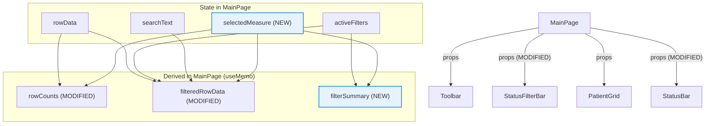
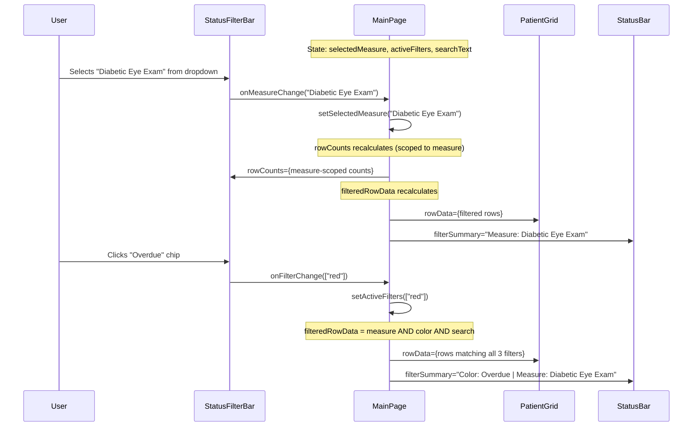
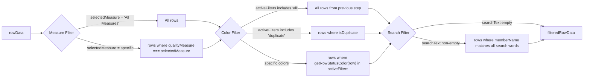
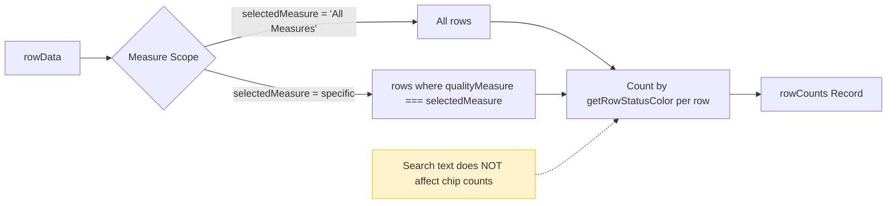

# Design: Compact Filter Bar with Quality Measure Dropdown

## Overview

This design document describes the technical architecture for the Compact Filter Bar feature (CFB-R1 through CFB-R7). The feature is entirely frontend -- no backend changes, no new API endpoints, no database migrations. It modifies three existing components (`StatusFilterBar`, `MainPage`, `StatusBar`) and introduces one new helper constant.

### Requirements Reference

- Requirements document: `.claude/specs/compact-filter-bar/requirements.md`
- 7 requirements (CFB-R1 through CFB-R7), 42 acceptance criteria, 11 edge cases

### Architecture Decision

**Approach: Extend existing components with new props and state, no new components.**

The feature adds a `selectedMeasure` state variable to `MainPage`, threads it through the existing props pattern to `StatusFilterBar` and `StatusBar`, and extends the existing `filteredRowData` and `rowCounts` memos. No new components, hooks, or stores are introduced. This minimizes surface area and follows the project's established pattern of lifting filter state to `MainPage` and passing it down via props.

## Architecture

### Component Hierarchy (Existing -- Annotated with Changes)



### Data Flow: Filter Evaluation



### Filter Logic Pipeline



### Chip Count Scoping Pipeline



## Component Interfaces

### 1. StatusFilterBar -- Modified Props Interface

**File:** `frontend/src/components/layout/StatusFilterBar.tsx`

```typescript
// CURRENT interface
interface StatusFilterBarProps {
  activeFilters: StatusColor[];
  onFilterChange: (filters: StatusColor[]) => void;
  rowCounts: Record<StatusColor, number>;
  searchText: string;
  onSearchChange: (text: string) => void;
  searchInputRef?: React.RefObject<HTMLInputElement>;
}

// NEW interface (additions only)
interface StatusFilterBarProps {
  activeFilters: StatusColor[];
  onFilterChange: (filters: StatusColor[]) => void;
  rowCounts: Record<StatusColor, number>;
  searchText: string;
  onSearchChange: (text: string) => void;
  searchInputRef?: React.RefObject<HTMLInputElement>;
  // NEW props
  selectedMeasure: string;                    // Current measure selection ("All Measures" or specific measure label)
  onMeasureChange: (measure: string) => void; // Callback when measure dropdown changes
  measureOptions: string[];                   // List of quality measure labels (from config)
}
```

**Default values:** `selectedMeasure` defaults to `'All Measures'`. `measureOptions` defaults to `[]` (empty until config loads, per NFR-R2).

### 2. StatusBar -- Modified Props Interface

**File:** `frontend/src/components/layout/StatusBar.tsx`

```typescript
// CURRENT interface
interface StatusBarProps {
  rowCount: number;
  totalRowCount?: number;
}

// NEW interface (addition only)
interface StatusBarProps {
  rowCount: number;
  totalRowCount?: number;
  // NEW prop
  filterSummary?: string;  // e.g. "Color: Overdue | Measure: Diabetic Eye Exam"
}
```

### 3. MainPage -- New State and Derived Data

**File:** `frontend/src/pages/MainPage.tsx`

```typescript
// NEW state variable
const [selectedMeasure, setSelectedMeasure] = useState<string>('All Measures');

// NEW constant: quality measure options list
// Derived from QUALITY_MEASURE_TO_STATUS keys (already imported config data)
const measureOptions = useMemo(() => {
  return Object.keys(QUALITY_MEASURE_TO_STATUS);
}, []);
```

## Detailed Component Changes

### 3.1 StatusFilterBar.tsx Changes

#### 3.1.1 Compact Chip Styling (CFB-R1)

The current chip button uses `px-3 py-1 rounded-full text-sm`. The compact redesign changes:

| Property | Current | Compact |
|----------|---------|---------|
| Padding | `px-3 py-1` | `px-2 py-0.5` |
| Font size | `text-sm` (14px) | `text-xs` (12px) |
| Gap between icon and text | `gap-1.5` | `gap-1` |
| Text wrapping | (wraps naturally) | `whitespace-nowrap` |
| Check icon size | `size={14}` | `size={12}` |
| Count font size | `text-xs` | `text-[10px]` |
| Border width | `border-2` | `border` |

The resulting chip height will be approximately 24px (12px font + 4px vertical padding + 2px border = ~24px).

**CSS class changes on chip `<button>`:**

Current:
```
inline-flex items-center gap-1.5 px-3 py-1 rounded-full text-sm font-medium
border-2 transition-all duration-150 cursor-pointer
```

New:
```
inline-flex items-center gap-1 px-2 py-0.5 rounded-full text-xs font-medium
border transition-all duration-150 cursor-pointer whitespace-nowrap
```

#### 3.1.2 Zero-Count Chip Opacity (CFB-R4-AC5)

When a chip has a count of zero, it renders at 30% opacity regardless of active/inactive state:

```typescript
const isZeroCount = count === 0;

// Opacity logic:
// - Zero count, not active: opacity-30
// - Zero count, active: normal opacity (user explicitly selected it)
// - Non-zero, active: normal opacity
// - Non-zero, not active: opacity-50 (existing behavior)
const opacityClass = isZeroCount && !isActive
  ? 'opacity-30'
  : (!isActive ? 'opacity-50 hover:opacity-75' : '');
```

This maps to CFB-R4-AC5 (zero-count at 30% opacity) and CFB-R4-AC6 (zero-count chip clickable, becomes active with normal styling).

**WCAG 4.5:1 contrast note (NFR-A4):** At `opacity: 0.30`, the chip text and border may not meet WCAG AA contrast on a `bg-gray-50` (#F9FAFB) background. If testing reveals insufficient contrast, the minimum opacity should be raised to `opacity-40` or `opacity-[0.35]`. This will be verified during implementation with a contrast checker.

#### 3.1.3 Quality Measure Dropdown (CFB-R2)

A native `<select>` element is added after the last chip (N/A) and before the search input, separated by a vertical divider. Using a native `<select>` satisfies NFR-U4 ("native select element or lightweight custom dropdown") and provides built-in keyboard accessibility (CFB-R7-AC2 through CFB-R7-AC5) without custom implementation.

**Layout structure change:**

```
Current:  [Filter: label] [chips...] [----search input (ml-auto)----]
New:      [Filter: label] [chips...] [divider] [Measure dropdown] [----search input (ml-auto)----]
```

**Vertical divider:** A `<div>` with `w-px h-6 bg-gray-300 mx-2` creates a 1px gray vertical line approximately 24px tall.

**Dropdown element:**

```tsx
{/* Vertical divider */}
<div className="w-px h-6 bg-gray-300 mx-2 self-center" />

{/* Measure dropdown */}
<select
  value={selectedMeasure}
  onChange={(e) => onMeasureChange(e.target.value)}
  aria-label="Filter by quality measure"
  className={`
    text-xs py-1 px-2 border rounded-md bg-white
    focus:outline-none focus:ring-2 focus:ring-blue-500 focus:border-blue-500
    ${selectedMeasure !== 'All Measures' ? 'ring-2 ring-blue-500 border-blue-500' : 'border-gray-300'}
  `}
>
  <option value="All Measures">All Measures</option>
  {measureOptions.map((measure) => (
    <option key={measure} value={measure}>{measure}</option>
  ))}
</select>
```

Key design decisions:
- **Native `<select>`** rather than custom dropdown: Provides keyboard accessibility for free (Enter/Space opens, Arrow keys navigate, Enter selects, Escape closes). Satisfies CFB-R7-AC2 through CFB-R7-AC5 without custom event handlers.
- **Blue ring when active** (`ring-2 ring-blue-500`): Satisfies CFB-R2-AC6. Ring removed when "All Measures" is selected (CFB-R2-AC8).
- **`aria-label="Filter by quality measure"`**: Satisfies CFB-R7-AC7 and NFR-A2.
- **`text-xs` font size**: Matches compact chip typography.

#### 3.1.4 Tab Order (CFB-R7-AC1)

The DOM order provides the correct tab sequence: chip buttons (in order) -> dropdown -> search input. The search input already has `ml-auto` which pushes it to the right. The dropdown sits between the chips and search in the DOM flow, so native tab order works without `tabIndex` manipulation.

### 3.2 MainPage.tsx Changes

#### 3.2.1 New State

```typescript
// After existing state declarations (line ~34)
const [selectedMeasure, setSelectedMeasure] = useState<string>('All Measures');
```

#### 3.2.2 Quality Measure Options List

```typescript
// Import QUALITY_MEASURE_TO_STATUS from dropdownConfig
import { QUALITY_MEASURE_TO_STATUS } from '../config/dropdownConfig';

// Stable list of quality measure labels
const measureOptions = useMemo(() => {
  return Object.keys(QUALITY_MEASURE_TO_STATUS);
}, []);
```

This uses the existing `QUALITY_MEASURE_TO_STATUS` from `dropdownConfig.ts` which already contains all 13 quality measures in their configured order. No API call is needed (satisfies NFR-P3 and NFR-P4). The keys are ordered by insertion order in the JS object, which matches the configured sort order in the config file.

#### 3.2.3 Modified `rowCounts` Memo

The current `rowCounts` iterates all `rowData`. It must be scoped to the selected measure when a specific measure is active.

```typescript
const rowCounts = useMemo(() => {
  const counts: Record<StatusColor, number> = {
    all: 0, duplicate: 0, white: 0, yellow: 0,
    blue: 0, green: 0, purple: 0, orange: 0, gray: 0, red: 0,
  };

  // Scope to selected measure (or all rows if "All Measures")
  const scopedRows = selectedMeasure === 'All Measures'
    ? rowData
    : rowData.filter((row) => row.qualityMeasure === selectedMeasure);

  scopedRows.forEach((row) => {
    if (row.isDuplicate) {
      counts.duplicate++;
    }
    const color = getRowStatusColor(row);
    counts[color]++;
  });

  return counts;
}, [rowData, selectedMeasure]); // Added selectedMeasure dependency
```

Key points:
- `searchText` is NOT a dependency -- chip counts are not affected by name search (CFB-R4-AC7, existing behavior extended).
- When `selectedMeasure !== 'All Measures'`, only rows with matching `qualityMeasure` are counted (CFB-R4-AC2, AC3, AC4).
- The "All" chip count equals the total of measure-scoped rows (CFB-R4-AC3).

#### 3.2.4 Modified `filteredRowData` Memo

The filter pipeline gains a measure filter step, inserted before the existing color and search filters.

```typescript
const filteredRowData = useMemo(() => {
  let filtered = rowData;

  // Step 1: Apply measure filter (NEW)
  if (selectedMeasure !== 'All Measures') {
    filtered = filtered.filter((row) => row.qualityMeasure === selectedMeasure);
  }

  // Step 2: Apply status color filter (existing, unchanged)
  if (!activeFilters.includes('all') && activeFilters.length > 0) {
    filtered = filtered.filter((row) => {
      if (activeFilters.includes('duplicate')) return row.isDuplicate;
      const color = getRowStatusColor(row);
      return activeFilters.includes(color);
    });
  }

  // Step 3: Apply name search filter (existing, unchanged)
  if (searchText.trim()) {
    const searchWords = searchText.trim().toLowerCase().split(/\s+/);
    filtered = filtered.filter((row) => {
      const name = row.memberName?.toLowerCase() || '';
      return searchWords.every((word) => name.includes(word));
    });
  }

  return filtered;
}, [rowData, selectedMeasure, activeFilters, searchText]); // Added selectedMeasure dependency
```

This implements the combined filter logic: `measureMatch AND (colorA OR colorB) AND searchMatch` (CFB-R3-AC5).

#### 3.2.5 New `filterSummary` Derived Value

```typescript
const filterSummary = useMemo(() => {
  const parts: string[] = [];

  // Color filter summary
  if (!activeFilters.includes('all') && activeFilters.length > 0) {
    if (activeFilters.includes('duplicate')) {
      parts.push('Color: Duplicates');
    } else {
      const STATUS_LABELS: Record<string, string> = {
        white: 'Not Addressed', red: 'Overdue', blue: 'In Progress',
        yellow: 'Contacted', green: 'Completed', purple: 'Declined',
        orange: 'Resolved', gray: 'N/A',
      };
      const labels = activeFilters.map((f) => STATUS_LABELS[f]).filter(Boolean);
      if (labels.length > 0) {
        parts.push(`Color: ${labels.join(', ')}`);
      }
    }
  }

  // Measure filter summary
  if (selectedMeasure !== 'All Measures') {
    parts.push(`Measure: ${selectedMeasure}`);
  }

  return parts.length > 0 ? parts.join(' | ') : undefined;
}, [activeFilters, selectedMeasure]);
```

This produces strings like:
- `undefined` (no filters active -- CFB-R5-AC5)
- `"Color: Overdue"` (color only -- CFB-R5-AC2)
- `"Measure: Diabetic Eye Exam"` (measure only -- CFB-R5-AC3)
- `"Color: In Progress, Overdue | Measure: Diabetic Eye Exam"` (both -- CFB-R5-AC4)

#### 3.2.6 Updated JSX Props

```tsx
<StatusFilterBar
  activeFilters={activeFilters}
  onFilterChange={setActiveFilters}
  rowCounts={rowCounts}
  searchText={searchText}
  onSearchChange={setSearchText}
  searchInputRef={searchInputRef}
  selectedMeasure={selectedMeasure}           // NEW
  onMeasureChange={setSelectedMeasure}        // NEW
  measureOptions={measureOptions}             // NEW
/>

{/* ... */}

<StatusBar
  rowCount={filteredRowData.length}
  totalRowCount={rowData.length}
  filterSummary={filterSummary}               // NEW
/>
```

### 3.3 StatusBar.tsx Changes

**File:** `frontend/src/components/layout/StatusBar.tsx`

Add display of the `filterSummary` prop next to the row count.

```tsx
interface StatusBarProps {
  rowCount: number;
  totalRowCount?: number;
  filterSummary?: string;  // NEW
}

export default function StatusBar({ rowCount, totalRowCount, filterSummary }: StatusBarProps) {
  return (
    <div className="bg-gray-100 border-t border-gray-200 px-4 py-2 flex items-center justify-between text-sm text-gray-600">
      <div className="flex items-center gap-4">
        <span>Showing {rowCount.toLocaleString()} of {(totalRowCount ?? rowCount).toLocaleString()} rows</span>
        {filterSummary && (
          <span className="text-gray-500 border-l border-gray-300 pl-4">
            {filterSummary}
          </span>
        )}
      </div>
      <div className="flex items-center gap-2">
        <span className="text-green-600">Connected</span>
      </div>
    </div>
  );
}
```

The filter summary appears to the right of the row count, separated by a left border (visual pipe delimiter). When no filters are active, `filterSummary` is `undefined` and nothing is rendered (CFB-R5-AC5).

## Data Models

### No Database Changes

This feature is entirely client-side. No database schema changes, no migrations, no new tables.

### Existing Data Used

| Data Source | Location | Usage |
|-------------|----------|-------|
| `GridRow.qualityMeasure` | `frontend/src/types/index.ts` (line 10), `PatientGrid.tsx` (line 55) | Field compared against `selectedMeasure` for filtering |
| `QUALITY_MEASURE_TO_STATUS` | `frontend/src/config/dropdownConfig.ts` (line 26) | Keys provide the 13 quality measure labels for dropdown options |
| `getRowStatusColor()` | `frontend/src/components/layout/StatusFilterBar.tsx` (line 146) | Determines row color for chip count calculation (unchanged) |

### Quality Measure Values (from `dropdownConfig.ts`)

The 13 values returned by `Object.keys(QUALITY_MEASURE_TO_STATUS)`:

1. Annual Wellness Visit
2. Diabetic Eye Exam
3. Colon Cancer Screening
4. Breast Cancer Screening
5. Cervical Cancer Screening
6. GC/Chlamydia Screening
7. Diabetic Nephropathy
8. Hypertension Management
9. ACE/ARB in DM or CAD
10. Vaccination
11. Diabetes Control
12. Annual Serum K&Cr
13. Chronic Diagnosis Code

This order matches the insertion order in the `QUALITY_MEASURE_TO_STATUS` object in `dropdownConfig.ts`.

## API Design

### No New API Endpoints

No backend changes are required. The feature uses:

| Existing Endpoint | Purpose | Called When |
|-------------------|---------|-------------|
| `GET /api/config/all` | Provides config data (already fetched on app load) | Not called by this feature -- uses static `dropdownConfig.ts` instead |
| `GET /api/data` | Provides patient rows (already fetched in `MainPage.loadData()`) | Not called by this feature -- uses already-loaded `rowData` state |

The quality measure dropdown is populated from `dropdownConfig.ts` (static client-side data), not from an API response. This satisfies NFR-P3 ("SHALL NOT trigger any additional API calls").

## State Management

### State Ownership

All filter state lives in `MainPage` component state (React `useState`). No Zustand store is used for filter state (consistent with existing `activeFilters` and `searchText` patterns).

| State Variable | Owner | Type | Default | Persisted? |
|---------------|-------|------|---------|------------|
| `activeFilters` | MainPage | `StatusColor[]` | `['all']` | No (existing) |
| `searchText` | MainPage | `string` | `''` | No (existing) |
| `selectedMeasure` | MainPage | `string` | `'All Measures'` | No (new) |

### State Preservation on Data Changes (NFR-R3, EC-2, EC-3, EC-7)

When `rowData` changes (via cell edit, add row, delete row, duplicate row), the `setRowData` calls in `MainPage` update only the `rowData` array. The `selectedMeasure`, `activeFilters`, and `searchText` states are independent and are not reset. The `filteredRowData` and `rowCounts` memos automatically recalculate because they depend on `rowData`.

This is already the existing pattern -- `activeFilters` and `searchText` persist across `handleRowUpdated`, `createRow`, `handleDeleteRow`, and `handleDuplicateRow`. The new `selectedMeasure` state follows the same pattern with no additional work.

### State Reset on Physician Change

When `selectedPhysicianId` changes (STAFF/ADMIN user switches physician), `loadData()` is called and `rowData` is replaced. The existing code does NOT reset `activeFilters` or `searchText` on physician change. For consistency, `selectedMeasure` will also NOT be reset. If a measure selected for one physician's data has zero matches for the new physician's data, the user will see zero rows and can switch to "All Measures".

## Error Handling

### No New Error States

This feature does not introduce network calls, async operations, or failure modes beyond what already exists. The only edge case is configuration data availability:

| Scenario | Handling |
|----------|----------|
| `QUALITY_MEASURE_TO_STATUS` is empty or undefined | `measureOptions` will be `[]`. Dropdown shows only "All Measures". No crash. (NFR-R2) |
| `row.qualityMeasure` is null (new rows) | Null does not match any selected measure string. Row excluded from filtered view when specific measure selected. Included when "All Measures" selected. (EC-8) |
| User rapidly switches measures (EC-11) | React batches state updates. `useMemo` recalculates on final state. No race conditions because all operations are synchronous client-side filters on in-memory data. |

## Performance Considerations

### Filter Performance (NFR-P1, NFR-P2)

All filtering is synchronous iteration over in-memory arrays. For 5,000 rows:

- **Measure filter:** Single `Array.filter()` with string equality check. O(n), approximately 0.1ms.
- **Color filter:** `Array.filter()` with `getRowStatusColor()` per row. O(n), approximately 2-5ms (status color involves string lookups).
- **Search filter:** `Array.filter()` with `toLowerCase()` + `includes()`. O(n * k) where k = search words. Approximately 1-3ms.
- **Combined:** Sequential filters, each reducing the array. Total approximately 3-8ms for 5,000 rows, well under the 100ms target.

**Chip count recalculation (NFR-P2):** Single `Array.forEach()` with `getRowStatusColor()` per row. O(n), approximately 2-5ms for 5,000 rows, well under the 50ms target.

### Memoization Strategy

| Computation | Dependencies | Triggers Recalculation When |
|-------------|-------------|----------------------------|
| `measureOptions` | `[]` (static) | Never (config data is static import) |
| `rowCounts` | `[rowData, selectedMeasure]` | Row data changes OR measure selection changes |
| `filteredRowData` | `[rowData, selectedMeasure, activeFilters, searchText]` | Any filter dimension changes |
| `filterSummary` | `[activeFilters, selectedMeasure]` | Color or measure selection changes |

Note: `rowCounts` intentionally does NOT depend on `searchText` (chip counts are not affected by name search -- CFB-R4-AC7).

## File Change Summary

| File | Change Type | Lines Changed (est.) |
|------|------------|---------------------|
| `frontend/src/components/layout/StatusFilterBar.tsx` | Modify | ~40 lines (compact CSS + dropdown + divider + zero-count opacity) |
| `frontend/src/pages/MainPage.tsx` | Modify | ~30 lines (new state, modified memos, new filterSummary, updated props) |
| `frontend/src/components/layout/StatusBar.tsx` | Modify | ~8 lines (new prop + conditional rendering) |

**No new files created.** All changes are modifications to existing files.

### Imports Added

| File | New Import |
|------|-----------|
| `MainPage.tsx` | `QUALITY_MEASURE_TO_STATUS` from `../../config/dropdownConfig` |

### Exports Changed

| File | Change |
|------|--------|
| `StatusFilterBar.tsx` | `StatusFilterBarProps` interface extended (backwards-compatible if new props optional, but they will be required) |
| `StatusBar.tsx` | `StatusBarProps` interface extended (new prop is optional) |

## Testing Strategy

### Layer 1: Frontend Component Tests (Vitest)

**File:** `frontend/src/components/layout/StatusFilterBar.test.tsx`

New test cases to add to existing test file:

| Test Case | Requirement | Description |
|-----------|-------------|-------------|
| Compact chip has whitespace-nowrap | CFB-R1-AC1 | Verify chip button className contains `whitespace-nowrap` |
| Compact chip has reduced padding | CFB-R1-AC2 | Verify chip className contains `py-0.5` and `px-2` |
| Multi-word labels stay single line | CFB-R1-AC3 | Verify "Not Addressed" and "In Progress" render in single-line chips |
| Active chip still shows checkmark | CFB-R1-AC4 | Verify Check icon renders when chip is active (existing test, verify still passes) |
| Measure dropdown renders | CFB-R2-AC1 | Verify `<select>` with aria-label "Filter by quality measure" exists |
| Dropdown default is "All Measures" | CFB-R2-AC2 | Verify selected value is "All Measures" on initial render |
| Dropdown lists all measures | CFB-R2-AC3 | Verify 14 `<option>` elements (All Measures + 13 measures) |
| Dropdown calls onMeasureChange | CFB-R2-AC5 | Fire change event, verify callback called with selected value |
| Active measure shows blue ring | CFB-R2-AC6 | Verify `ring-2 ring-blue-500` classes when specific measure selected |
| "All Measures" has no blue ring | CFB-R2-AC8 | Verify no `ring-2` class when "All Measures" selected |
| Zero-count chip has opacity-30 | CFB-R4-AC5 | Pass rowCounts with zero for a color, verify `opacity-30` class |
| Zero-count chip is clickable | CFB-R4-AC6 | Click zero-count chip, verify onFilterChange called |
| Vertical divider renders | CFB-R2-AC1 | Verify divider element exists between chips and dropdown |
| Dropdown has aria-label | CFB-R7-AC7 | Verify aria-label="Filter by quality measure" on select element |

**File:** `frontend/src/components/layout/StatusBar.test.tsx`

New test cases to add to existing test file:

| Test Case | Requirement | Description |
|-----------|-------------|-------------|
| Shows filter summary when provided | CFB-R5-AC2/3 | Render with filterSummary, verify text appears |
| No filter summary when undefined | CFB-R5-AC5 | Render without filterSummary, verify no extra text |
| Shows combined summary with pipe | CFB-R5-AC4 | Render with "Color: Overdue \| Measure: Diabetic Eye Exam", verify |

### Layer 2: Page-Level Integration Tests (Vitest)

**File:** `frontend/src/pages/MainPage.test.tsx` (new file or extend existing)

These tests verify the filter logic integration:

| Test Case | Requirement | Description |
|-----------|-------------|-------------|
| Measure filter scopes rowCounts | CFB-R4-AC2 | Set selectedMeasure, verify rowCounts only count matching rows |
| Measure + color filter AND logic | CFB-R3-AC2 | Set both filters, verify only matching rows in filteredRowData |
| Measure + color + search AND logic | CFB-R3-AC3 | Set all three, verify combined filtering |
| Duplicates + measure AND logic | CFB-R3-AC4 | Set duplicate + measure, verify only duplicate rows for that measure |
| Changing measure preserves color | CFB-R3-AC6 | Change measure, verify activeFilters unchanged |
| "All Measures" shows all rows | CFB-R2-AC7 | Set "All Measures", verify no measure filtering |
| Null qualityMeasure excluded | EC-8 | Row with null qualityMeasure excluded when specific measure selected |
| Filter summary generation | CFB-R5-AC2/3/4 | Verify filterSummary string for various filter combinations |

### Layer 3: E2E Tests (Playwright)

**File:** `frontend/e2e/compact-filter-bar.spec.ts`

| Test Case | Requirement | Description |
|-----------|-------------|-------------|
| Compact chips render on single line | CFB-R1-AC5 | Navigate to main page, verify all chips visible without overflow |
| Measure dropdown visible and functional | CFB-R2-AC1/5 | Select a measure, verify grid filters |
| Combined filter updates status bar | CFB-R5-AC1/4 | Apply color + measure, verify status bar text |
| Measure selection persists after cell edit | EC-2/EC-7 | Select measure, edit cell, verify measure stays selected |
| Zero-count chip appears faded | CFB-R4-AC5 | Select measure with zero-count status, verify visual |

### Layer 4: E2E Tests (Cypress -- AG Grid interactions)

**File:** `frontend/cypress/e2e/compact-filter-bar.cy.ts`

| Test Case | Requirement | Description |
|-----------|-------------|-------------|
| Editing qualityMeasure updates filter | EC-2 | Edit a row's quality measure while filter active, verify row disappears |
| Grid shows correct rows for measure | CFB-R2-AC5 | Select measure, verify AG Grid row data matches |
| Chip counts update for measure | CFB-R4-AC2 | Select measure, verify chip count values change |

### Estimated Test Count

| Layer | New Tests |
|-------|-----------|
| Vitest (StatusFilterBar) | ~14 |
| Vitest (StatusBar) | ~3 |
| Vitest (MainPage integration) | ~8 |
| Playwright E2E | ~5 |
| Cypress E2E | ~3 |
| **Total** | **~33** |

## Edge Case Handling Matrix

| Edge Case | Handling Location | Mechanism |
|-----------|-------------------|-----------|
| EC-1: No matching rows for a status color | StatusFilterBar (opacity) + MainPage (rowCounts) | Zero count calculated; chip rendered at 30% opacity |
| EC-2: Data changes via cell edit with measure active | MainPage (handleRowUpdated -> rowData change -> memo recalc) | Memos automatically recalculate on rowData change |
| EC-3: New row added with null qualityMeasure | MainPage (filteredRowData memo) | `null !== selectedMeasure` so row excluded from filtered view |
| EC-4: Duplicates + measure filter | MainPage (filteredRowData memo) | Measure filter applied first, then duplicate filter |
| EC-5: All chips manually selected | StatusFilterBar (handleChipClick -- existing logic) | Existing behavior preserved: no auto-switch to "All" |
| EC-6: Search yields zero results with measure | MainPage (filteredRowData memo) | Empty grid shown; chip counts unaffected by search |
| EC-7: Data reload with active measure | MainPage (state preservation) | `selectedMeasure` state is independent of `rowData` |
| EC-8: Null qualityMeasure rows | MainPage (filteredRowData filter) | Strict equality: `null !== "Diabetic Eye Exam"` |
| EC-9: Narrow viewport | StatusFilterBar (CSS) | `flex-wrap` allows wrapping; divider remains visible |
| EC-10: Page load defaults | MainPage (useState defaults) | `selectedMeasure: 'All Measures'`, `activeFilters: ['all']` |
| EC-11: Rapid measure switching | React state batching | Synchronous memos; no async; final state wins |

## Responsive Layout (EC-9)

The filter bar container uses `flex items-center gap-2`. On narrow viewports below 1280px, chips may wrap. To handle this gracefully, the container class should include `flex-wrap`:

```
Current:  flex items-center gap-2 px-4 py-2 bg-gray-50 border-b border-gray-200
New:      flex items-center flex-wrap gap-2 px-4 py-2 bg-gray-50 border-b border-gray-200
```

The `flex-wrap` ensures chips wrap to a second line rather than overflowing. The vertical divider and dropdown will wrap together as a unit (they are adjacent flex children).

At 1280px and above, all 10 compact chips plus the divider, dropdown, and search input should fit on a single line (CFB-R1-AC5). The compact chip width estimates:

| Chip | Approximate Width |
|------|------------------|
| All (100) | ~58px |
| Duplicates (5) | ~82px |
| Not Addressed (20) | ~100px |
| Overdue (5) | ~68px |
| In Progress (25) | ~90px |
| Contacted (15) | ~82px |
| Completed (10) | ~86px |
| Declined (5) | ~74px |
| Resolved (5) | ~74px |
| N/A (10) | ~50px |
| **Total chips** | **~764px** |
| "Filter:" label | ~50px |
| Divider + gap | ~20px |
| Dropdown | ~160px |
| Search input | ~256px (w-64) |
| **Total** | **~1250px** |

This fits within 1280px with approximately 30px to spare (padding included).

## Accessibility Compliance

| Requirement | Implementation |
|-------------|---------------|
| CFB-R7-AC1 (Tab order) | Native DOM order: chips -> dropdown -> search |
| CFB-R7-AC2 (Enter/Space opens dropdown) | Native `<select>` behavior |
| CFB-R7-AC3 (Arrow keys in dropdown) | Native `<select>` behavior |
| CFB-R7-AC4 (Enter selects option) | Native `<select>` behavior |
| CFB-R7-AC5 (Escape closes dropdown) | Native `<select>` behavior |
| CFB-R7-AC6 (Enter/Space toggles chip) | Existing `<button>` `onClick` handler |
| CFB-R7-AC7 (aria-label on dropdown) | `aria-label="Filter by quality measure"` |
| NFR-A1 (aria-pressed on chips) | Existing behavior preserved |
| NFR-A2 (aria-label on dropdown) | Same as CFB-R7-AC7 |
| NFR-A3 (Non-color indicator) | Checkmark icon preserved on compact chips |
| NFR-A4 (Zero-count contrast) | 30% opacity with contrast verification; raise to 35-40% if needed |

## Dependencies and Risks

### Dependencies (All Satisfied)

| Dependency | Status | Notes |
|------------|--------|-------|
| `StatusFilterBar.tsx` | Exists | Component to modify |
| `MainPage.tsx` | Exists | Page to modify |
| `StatusBar.tsx` | Exists | Component to modify |
| `dropdownConfig.ts` | Exists | `QUALITY_MEASURE_TO_STATUS` provides measure list |
| `getRowStatusColor()` | Exists | Used for chip count calculation (unchanged) |
| Tailwind CSS | Configured | All utility classes used are standard Tailwind |

### Risks

| Risk | Likelihood | Impact | Mitigation |
|------|-----------|--------|------------|
| Compact chips too small for touch | Low | Medium | Minimum 24px height, minimum 44px width per NFR-U1; test on touchpad |
| Zero-count opacity fails WCAG contrast | Medium | Low | Verify with contrast checker during implementation; raise opacity floor if needed |
| Existing tests break due to CSS class changes | High | Low | Update existing test assertions that check for `opacity-50`, `border-2`, `py-1` etc. |
| Long measure names overflow dropdown | Low | Low | Dropdown naturally truncates with ellipsis; longest measure is "GC/Chlamydia Screening" (~22 chars, fits in 160px |

## Glossary

| Term | Definition |
|------|-----------|
| Chip | A rounded pill-shaped toggle button representing a status color filter |
| Measure | Quality Measure -- the clinical quality measure category (e.g., "Diabetic Eye Exam") |
| Status Color | The computed color category of a row based on its `measureStatus`, `dueDate`, and `tracking1` fields |
| Scoped Counts | Chip counts recalculated to reflect only rows matching the selected quality measure |
