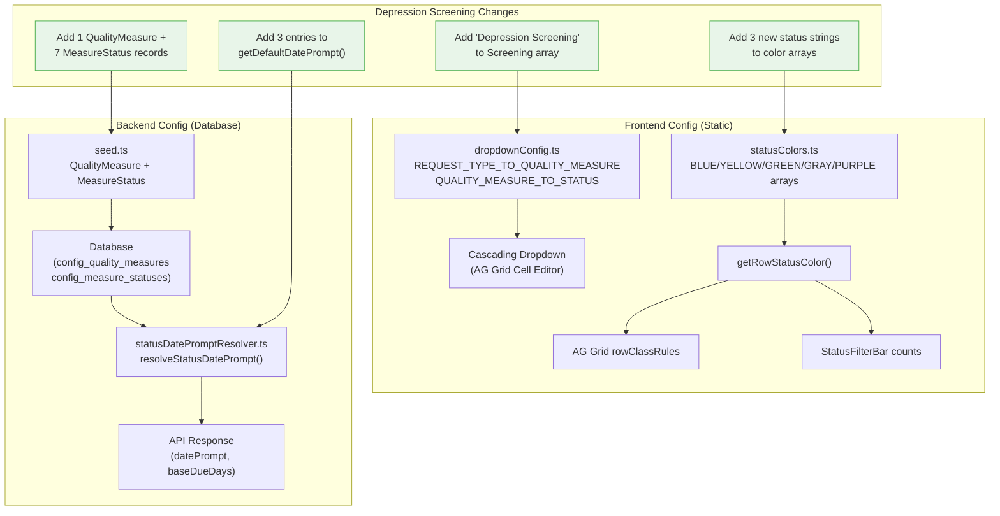
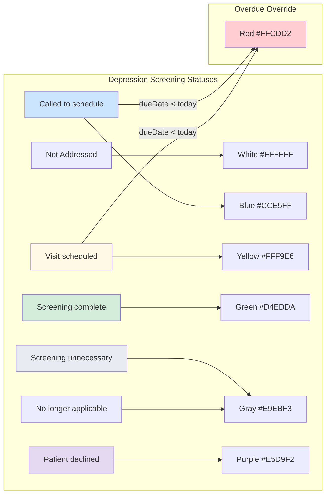
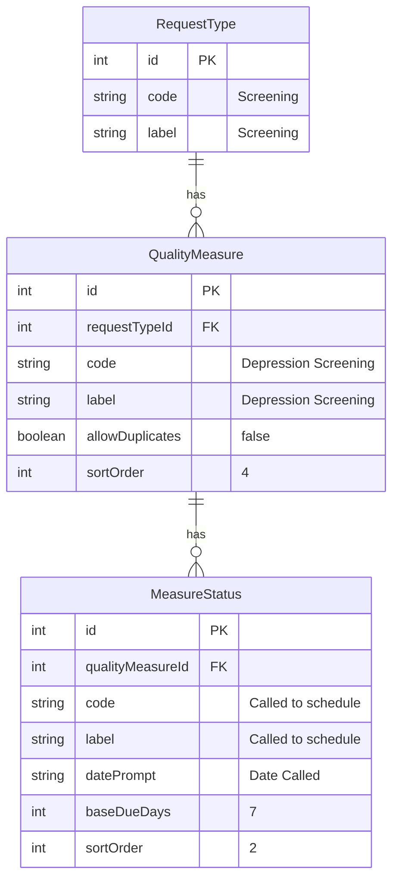

# Design Document: Depression Screening

## Overview

Depression Screening is a configuration-only addition of a 14th quality measure to the existing patient tracking system. It adds "Depression Screening" under the "Screening" request type, with 7 measure statuses, color mappings, date prompts, countdown timers, and sample seed data. No new components, API endpoints, database schema changes, or architectural patterns are introduced. Every change extends existing data structures (arrays, maps, seed records) using established patterns.

## Steering Document Alignment

### Technical Standards (tech.md)

- **No new dependencies.** All changes use existing TypeScript config objects, Prisma seed patterns, and frontend color arrays.
- **Testing:** Vitest for frontend config tests (existing `dropdownConfig.test.ts`). Backend seed testing covered by existing Jest seed integration. No new test files needed beyond updating existing assertions.
- **TypeScript:** All config changes are type-safe via existing `Record<string, string[]>` types and `as const` readonly arrays.

### Project Structure (structure.md)

- All file modifications follow existing structure conventions exactly:
  - Frontend config: `frontend/src/config/` (existing files)
  - Backend service: `backend/src/services/` (existing file)
  - Seed data: `backend/prisma/seed.ts` (existing file)
  - Tests: `frontend/src/config/dropdownConfig.test.ts` (existing file)
- No new files or directories are created.

## Code Reuse Analysis

This feature is 100% reuse of existing infrastructure. No new code patterns are introduced.

### Existing Components to Leverage

- **`dropdownConfig.ts` cascading maps:** `REQUEST_TYPE_TO_QUALITY_MEASURE` and `QUALITY_MEASURE_TO_STATUS` dictionaries drive the cascading dropdown behavior. Adding entries to these maps automatically integrates Depression Screening into the dropdown cascade.
- **`statusColors.ts` color arrays:** `BLUE_STATUSES`, `YELLOW_STATUSES`, `GREEN_STATUSES`, `GRAY_STATUSES`, `PURPLE_STATUSES` arrays determine row background colors. Adding status strings to these arrays automatically applies correct colors.
- **`getRowStatusColor()` function:** Already handles all color priority logic (overdue > gray > purple > green > blue > yellow > orange > white). No changes needed.
- **`isRowOverdue()` function:** Already excludes gray and purple statuses from overdue detection. Depression Screening's terminal statuses (gray/purple) are automatically excluded.
- **`statusDatePromptResolver.ts`:** `getDefaultDatePrompt()` provides fallback date prompt labels. Adding entries extends the fallback map.
- **`seed.ts` helper functions:** `createStatuses()` and the `measureConfigs` sample data pattern are reused identically.
- **`getQualityMeasuresForRequestType()`:** Already sorts alphabetically via `localeCompare()`. "Depression Screening" will sort correctly between "Colon Cancer Screening" and the end of the list.

### Integration Points

- **AG Grid row styling:** `PatientGrid` consumes `statusColors.ts` arrays via `rowClassRules`. Adding status strings to the arrays is sufficient; no grid code changes needed.
- **StatusFilterBar:** Consumes `getRowStatusColor()` for color counting. Automatically includes Depression Screening rows once color arrays are updated.
- **Cascading clear logic:** Already implemented in the grid cell editor. Changing Request Type, Quality Measure, or Measure Status triggers cascading clears. Depression Screening inherits this behavior.
- **Due date calculation:** The backend `resolveStatusDatePrompt()` queries `MeasureStatus.datePrompt` from the database. The seed provides the correct `baseDueDays` values, and the existing due date calculation service uses them automatically.
- **Database:** Existing `QualityMeasure`, `MeasureStatus`, and `PatientMeasure` models support this feature without schema changes. The `PatientMeasure.qualityMeasure` field is a free-text string that accepts any value.

## Architecture

This feature makes no architectural changes. The diagram below shows the existing data flow that Depression Screening plugs into:



### Status-to-Color Mapping Flow



## Components and Interfaces

No new components are created. All changes are to existing configuration objects.

### Change 1: `frontend/src/config/dropdownConfig.ts`

- **Purpose:** Register Depression Screening in the cascading dropdown system.
- **Change:** Add `'Depression Screening'` to `REQUEST_TYPE_TO_QUALITY_MEASURE['Screening']` array. Add `'Depression Screening'` key with 7 statuses to `QUALITY_MEASURE_TO_STATUS` map.
- **Dependencies:** None. Pure data addition.
- **Reuses:** Existing `Record<string, string[]>` pattern. Existing `getQualityMeasuresForRequestType()` sorts alphabetically, so no sort logic changes needed.

#### Exact Changes

```typescript
// In REQUEST_TYPE_TO_QUALITY_MEASURE, change Screening array:
'Screening': [
  'Breast Cancer Screening',
  'Colon Cancer Screening',
  'Cervical Cancer Screening',
  'Depression Screening',          // NEW
],

// Add new entry to QUALITY_MEASURE_TO_STATUS:
'Depression Screening': [
  'Not Addressed',
  'Called to schedule',
  'Visit scheduled',
  'Screening complete',
  'Screening unnecessary',
  'Patient declined',
  'No longer applicable',
],
```

### Change 2: `frontend/src/config/statusColors.ts`

- **Purpose:** Map 3 new unique status strings to their correct color arrays.
- **Change:** Add `'Called to schedule'` to `BLUE_STATUSES`, `'Visit scheduled'` to `YELLOW_STATUSES`, `'Screening complete'` to `GREEN_STATUSES`.
- **Dependencies:** None. Pure data addition to `as const` arrays.
- **Reuses:** Existing color array pattern. `getRowStatusColor()` already checks these arrays.
- **NOT changed:** `GRAY_STATUSES` (already contains `'Screening unnecessary'` and `'No longer applicable'`), `PURPLE_STATUSES` (already contains `'Patient declined'`).

#### Exact Changes

```typescript
// Add to BLUE_STATUSES array:
'Called to schedule',              // NEW - Depression Screening

// Add to YELLOW_STATUSES array:
'Visit scheduled',                 // NEW - Depression Screening

// Add to GREEN_STATUSES array:
'Screening complete',              // NEW - Depression Screening (note: no "d" suffix)
```

#### Status Reuse Verification

| Status String | Color Array | Already Present? | Action |
|---------------|-------------|------------------|--------|
| `Not Addressed` | white (default) | N/A (fallthrough) | None |
| `Called to schedule` | BLUE_STATUSES | No | **ADD** |
| `Visit scheduled` | YELLOW_STATUSES | No | **ADD** |
| `Screening complete` | GREEN_STATUSES | No | **ADD** |
| `Screening unnecessary` | GRAY_STATUSES | Yes | None |
| `Patient declined` | PURPLE_STATUSES | Yes | None |
| `No longer applicable` | GRAY_STATUSES | Yes | None |

### Change 3: `backend/src/services/statusDatePromptResolver.ts`

- **Purpose:** Provide default date prompt labels for Depression Screening statuses when the database seed has not been run.
- **Change:** Add 3 new entries to the `defaultPrompts` map in `getDefaultDatePrompt()`.
- **Dependencies:** None. Pure data addition.
- **Reuses:** Existing `Record<string, string>` pattern.

#### Exact Changes

Add to the `defaultPrompts` object inside `getDefaultDatePrompt()`:

```typescript
// Depression Screening
'Called to schedule': 'Date Called',
'Visit scheduled': 'Date Scheduled',
'Screening complete': 'Date Completed',
```

#### Entries NOT needed (already covered by existing entries)

| Status | Existing Entry | Prompt |
|--------|---------------|--------|
| `Patient declined` | Line 112 | `'Date Declined'` |
| `Screening unnecessary` | Line 118 | `'Date Updated'` |
| `No longer applicable` | Line 117 | `'Date Updated'` |

Note: The requirements specify "Date Determined" for "Screening unnecessary" and "No longer applicable" prompts. However, the existing `getDefaultDatePrompt()` already maps these to "Date Updated". Since the database seed is the authoritative source (where `datePrompt` is set to "Date Determined"), and `getDefaultDatePrompt()` is only a fallback, the existing fallback values are acceptable. The seed data will provide the correct "Date Determined" prompt when the database is seeded. Changing the existing fallback for shared statuses would affect other measures and is out of scope.

### Change 4: `backend/prisma/seed.ts`

- **Purpose:** Seed Depression Screening configuration (QualityMeasure + MeasureStatus records) and sample patient data into the database.
- **Change:** Add 1 QualityMeasure upsert, 7 MeasureStatus records via `createStatuses()`, and 6-7 sample patient entries to `testPatients` and `measureConfigs` arrays.
- **Dependencies:** Requires `screeningType.id` (already resolved in seed).
- **Reuses:** Existing `createStatuses()` helper, existing upsert pattern, existing `measureConfigs` array pattern, existing round-robin physician assignment.

#### QualityMeasure Upsert

Add to the `qualityMeasures` array (in the Screening section, after Cervical Cancer):

```typescript
prisma.qualityMeasure.upsert({
  where: { requestTypeId_code: { requestTypeId: screeningType.id, code: 'Depression Screening' } },
  update: {},
  create: {
    requestTypeId: screeningType.id,
    code: 'Depression Screening',
    label: 'Depression Screening',
    allowDuplicates: false,
    sortOrder: 4,
  },
}),
```

#### MeasureStatus Records

Add after Cervical Cancer Screening statuses (reusing `createStatuses()` helper):

```typescript
const depressionMeasure = qualityMeasures.find(qm => qm.code === 'Depression Screening')!;

await createStatuses(depressionMeasure.id, [
  { code: 'Not Addressed',           label: 'Not Addressed',           datePrompt: null,             baseDueDays: null, sortOrder: 1 },
  { code: 'Called to schedule',       label: 'Called to schedule',       datePrompt: 'Date Called',    baseDueDays: 7,    sortOrder: 2 },
  { code: 'Visit scheduled',         label: 'Visit scheduled',         datePrompt: 'Date Scheduled', baseDueDays: 1,    sortOrder: 3 },
  { code: 'Screening complete',      label: 'Screening complete',      datePrompt: 'Date Completed', baseDueDays: null, sortOrder: 4 },
  { code: 'Screening unnecessary',   label: 'Screening unnecessary',   datePrompt: 'Date Determined', baseDueDays: null, sortOrder: 5 },
  { code: 'Patient declined',        label: 'Patient declined',        datePrompt: 'Date Declined',  baseDueDays: null, sortOrder: 6 },
  { code: 'No longer applicable',    label: 'No longer applicable',    datePrompt: 'Date Determined', baseDueDays: null, sortOrder: 7 },
]);
```

#### Sample Patient Data

Add to `testPatients` array (6 new patients for Depression Screening):

```typescript
// Screening - Depression
{ name: 'Harper, Angela',    dob: new Date('1975-03-14'), phone: '5552004001', address: '217 Meadow St' },
{ name: 'Reed, Christine',   dob: new Date('1968-07-22'), phone: '5552004002', address: '218 Brook Ave' },
{ name: 'Price, Gloria',     dob: new Date('1972-11-08'), phone: '5552004003', address: '219 Willow Blvd' },
{ name: 'Butler, Diane',     dob: new Date('1980-05-30'), phone: '5552004004', address: '220 Aspen Lane' },
{ name: 'Howard, Margaret',  dob: new Date('1963-09-12'), phone: '5552004005', address: '221 Spruce Road' },
{ name: 'Ward, Catherine',   dob: new Date('1970-01-25'), phone: '5552004006', address: '222 Poplar Court' },
```

Add to `measureConfigs` array (7 entries covering all statuses + 1 overdue scenario):

```typescript
// Depression Screening
{ patientName: 'Harper, Angela',   requestType: 'Screening', qualityMeasure: 'Depression Screening', measureStatus: 'Not Addressed',         statusDate: null,        tracking1: null, tracking2: null, notes: 'White - not addressed' },
{ patientName: 'Reed, Christine',  requestType: 'Screening', qualityMeasure: 'Depression Screening', measureStatus: 'Called to schedule',     statusDate: daysAgo(3),  tracking1: null, tracking2: null, notes: 'Blue - called 3 days ago (7 day timer)' },
{ patientName: 'Price, Gloria',    requestType: 'Screening', qualityMeasure: 'Depression Screening', measureStatus: 'Visit scheduled',        statusDate: daysFromNow(5), tracking1: null, tracking2: null, notes: 'Yellow - visit in 5 days' },
{ patientName: 'Butler, Diane',    requestType: 'Screening', qualityMeasure: 'Depression Screening', measureStatus: 'Screening complete',     statusDate: daysAgo(14), tracking1: null, tracking2: null, notes: 'Green - completed 14 days ago' },
{ patientName: 'Howard, Margaret', requestType: 'Screening', qualityMeasure: 'Depression Screening', measureStatus: 'Screening unnecessary',  statusDate: daysAgo(30), tracking1: null, tracking2: null, notes: 'Gray - unnecessary' },
{ patientName: 'Ward, Catherine',  requestType: 'Screening', qualityMeasure: 'Depression Screening', measureStatus: 'Patient declined',       statusDate: daysAgo(10), tracking1: null, tracking2: null, notes: 'Purple - declined' },
{ patientName: 'Reed, Christine',  requestType: 'Screening', qualityMeasure: 'Depression Screening', measureStatus: 'Called to schedule',     statusDate: daysAgo(14), tracking1: null, tracking2: null, notes: 'Red - overdue (called 14 days ago, 7 day timer expired)' },
```

Note: The last entry reuses 'Reed, Christine' to create a second measure row demonstrating the overdue (red) scenario. This follows the existing pattern where patients can have multiple measure rows (e.g., Bennett, Carol has an overdue AWV). Since Depression Screening has `allowDuplicates: false`, this tests the duplicate detection as well. Alternatively, a 7th patient can be added specifically for the overdue case if the duplicate scenario is not desired.

### Change 5: `frontend/src/config/dropdownConfig.test.ts`

- **Purpose:** Update existing test assertions to account for the 4th screening measure.
- **Change:** Update Screening count assertion from 3 to 4. Update sorted Screening list assertion. Add Depression Screening status validation.
- **Dependencies:** Changes 1 (dropdownConfig.ts) must be applied first.
- **Reuses:** Existing Vitest test patterns.

#### Exact Changes

```typescript
// Line 52-57: Update Screening count and assertion
it('maps Screening to 4 screening measures', () => {
  expect(REQUEST_TYPE_TO_QUALITY_MEASURE['Screening']).toHaveLength(4);
  expect(REQUEST_TYPE_TO_QUALITY_MEASURE['Screening']).toContain('Breast Cancer Screening');
  expect(REQUEST_TYPE_TO_QUALITY_MEASURE['Screening']).toContain('Colon Cancer Screening');
  expect(REQUEST_TYPE_TO_QUALITY_MEASURE['Screening']).toContain('Cervical Cancer Screening');
  expect(REQUEST_TYPE_TO_QUALITY_MEASURE['Screening']).toContain('Depression Screening');
});

// Line 159-165: Update sorted Screening assertion
it('returns sorted quality measures for Screening', () => {
  const result = getQualityMeasuresForRequestType('Screening');
  expect(result).toEqual([
    'Breast Cancer Screening',
    'Cervical Cancer Screening',
    'Colon Cancer Screening',
    'Depression Screening',
  ]);
});

// Add new test for Depression Screening statuses:
it('Depression Screening has correct statuses', () => {
  const statuses = QUALITY_MEASURE_TO_STATUS['Depression Screening'];
  expect(statuses).toHaveLength(7);
  expect(statuses[0]).toBe('Not Addressed');
  expect(statuses).toContain('Called to schedule');
  expect(statuses).toContain('Visit scheduled');
  expect(statuses).toContain('Screening complete');
  expect(statuses).toContain('Screening unnecessary');
  expect(statuses).toContain('Patient declined');
  expect(statuses).toContain('No longer applicable');
});
```

## Data Models

### No Schema Changes Required

The existing Prisma schema fully supports Depression Screening:

- **`QualityMeasure`** (table: `config_quality_measures`): New row with `code: 'Depression Screening'`, `requestTypeId` pointing to the Screening request type, `allowDuplicates: false`, `sortOrder: 4`.
- **`MeasureStatus`** (table: `config_measure_statuses`): 7 new rows linked to the Depression Screening quality measure, each with `code`, `label`, `datePrompt`, `baseDueDays`, and `sortOrder`.
- **`PatientMeasure`** (table: `patient_measures`): Sample patient rows with `qualityMeasure: 'Depression Screening'` and various `measureStatus` values. No structural changes.

### Seed Data Summary



### MeasureStatus Seed Configuration (7 records)

| sortOrder | code | label | datePrompt | baseDueDays | Color |
|-----------|------|-------|------------|-------------|-------|
| 1 | Not Addressed | Not Addressed | null | null | White |
| 2 | Called to schedule | Called to schedule | Date Called | 7 | Blue |
| 3 | Visit scheduled | Visit scheduled | Date Scheduled | 1 | Yellow |
| 4 | Screening complete | Screening complete | Date Completed | null | Green |
| 5 | Screening unnecessary | Screening unnecessary | Date Determined | null | Gray |
| 6 | Patient declined | Patient declined | Date Declined | null | Purple |
| 7 | No longer applicable | No longer applicable | Date Determined | null | Gray |

### Sample Patient Seed Data (6 patients, 7 measure rows)

| Patient | Status | Status Date | Expected Color | Notes |
|---------|--------|-------------|----------------|-------|
| Harper, Angela | Not Addressed | null | White | Default state |
| Reed, Christine | Called to schedule | 3 days ago | Blue | Active timer, not yet overdue |
| Price, Gloria | Visit scheduled | 5 days from now | Yellow | Upcoming visit |
| Butler, Diane | Screening complete | 14 days ago | Green | Completed, no timer |
| Howard, Margaret | Screening unnecessary | 30 days ago | Gray | Terminal state |
| Ward, Catherine | Patient declined | 10 days ago | Purple | Terminal state |
| Reed, Christine (2nd row) | Called to schedule | 14 days ago | Red | Overdue: 14 > 7 days |

## Error Handling

### Error Scenarios

1. **Seed not run (missing Depression Screening config in database)**
   - **Handling:** `getDefaultDatePrompt()` fallback provides correct prompts for 3 new statuses. Remaining 4 statuses already have fallback entries. The dropdown will not show Depression Screening (graceful degradation per NFR-6).
   - **User Impact:** Depression Screening option simply does not appear in the Quality Measure dropdown. All other measures continue working normally.

2. **Re-running seed (duplicate prevention)**
   - **Handling:** All seed operations use `prisma.upsert()` with composite unique keys (`requestTypeId_code` for QualityMeasure, `qualityMeasureId_code` for MeasureStatus). The `createStatuses()` helper explicitly uses upsert. Sample patients are only created when `existingPatientCount === 0`.
   - **User Impact:** None. Seed is idempotent.

3. **Status string mismatch between frontend and backend**
   - **Handling:** Frontend `dropdownConfig.ts` and backend `seed.ts` use identical status strings. The `statusColors.ts` arrays use exact string matching. This is the same pattern used by all 13 existing measures.
   - **User Impact:** If strings diverge, the row color would fall through to white (default). This is a development-time concern, not a runtime risk, and is caught by the test assertions.

4. **"Screening complete" vs "Screening completed" confusion**
   - **Handling:** Both strings are added to `GREEN_STATUSES` as separate entries (per EDGE-5 in requirements). "Screening completed" is already present for Cervical Cancer; "Screening complete" (no "d") is added for Depression Screening.
   - **User Impact:** Both render green correctly. No confusion at the UI level since each measure only shows its own statuses in the dropdown.

## Testing Strategy

### Unit Testing (Vitest -- frontend config)

**File:** `frontend/src/config/dropdownConfig.test.ts`

Updates to existing tests:

| Test | Current Assertion | New Assertion |
|------|-------------------|---------------|
| `maps Screening to N screening measures` | `toHaveLength(3)` | `toHaveLength(4)` |
| `returns sorted quality measures for Screening` | 3-item array | 4-item array including Depression Screening |

New test cases:

| Test | Description |
|------|-------------|
| `Depression Screening has correct statuses` | Verify 7 statuses in correct order, "Not Addressed" first |
| `Depression Screening has no tracking options` | Verify none of the 7 statuses appear in `STATUS_TO_TRACKING1` |

Estimated: ~3 new test assertions, ~2 updated assertions.

### Unit Testing (Vitest -- status colors)

If `statusColors.test.ts` exists or color mapping tests exist in other files, add:

| Test | Description |
|------|-------------|
| `Called to schedule maps to blue` | Verify `getRowStatusColor()` returns 'blue' for this status |
| `Visit scheduled maps to yellow` | Verify `getRowStatusColor()` returns 'yellow' for this status |
| `Screening complete maps to green` | Verify `getRowStatusColor()` returns 'green' for this status |
| `Called to schedule overdue maps to red` | Verify overdue with past due date returns 'red' |
| `Visit scheduled overdue maps to red` | Verify overdue with past due date returns 'red' |
| `Patient declined does NOT go red` | Verify purple status stays purple even with past due date |

### Integration Testing (Seed Validation)

No separate seed integration test is needed. The existing seed process validates itself via console output and database constraints (unique composite keys will error if data is malformed).

### E2E Testing

**Layer 3 (Playwright) or Layer 4 (Cypress):** If a Depression Screening E2E test is desired, it would follow the existing patterns:

1. Login as physician
2. Add a new patient row
3. Select Request Type = "Screening"
4. Verify Quality Measure dropdown contains "Depression Screening"
5. Select "Depression Screening"
6. Verify Measure Status dropdown shows 7 options
7. Select "Called to schedule"
8. Verify date prompt displays "Date Called"
9. Enter a date
10. Verify row turns blue

This is optional for a configuration-only change and can be deferred to the broader Screening E2E test suite.

### Layer 5 (Visual Browser Review)

Since this feature does not change any UI components, layouts, or CSS, visual browser review is limited to:
- Verify the dropdown shows 4 screening measures when "Screening" is selected
- Verify row colors for each Depression Screening status
- Verify overdue red override works

This can be done as part of implementation verification rather than a formal review cycle.

## Files Changed Summary

| # | File | Type | Lines Changed (est.) | Description |
|---|------|------|---------------------|-------------|
| 1 | `frontend/src/config/dropdownConfig.ts` | Modify | +9 | Add Depression Screening to Screening array; add status map entry |
| 2 | `frontend/src/config/statusColors.ts` | Modify | +3 | Add 3 status strings to BLUE, YELLOW, GREEN arrays |
| 3 | `backend/src/services/statusDatePromptResolver.ts` | Modify | +4 | Add 3 date prompt fallback entries |
| 4 | `backend/prisma/seed.ts` | Modify | +40 | Add QualityMeasure upsert, 7 MeasureStatus records, 6 patients, 7 measure configs |
| 5 | `frontend/src/config/dropdownConfig.test.ts` | Modify | +15 | Update Screening count, sorted list; add Depression Screening status tests |

**Total estimated:** ~71 lines added, 0 lines deleted, 0 new files.
