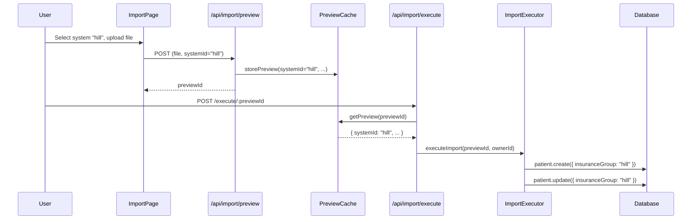
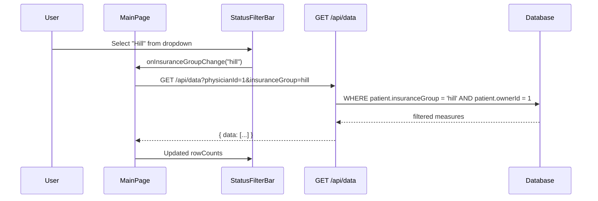
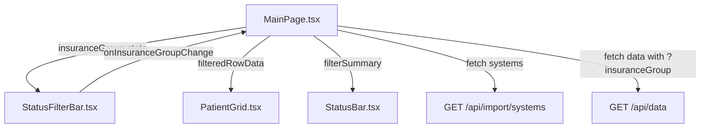

# Design Document: Insurance Group

## Overview

This feature adds an `insuranceGroup` field to the `Patient` model that associates each patient with the healthcare system (insurance group) from which they were imported. It extends the import pipeline to persist the selected `systemId` on patient records, adds a server-side filter to the `GET /api/data` endpoint, and adds a dropdown filter in the `StatusFilterBar` component on the patient grid page. The dropdown options are driven dynamically by the `systems.json` registry via the existing `GET /api/import/systems` endpoint.

The feature touches four layers: database schema, import pipeline, data API, and frontend UI. All changes build on existing patterns and conventions already established in the codebase.

## Steering Document Alignment

### Technical Standards (tech.md)

- **Prisma ORM**: Schema change uses standard Prisma migration workflow (`npx prisma migrate dev`). The new column follows existing naming conventions (`insurance_group` in SQL, `insuranceGroup` in TypeScript).
- **Express.js routes**: The `GET /api/data` endpoint is extended with a new query parameter following the same pattern as the existing `physicianId` parameter.
- **TypeScript**: All new interfaces and type changes use strict TypeScript. No `any` types.
- **React + Tailwind CSS**: The dropdown filter follows the identical pattern of the existing Quality Measure `<select>` in `StatusFilterBar.tsx`.
- **Zustand**: No new stores needed. Filter state is local to `MainPage.tsx` via `useState`, consistent with `selectedMeasure` and `activeFilters`.
- **AG Grid Community**: The filter is external (in `StatusFilterBar`), not an AG Grid column filter, per CON-IG-1.
- **Axios**: Frontend uses `api.get()` for the systems endpoint, consistent with all other API calls.

### Project Structure (structure.md)

- **Backend**: Schema change in `backend/prisma/schema.prisma`. Service changes in `backend/src/services/import/`. Route handler changes in `backend/src/routes/handlers/dataHandlers.ts`. No new files required; all changes extend existing modules.
- **Frontend**: UI changes in `frontend/src/components/layout/StatusFilterBar.tsx` and `frontend/src/pages/MainPage.tsx`. No new components required.
- **Tests**: Backend tests in `backend/src/services/__tests__/` and `backend/src/routes/__tests__/`. Frontend tests in `frontend/src/components/layout/StatusFilterBar.test.tsx` and `frontend/src/pages/MainPage.test.tsx`. E2E tests in `frontend/cypress/e2e/` and `frontend/e2e/`.
- **Naming**: All conventions followed (PascalCase components, camelCase services, snake_case DB columns).

## Code Reuse Analysis

### Existing Components to Leverage

- **`StatusFilterBar.tsx`**: The Quality Measure dropdown (`<select>`) is the exact pattern for the Insurance Group dropdown. Same Tailwind classes, same active-ring indicator, same position in the filter bar.
- **`configLoader.ts` / `listSystems()`**: Already returns `SystemListItem[]` with `{ id, name, isDefault }`. No changes needed to this service.
- **`GET /api/import/systems`**: Already exposes the systems list to the frontend. No backend changes needed for this endpoint.
- **`previewCache.ts` / `PreviewEntry`**: Already stores `systemId` in the preview entry. No changes needed.
- **`getPatientOwnerFilter()`**: Existing ownership filter pattern in `data.routes.ts`. The insurance group filter will be added alongside it using the same pattern.
- **`toGridRowPayload()`**: Existing function in `versionCheck.ts` that maps `PatientMeasure` + `Patient` to `GridRowPayload`. Must be extended to include `insuranceGroup`.
- **`MainPage.tsx` state management**: Follows existing patterns for `selectedMeasure`, `activeFilters`, and `searchText` -- local `useState` with effects that trigger re-fetch.

### Integration Points

- **Prisma `Patient` model**: New nullable `String` field `insuranceGroup` with `@map("insurance_group")` and `@@index`.
- **Import pipeline**: `importExecutor.ts` `insertMeasure()` and `updateMeasure()` functions receive and persist `insuranceGroup` from preview cache. Both functions must set `patient.insuranceGroup = systemId` — `insertMeasure()` on patient create/update, and `updateMeasure()` on patient update (since UPDATE actions mean the patient exists but the measure status changed).
- **Data API**: `dataHandlers.ts` `getPatientMeasures()` reads `req.query.insuranceGroup` and adds a `where` clause on `patient.insuranceGroup`.
- **Grid data response**: `gridData` mapping in `getPatientMeasures()` includes `insuranceGroup` field from `measure.patient.insuranceGroup`.
- **Socket.IO payloads**: `GridRowPayload` type extended with `insuranceGroup` field so real-time updates carry it.
- **Audit logging**: Import executor already creates audit log entries. The `insuranceGroup` change is included in the `changes` JSON automatically via the existing audit pattern.

## Architecture

### Data Flow Diagram



### Filter Flow Diagram



### Component Architecture



## Components and Interfaces

### 1. Prisma Schema -- Patient Model Extension

- **Purpose:** Add `insuranceGroup` field to persist the source healthcare system on patient records.
- **Interfaces:** Standard Prisma model field, no custom methods.
- **Dependencies:** Prisma migration system.
- **Reuses:** Existing `Patient` model pattern for nullable string fields.

### 2. Import Executor -- `insuranceGroup` Propagation

- **Purpose:** Set `insuranceGroup` on patient records during import (both create and update paths).
- **Interfaces:**
  - `insertMeasure(change, tx, ownerId, systemId)` -- extended signature to accept `systemId`.
  - `updateMeasure(change, tx, systemId)` -- extended signature to accept `systemId` and update patient's `insuranceGroup`.
  - `executeReplaceMode(changes, tx, stats, errors, ownerId, systemId)` -- extended to thread `systemId` through.
  - `executeMergeMode(changes, tx, stats, errors, ownerId, systemId)` -- extended to thread `systemId` through.
  - `executeImport(previewId, ownerId)` -- reads `systemId` from preview cache.
- **Dependencies:** `previewCache.ts` (already stores `systemId`), `prisma.patient.create/update`.
- **Reuses:** Existing `PreviewEntry.systemId` field (already present in the cache), existing `insertMeasure()` and `updateMeasure()` functions.

### 3. Data Handlers -- `getPatientMeasures()` Filter Extension

- **Purpose:** Accept `insuranceGroup` query parameter and filter patient measures accordingly.
- **Interfaces:**
  - Query param: `?insuranceGroup=hill` (specific group), `?insuranceGroup=none` (null group), omitted or `?insuranceGroup=all` (no filter).
  - Response: Each row includes `insuranceGroup: string | null`.
- **Dependencies:** `getPatientOwnerFilter()`, Prisma query builder.
- **Reuses:** Existing `ownerWhere` pattern in `getPatientMeasures()`. The insurance group filter is added as an additional `AND` condition.

### 4. StatusFilterBar -- Insurance Group Dropdown

- **Purpose:** Display a dropdown filter for insurance group in the filter bar.
- **Interfaces:**
  - Props: `selectedInsuranceGroup: string`, `onInsuranceGroupChange: (value: string) => void`, `insuranceGroupOptions: Array<{ id: string; name: string }>`.
  - Renders: `<select>` element between Quality Measure dropdown and Search input.
- **Dependencies:** None (pure presentational component).
- **Reuses:** Exact visual pattern of the existing Quality Measure `<select>` (same Tailwind classes, same active-ring indicator).

### 5. MainPage -- Insurance Group State and Data Fetching

- **Purpose:** Manage `insuranceGroup` filter state, fetch systems list, and pass the filter to the API.
- **Interfaces:**
  - State: `selectedInsuranceGroup: string` (default `'hill'`).
  - State: `insuranceGroupOptions: Array<{ id: string; name: string }>` (from `GET /api/import/systems`).
  - Effect: `getQueryParams()` extended to include `&insuranceGroup=<value>`.
  - Effect: Re-fetch data when `selectedInsuranceGroup` changes.
- **Dependencies:** `api.get('/import/systems')`, `api.get('/data')`.
- **Reuses:** Existing `selectedMeasure` pattern (local `useState`, passed to `StatusFilterBar`, triggers re-fetch).

### 6. GridRow / GridRowPayload -- Type Extension

- **Purpose:** Include `insuranceGroup` in the row data flowing through the grid and Socket.IO.
- **Interfaces:** `insuranceGroup: string | null` added to both `GridRow` (frontend) and `GridRowPayload` (shared type).
- **Dependencies:** `versionCheck.ts` `toGridRowPayload()`.
- **Reuses:** Existing field pattern in both types.

## Data Models

### Patient Model (Modified)

```prisma
model Patient {
  id              Int              @id @default(autoincrement())
  memberName      String           @map("member_name")
  memberDob       DateTime         @map("member_dob") @db.Date
  memberTelephone String?          @map("member_telephone")
  memberAddress   String?          @map("member_address")
  insuranceGroup  String?          @map("insurance_group")          // NEW
  ownerId         Int?             @map("owner_id")
  owner           User?            @relation(fields: [ownerId], references: [id], onDelete: SetNull)
  createdAt       DateTime         @default(now()) @map("created_at")
  updatedAt       DateTime         @updatedAt @map("updated_at")
  measures        PatientMeasure[]

  @@unique([memberName, memberDob])
  @@index([ownerId])
  @@index([insuranceGroup])                                         // NEW
  @@map("patients")
}
```

### Migration SQL

```sql
-- AlterTable: Add insurance_group column
ALTER TABLE "patients" ADD COLUMN "insurance_group" TEXT;

-- CreateIndex: Add index for filtering performance
CREATE INDEX "patients_insurance_group_idx" ON "patients"("insurance_group");

-- DataMigration: Set existing patients to 'hill'
UPDATE "patients" SET "insurance_group" = 'hill' WHERE "insurance_group" IS NULL;
```

**Migration strategy:** The column is added as nullable first (no default), then a data migration sets all existing rows to `'hill'`. This is idempotent -- running again only updates rows where `insurance_group IS NULL`. The column remains nullable for manually-created patients. This approach is backward-compatible: if the app is rolled back, the column is ignored by older code.

### GridRow Interface (Modified)

```typescript
export interface GridRow {
  id: number;
  patientId: number;
  memberName: string;
  memberDob: string;
  memberTelephone: string | null;
  memberAddress: string | null;
  insuranceGroup: string | null;    // NEW
  requestType: string | null;
  qualityMeasure: string | null;
  measureStatus: string | null;
  statusDate: string | null;
  statusDatePrompt: string | null;
  tracking1: string | null;
  tracking2: string | null;
  depressionScreeningStatus: string | null;
  dueDate: string | null;
  timeIntervalDays: number | null;
  notes: string | null;
  rowOrder: number;
  isDuplicate: boolean;
  updatedAt?: string;
}
```

### GridRowPayload Interface (Modified)

```typescript
// backend/src/types/socket.ts
export interface GridRowPayload {
  // ... existing fields ...
  insuranceGroup: string | null;    // NEW
}
```

### StatusFilterBar Props (Modified)

```typescript
interface StatusFilterBarProps {
  // ... existing props ...
  selectedInsuranceGroup: string;
  onInsuranceGroupChange: (value: string) => void;
  insuranceGroupOptions: Array<{ id: string; name: string }>;
}
```

## API Design

### GET /api/data -- Extended Query Parameters

**Existing parameters (unchanged):**
- `physicianId` (required for STAFF/ADMIN)

**New parameter:**
- `insuranceGroup` (optional): Filter by insurance group.
  - Value `"hill"`, `"kaiser"`, etc.: Filter to patients with matching `insuranceGroup`.
  - Value `"none"` or `"null"`: Filter to patients with `insuranceGroup IS NULL`.
  - Value `"all"` or omitted: No insurance group filter (return all).

**Request example:**
```
GET /api/data?physicianId=1&insuranceGroup=hill
```

**Response (unchanged structure, new field in each row):**
```json
{
  "success": true,
  "data": [
    {
      "id": 1,
      "patientId": 1,
      "memberName": "Smith, John",
      "memberDob": "1960-01-15T00:00:00.000Z",
      "memberTelephone": "(555) 123-4567",
      "memberAddress": "123 Main St",
      "insuranceGroup": "hill",
      "requestType": "AWV",
      "qualityMeasure": "Annual Wellness Visit",
      "measureStatus": "Completed",
      ...
    }
  ]
}
```

**Validation:** The `insuranceGroup` parameter is validated against the systems registry (`configLoader.systemExists()`). Values not matching a registered system, `"none"`, `"null"`, or `"all"` are rejected with a 400 error. This prevents injection of arbitrary values.

### GET /api/import/systems -- Unchanged

This endpoint already returns the data needed for the dropdown. No changes required.

```json
{
  "success": true,
  "data": [
    { "id": "hill", "name": "Hill Healthcare", "isDefault": true }
  ]
}
```

## Detailed Implementation Changes

### Backend Changes

#### 1. `backend/prisma/schema.prisma`

Add `insuranceGroup` field and index to `Patient` model:

```prisma
insuranceGroup  String?          @map("insurance_group")
@@index([insuranceGroup])
```

#### 2. `backend/src/routes/handlers/dataHandlers.ts` -- `getPatientMeasures()`

```typescript
// After getPatientOwnerFilter():
const insuranceGroupParam = req.query.insuranceGroup as string | undefined;

// Build insurance group where clause
let insuranceGroupWhere: Record<string, unknown> = {};
if (insuranceGroupParam && insuranceGroupParam !== 'all') {
  if (insuranceGroupParam === 'none' || insuranceGroupParam === 'null') {
    insuranceGroupWhere = { insuranceGroup: null };
  } else {
    // Validate against registry
    if (!systemExists(insuranceGroupParam)) {
      throw createError(`Invalid insuranceGroup: ${insuranceGroupParam}`, 400, 'VALIDATION_ERROR');
    }
    insuranceGroupWhere = { insuranceGroup: insuranceGroupParam };
  }
}

// Combine with owner where clause
const measures = await prisma.patientMeasure.findMany({
  where: {
    patient: {
      ...ownerWhere,
      ...insuranceGroupWhere,
    },
  },
  include: { patient: true },
  orderBy: { rowOrder: 'asc' },
});

// Include insuranceGroup in response mapping:
const gridData = measures.map((measure) => ({
  // ... existing fields ...
  insuranceGroup: measure.patient.insuranceGroup,
}));
```

#### 3. `backend/src/services/import/importExecutor.ts` -- `insertMeasure()`

Read `systemId` from preview cache and pass to patient creation/update:

```typescript
export async function executeImport(previewId: string, ownerId: number | null = null): Promise<ExecutionResult> {
  const preview = getPreview(previewId);
  if (!preview) { throw new Error(`Preview not found or expired: ${previewId}`); }

  // Read systemId from preview cache (fallback to 'hill' for backward compat)
  const systemId = preview.systemId || 'hill';

  // Pass systemId through to insert/update functions
  await prisma.$transaction(async (tx) => {
    if (preview.mode === 'replace') {
      await executeReplaceMode(preview.diff.changes, tx, stats, errors, ownerId, systemId);
    } else {
      await executeMergeMode(preview.diff.changes, tx, stats, errors, ownerId, systemId);
    }
  }, { timeout: 300000, maxWait: 10000 });
  // ...
}
```

In `insertMeasure()`, set `insuranceGroup` on patient create/update:

```typescript
async function insertMeasure(
  change: DiffChange,
  tx: PrismaTransaction,
  ownerId: number | null,
  systemId: string                // NEW parameter
): Promise<void> {
  // ... existing patient find ...

  if (!patient) {
    patient = await tx.patient.create({
      data: {
        memberName: change.memberName,
        memberDob: memberDob,
        memberTelephone: change.memberTelephone,
        memberAddress: change.memberAddress,
        ownerId: ownerId,
        insuranceGroup: systemId,   // NEW: set insurance group
      }
    });
  } else {
    // Update existing patient's insuranceGroup AND ownerId
    const updateData: Record<string, unknown> = { insuranceGroup: systemId };
    if (ownerId !== null && patient.ownerId !== ownerId) {
      updateData.ownerId = ownerId;
    }
    patient = await tx.patient.update({
      where: { id: patient.id },
      data: updateData,
    });
  }

  // ... rest unchanged ...
}
```

#### 3b. `backend/src/services/import/importExecutor.ts` -- `updateMeasure()`

The `updateMeasure()` function handles UPDATE actions (existing measure found, status changed). It must also update the patient's `insuranceGroup` to reflect the current import's system, per REQ-IG-2 AC3 and REQ-IG-6.

```typescript
async function updateMeasure(
  change: DiffChange,
  tx: PrismaTransaction,
  systemId: string                // NEW parameter
): Promise<void> {
  // ... existing measure update logic ...

  // Update patient's insuranceGroup (REQ-IG-2 AC3: re-import updates group)
  if (change.existingPatientId) {
    await tx.patient.update({
      where: { id: change.existingPatientId },
      data: { insuranceGroup: systemId },
    });
  }
}
```

Note: `executeReplaceMode()` and `executeMergeMode()` must also accept `systemId` and pass it to both `insertMeasure()` and `updateMeasure()`.

#### 3c. `backend/src/routes/handlers/dataHandlers.ts` -- `duplicateRow()`

The duplicate row response must include `insuranceGroup` from the patient record for consistency:

```typescript
// In the response mapping for duplicateRow:
insuranceGroup: duplicatedMeasure.patient.insuranceGroup,
```

#### 3d. Import for `systemExists` in dataHandlers.ts

Add new import at the top of `dataHandlers.ts`:

```typescript
import { systemExists } from '../../services/import/configLoader.js';
```

#### 4. `backend/src/services/versionCheck.ts` -- `toGridRowPayload()`

Add `insuranceGroup` to the payload type and mapping:

```typescript
function toGridRowPayload(measure: {
  // ... existing fields ...
  patient: {
    // ... existing fields ...
    insuranceGroup: string | null;  // NEW
  };
}): GridRowPayload {
  return {
    // ... existing fields ...
    insuranceGroup: measure.patient.insuranceGroup,  // NEW
  };
}
```

#### 5. `backend/src/types/socket.ts` -- `GridRowPayload`

Add `insuranceGroup` field:

```typescript
export interface GridRowPayload {
  // ... existing fields ...
  insuranceGroup: string | null;
}
```

#### 6. `backend/src/routes/handlers/dataHandlers.ts` -- `createPatientMeasure()`

Include `insuranceGroup` in the response payload (from the patient record):

```typescript
// In the response mapping:
insuranceGroup: updatedMeasure!.patient.insuranceGroup,
```

Same for `updatePatientMeasure()` and `deletePatientMeasure()` responses.

### Frontend Changes

#### 1. `frontend/src/components/layout/StatusFilterBar.tsx`

Add insurance group dropdown between Quality Measure dropdown and Search input:

```typescript
interface StatusFilterBarProps {
  // ... existing props ...
  selectedInsuranceGroup: string;
  onInsuranceGroupChange: (value: string) => void;
  insuranceGroupOptions: Array<{ id: string; name: string }>;
}

// In the JSX, after Quality Measure dropdown:
{/* Insurance Group dropdown */}
<select
  value={selectedInsuranceGroup}
  onChange={(e) => onInsuranceGroupChange(e.target.value)}
  aria-label="Filter by insurance group"
  className={`
    text-xs py-0.5 pl-1.5 pr-6 border rounded-md bg-white cursor-pointer
    focus:outline-none focus:ring-2 focus:ring-blue-500 focus:border-blue-500
    ${selectedInsuranceGroup !== 'all' ? 'ring-2 ring-blue-400 border-blue-400' : 'border-gray-300'}
  `}
>
  <option value="all">All</option>
  {insuranceGroupOptions.map((system) => (
    <option key={system.id} value={system.id}>{system.name}</option>
  ))}
  <option value="none">No Insurance</option>
</select>
```

Note: The active-ring indicator (`ring-2 ring-blue-400 border-blue-400`) matches the existing Quality Measure dropdown behavior when a non-default value is selected. Since the default value is `'hill'` (not `'all'`), the ring is shown whenever the value is anything other than `'all'`, which means it will be active by default -- consistent with the requirement that "Hill" is the default selection.

#### 2. `frontend/src/pages/MainPage.tsx`

Add insurance group state and data fetching:

```typescript
// State
const [selectedInsuranceGroup, setSelectedInsuranceGroup] = useState<string>('hill');
const [insuranceGroupOptions, setInsuranceGroupOptions] = useState<Array<{ id: string; name: string }>>([]);

// Fetch systems on mount (cached for session per NFR-IG-3)
useEffect(() => {
  api.get('/import/systems')
    .then((res) => {
      if (res.data.success) {
        setInsuranceGroupOptions(
          res.data.data
            .map((s: { id: string; name: string }) => ({ id: s.id, name: s.name }))
            .sort((a: { name: string }, b: { name: string }) => a.name.localeCompare(b.name))
        );
      }
    })
    .catch(() => {
      // Fallback per REQ-IG-7 AC4
      setInsuranceGroupOptions([{ id: 'hill', name: 'Hill' }]);
    });
}, []);

// Extend getQueryParams to include insuranceGroup
const getQueryParams = useCallback(() => {
  const params = new URLSearchParams();
  if (user?.roles.includes('STAFF') && selectedPhysicianId) {
    params.set('physicianId', String(selectedPhysicianId));
  } else if (user?.roles.includes('ADMIN')) {
    params.set('physicianId', selectedPhysicianId === null ? 'unassigned' : String(selectedPhysicianId));
  }
  if (selectedInsuranceGroup !== 'all') {
    params.set('insuranceGroup', selectedInsuranceGroup === 'none' ? 'none' : selectedInsuranceGroup);
  }
  const qs = params.toString();
  return qs ? `?${qs}` : '';
}, [user?.roles, selectedPhysicianId, selectedInsuranceGroup]);

// Re-fetch when insuranceGroup changes (add to useEffect deps)
useEffect(() => {
  loadData().catch(/* ... */);
}, [selectedPhysicianId, selectedInsuranceGroup, getQueryParams]);
```

Extend `filterSummary` to include insurance group:

```typescript
const filterSummary = useMemo(() => {
  const parts: string[] = [];
  if (selectedInsuranceGroup !== 'all') {
    const label = selectedInsuranceGroup === 'none'
      ? 'No Insurance'
      : insuranceGroupOptions.find(o => o.id === selectedInsuranceGroup)?.name || selectedInsuranceGroup;
    parts.push(`Insurance: ${label}`);
  }
  if (!activeFilters.includes('all') && activeFilters.length > 0) {
    const labels = activeFilters.map(f => STATUS_LABELS[f] || f).join(', ');
    parts.push(`Color: ${labels}`);
  }
  if (selectedMeasure !== 'All Measures') {
    parts.push(`Measure: ${selectedMeasure}`);
  }
  return parts.length > 0 ? parts.join(' | ') : undefined;
}, [activeFilters, selectedMeasure, selectedInsuranceGroup, insuranceGroupOptions]);
```

Pass new props to `StatusFilterBar`:

```tsx
<StatusFilterBar
  // ... existing props ...
  selectedInsuranceGroup={selectedInsuranceGroup}
  onInsuranceGroupChange={setSelectedInsuranceGroup}
  insuranceGroupOptions={insuranceGroupOptions}
/>
```

#### 3. `frontend/src/components/grid/PatientGrid.tsx` -- GridRow Type

Add `insuranceGroup` to the `GridRow` interface:

```typescript
export interface GridRow {
  // ... existing fields ...
  insuranceGroup: string | null;
}
```

No column definition needed for `insuranceGroup` -- it is not displayed as a grid column; it is only used for filtering.

#### 4. `frontend/src/types/socket.ts` -- GridRowPayload Type

Add `insuranceGroup` field:

```typescript
export interface GridRowPayload {
  // ... existing fields ...
  insuranceGroup: string | null;
}
```

## Error Handling

### Error Scenarios

1. **Invalid `insuranceGroup` query parameter**
   - **Handling:** Backend validates against `configLoader.systemExists()`. Returns `400 VALIDATION_ERROR` if the value does not match a registered system, `"none"`, `"null"`, or `"all"`.
   - **User Impact:** Frontend shows error toast. This scenario should not occur in normal usage since the dropdown only contains valid options.

2. **`GET /api/import/systems` endpoint failure**
   - **Handling:** Frontend catches the error and falls back to hardcoded defaults `[{ id: 'hill', name: 'Hill' }]` per REQ-IG-7 AC4.
   - **User Impact:** Dropdown shows "All Insurance", "Hill", and "No Insurance" instead of the full dynamic list. Functionality is preserved.

3. **Missing `systemId` in preview cache (backward compatibility)**
   - **Handling:** `executeImport()` defaults to `'hill'` if `preview.systemId` is falsy, per REQ-IG-2 AC6.
   - **User Impact:** None -- in-flight previews from before the deployment execute correctly.

4. **Patient with unknown `insuranceGroup` value (system removed from registry)**
   - **Handling:** Patient appears when "All" filter is selected. Does not match any specific system filter since the value is not in the registry. The `GET /api/data` validation allows `'all'` to bypass system existence checks.
   - **User Impact:** Patient is visible under "All" but not under any named insurance group.

5. **Data migration failure**
   - **Handling:** The Prisma migration is atomic. If the data migration (`UPDATE patients SET insurance_group = 'hill'`) fails, the entire migration is rolled back. The schema change is not applied.
   - **User Impact:** Deployment fails cleanly. Administrator can retry the migration.

6. **Concurrent filter change and import**
   - **Handling:** Existing Socket.IO `import:completed` event triggers `loadData()` which re-fetches with current filter state. Newly imported patients from a different insurance group will not appear if the filter excludes them.
   - **User Impact:** Grid refreshes automatically. User sees only patients matching their current filter.

## Testing Strategy

### Unit Testing (Jest -- Backend)

| Test File | Coverage |
|-----------|----------|
| `backend/src/services/import/__tests__/importExecutor.test.ts` | Extended: verify `insuranceGroup` is set on patient create/update during import |
| `backend/src/routes/__tests__/data.routes.test.ts` | Extended: test `?insuranceGroup=hill`, `?insuranceGroup=none`, `?insuranceGroup=all`, invalid values |
| `backend/src/services/__tests__/versionCheck.test.ts` | Extended: verify `toGridRowPayload` includes `insuranceGroup` |

**Key test cases:**
- Import creates patient with correct `insuranceGroup`
- Import updates existing patient's `insuranceGroup`
- Re-import from different system changes `insuranceGroup`
- Missing `systemId` in preview cache defaults to `'hill'`
- `GET /api/data?insuranceGroup=hill` returns only Hill patients
- `GET /api/data?insuranceGroup=none` returns only null-group patients
- `GET /api/data?insuranceGroup=all` returns all patients
- `GET /api/data?insuranceGroup=invalid` returns 400
- `insuranceGroup` filter combined with `physicianId` applies both (AND)
- RBAC still enforced with insurance group filter active
- Grid response includes `insuranceGroup` field

### Component Testing (Vitest -- Frontend)

| Test File | Coverage |
|-----------|----------|
| `frontend/src/components/layout/StatusFilterBar.test.tsx` | Extended: render insurance group dropdown, options order, active-ring indicator, change handler |
| `frontend/src/pages/MainPage.test.tsx` | Extended: default selection `'hill'`, systems fetch + fallback, query params include `insuranceGroup`, filter summary text |

**Key test cases:**
- Dropdown renders with "All", system names (sorted alphabetically), and "No Insurance"
- Default selection is "Hill"
- Active-ring indicator shown when value is not "all"
- Changing dropdown triggers `onInsuranceGroupChange` callback
- Systems fetch failure falls back to hardcoded `[{ id: 'hill', name: 'Hill' }]`
- `getQueryParams()` includes `&insuranceGroup=hill` by default
- `getQueryParams()` omits `insuranceGroup` when set to `'all'`
- Filter summary includes "Insurance: Hill" when active

### E2E Testing (Playwright)

| Test File | Coverage |
|-----------|----------|
| `frontend/e2e/insurance-group-filter.spec.ts` | New: full user flow for insurance group filtering |

**Key scenarios:**
- Page loads with "Hill" selected by default
- Changing to "All" shows all patients
- Changing to "No Insurance" shows only unassigned patients
- Filter persists when physician selector changes
- Status bar shows insurance group in filter summary

### E2E Testing (Cypress -- AG Grid)

| Test File | Coverage |
|-----------|----------|
| `frontend/cypress/e2e/insurance-group-filter.cy.ts` | New: verify grid row counts change with filter, status chips update |

**Key scenarios:**
- Grid shows correct row count after filter change
- Status color chip counts reflect filtered data
- Insurance group filter combined with quality measure filter

### Visual Browser Review (MCP Playwright -- Layer 5)

- Verify dropdown placement between Quality Measure and Search
- Verify active-ring indicator appearance
- Verify filter summary text in status bar
- Verify grid updates correctly when filter changes
- Screenshot review of all filter combinations
