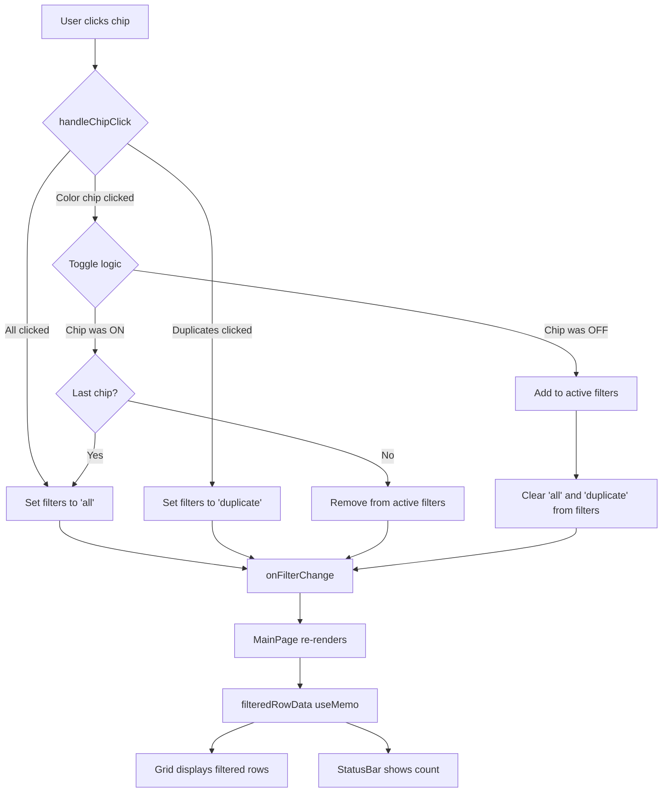

# Design Document: Multi-Select Status Filter

## Overview

Convert the StatusFilterBar from single-select to multi-select behavior. The change is localized to two files: `StatusFilterBar.tsx` (click handler + visual style) and `MainPage.tsx` (filter logic for duplicates edge case). The existing `filteredRowData` useMemo already supports multi-select arrays — only the click handler enforces single-select today.

## Steering Document Alignment

### Technical Standards (tech.md)
- **React 18 + TypeScript**: All changes within existing React component patterns
- **Tailwind CSS**: Chip styling uses Tailwind utility classes (no custom CSS)
- **lucide-react icons**: Checkmark icon (`Check`) from already-imported icon library
- **No new dependencies**: Pure frontend changes using existing libraries

### Project Structure (structure.md)
- **Component location**: `frontend/src/components/layout/StatusFilterBar.tsx` (existing)
- **Page location**: `frontend/src/pages/MainPage.tsx` (existing)
- **Test location**: `frontend/src/components/layout/StatusFilterBar.test.tsx` (existing, extend)
- **Cypress E2E**: `frontend/cypress/e2e/` (new test file)

## Code Reuse Analysis

### Existing Components to Leverage
- **StatusFilterBar.tsx**: Modify `handleChipClick` and chip rendering (keep props interface, STATUS_CATEGORIES, search input unchanged)
- **MainPage.tsx**: Modify `filteredRowData` useMemo to handle multi-select with duplicates exclusivity
- **STATUS_CATEGORIES array**: Keep all 10 categories; only add `Check` icon import

### Integration Points
- **activeFilters state** (`MainPage.tsx` line 30): Already typed as `StatusColor[]` — no type changes needed
- **onFilterChange callback**: Already accepts `StatusColor[]` — no signature changes needed
- **rowCounts computation**: No changes — always computes from full dataset
- **Patient Name Search**: AND logic already works with multi-select (filters apply sequentially)
- **StatusBar component**: Already receives `filteredRowData.length` — works automatically

## Architecture



## Components and Interfaces

### StatusFilterBar (Modified)

- **Purpose**: Render filter chips with multi-select toggle and checkmark+fill visual style
- **Props interface**: No changes to `StatusFilterBarProps`
- **Dependencies**: Add `Check` icon from `lucide-react`

#### handleChipClick Changes

**Current** (single-select):
```typescript
const handleChipClick = (id: StatusColor) => {
  if (id === 'all') {
    onFilterChange(['all']);
  } else if (activeFilters.includes(id) && !activeFilters.includes('all')) {
    onFilterChange(['all']);
  } else {
    onFilterChange([id]);
  }
};
```

**New** (multi-select):
```typescript
const handleChipClick = (id: StatusColor) => {
  if (id === 'all') {
    // All clears everything
    onFilterChange(['all']);
    return;
  }

  if (id === 'duplicate') {
    // Duplicates is exclusive — toggle it
    if (activeFilters.includes('duplicate')) {
      onFilterChange(['all']);
    } else {
      onFilterChange(['duplicate']);
    }
    return;
  }

  // Status color chip toggled
  let newFilters: StatusColor[];

  if (activeFilters.includes('all') || activeFilters.includes('duplicate')) {
    // Coming from All or Duplicates → start fresh with just this chip
    newFilters = [id];
  } else if (activeFilters.includes(id)) {
    // Toggle OFF — remove this chip
    newFilters = activeFilters.filter((f) => f !== id);
    // If nothing left, fall back to All
    if (newFilters.length === 0) {
      newFilters = ['all'];
    }
  } else {
    // Toggle ON — add this chip
    newFilters = [...activeFilters, id];
  }

  onFilterChange(newFilters);
};
```

**Logic summary:**
| Action | Result |
|--------|--------|
| Click "All" | `['all']` — clears everything |
| Click "Duplicates" (not active) | `['duplicate']` — exclusive mode |
| Click "Duplicates" (active) | `['all']` — back to all |
| Click color chip while "All" active | `[color]` — start single selection |
| Click color chip while "Duplicates" active | `[color]` — exit duplicates mode |
| Click unselected color chip | `[...existing, color]` — add to multi-select |
| Click selected color chip (not last) | `existing.filter(f => f !== color)` — remove |
| Click last selected color chip | `['all']` — prevent zero-selection |

#### Chip Rendering Changes

**Current**: Blue ring for active, opacity for inactive
```tsx
${isActive ? 'ring-2 ring-offset-1 ring-blue-500' : 'opacity-60 hover:opacity-100'}
```

**New**: Checkmark + filled background for active, outlined with reduced opacity for inactive
```tsx
<button
  key={category.id}
  onClick={() => handleChipClick(category.id)}
  aria-pressed={isActive}
  className={`
    inline-flex items-center gap-1.5 px-3 py-1 rounded-full text-sm font-medium
    border-2 transition-all duration-150 cursor-pointer
    ${isActive
      ? `${category.bgColor} ${category.textColor} ${category.borderColor}`
      : `bg-white ${category.textColor} ${category.borderColor} opacity-50 hover:opacity-75`
    }
  `}
>
  {isActive && <Check size={14} strokeWidth={3} />}
  <span>{category.label}</span>
  <span className="text-xs opacity-75">({count})</span>
</button>
```

**Visual states:**
| State | Background | Border | Opacity | Checkmark |
|-------|-----------|--------|---------|-----------|
| Active | Category color fill | Category border | 100% | Yes (Check icon, 14px) |
| Inactive | White | Category border | 50% | No |
| Inactive + Hover | White | Category border | 75% | No |

**Keyboard accessibility**: Native `<button>` elements support Enter/Space activation and Tab navigation out of the box, satisfying AC-5.1 and AC-5.2 without additional JavaScript. The `aria-pressed` attribute (no explicit role override needed) satisfies AC-5.3.

**Edge case notes:**
- **All chips manually selected**: The `handleChipClick` logic never auto-switches to "All" — only the "All" click or last-chip-off triggers it
- **Data reload**: `activeFilters` state is independent of `rowData`, so filters are preserved across data refreshes
- **Single chip selected**: Visually identical to old single-select mode (one chip highlighted, rest dimmed)

### MainPage (Modified)

- **Purpose**: Host filter state and apply multi-select filtering to grid data
- **Changes**: Update `filteredRowData` useMemo to properly handle mixed duplicate + color scenarios

#### filteredRowData Changes

**Current** (line 80-84):
```typescript
if (activeFilters.includes('duplicate')) return row.isDuplicate;
const color = getRowStatusColor(row);
return activeFilters.includes(color);
```

**New** — same logic, no change needed. The current code already:
1. Checks if `'all'` is in filters → shows all rows
2. Checks if `'duplicate'` is in filters → shows duplicate rows
3. Otherwise maps rows by status color against active filters

Since `'duplicate'` is now exclusive (AC-3.1), it will always be the only item in `activeFilters` when active, so the existing `includes('duplicate')` check works correctly. No changes to `filteredRowData` are needed.

**No changes needed to:**
- `rowCounts` useMemo (always computes from full `rowData`)
- `searchText` filtering (applies after status filter — AND logic preserved)
- `StatusBar` component (receives `filteredRowData.length` automatically)
- `activeFilters` state initialization (`['all']` remains the default)

## Data Models

No database or data model changes. All changes are client-side UI state.

**Existing state (unchanged):**
```typescript
// MainPage.tsx
const [activeFilters, setActiveFilters] = useState<StatusColor[]>(['all']);
```

**Valid states for `activeFilters`:**
- `['all']` — Show all rows (default)
- `['duplicate']` — Show duplicate rows only
- `['green']` — Single color filter
- `['green', 'blue', 'red']` — Multi-color filter (OR logic)
- Never: `[]` (empty) — prevented by AC-1.3 fallback
- Never: `['all', 'green']` — "All" always stands alone
- Never: `['duplicate', 'green']` — "Duplicates" always stands alone

## Error Handling

### Error Scenarios

1. **Zero-selection state attempted**
   - **Handling**: `handleChipClick` detects when toggling OFF the last chip and auto-sets `['all']`
   - **User Impact**: Seamless — "All" chip lights up, grid shows all rows

2. **Invalid filter state in localStorage** (future: if filter state is persisted)
   - **Handling**: Not applicable now — filter state resets to `['all']` on page load
   - **User Impact**: None — always starts fresh

## Testing Strategy

### Unit Testing (Vitest)

**StatusFilterBar.test.tsx** — Modify existing tests + add new (existing `ring-2` assertions and single-select click tests will need updating):
- Multi-select toggle: click adds chip, click removes chip
- Last chip removal falls back to "All"
- "All" click clears all selections
- "Duplicates" exclusivity with color chips
- Checkmark icon appears for active chips only
- `aria-pressed` attribute reflects toggle state
- Hover state on inactive chips

### Integration Testing (Vitest)

**MainPage.test.tsx** — Extend existing 20 tests:
- Multi-filter produces correct `filteredRowData` (OR logic)
- Multi-filter + search text (AND logic)
- Duplicates filter shows only duplicate rows
- Switching from duplicates to color filter

### End-to-End Testing (Cypress)

**New file: `multi-select-filter.cy.ts`**:
- Select multiple chips → grid shows combined results
- Toggle chip off → grid updates
- "All" resets all selections
- Duplicates exclusive behavior
- Checkmark icons visible/hidden
- Search + multi-filter combination
- Keyboard: Enter/Space toggles chip
- Tab navigation through chips

### Test Count Estimate
- Vitest (StatusFilterBar): ~12 new tests
- Vitest (MainPage): ~6 new tests
- Cypress E2E: ~15 new tests
- **Total: ~33 new tests**
