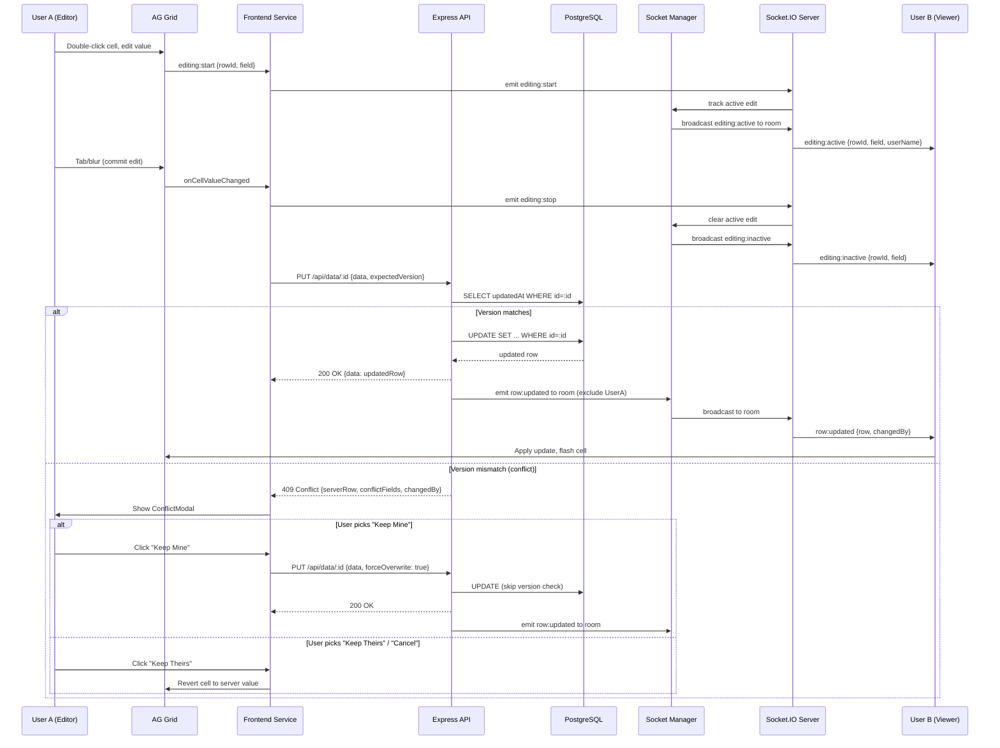
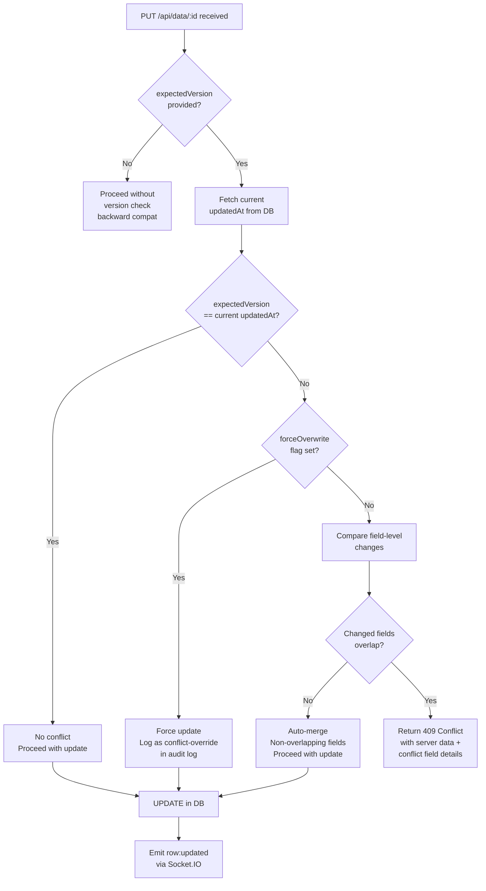
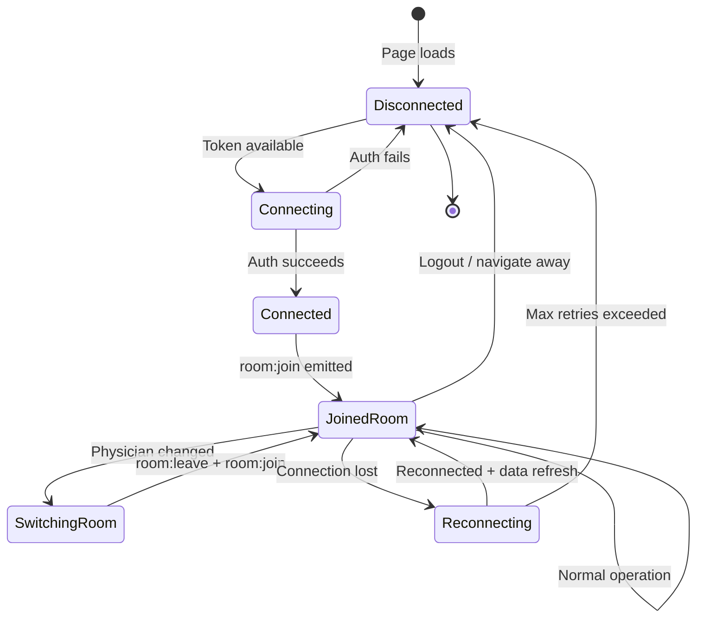

# Design Document: Parallel Editing (Real-Time Collaborative Editing with Conflict Resolution)

## Overview

This feature adds real-time collaborative editing to the Patient Tracker application. It introduces Socket.IO-based WebSocket communication so that multiple users editing the same physician's patient data see each other's changes immediately, are aware of each other's presence and active edits, and receive clear conflict resolution dialogs when two users edit the same field of the same row. The system uses optimistic concurrency control (version checking via the existing `updatedAt` timestamp) rather than pessimistic locking.

The architecture is additive: Socket.IO sits on top of the existing HTTP CRUD layer. If WebSocket connectivity fails, the application falls back to the current HTTP-only behavior with no functionality loss beyond real-time updates.

## Steering Document Alignment

### Technical Standards (tech.md)

- **Runtime & Framework**: Socket.IO server attaches to the existing `createServer(app)` HTTP server in `backend/src/index.ts`. No new server process is needed.
- **TypeScript**: All new backend and frontend code is TypeScript. Socket.IO event payloads are typed via shared interfaces.
- **State Management**: A new Zustand store (`realtimeStore`) follows the existing `authStore` pattern. No Redux or Context API.
- **Styling**: Tailwind CSS utility classes for all new UI components (ConflictModal, presence indicators, connection status). No new CSS frameworks.
- **Testing**: Jest for backend Socket.IO logic, Vitest for frontend React components, Playwright for E2E connection flows, Cypress for AG Grid edit indicator integration.
- **ESM**: All new modules use ESM (`import`/`export`), matching the project's `"type": "module"` configuration.

### Project Structure (structure.md)

All new files follow the existing directory layout and naming conventions:

| New File | Convention Followed |
|----------|-------------------|
| `backend/src/services/socketManager.ts` | camelCase service in `services/` |
| `backend/src/middleware/socketAuth.ts` | camelCase middleware in `middleware/` |
| `frontend/src/services/socketService.ts` | camelCase service in `services/` (new directory, follows backend pattern) |
| `frontend/src/stores/realtimeStore.ts` | camelCase store in `stores/` |
| `frontend/src/components/modals/ConflictModal.tsx` | PascalCase component in `components/modals/` |
| `frontend/src/hooks/useSocket.ts` | camelCase hook in `hooks/` (new directory) |

## Code Reuse Analysis

### Existing Components to Leverage

- **`ConfirmModal`** (`frontend/src/components/modals/ConfirmModal.tsx`): The ConflictModal will follow the same structural pattern (fixed overlay, centered card, button row) and CSS class conventions. It differs in having three buttons and a comparison section but reuses the modal shell approach.
- **`StatusBar`** (`frontend/src/components/layout/StatusBar.tsx`): Already has a right-side section with a hardcoded "Connected" text. This will be replaced with a dynamic connection status indicator and presence display.
- **`useAuthStore`** (`frontend/src/stores/authStore.ts`): The `token`, `user`, and `selectedPhysicianId` fields are consumed by the Socket.IO service for authentication and room management. The Zustand `persist` + `partialize` pattern will be followed for the new store.
- **`api` Axios instance** (`frontend/src/api/axios.ts`): The `getApiBaseUrl()` logic will be reused to derive the Socket.IO server URL (same origin, different path).
- **`verifyToken`** (`backend/src/services/authService.ts`): Reused in Socket.IO authentication middleware to validate JWT tokens on WebSocket connections.
- **`findUserById`** (`backend/src/services/authService.ts`): Reused to look up user details (displayName) from the socket's authenticated userId.
- **`createError`** (`backend/src/middleware/errorHandler.ts`): Used in the version-check logic to create the 409 Conflict error response.
- **`prisma` singleton** (`backend/src/config/database.ts`): All database access goes through the existing Prisma client singleton.
- **`GridRow` interface** (`frontend/src/components/grid/PatientGrid.tsx` and `frontend/src/types/index.ts`): Extended with `updatedAt` (already present in the types/index.ts version) for version tracking.

### Integration Points

- **`backend/src/index.ts`**: Socket.IO server attaches to the existing `server` variable (line 16: `const server = createServer(app)`). Graceful shutdown extended to close Socket.IO connections.
- **`backend/src/routes/data.routes.ts`**: PUT, POST, DELETE, and duplicate routes emit Socket.IO events after successful database operations. The PUT route adds `expectedVersion` checking.
- **`backend/src/routes/import.routes.ts`**: The execute endpoint emits `import:started` and `import:completed` events.
- **`frontend/src/pages/MainPage.tsx`**: Integrates the `useSocket` hook to handle incoming row events and manage the Socket.IO lifecycle tied to `selectedPhysicianId`.
- **`frontend/src/components/grid/PatientGrid.tsx`**: Tracks `updatedAt` per row as `expectedVersion`, sends it with PUT requests, handles 409 responses, applies remote updates, and renders edit indicators.
- **Nginx config** (`nginx/nginx.conf`): Already has WebSocket proxy configuration for `/socket.io` (lines 40-48). No changes needed.

## Architecture

### High-Level System Architecture

```mermaid
graph TB
    subgraph "Browser (User A)"
        A_Grid[AG Grid]
        A_Socket[Socket.IO Client]
        A_Store[Realtime Store<br/>Zustand]
        A_HTTP[Axios HTTP Client]
    end

    subgraph "Browser (User B)"
        B_Grid[AG Grid]
        B_Socket[Socket.IO Client]
        B_Store[Realtime Store<br/>Zustand]
        B_HTTP[Axios HTTP Client]
    end

    subgraph "Nginx Reverse Proxy"
        NX_API[/api/* proxy]
        NX_WS[/socket.io/* proxy<br/>WebSocket upgrade]
    end

    subgraph "Backend (Node.js)"
        Express[Express App]
        SIO[Socket.IO Server]
        SM[Socket Manager<br/>Rooms + Presence]
        DR[Data Routes<br/>+ Version Check]
        IR[Import Routes<br/>+ Event Emit]
        Auth[JWT Auth<br/>Middleware]
        DB[(PostgreSQL<br/>Prisma ORM)]
    end

    A_HTTP --> NX_API --> Express --> DR --> DB
    B_HTTP --> NX_API
    A_Socket --> NX_WS --> SIO
    B_Socket --> NX_WS
    SIO --> Auth
    SIO --> SM
    DR --> SM
    IR --> SM
    SM -->|broadcast| SIO
```

### Socket.IO Event Flow (Cell Edit with Broadcast)



### Conflict Detection Flow (Field-Level)



### Connection Lifecycle



## Components and Interfaces

### Backend Components

#### 1. Socket Manager (`backend/src/services/socketManager.ts`)

- **Purpose:** Central service for managing Socket.IO rooms, presence tracking, active edit tracking, and event broadcasting. This is a singleton module that holds the Socket.IO `Server` instance and provides functions that route handlers call to emit events.
- **Interfaces:**

```typescript
import { Server as SocketIOServer, Socket } from 'socket.io';
import { Server as HTTPServer } from 'http';

// Types for Socket.IO events
export interface ServerToClientEvents {
  'row:updated': (payload: { row: GridRowPayload; changedBy: string }) => void;
  'row:created': (payload: { row: GridRowPayload; changedBy: string }) => void;
  'row:deleted': (payload: { rowId: number; changedBy: string }) => void;
  'data:refresh': (payload: { reason: string }) => void;
  'import:started': (payload: { importedBy: string }) => void;
  'import:completed': (payload: { importedBy: string; stats: ImportStats }) => void;
  'editing:active': (payload: { rowId: number; field: string; userName: string }) => void;
  'editing:inactive': (payload: { rowId: number; field: string }) => void;
  'presence:update': (payload: { users: PresenceUser[] }) => void;
}

export interface ClientToServerEvents {
  'room:join': (payload: { physicianId: number | 'unassigned' }) => void;
  'room:leave': (payload: { physicianId: number | 'unassigned' }) => void;
  'editing:start': (payload: { rowId: number; field: string }) => void;
  'editing:stop': (payload: { rowId: number; field: string }) => void;
}

export interface PresenceUser {
  id: number;
  displayName: string;
}

export interface SocketData {
  userId: number;
  email: string;
  displayName: string;
  roles: string[];
  currentRoom: string | null;
}

// Module-level functions
export function initializeSocketIO(httpServer: HTTPServer): SocketIOServer;
export function getIO(): SocketIOServer | null;
export function getRoomName(physicianId: number | 'unassigned'): string;
export function broadcastToRoom(room: string, event: string, data: unknown, excludeSocketId?: string): void;
export function getPresenceForRoom(room: string): PresenceUser[];
export function getActiveEditsForRoom(room: string): ActiveEdit[];
```

- **Dependencies:** `socket.io`, `authService` (for JWT verification), `config` (for CORS settings)
- **Reuses:** `verifyToken` from authService, CORS config from `app.ts`

#### 2. Socket Auth Middleware (`backend/src/middleware/socketAuth.ts`)

- **Purpose:** Authenticate Socket.IO connections using the same JWT verification as HTTP routes. Runs once on connection handshake and attaches user data to `socket.data`.
- **Interfaces:**

```typescript
import { Socket } from 'socket.io';

export function socketAuthMiddleware(socket: Socket, next: (err?: Error) => void): void;
```

- **Dependencies:** `authService.verifyToken`, `authService.findUserById`
- **Reuses:** Identical JWT verification logic from `backend/src/middleware/auth.ts` (lines 18-48), adapted for Socket.IO's middleware signature

#### 3. Version Check Service (`backend/src/services/versionCheck.ts`)

- **Purpose:** Encapsulates the optimistic concurrency logic: compare `expectedVersion` against the database `updatedAt`, detect field-level conflicts, and return structured conflict information.
- **Interfaces:**

```typescript
export interface ConflictResult {
  hasConflict: boolean;
  conflictFields: string[];
  serverRow: GridRowPayload | null;
  changedBy: string | null;
}

export async function checkVersion(
  measureId: number,
  expectedVersion: string,
  incomingChangedFields: string[]
): Promise<ConflictResult>;
```

- **Dependencies:** Prisma client, AuditLog (to identify who made the conflicting change)
- **Reuses:** Prisma `patientMeasure.findUnique` pattern from data.routes.ts

### Frontend Components

#### 4. Socket Service (`frontend/src/services/socketService.ts`)

- **Purpose:** Manages the Socket.IO client connection lifecycle: connect, authenticate, join/leave rooms, reconnect, and expose event emitters. This is a singleton service (not a React component) that the store and hooks interact with.
- **Interfaces:**

```typescript
import { Socket } from 'socket.io-client';

export type ConnectionStatus = 'connected' | 'connecting' | 'reconnecting' | 'disconnected' | 'offline';

export interface SocketServiceEvents {
  onConnectionChange: (status: ConnectionStatus) => void;
  onRowUpdated: (payload: { row: GridRow; changedBy: string }) => void;
  onRowCreated: (payload: { row: GridRow; changedBy: string }) => void;
  onRowDeleted: (payload: { rowId: number; changedBy: string }) => void;
  onDataRefresh: (payload: { reason: string }) => void;
  onImportStarted: (payload: { importedBy: string }) => void;
  onImportCompleted: (payload: { importedBy: string; stats: object }) => void;
  onEditingActive: (payload: { rowId: number; field: string; userName: string }) => void;
  onEditingInactive: (payload: { rowId: number; field: string }) => void;
  onPresenceUpdate: (payload: { users: PresenceUser[] }) => void;
}

export function connect(token: string, handlers: SocketServiceEvents): void;
export function disconnect(): void;
export function joinRoom(physicianId: number | 'unassigned'): void;
export function leaveRoom(physicianId: number | 'unassigned'): void;
export function emitEditingStart(rowId: number, field: string): void;
export function emitEditingStop(rowId: number, field: string): void;
export function getSocket(): Socket | null;
export function getServerUrl(): string;
```

- **Dependencies:** `socket.io-client` (new dependency)
- **Reuses:** `getApiBaseUrl()` pattern from `frontend/src/api/axios.ts` to derive the Socket.IO server URL

#### 5. Realtime Store (`frontend/src/stores/realtimeStore.ts`)

- **Purpose:** Zustand store that holds all real-time state: connection status, room presence, active edit indicators, and import-in-progress flag. Follows the `authStore` pattern with actions that delegate to the socket service.
- **Interfaces:**

```typescript
import { create } from 'zustand';

export interface ActiveEdit {
  rowId: number;
  field: string;
  userName: string;
}

export interface RealtimeState {
  // Connection
  connectionStatus: ConnectionStatus;

  // Presence
  roomUsers: PresenceUser[];

  // Active edits
  activeEdits: ActiveEdit[];

  // Import state
  importInProgress: boolean;
  importedBy: string | null;

  // Actions
  setConnectionStatus: (status: ConnectionStatus) => void;
  setRoomUsers: (users: PresenceUser[]) => void;
  addActiveEdit: (edit: ActiveEdit) => void;
  removeActiveEdit: (rowId: number, field: string) => void;
  clearActiveEdits: () => void;
  setImportInProgress: (inProgress: boolean, importedBy?: string) => void;
}
```

- **Dependencies:** Zustand
- **Reuses:** `create` from zustand, follows `authStore.ts` naming and structure conventions (no persist needed -- real-time state is ephemeral)

#### 6. useSocket Hook (`frontend/src/hooks/useSocket.ts`)

- **Purpose:** React hook that manages the Socket.IO connection lifecycle tied to the component lifecycle. Connects on mount (when authenticated), joins rooms based on `selectedPhysicianId`, handles room switching, and disconnects on unmount/logout.
- **Interfaces:**

```typescript
export function useSocket(options: {
  onRowUpdated: (row: GridRow, changedBy: string) => void;
  onRowCreated: (row: GridRow, changedBy: string) => void;
  onRowDeleted: (rowId: number, changedBy: string) => void;
  onDataRefresh: () => void;
}): void;
```

- **Dependencies:** `socketService`, `realtimeStore`, `authStore`
- **Reuses:** `useAuthStore` for `token` and `selectedPhysicianId`; `useRealtimeStore` for updating connection status and presence

#### 7. ConflictModal (`frontend/src/components/modals/ConflictModal.tsx`)

- **Purpose:** Displays a conflict resolution dialog when a 409 Conflict response is received. Shows the conflicting field(s) with "base" (original), "theirs" (server), and "yours" (local) values side by side, with three action buttons.
- **Interfaces:**

```typescript
export interface ConflictField {
  fieldName: string;        // Human-readable column header (e.g., "Measure Status")
  fieldKey: string;         // Technical field key (e.g., "measureStatus")
  baseValue: string | null; // Original value before either edit
  theirValue: string | null;// Server value (other user's save)
  yourValue: string | null; // Current user's attempted value
}

interface ConflictModalProps {
  isOpen: boolean;
  patientName: string;
  changedBy: string;
  conflicts: ConflictField[];
  onKeepMine: () => void;
  onKeepTheirs: () => void;
  onCancel: () => void;
}

export default function ConflictModal(props: ConflictModalProps): JSX.Element | null;
```

- **Dependencies:** `lucide-react` (for icons)
- **Reuses:** Modal overlay pattern from `ConfirmModal` (fixed inset-0 z-50, backdrop click to cancel, Tailwind classes)

#### 8. ConnectionStatusIndicator (inline in StatusBar)

- **Purpose:** Renders a colored dot and text label showing the Socket.IO connection status. Integrated directly into the existing StatusBar component rather than a separate component.
- **Interfaces:** Uses `connectionStatus` from `realtimeStore`. Renders as part of `StatusBar`'s right-side section:

```
Green dot + "Connected"              (connected)
Yellow dot + "Reconnecting..."       (reconnecting)
Red dot + "Disconnected"             (disconnected)
Gray dot + "Offline mode"            (offline)
No indicator                          (connecting -- brief transitional state)
```

- **Reuses:** StatusBar already has a hardcoded green "Connected" text (line 17 of StatusBar.tsx). This is replaced with the dynamic version.

#### 9. PresenceIndicator (inline in StatusBar)

- **Purpose:** Shows the count of other users viewing the same data, with a hover tooltip listing their names. Only visible when at least one other user is in the room.
- **Interfaces:** Uses `roomUsers` from `realtimeStore`. Rendered adjacent to the connection status in StatusBar.
- **Reuses:** Tailwind tooltip pattern, `lucide-react` Users icon (already imported in MainPage)

## Data Models

### No Database Schema Changes

The optimistic concurrency control leverages the existing `updatedAt` field on `PatientMeasure` (managed by Prisma `@updatedAt`). No new database tables, columns, or migrations are required.

The existing `EditLock` model remains in the schema but is not used by this feature (per requirements ASM-4).

### Extended GridRow Type (Frontend)

The `GridRow` interface in `frontend/src/types/index.ts` already includes `updatedAt?: string`. For this feature, `updatedAt` becomes a required field in practice (always included in API responses). The `GridRow` interface in `PatientGrid.tsx` must be updated to include it:

```typescript
export interface GridRow {
  // ... existing fields ...
  updatedAt: string;  // ISO timestamp, used as expectedVersion
}
```

### Socket.IO Event Payloads (Shared Types)

These are TypeScript interfaces used by both backend and frontend (defined in each codebase, not a shared package):

```typescript
// Row data payload (same structure as API response)
interface GridRowPayload {
  id: number;
  patientId: number;
  memberName: string;
  memberDob: string;
  memberTelephone: string | null;
  memberAddress: string | null;
  requestType: string | null;
  qualityMeasure: string | null;
  measureStatus: string | null;
  statusDate: string | null;
  statusDatePrompt: string | null;
  tracking1: string | null;
  tracking2: string | null;
  tracking3: string | null;
  dueDate: string | null;
  timeIntervalDays: number | null;
  notes: string | null;
  rowOrder: number;
  isDuplicate: boolean;
  hgba1cGoal: string | null;
  hgba1cGoalReachedYear: boolean;
  hgba1cDeclined: boolean;
  updatedAt: string;
}

// 409 Conflict response body
interface ConflictResponse {
  success: false;
  error: {
    code: 'VERSION_CONFLICT';
    message: string;
  };
  data: {
    serverRow: GridRowPayload;
    conflictFields: Array<{
      field: string;
      serverValue: unknown;
      clientValue: unknown;
    }>;
    changedBy: string | null;
  };
}
```

### Audit Log Extension

The existing `AuditLog.changes` JSON field (type `Json?`) will include additional metadata for conflict-override saves:

```typescript
// Normal save audit entry (existing pattern)
{
  fields: [
    { field: 'measureStatus', old: 'Called to schedule', new: 'Completed' }
  ]
}

// Conflict-override save audit entry (new)
{
  fields: [
    { field: 'measureStatus', old: 'Completed', new: 'Scheduled' }
  ],
  conflictOverride: true,
  overwrittenUserId: 5,
  overwrittenUserEmail: 'dr.smith@clinic.com'
}
```

No schema migration is needed; the `Json` type accommodates the additional keys.

## API Changes

### Modified: PUT /api/data/:id

**Request body additions:**

| Field | Type | Required | Description |
|-------|------|----------|-------------|
| `expectedVersion` | `string` (ISO timestamp) | Optional | The `updatedAt` value the client had when the user started editing. If omitted, no version check is performed (backward compatibility). |
| `forceOverwrite` | `boolean` | Optional | If `true`, skip the version check. Used for "Keep Mine" conflict resolution. Default: `false`. |

**New response: 409 Conflict**

Returned when `expectedVersion` is provided, does not match the current `updatedAt`, and the changed fields overlap with the other user's changes.

```json
{
  "success": false,
  "error": {
    "code": "VERSION_CONFLICT",
    "message": "This record was modified by another user since you started editing."
  },
  "data": {
    "serverRow": { /* full GridRowPayload */ },
    "conflictFields": [
      {
        "field": "measureStatus",
        "serverValue": "Completed",
        "clientValue": "Scheduled"
      }
    ],
    "changedBy": "Dr. Smith"
  }
}
```

**Field-level auto-merge (no 409):**

If `expectedVersion` does not match but the incoming changed fields do not overlap with the fields changed since `expectedVersion`, the update proceeds normally (auto-merge). The response is the standard 200 OK with the merged row data.

### Socket.IO Events Emitted by Routes

After each successful CRUD operation, the route handler calls functions from `socketManager` to broadcast:

| Route | After Success | Socket.IO Event | Payload |
|-------|--------------|-----------------|---------|
| `PUT /api/data/:id` | Update succeeds | `row:updated` | `{ row: updatedRowData, changedBy: user.displayName }` |
| `POST /api/data` | Create succeeds | `row:created` | `{ row: newRowData, changedBy: user.displayName }` |
| `DELETE /api/data/:id` | Delete succeeds | `row:deleted` | `{ rowId: deletedId, changedBy: user.displayName }` |
| `POST /api/data/duplicate` | Duplicate succeeds | `row:created` | `{ row: duplicatedRowData, changedBy: user.displayName }` |
| `POST /api/import/execute` | Before execution | `import:started` | `{ importedBy: user.displayName }` |
| `POST /api/import/execute` | After execution | `import:completed` | `{ importedBy: user.displayName, stats: resultStats }` |

**Room targeting:** Each route determines the physician room from the request's `physicianId` query parameter (or the patient's `ownerId` for PUT/DELETE). Events are broadcast only to that room, excluding the originating user's socket.

**Socket ID resolution:** The route handler receives `req.user.id`. The socketManager maintains a mapping of `userId -> socketId(s)` to exclude the originator. If the user has multiple tabs (multiple sockets), all of their sockets receive the broadcast (only the specific socket that made the request is excluded).

## Error Handling

### Error Scenarios

1. **Socket.IO connection refused (invalid/expired JWT)**
   - **Handling:** The `socketAuth` middleware rejects the connection with a `new Error('Authentication failed')`. The client receives a `connect_error` event.
   - **User Impact:** The system falls back to HTTP-only mode. StatusBar shows "Offline mode" (gray dot). All editing works normally via HTTP. The user is not blocked.

2. **Socket.IO connection lost (network interruption)**
   - **Handling:** Socket.IO's built-in reconnection with exponential backoff (1s initial, 2x multiplier, 30s max, 10 max attempts). The `reconnect_attempt` event updates the store to "reconnecting". After successful reconnection, the client re-joins the room and performs a full data refresh via `GET /api/data`.
   - **User Impact:** StatusBar shows yellow "Reconnecting..." during retry. If all retries fail, shows red "Disconnected". Editing continues via HTTP throughout.

3. **Version conflict on PUT (409 response)**
   - **Handling:** The frontend catches the 409 status code in the `onCellValueChanged` error handler. Instead of the current `alert()`, it opens the ConflictModal with the conflict details from the response body.
   - **User Impact:** The user sees a clear dialog showing both values and chooses "Keep Mine", "Keep Theirs", or "Cancel". No data is lost.

4. **Row deleted while user is editing it**
   - **Handling:** The `row:deleted` event removes the row from `rowData`. If the row was being edited, AG Grid's edit mode is cancelled (the row node no longer exists). If the user tries to save (PUT) to the deleted row, the backend returns 404. The frontend catches 404 and shows a toast: "This row was deleted by another user."
   - **User Impact:** A toast notification explains what happened. No error dialog or unhandled exception.

5. **Cascading edit received while user is mid-edit on downstream field**
   - **Handling:** When a `row:updated` broadcast arrives and the updated row matches the row the current user is editing, AND the broadcast includes a cascade (multiple fields cleared), the frontend exits edit mode on the current cell, updates the row data, and shows a toast notification.
   - **User Impact:** Toast: "Row updated by [name] -- your edit was cancelled because the row changed." The user can re-enter edit mode.

6. **Import in progress while users are editing**
   - **Handling:** `import:started` triggers a non-blocking banner at the top of the grid area. Editing continues normally. On `import:completed`, a full data refresh occurs and the banner is dismissed.
   - **User Impact:** Yellow banner: "Data import in progress. Your view will refresh automatically when complete." Edits are not blocked.

7. **Out-of-order broadcasts due to network latency**
   - **Handling:** Each `row:updated` event includes the full row data with `updatedAt`. The frontend compares the incoming `updatedAt` against the locally stored value for that row. If the incoming timestamp is older, the event is discarded.
   - **User Impact:** None -- the user always sees the most recent version.

8. **Backend restart while clients are connected**
   - **Handling:** All Socket.IO connections drop. Clients detect disconnection and follow the reconnection flow. On reconnection, they re-join rooms and perform a full data refresh.
   - **User Impact:** Brief "Reconnecting..." status, then automatic recovery. No user action needed.

## Testing Strategy

### Unit Testing (Backend -- Jest)

**Files:**
- `backend/src/services/__tests__/socketManager.test.ts`
- `backend/src/services/__tests__/versionCheck.test.ts`
- `backend/src/middleware/__tests__/socketAuth.test.ts`

**Key scenarios:**
- Socket.IO server initialization and configuration
- Room join/leave and presence tracking (add user, remove user, get room users)
- Active edit tracking (add edit, remove edit, clear on disconnect)
- Broadcast targeting (correct room, exclude originator)
- Version check: matching version passes, mismatched version with overlapping fields returns conflict, mismatched version with non-overlapping fields auto-merges
- Socket auth: valid JWT accepted, expired JWT rejected, missing JWT rejected, inactive user rejected
- Audit log entry includes `conflictOverride` flag on force-save

### Unit Testing (Frontend -- Vitest)

**Files:**
- `frontend/src/stores/realtimeStore.test.ts`
- `frontend/src/services/socketService.test.ts`
- `frontend/src/components/modals/ConflictModal.test.tsx`
- `frontend/src/components/layout/StatusBar.test.tsx` (update existing)
- `frontend/src/hooks/useSocket.test.ts`

**Key scenarios:**
- Realtime store: connection status transitions, presence updates, active edit add/remove
- Socket service: connect/disconnect lifecycle, room join/leave, event emission
- ConflictModal: renders with conflict data, "Keep Mine" callback, "Keep Theirs" callback, "Cancel" callback, multiple conflict fields displayed
- StatusBar: renders correct dot color and text for each connection status, shows/hides presence indicator
- useSocket hook: connects on mount, disconnects on unmount, re-joins room on physicianId change

### Integration Testing (Backend -- Jest + Supertest)

**Files:**
- `backend/src/routes/__tests__/data.routes.version.test.ts`

**Key scenarios:**
- PUT with `expectedVersion` matching: 200 OK
- PUT with `expectedVersion` mismatched + overlapping field: 409 Conflict with correct body
- PUT with `expectedVersion` mismatched + non-overlapping fields: 200 OK (auto-merge)
- PUT with `forceOverwrite: true`: 200 OK regardless of version mismatch
- PUT without `expectedVersion`: 200 OK (backward compatibility)
- Audit log entry for conflict-override save

### E2E Testing (Playwright)

**Files:**
- `frontend/e2e/parallel-editing.spec.ts`

**Key scenarios:**
- Connection status indicator appears on page load
- Two browser contexts editing different cells on the same row (no conflict)
- Two browser contexts editing the same cell (conflict dialog appears)
- "Keep Mine" resolves the conflict
- "Keep Theirs" reverts the cell
- Presence indicator shows other user count
- Reconnection after brief disconnect
- Import banner appears and disappears

### E2E Testing (Cypress)

**Files:**
- `frontend/cypress/e2e/parallel-editing-grid.cy.ts`

**Key scenarios:**
- Remote row update applies to grid without scroll position change
- Cell flash animation on remote update
- Edit indicator (dashed orange border) appears on remotely-edited cell
- Edit indicator clears when remote user stops editing
- Row deletion removes row from other user's grid

### Visual Review (MCP Playwright -- Layer 5)

- Verify ConflictModal layout and readability
- Verify connection status indicator colors and positions
- Verify presence tooltip on hover
- Verify edit indicator styling (dashed orange border distinct from blue selection)
- Verify cell flash animation on remote update
- Verify import banner appearance and dismissal

## Implementation Notes

### Socket.IO Server URL Derivation

The frontend Socket.IO client needs to connect to the same origin as the HTTP API. The connection URL is derived from the existing `getApiBaseUrl()` logic:

- **Local dev (Vite):** Socket.IO connects to `http://localhost:3000` (backend port). Vite proxy is not used for WebSocket; the socket.io-client connects directly.
- **Docker (Nginx):** Socket.IO connects to the Nginx host (port 80). Nginx proxies `/socket.io` to the backend. The existing nginx.conf already has this configuration.
- **Render.com:** Socket.IO connects to the backend API URL (`https://patient-tracker-api-cwrh.onrender.com`). Render supports WebSocket natively.

### Backward Compatibility

- The `expectedVersion` field in PUT requests is optional. Existing clients (or integration tests) that do not send it will continue to work as before -- no version check is performed.
- The Socket.IO server initialization is wrapped in a try/catch. If it fails to start (missing dependency, port conflict), the HTTP server continues to function.
- The frontend socket service is lazily initialized. If the `socket.io-client` import fails, the application operates in HTTP-only mode.

### Performance Considerations

- Socket.IO broadcasts use `socket.to(room).emit()`, which is O(n) where n is the number of clients in the room. With a max of 20 concurrent users per room (PE-NFR-SC3), this is trivial.
- The version check adds a single `SELECT updatedAt` query before the existing `UPDATE`. Since the row is already loaded for ownership verification (line 315-317 of data.routes.ts), the version can be checked against the already-loaded record with zero additional queries.
- `socket.io-client` adds approximately 40KB gzipped to the frontend bundle. This is loaded asynchronously and does not block initial render.
- Row updates via Socket.IO use `node.setData()` on the AG Grid row node (matching the existing pattern on line 415 of PatientGrid.tsx), which updates in place without triggering a full grid redraw.

### Room Naming Convention

```
physician:{physicianId}     e.g., physician:5
physician:unassigned         for unassigned patients
```

This matches the existing `physicianId` query parameter patterns used throughout the data routes.

### Version Tracking in Frontend

Each `GridRow` carries its `updatedAt` field. When a user enters edit mode on a cell (double-click), the current row's `updatedAt` is captured and stored as `expectedVersion` for that edit session. This value is sent with the PUT request. The `updatedAt` is refreshed whenever:

1. A PUT response returns updated row data (own save)
2. A `row:updated` broadcast is received (other user's save)
3. A full data refresh occurs (reconnection, import completion)

### AG Grid Edit Indicator Rendering

Active edit indicators (dashed orange borders on cells being edited by other users) are implemented via AG Grid's `cellClass` callback. The `realtimeStore.activeEdits` array is checked for each cell. When a match is found, a CSS class `cell-remote-editing` is applied, which adds:

```css
.cell-remote-editing {
  border: 2px dashed #f97316 !important; /* Tailwind orange-500 */
}
```

A title attribute is set dynamically to show the editor's name on hover: "Being edited by Dr. Smith".

### Cell Flash Animation

When a `row:updated` event is received for a row that is visible and not being actively edited by the current user, a brief CSS animation highlights the changed cells:

```css
@keyframes cellFlash {
  0% { background-color: #fef9c3; }  /* Tailwind yellow-100 */
  100% { background-color: transparent; }
}

.cell-remote-updated {
  animation: cellFlash 1s ease-out;
}
```

This is applied via AG Grid's `flashCells` API method, which is purpose-built for this use case.

### Dependency on `selectedPhysicianId`

The `selectedPhysicianId` from `authStore` determines which Socket.IO room to join. When it changes (STAFF/ADMIN switching physicians):

1. `useSocket` detects the change via `useEffect` dependency
2. Emits `room:leave` for the old room
3. Emits `room:join` for the new room
4. The `presence:update` event from the server updates both rooms' user lists

For PHYSICIAN users, `selectedPhysicianId` is always their own user ID and never changes during a session.

---

## Summary

| Aspect | Detail |
|--------|--------|
| **Architecture approach** | Additive Socket.IO layer on top of existing HTTP CRUD. Graceful degradation to HTTP-only. |
| **Key API changes** | PUT /api/data/:id gains `expectedVersion` and `forceOverwrite` fields; returns 409 Conflict on version mismatch with overlapping fields. |
| **Data model changes** | None. Leverages existing `updatedAt` on PatientMeasure. Audit log JSON extended (no migration). |
| **New backend files** | `socketManager.ts` (service), `socketAuth.ts` (middleware), `versionCheck.ts` (service) |
| **New frontend files** | `socketService.ts` (service), `realtimeStore.ts` (store), `useSocket.ts` (hook), `ConflictModal.tsx` (component) |
| **Modified backend files** | `index.ts` (attach Socket.IO), `data.routes.ts` (version check + events), `import.routes.ts` (import events) |
| **Modified frontend files** | `MainPage.tsx` (useSocket hook), `PatientGrid.tsx` (version tracking, conflict handling, edit indicators), `StatusBar.tsx` (connection + presence), `types/index.ts` (updatedAt required) |
| **New dependency** | `socket.io-client` added to frontend `package.json` |
| **Infrastructure changes** | None. Nginx WebSocket config already exists. Render.com supports WebSocket natively. |
| **Components to build** | SocketManager, SocketAuth, VersionCheck, SocketService, RealtimeStore, useSocket, ConflictModal |
| **Components to reuse/extend** | StatusBar (extend), PatientGrid (extend), MainPage (extend), ConfirmModal (pattern reference), AuthStore (consumed) |
| **Integration points** | index.ts (server), data.routes.ts (CRUD events), import.routes.ts (import events), authService.ts (JWT verify), PatientGrid (version tracking + AG Grid API) |
