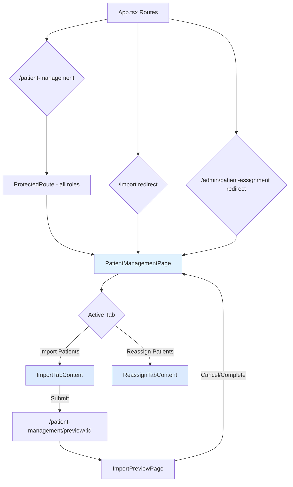

# Design Document: Patient Management Page

## Overview

Replace the separate Import page (`/import`) and Patient Assignment page (`/admin/patient-assignment`) with a unified **Patient Management** page at `/patient-management`. The page uses a tab interface to present both workflows. No backend changes are required — this is a frontend-only restructuring that reuses existing components and API endpoints.

## Steering Document Alignment

### Technical Standards (tech.md)
- **React + TypeScript** page component following existing page patterns
- **React Router v6** for routing with `Navigate` for redirects and `useSearchParams` for tab state
- **Tailwind CSS** for all styling (no custom CSS)
- **Zustand** authStore for role checks (existing pattern)
- **Axios** api client for API calls (existing)
- No new dependencies required

### Project Structure (structure.md)
- New page: `frontend/src/pages/PatientManagementPage.tsx` (PascalCase + Page suffix)
- Existing pages `ImportPage.tsx` and `PatientAssignmentPage.tsx` refactored into tab content components
- Route changes in `App.tsx` (existing route definitions file)
- Nav label change in `Header.tsx` (existing layout component)
- Tests follow naming conventions: `.test.tsx` for Vitest, `.spec.ts` for Playwright, `.cy.ts` for Cypress

## Code Reuse Analysis

### Existing Components to Leverage
- **`ImportPage.tsx`** (274 lines): Entire import form logic reused as-is. Refactored from a page into an embeddable tab content component (remove outer wrapper, keep all state/logic)
- **`PatientAssignmentPage.tsx`** (290 lines): Entire assignment logic reused as-is. Same refactoring approach — remove outer page wrapper, keep all state/logic
- **`ImportPreviewPage.tsx`** (705 lines): Preview flow unchanged, only navigation target updates (`/import` → `/patient-management`)
- **`Header.tsx`**: Nav link text and path change only
- **`ProtectedRoute.tsx`**: Existing role guard reused unchanged

### Integration Points
- **`/api/import/preview`** (POST): Import upload — unchanged
- **`/api/import/preview/:id`** (GET): Preview fetch — unchanged
- **`/api/import/execute/:id`** (POST): Import execute — unchanged
- **`/api/admin/patients/unassigned`** (GET): Unassigned patients list — unchanged
- **`/api/admin/patients/bulk-assign`** (PATCH): Bulk assignment — unchanged
- **`/api/users/physicians`** (GET): Physician list — unchanged
- **Zustand authStore**: `user.roles` for tab visibility, `selectedPhysicianId` for import

## Architecture



## Components and Interfaces

### PatientManagementPage (New)
- **Purpose:** Container page with tab navigation. Reads URL `?tab=` param to determine active tab. Controls tab visibility based on user role.
- **File:** `frontend/src/pages/PatientManagementPage.tsx`
- **Interfaces:**
  - No props (reads role from authStore, tab from URL search params)
  - Renders tab bar + active tab content
- **Dependencies:** `useAuthStore`, `useSearchParams` (React Router), `ImportTabContent`, `ReassignTabContent`
- **Reuses:** Existing authStore for role checks

### ImportTabContent (Refactored from ImportPage)
- **Purpose:** The import form — healthcare system selector, mode, physician selector, file upload. Extracted from `ImportPage.tsx` with navigation paths updated.
- **File:** `frontend/src/pages/PatientManagementPage.tsx` (inline component or same file)
- **Interfaces:**
  - No props — self-contained with own state
  - Navigates to `/patient-management/preview/:previewId` on submit
- **Dependencies:** `api` (Axios), `useAuthStore`, `useNavigate`
- **Reuses:** 100% of existing `ImportPage.tsx` logic and UI
- **Strips from original:** Outer page wrapper (`max-w-2xl mx-auto p-6`), `<h1>` page header and subtitle

### ReassignTabContent (Refactored from PatientAssignmentPage)
- **Purpose:** List unassigned patients, select, assign to physician. Extracted from `PatientAssignmentPage.tsx`.
- **File:** `frontend/src/pages/PatientManagementPage.tsx` (inline component or same file)
- **Interfaces:**
  - Props: `isActive: boolean` — controls whether data loading fires
  - Lazy-loads data via `hasActivated` ref: data fetches only when `isActive` becomes `true` for the first time (not on mount)
  - Shows loading spinner while fetching
- **Dependencies:** `api` (Axios)
- **Reuses:** 100% of existing `PatientAssignmentPage.tsx` logic and UI
- **Strips from original:** Outer page wrapper (`max-w-6xl mx-auto p-6`), `<h1>` page header, "Back to Admin" link

### Route Changes (App.tsx)
- **Remove:** `/import` route, `/admin/patient-assignment` route
- **Add:** `/patient-management` route (all authenticated users)
- **Add:** `/patient-management/preview/:previewId` route (all authenticated users)
- **Add:** Redirect routes: `/import` → `/patient-management`, `/import/preview/:previewId` → `/patient-management/preview/:previewId`, `/admin/patient-assignment` → `/patient-management?tab=reassign`
- **Reuses:** Existing `ProtectedRoute` wrapper pattern

### Header Changes (Header.tsx)
- **Change:** Nav link text "Import" → "Patient Mgmt", path `/import` → `/patient-management`
- **Change:** Active state check: `location.pathname.startsWith('/import')` → `location.pathname.startsWith('/patient-management')`

### AdminPage Changes (AdminPage.tsx)
- **Remove:** "Assign Patients" button (functionality moved to Patient Management page)
- **Or alternatively:** Re-target button to navigate to `/patient-management?tab=reassign` instead of `/admin/patient-assignment` (keeps quick access from Admin)

### ImportPreviewPage Changes (ImportPreviewPage.tsx)
- **Change:** All `navigate('/import')` calls → `navigate('/patient-management')`

## Data Models

No new data models. All existing models (Patient, User, PatientQualityMeasure, etc.) remain unchanged. No database migrations needed.

## Tab State Management

```typescript
// Tab state via URL search params (React Router)
const [searchParams, setSearchParams] = useSearchParams();
const activeTab = searchParams.get('tab') || 'import';

// Tab switching
const setTab = (tab: string) => {
  if (tab === 'import') {
    setSearchParams({});  // default, no param
  } else {
    setSearchParams({ tab });
  }
};

// Role-based tab visibility
const isAdmin = user?.roles.includes('ADMIN');
const tabs = [
  { id: 'import', label: 'Import Patients' },
  ...(isAdmin ? [{ id: 'reassign', label: 'Reassign Patients' }] : []),
];

// Guard: non-admin with ?tab=reassign falls back to import
const resolvedTab = (!isAdmin && activeTab === 'reassign') ? 'import' : activeTab;
// Guard: invalid tab value falls back to import
const validTabs = ['import', ...(isAdmin ? ['reassign'] : [])];
const finalTab = validTabs.includes(resolvedTab) ? resolvedTab : 'import';
```

## Tab UI Design

```
┌──────────────────────────────────────────────────────┐
│  Patient Management                                   │
│                                                        │
│  ┌──────────────────┐  ┌─────────────────────┐        │
│  │ Import Patients  │  │ Reassign Patients    │        │
│  │ (active: blue    │  │ (inactive: gray      │        │
│  │  underline)      │  │  text)               │        │
│  └──────────────────┘  └─────────────────────┘        │
│  ─────────────────────────────────────────────        │
│                                                        │
│  [Tab content area - renders ImportTabContent          │
│   or ReassignTabContent based on active tab]           │
│                                                        │
└──────────────────────────────────────────────────────┘
```

- Tabs use Tailwind classes: active tab has `border-b-2 border-blue-600 text-blue-600 font-semibold`, inactive has `text-gray-500 hover:text-gray-700`
- Tab bar has a `border-b border-gray-200` divider underneath
- Content area below tabs renders the active component
- Both tab content components remain mounted (hidden via `display: none`) to preserve import form state
- ReassignTabContent receives `isActive` prop; uses `hasActivated` ref to defer API call until first activation
- Browser document title updates per tab: "Patient Management - Import" / "Patient Management - Reassign"
- Tab layout is responsive — tabs stack vertically on mobile if needed

## Error Handling

### Error Scenarios
1. **Bulk-assign API failure (Reassign tab)**
   - **Handling:** Catch in `handleAssign()`, set `error` state, retain patient selections and physician choice
   - **User Impact:** Red error banner with message, user can retry without re-selecting

2. **Unassigned patients API failure (Reassign tab load)**
   - **Handling:** Catch in `loadData()`, set `error` state
   - **User Impact:** Error message with retry option

3. **Invalid tab query param**
   - **Handling:** `validTabs.includes()` check, fallback to 'import'
   - **User Impact:** Silently shows Import tab (no error shown)

4. **Non-ADMIN accessing ?tab=reassign**
   - **Handling:** Role check in tab resolution logic
   - **User Impact:** Silently shows Import tab (no error shown)

## Testing Strategy

### Unit Testing (Vitest)
- **PatientManagementPage.test.tsx** — Tab rendering, role-based visibility, URL sync
  - Renders Import tab by default
  - ADMIN sees both tabs, STAFF/PHYSICIAN sees only Import
  - Tab click updates URL search params
  - `?tab=reassign` activates Reassign tab for ADMIN
  - `?tab=reassign` falls back to Import for non-ADMIN
  - `?tab=invalid` falls back to Import
  - Tab content preserved when switching (form state)

### Integration Testing (Vitest)
- Verify ImportTabContent renders import form elements
- Verify ReassignTabContent renders assignment table/controls
- Verify navigation from Admin "Assign Patients" button goes to correct URL

### End-to-End Testing (Playwright)
- **patient-management.spec.ts** — Page navigation, tab switching, redirects
  - Navigate to `/patient-management` shows Import tab
  - Click Reassign tab shows assignment interface (ADMIN)
  - Old URL `/import` redirects to `/patient-management`
  - Old URL `/admin/patient-assignment` redirects to `/patient-management?tab=reassign`
  - Non-admin cannot see Reassign tab
  - Header nav shows "Patient Mgmt" and highlights correctly

### E2E Testing (Cypress) — Existing tests
- Existing import-flow.cy.ts tests may need path updates (`/import` → `/patient-management`)
- Existing import E2E tests should continue to pass with redirect
