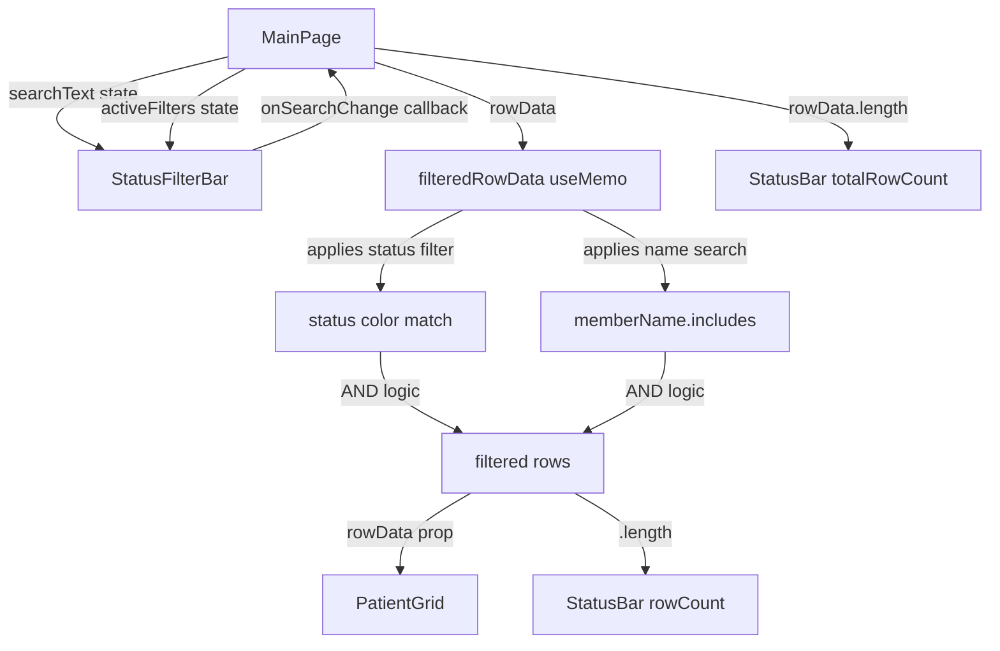

# Design: Patient Name Search

## Overview

Add a client-side search input to the StatusFilterBar that filters the patient grid by `memberName`. The search integrates with the existing status color filter using AND logic and follows the same `useMemo` filtering pattern already established in MainPage.tsx.

## Steering Document Alignment

### Technical Standards (tech.md)
- **React + TypeScript** for the search input component
- **Tailwind CSS** for styling (consistent with existing filter bar)
- **Lucide React** for search and clear icons (already used throughout the app)
- **Zustand** is NOT needed - search state is local to MainPage (same as `activeFilters`)
- **No backend changes** - client-side filtering on already-loaded data

### Project Structure (structure.md)
- Search input added directly into `StatusFilterBar.tsx` (extends existing component)
- Filter logic added to `MainPage.tsx` `filteredRowData` useMemo (extends existing pattern)
- No new files needed for core functionality - this extends 2 existing files

## Code Reuse Analysis

### Existing Components to Leverage
- **StatusFilterBar.tsx**: Add search input to the right side of the existing filter bar
- **MainPage.tsx `filteredRowData` useMemo**: Extend to include name search (AND with status filter)
- **MainPage.tsx `rowCounts` useMemo**: Already computed from unfiltered `rowData` - no change needed
- **StatusBar.tsx**: Already supports `rowCount` vs `totalRowCount` - no change needed
- **Lucide React icons**: `Search` and `X` icons for the input

### Integration Points
- **StatusFilterBar props**: Add `searchText` + `onSearchChange` props
- **MainPage state**: Add `searchText` state variable (same pattern as `activeFilters`)
- **filteredRowData**: Add `.toLowerCase().includes()` check combined with existing filter

## Architecture



## Components and Interfaces

### StatusFilterBar (Modified)

- **Purpose:** Add search input alongside existing status color filter chips
- **New Props:**
  ```typescript
  interface StatusFilterBarProps {
    activeFilters: StatusColor[];
    onFilterChange: (filters: StatusColor[]) => void;
    rowCounts: Record<StatusColor, number>;
    searchText: string;           // NEW
    onSearchChange: (text: string) => void;  // NEW
  }
  ```
- **UI Layout:**
  ```
  [Filter: ] [All (50)] [Not Addressed (10)] ... [N/A (2)] | [🔍 Search by name...  ✕]
  ```
  - Search input positioned at the right end of the filter bar with `ml-auto`
  - Search icon (Lucide `Search`) inside the input on the left
  - Clear button (Lucide `X`) appears only when text is present
  - Input width: `w-64` (256px) with Tailwind styling matching the bar aesthetic
- **Reuses:** Existing StatusFilterBar component, Tailwind utility classes, Lucide icons

### MainPage (Modified)

- **Purpose:** Add search state and integrate with existing filter pipeline
- **New State:**
  ```typescript
  const [searchText, setSearchText] = useState('');
  ```
- **Modified `filteredRowData` useMemo:**
  ```typescript
  const filteredRowData = useMemo(() => {
    let filtered = rowData;

    // Apply status color filter (existing logic)
    if (!activeFilters.includes('all') && activeFilters.length > 0) {
      filtered = filtered.filter((row) => {
        if (activeFilters.includes('duplicate')) return row.isDuplicate;
        const color = getRowStatusColor(row);
        return activeFilters.includes(color);
      });
    }

    // Apply name search filter (NEW)
    if (searchText.trim()) {
      const search = searchText.trim().toLowerCase();
      filtered = filtered.filter((row) =>
        row.memberName?.toLowerCase().includes(search)
      );
    }

    return filtered;
  }, [rowData, activeFilters, searchText]);
  ```
- **Keyboard handler:** Add `useEffect` for Ctrl+F / Cmd+F to focus the search input via a ref
- **Reuses:** Existing `filteredRowData` pattern, `rowCounts` (unchanged), StatusBar (unchanged)

## Data Models

No data model changes. The search operates on the existing `GridRow.memberName` field (string) which is already loaded in the client.

## Error Handling

### Error Scenarios
1. **`memberName` is null or undefined:**
   - **Handling:** Use optional chaining: `row.memberName?.toLowerCase().includes(search)`
   - **User Impact:** Rows with null memberName are excluded from search results (correct behavior - they don't match)

2. **Special characters in search text:**
   - **Handling:** No regex used - plain `String.includes()` handles all characters safely
   - **User Impact:** Searching for "O'Brien" or "Smith-Jones" works correctly

## Testing Strategy

### Unit Testing (Vitest)
- StatusFilterBar component: renders search input, handles text changes, shows/hides clear button
- Search filtering logic: case-insensitive matching, partial matching, null memberName handling
- Filter combination: search + status color filter AND logic

### End-to-End Testing (Cypress)
- Type in search box and verify grid filters
- Clear search and verify grid restores
- Combine search with status color filter
- Ctrl+F keyboard shortcut focuses search
- Escape clears search

### Existing Tests (No Changes Needed)
- StatusFilterBar existing tests for chip behavior remain valid
- PatientGrid tests unaffected (receives pre-filtered data)
- StatusBar tests unaffected (receives count props)
