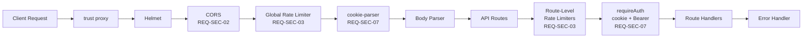
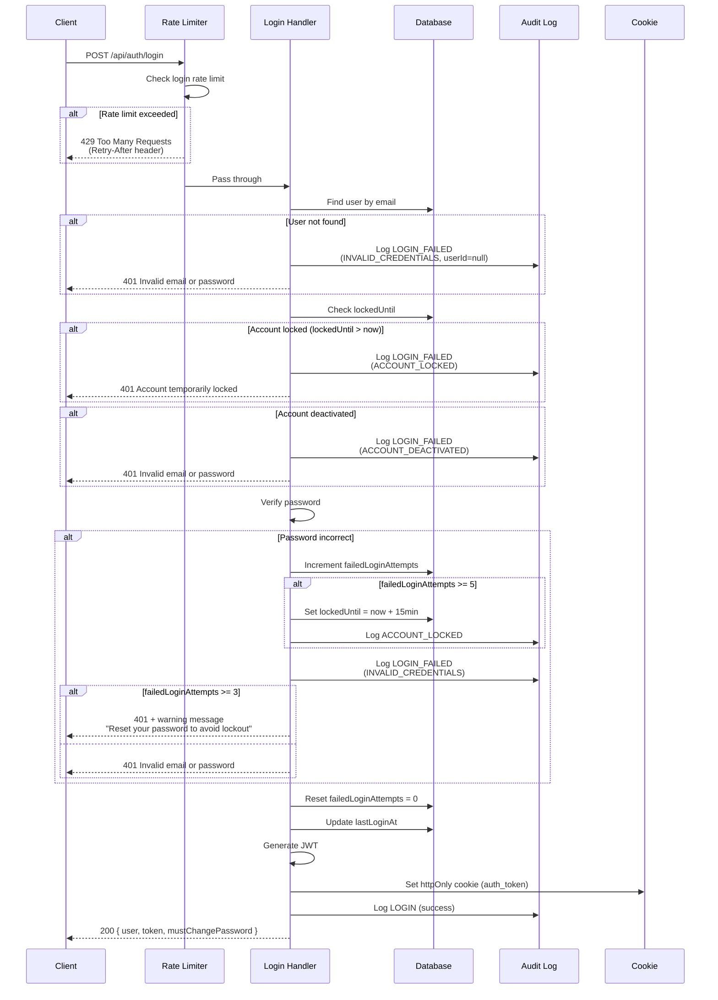
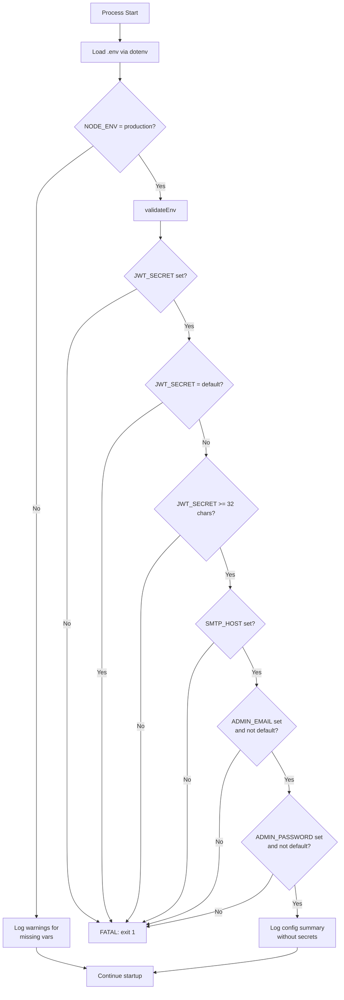
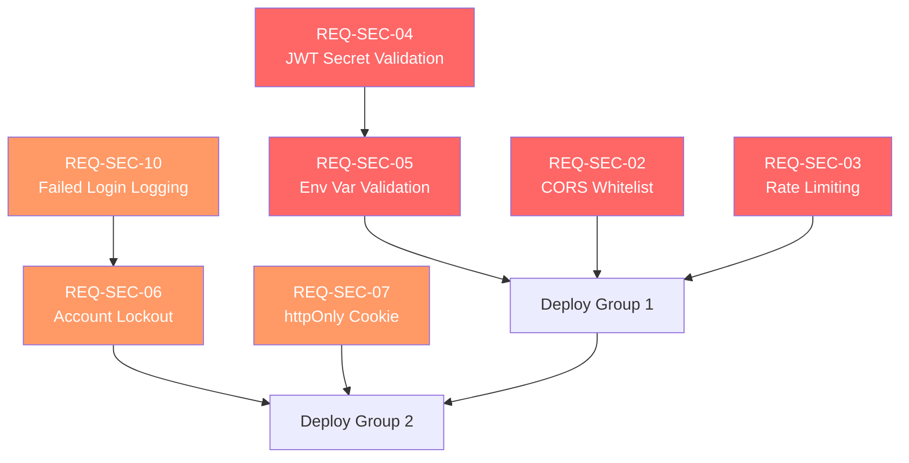

# Design Document: Security Hardening

## Introduction

This design document details the technical architecture, data models, API changes, component interfaces, and implementation strategy for the 7 included security hardening requirements (REQ-SEC-02, 03, 04, 05, 06, 07, 10). The design builds on existing patterns in the Patient Quality Measure Tracking System codebase and follows the project's established conventions for Express middleware, Prisma models, Zod validation, Zustand state management, and the standard `{ success, data, error }` API response format.

### Requirements Traceability

| Requirement | Title | Priority |
|-------------|-------|----------|
| REQ-SEC-02 | CORS Origin Whitelist | Critical |
| REQ-SEC-03 | Rate Limiting | Critical |
| REQ-SEC-04 | JWT Secret Validation | Critical |
| REQ-SEC-05 | Env Var Validation at Startup | Critical |
| REQ-SEC-06 | Account Lockout | High |
| REQ-SEC-07 | Move JWT to httpOnly Cookie | High |
| REQ-SEC-10 | Failed Login Audit Logging | High |

---

## 1. Architecture Overview

### 1.1 Middleware Chain

The security hardening changes introduce new middleware layers into the existing Express pipeline. The updated middleware chain processes requests in this order:



**Key design decisions:**
- `trust proxy` is set at the application level (`app.set('trust proxy', 1)`) before any middleware, enabling correct client IP resolution behind nginx/Render load balancer.
- Global rate limiter is applied at the `/api` route level, before any route matching.
- Route-specific rate limiters (login, forgot-password, change-password, import) are applied per-route within `auth.routes.ts` and `import.routes.ts`.
- `cookie-parser` middleware is added to parse the `auth_token` httpOnly cookie before route handlers.

### 1.2 Login Flow

The login flow is the most complex change, incorporating rate limiting, lockout checks, failed login audit logging, and httpOnly cookie setting:



### 1.3 Startup Validation Flow

Environment validation runs before any server initialization:



---

## 2. Data Model Changes

### 2.1 Prisma Schema Changes (User Model)

Three new fields are added to the existing `User` model. No new models are needed because audit logging uses the existing `AuditLog` model with new action types.

```prisma
model User {
  // ... existing fields ...

  // Security hardening fields (REQ-SEC-06: Account Lockout)
  failedLoginAttempts  Int       @default(0) @map("failed_login_attempts")
  lockedUntil          DateTime? @map("locked_until")
  mustChangePassword   Boolean   @default(false) @map("must_change_password")

  // ... existing relations ...
}
```

**Migration strategy:**
- A single Prisma migration adds the three columns with defaults.
- `failedLoginAttempts` defaults to `0` -- no existing users are affected.
- `lockedUntil` defaults to `null` -- no existing users are locked.
- `mustChangePassword` defaults to `false` -- no existing users are forced to change.
- The migration is non-destructive and requires no data transformation.

**Migration command:**
```bash
npx prisma migrate dev --name add-account-lockout-fields
```

### 2.2 AuditLog Action Types

The existing `AuditLog` model's `action` field (String) will accept two new values. No schema change is needed since `action` is already a free-form string. The comment on the `action` field will be updated to document the new values:

```
'CREATE', 'UPDATE', 'DELETE', 'LOGIN', 'LOGOUT', 'LOCK', 'UNLOCK',
'PASSWORD_CHANGE', 'PASSWORD_RESET_CLI',
'LOGIN_FAILED',      // NEW (REQ-SEC-10)
'ACCOUNT_LOCKED',    // NEW (REQ-SEC-06)
'SEND_TEMP_PASSWORD' // NEW (REQ-SEC-06)
```

### 2.3 AuditLog Details Format for Failed Logins

The existing `details` JSON field stores additional context. For `LOGIN_FAILED` entries:

```json
{
  "reason": "INVALID_CREDENTIALS" | "ACCOUNT_LOCKED" | "ACCOUNT_DEACTIVATED",
  "failedAttempts": 3
}
```

For `ACCOUNT_LOCKED` entries:

```json
{
  "reason": "MAX_FAILED_ATTEMPTS",
  "failedAttempts": 5,
  "lockedUntil": "2026-02-12T15:30:00.000Z"
}
```

---

## 3. API Changes

### 3.1 Rate Limit Response (429)

All rate-limited endpoints return a standardized 429 response:

```typescript
// HTTP 429 Too Many Requests
{
  success: false,
  error: {
    code: "RATE_LIMIT_EXCEEDED",
    message: "Too many login attempts. Please try again in 15 minutes.",
    retryAfter: 900  // seconds
  }
}
```

**Headers:**
```
Retry-After: 900
X-RateLimit-Limit: 20
X-RateLimit-Remaining: 0
X-RateLimit-Reset: 1739370600
```

### 3.2 Login Response Changes (POST /api/auth/login)

**Current response (200):**
```json
{
  "success": true,
  "data": {
    "user": { "id": 1, "email": "...", "roles": [...] },
    "token": "eyJ...",
    "assignments": [...]
  }
}
```

**New response (200):**
```json
{
  "success": true,
  "data": {
    "user": { "id": 1, "email": "...", "roles": [...] },
    "token": "eyJ...",
    "assignments": [...],
    "mustChangePassword": false
  }
}
```

Additionally, the response sets an httpOnly cookie:
```
Set-Cookie: auth_token=eyJ...; HttpOnly; Secure; SameSite=Strict; Path=/; Max-Age=28800
```

**Note:** The `token` field remains in the response body during the migration period for backward compatibility.

**New error responses:**

Lockout (401):
```json
{
  "success": false,
  "error": {
    "code": "ACCOUNT_LOCKED",
    "message": "Account temporarily locked. Please try again later."
  }
}
```

3-attempt warning (401):
```json
{
  "success": false,
  "error": {
    "code": "INVALID_CREDENTIALS",
    "message": "Invalid email or password",
    "warning": "Having trouble? Reset your password to avoid being locked out."
  }
}
```

### 3.3 Logout Response Changes (POST /api/auth/logout)

**Added behavior:** Clear the httpOnly cookie in the response:
```
Set-Cookie: auth_token=; HttpOnly; Secure; SameSite=Strict; Path=/; Max-Age=0
```

### 3.4 New Endpoint: Send Temporary Password

**POST /api/admin/users/:id/send-temp-password**

Requires: ADMIN role (inherits from admin.routes.ts router-level middleware).

**Request:** No body required.

**Response (200):**
```json
{
  "success": true,
  "message": "Temporary password sent to user@example.com",
  "data": {
    "emailSent": true
  }
}
```

**Error responses:**
- 404: User not found
- 400: SMTP not configured
- 500: Email send failure

**Side effects:**
1. Generate random 12-character temporary password (alphanumeric + symbols).
2. Hash and update the user's password.
3. Reset `failedLoginAttempts` to 0.
4. Set `lockedUntil` to null (unlock account).
5. Set `mustChangePassword` to true.
6. Email the temporary password to the user.
7. Create audit log entry with action `SEND_TEMP_PASSWORD`.

### 3.5 Password Change Endpoint Update (PUT /api/auth/password)

**Added behavior:** After successful password change, if `mustChangePassword` was `true`, set it to `false`.

**Response:** Unchanged format, but backend additionally clears the `mustChangePassword` flag.

---

## 4. File-by-File Changes

### 4.1 New Files

#### `backend/src/config/validateEnv.ts` (REQ-SEC-04, REQ-SEC-05)

**Purpose:** Validate required environment variables at startup, before any services initialize.

```typescript
// Validates 4 required env vars in production:
// - JWT_SECRET (required, not default, >= 32 chars)
// - SMTP_HOST (required)
// - ADMIN_EMAIL (required, not default 'admin@clinic.com')
// - ADMIN_PASSWORD (required, not default 'changeme123')
//
// In development: logs warnings but does not exit.
// Does NOT validate DATABASE_URL or CORS_ORIGIN (per user decision).

export interface EnvValidationResult {
  valid: boolean;
  errors: string[];
  warnings: string[];
}

export function validateEnv(): EnvValidationResult;
```

**Implementation details:**
- Called synchronously (no async, no network calls).
- In production (`NODE_ENV=production`): collects all errors, logs each, then calls `process.exit(1)` if any.
- In development: logs warnings for missing/default values but allows startup.
- On success: logs summary without secret values, e.g., `"Configuration validated: NODE_ENV=production, PORT=3000, JWT secret length=64"`.

#### `backend/src/middleware/rateLimiter.ts` (REQ-SEC-03)

**Purpose:** Configure and export all rate limiter instances using `express-rate-limit`.

```typescript
import rateLimit from 'express-rate-limit';

export interface RateLimitConfig {
  enabled: boolean;
  login: { max: number; windowMs: number };
  forgotPassword: { max: number; windowMs: number };
  changePassword: { max: number; windowMs: number };
  import: { max: number; windowMs: number };
  global: { max: number; windowMs: number };
}

// Reads from env vars with defaults:
// RATE_LIMIT_ENABLED (default: 'true')
// RATE_LIMIT_LOGIN_MAX (default: 20)
// RATE_LIMIT_LOGIN_WINDOW_MIN (default: 15)
// RATE_LIMIT_IMPORT_MAX (default: 10)
// RATE_LIMIT_IMPORT_WINDOW_MIN (default: 1)
// RATE_LIMIT_GLOBAL_MAX (default: 100)
// RATE_LIMIT_GLOBAL_WINDOW_MIN (default: 1)
// RATE_LIMIT_FORGOT_PW_MAX (default: 5)
// RATE_LIMIT_FORGOT_PW_WINDOW_MIN (default: 15)

export function getRateLimitConfig(): RateLimitConfig;

// Rate limiter middleware instances
export const loginLimiter: RequestHandler;
export const forgotPasswordLimiter: RequestHandler;
export const changePasswordLimiter: RequestHandler;
export const importLimiter: RequestHandler;
export const globalLimiter: RequestHandler;
```

**Implementation details:**
- When `RATE_LIMIT_ENABLED=false`, all limiters are replaced with pass-through middleware (`(_req, _res, next) => next()`).
- All limiters use in-memory store (default for `express-rate-limit`).
- Custom error handler formats the 429 response in the standard `{ success, error }` format.
- Sets `Retry-After`, `X-RateLimit-Limit`, `X-RateLimit-Remaining`, `X-RateLimit-Reset` headers.
- `standardHeaders: true` and `legacyHeaders: false` for RFC-compliant headers.
- `keyGenerator` uses `req.ip` (correct when `trust proxy` is set).

#### `frontend/src/components/ForcePasswordChange.tsx` (REQ-SEC-06)

**Purpose:** Full-screen modal/overlay that blocks all application interaction until the user changes their password.

```typescript
interface ForcePasswordChangeProps {
  onPasswordChanged: () => void;
}

// Renders a centered card with:
// - Title: "Password Change Required"
// - Message: "Your password must be changed before you can continue."
// - New password field (min 8 chars)
// - Confirm password field
// - Submit button
// - Calls PUT /api/auth/password with currentPassword as the temp password
//   (stored in memory from login response during that session)
// - On success: calls onPasswordChanged() which clears mustChangePassword state
```

**Design note:** The forced password change screen does NOT require the current password to be re-entered (the user just logged in with the temp password). Instead, a special `PUT /api/auth/force-change-password` endpoint accepts only `newPassword` and validates the user's `mustChangePassword` flag is `true`. This avoids the user needing to remember/re-type the temporary password.

Alternatively, we can use the existing `PUT /api/auth/password` endpoint but store the temp password transiently in the auth store during login (not persisted). The simpler approach is to create a dedicated endpoint.

**Decision: Use a new endpoint `POST /api/auth/force-change-password`** that:
- Requires authentication (user is already logged in).
- Verifies `mustChangePassword === true` for the user.
- Accepts `{ newPassword }` only.
- Updates the password, sets `mustChangePassword = false`.
- Returns success.

### 4.2 Modified Backend Files

#### `backend/src/app.ts` (REQ-SEC-02, REQ-SEC-03, REQ-SEC-07)

**Changes:**

1. **Add `trust proxy`** (line added before all middleware):
   ```typescript
   app.set('trust proxy', 1);
   ```

2. **Add `cookie-parser`** middleware:
   ```typescript
   import cookieParser from 'cookie-parser';
   app.use(cookieParser());
   ```

3. **CORS configuration** -- Keep `origin: true` as default (per user decision). No change to existing CORS logic. The `credentials: true` setting is already present.

4. **Add global rate limiter** after CORS, before routes:
   ```typescript
   import { globalLimiter } from './middleware/rateLimiter.js';
   app.use('/api', globalLimiter);
   ```

5. No changes to the existing CORS logic. The current code already handles `CORS_ORIGIN` as comma-separated list and falls back to `true` when not set. This behavior is preserved.

**New dependency:** `cookie-parser` (npm package).

#### `backend/src/config/index.ts` (REQ-SEC-03, REQ-SEC-04)

**Changes:**

Add rate limit configuration properties:

```typescript
export const config = {
  // ... existing properties ...

  // Rate limiting defaults (overridden by env vars in rateLimiter.ts)
  rateLimitEnabled: process.env.RATE_LIMIT_ENABLED !== 'false',

  // JWT cookie settings
  jwtCookieName: 'auth_token',
  jwtCookieMaxAge: 28800000, // 8 hours in milliseconds
};
```

**Note:** JWT secret validation logic is in `validateEnv.ts`, not here. The existing fallback `'development_jwt_secret_change_in_production'` remains for development mode.

#### `backend/src/index.ts` (REQ-SEC-04, REQ-SEC-05)

**Changes:**

Call `validateEnv()` immediately after dotenv loading, before any other imports that might use config values:

```typescript
import dotenv from 'dotenv';
// ... dotenv.config() ...

// Validate environment BEFORE anything else
import { validateEnv } from './config/validateEnv.js';
validateEnv();

// ... rest of existing imports and startup ...
```

The `validateEnv()` call must be the first thing after `dotenv.config()`. If validation fails in production, it calls `process.exit(1)` with clear error messages.

#### `backend/src/middleware/auth.ts` (REQ-SEC-07)

**Changes to `requireAuth`:**

Read JWT from cookie first, fall back to Bearer header:

```typescript
export async function requireAuth(req: Request, _res: Response, next: NextFunction): Promise<void> {
  try {
    let token: string | undefined;

    // 1. Try httpOnly cookie first (REQ-SEC-07)
    if (req.cookies?.auth_token) {
      token = req.cookies.auth_token;
    }
    // 2. Fall back to Authorization Bearer header (backward compatibility)
    else {
      const authHeader = req.headers.authorization;
      if (authHeader?.startsWith('Bearer ')) {
        token = authHeader.substring(7);
      }
    }

    if (!token) {
      throw createError('Authentication required', 401, 'UNAUTHORIZED');
    }

    // ... rest of existing verification logic unchanged ...
  }
}
```

**Same changes to `optionalAuth`:** Read from cookie first, fall back to Bearer header.

#### `backend/src/middleware/socketAuth.ts` (REQ-SEC-07)

**Changes:**

Read JWT from cookie in the WebSocket upgrade handshake, with fallback to `auth.token`:

```typescript
export async function socketAuthMiddleware(socket: TypedSocket, next: (err?: Error) => void): Promise<void> {
  try {
    // Try cookie first (sent on WebSocket upgrade request)
    let token = parseCookies(socket.handshake.headers.cookie)?.auth_token;

    // Fall back to auth payload (backward compatibility)
    if (!token) {
      token = socket.handshake.auth?.token as string | undefined;
    }

    if (!token) {
      return next(new Error('Authentication failed: no token provided'));
    }

    // ... rest unchanged ...
  }
}
```

**Note:** Socket.IO does NOT use `cookie-parser` -- the `handshake.headers.cookie` is a raw string. A simple cookie parser utility is needed (inline function or small utility).

#### `backend/src/routes/auth.routes.ts` (REQ-SEC-03, REQ-SEC-06, REQ-SEC-07, REQ-SEC-10)

This file has the most changes. The login handler is substantially rewritten.

**Changes:**

1. **Import rate limiters:**
   ```typescript
   import { loginLimiter, forgotPasswordLimiter, changePasswordLimiter } from '../middleware/rateLimiter.js';
   ```

2. **Apply route-level rate limiters:**
   ```typescript
   router.post('/login', loginLimiter, async (req, res, next) => { ... });
   router.post('/forgot-password', forgotPasswordLimiter, async (req, res, next) => { ... });
   router.put('/password', requireAuth, changePasswordLimiter, async (req, res, next) => { ... });
   ```

3. **Rewrite login handler** (pseudocode):
   ```typescript
   router.post('/login', loginLimiter, async (req, res, next) => {
     const { email, password } = validated(req.body);

     // 1. Find user
     const user = await findUserByEmail(email.toLowerCase());

     // 2. If not found, log and return generic error
     if (!user) {
       await logFailedLogin(null, email, req.ip, 'INVALID_CREDENTIALS');
       throw createError('Invalid email or password', 401, 'INVALID_CREDENTIALS');
     }

     // 3. Check if locked
     if (user.lockedUntil && user.lockedUntil > new Date()) {
       await logFailedLogin(user.id, email, req.ip, 'ACCOUNT_LOCKED');
       throw createError('Account temporarily locked. Please try again later.', 401, 'ACCOUNT_LOCKED');
     }

     // 4. Check if deactivated
     if (!user.isActive) {
       await logFailedLogin(user.id, email, req.ip, 'ACCOUNT_DEACTIVATED');
       throw createError('Invalid email or password', 401, 'INVALID_CREDENTIALS');
     }

     // 5. Verify password
     const isValid = await verifyPassword(password, user.passwordHash);
     if (!isValid) {
       const newCount = await incrementFailedAttempts(user.id);
       if (newCount >= 5) {
         await lockAccount(user.id);
         await logAccountLocked(user.id, email, req.ip, newCount);
       }
       await logFailedLogin(user.id, email, req.ip, 'INVALID_CREDENTIALS', newCount);

       if (newCount >= 3) {
         // Include warning about password reset
         const err = createError('Invalid email or password', 401, 'INVALID_CREDENTIALS');
         // Attach warning to error response
         return res.status(401).json({
           success: false,
           error: {
             code: 'INVALID_CREDENTIALS',
             message: 'Invalid email or password',
             warning: 'Having trouble? Reset your password to avoid being locked out.',
           },
         });
       }
       throw createError('Invalid email or password', 401, 'INVALID_CREDENTIALS');
     }

     // 6. Success -- reset failed attempts and clear lock
     await resetFailedAttempts(user.id);
     await updateLastLogin(user.id);
     const token = generateToken(user);

     // 7. Set httpOnly cookie
     res.cookie('auth_token', token, {
       httpOnly: true,
       secure: process.env.NODE_ENV === 'production',
       sameSite: 'strict',
       path: '/',
       maxAge: 28800000, // 8 hours
     });

     // 8. Log successful login
     await logSuccessfulLogin(user.id, email, req.ip);

     // 9. Return response (token still in body for migration)
     res.json({
       success: true,
       data: {
         user: toAuthUser(user),
         token,
         assignments: await getAssignments(user),
         mustChangePassword: user.mustChangePassword,
       },
     });
   });
   ```

4. **Update logout handler** to clear cookie:
   ```typescript
   router.post('/logout', requireAuth, async (req, res, next) => {
     // ... existing edit lock release and audit logging ...

     // Clear auth cookie
     res.clearCookie('auth_token', {
       httpOnly: true,
       secure: process.env.NODE_ENV === 'production',
       sameSite: 'strict',
       path: '/',
     });

     res.json({ success: true, message: 'Logged out successfully' });
   });
   ```

5. **Add force-change-password endpoint:**
   ```typescript
   const forceChangePasswordSchema = z.object({
     newPassword: z.string().min(8, 'New password must be at least 8 characters'),
   });

   router.post('/force-change-password', requireAuth, async (req, res, next) => {
     const user = await findUserById(req.user!.id);
     if (!user?.mustChangePassword) {
       throw createError('Password change not required', 400, 'NOT_REQUIRED');
     }

     const { newPassword } = validated(req.body, forceChangePasswordSchema);
     await updatePassword(user.id, newPassword);
     await prisma.user.update({
       where: { id: user.id },
       data: { mustChangePassword: false },
     });

     // Update cookie with new token (optional, for session continuity)
     const newToken = generateToken(user);
     res.cookie('auth_token', newToken, { ... });

     res.json({ success: true, message: 'Password changed successfully' });
   });
   ```

6. **Update password change endpoint** to also clear `mustChangePassword`:
   ```typescript
   // In PUT /password handler, after updatePassword():
   if (fullUser.mustChangePassword) {
     await prisma.user.update({
       where: { id: user.id },
       data: { mustChangePassword: false },
     });
   }
   ```

#### `backend/src/services/authService.ts` (REQ-SEC-06)

**New functions added:**

```typescript
/**
 * Increment failed login attempts for a user.
 * Returns the new count.
 */
export async function incrementFailedAttempts(userId: number): Promise<number> {
  const updated = await prisma.user.update({
    where: { id: userId },
    data: { failedLoginAttempts: { increment: 1 } },
    select: { failedLoginAttempts: true },
  });
  return updated.failedLoginAttempts;
}

/**
 * Lock an account for 15 minutes.
 */
export async function lockAccount(userId: number): Promise<void> {
  await prisma.user.update({
    where: { id: userId },
    data: { lockedUntil: new Date(Date.now() + 15 * 60 * 1000) },
  });
}

/**
 * Reset failed login attempts and clear lock.
 */
export async function resetFailedAttempts(userId: number): Promise<void> {
  await prisma.user.update({
    where: { id: userId },
    data: { failedLoginAttempts: 0, lockedUntil: null },
  });
}

/**
 * Check if an account is currently locked.
 */
export function isAccountLocked(user: { lockedUntil: Date | null }): boolean {
  return user.lockedUntil !== null && user.lockedUntil > new Date();
}

/**
 * Generate a random temporary password.
 * 12 characters: uppercase, lowercase, digits, symbols.
 */
export function generateTempPassword(): string {
  const chars = 'ABCDEFGHIJKLMNOPQRSTUVWXYZabcdefghijklmnopqrstuvwxyz0123456789!@#$%^&*';
  const bytes = crypto.randomBytes(12);
  return Array.from(bytes).map(b => chars[b % chars.length]).join('');
}

/**
 * Send temporary password to user, unlock account, and force password change.
 */
export async function sendTempPassword(userId: number): Promise<{ email: string; emailSent: boolean }> {
  const user = await prisma.user.findUnique({ where: { id: userId } });
  if (!user) throw new Error('User not found');

  const tempPassword = generateTempPassword();
  const passwordHash = await hashPassword(tempPassword);

  await prisma.user.update({
    where: { id: userId },
    data: {
      passwordHash,
      failedLoginAttempts: 0,
      lockedUntil: null,
      mustChangePassword: true,
    },
  });

  // Send email with temp password
  const emailSent = await sendTempPasswordEmail(user.email, tempPassword);

  return { email: user.email, emailSent };
}
```

#### `backend/src/routes/handlers/userHandlers.ts` (REQ-SEC-06)

**New handler added:**

```typescript
/**
 * POST /api/admin/users/:id/send-temp-password
 * Generate temp password, email it, unlock account, force password change.
 */
export async function sendTempPasswordHandler(req: Request, res: Response, next: NextFunction) {
  try {
    const { id } = req.params;
    const userId = parseInt(id, 10);

    // Check SMTP is configured
    if (!isSmtpConfigured()) {
      throw createError('SMTP is not configured. Cannot send temporary password.', 400, 'SMTP_NOT_CONFIGURED');
    }

    // Check user exists
    const user = await prisma.user.findUnique({ where: { id: userId } });
    if (!user) {
      throw createError('User not found', 404, 'USER_NOT_FOUND');
    }

    // Send temp password
    const result = await sendTempPassword(userId);

    // Audit log
    await prisma.auditLog.create({
      data: {
        userId: req.user!.id,
        userEmail: req.user!.email,
        action: 'SEND_TEMP_PASSWORD',
        entity: 'user',
        entityId: userId,
        details: { targetEmail: user.email, emailSent: result.emailSent },
        ipAddress: req.ip || req.socket.remoteAddress,
      },
    });

    res.json({
      success: true,
      message: `Temporary password sent to ${result.email}`,
      data: { emailSent: result.emailSent },
    });
  } catch (error) {
    next(error);
  }
}
```

#### `backend/src/routes/admin.routes.ts` (REQ-SEC-06)

**Changes:**

Add the new route and import:

```typescript
import { sendTempPasswordHandler } from './handlers/userHandlers.js';

// ... existing routes ...
router.post('/users/:id/send-temp-password', sendTempPasswordHandler);
```

#### `backend/src/routes/import.routes.ts` (REQ-SEC-03)

**Changes:**

Apply the import rate limiter to upload endpoints:

```typescript
import { importLimiter } from '../middleware/rateLimiter.js';

// Apply import rate limiter to all import routes
router.use(importLimiter);
```

#### `backend/prisma/schema.prisma` (REQ-SEC-06)

**Changes** (as specified in section 2.1):

Add three fields to the `User` model:
```prisma
  failedLoginAttempts  Int       @default(0) @map("failed_login_attempts")
  lockedUntil          DateTime? @map("locked_until")
  mustChangePassword   Boolean   @default(false) @map("must_change_password")
```

#### `backend/src/services/emailService.ts` (REQ-SEC-06)

**New function added:**

```typescript
/**
 * Send temporary password email to a user.
 */
export async function sendTempPasswordEmail(
  email: string,
  tempPassword: string
): Promise<boolean> {
  const appUrl = process.env.APP_URL || 'http://localhost:5173';
  const loginUrl = `${appUrl}/login`;

  const subject = 'Your Temporary Password - Patient Tracker';

  const text = `
A temporary password has been set for your Patient Tracker account.

Your temporary password: ${tempPassword}

Please log in and change your password immediately:
${loginUrl}

You will be required to set a new password on your next login.

If you did not request this, please contact your administrator immediately.
`;

  const html = `
<!DOCTYPE html>
<html>
<head>
  <style>
    body { font-family: Arial, sans-serif; line-height: 1.6; color: #333; }
    .container { max-width: 600px; margin: 0 auto; padding: 20px; }
    .password-box {
      background-color: #f5f5f5;
      border: 1px solid #ddd;
      padding: 15px;
      font-family: monospace;
      font-size: 18px;
      text-align: center;
      margin: 20px 0;
      border-radius: 4px;
    }
    .button {
      display: inline-block;
      padding: 12px 24px;
      background-color: #1976d2;
      color: white !important;
      text-decoration: none;
      border-radius: 4px;
      margin: 20px 0;
    }
    .alert { background-color: #fff3cd; border: 1px solid #ffc107; padding: 10px; border-radius: 4px; margin: 15px 0; }
    .footer { margin-top: 30px; font-size: 12px; color: #666; }
  </style>
</head>
<body>
  <div class="container">
    <h2>Your Temporary Password</h2>
    <p>A temporary password has been set for your Patient Tracker account.</p>
    <div class="password-box">${tempPassword}</div>
    <p>Please log in and change your password immediately:</p>
    <a href="${loginUrl}" class="button">Log In</a>
    <div class="alert">
      <strong>Important:</strong> You will be required to set a new password on your next login.
    </div>
    <div class="footer">
      <p>If you did not request this, please contact your administrator immediately.</p>
    </div>
  </div>
</body>
</html>
`;

  return sendEmail({ to: email, subject, text, html });
}
```

### 4.3 Modified Frontend Files

#### `frontend/src/api/axios.ts` (REQ-SEC-07)

**Changes:**

1. **Add `withCredentials: true`** to axios instance:
   ```typescript
   export const api = axios.create({
     baseURL: apiBaseUrl,
     withCredentials: true,  // Send cookies with every request
     headers: {
       'Content-Type': 'application/json',
     },
   });
   ```

2. **Remove Bearer header from request interceptor:**
   ```typescript
   api.interceptors.request.use(
     (config) => {
       // No longer sending Authorization Bearer header
       // Auth is handled via httpOnly cookie (withCredentials: true)

       // Include Socket.IO ID so backend can exclude originating socket from broadcasts
       const socket = getSocket();
       if (socket?.id) {
         config.headers['X-Socket-ID'] = socket.id;
       }

       return config;
     },
     (error) => Promise.reject(error),
   );
   ```

3. **Add 429 handling to response interceptor:**
   ```typescript
   api.interceptors.response.use(
     (response) => response,
     (error) => {
       if (error.response?.status === 429) {
         // Rate limit -- error message comes from server
         logger.warn('Rate limited:', {
           url: error.config?.url,
           retryAfter: error.response.headers['retry-after'],
         });
       }
       // ... existing error handling ...
     }
   );
   ```

#### `frontend/src/stores/authStore.ts` (REQ-SEC-06, REQ-SEC-07)

**Changes:**

1. **Add `mustChangePassword` to state:**
   ```typescript
   interface AuthState {
     // ... existing fields ...
     mustChangePassword: boolean;
     // ... existing actions ...
   }
   ```

2. **Remove localStorage token storage from `login` action:**
   ```typescript
   login: async (email, password) => {
     // ... existing validation ...
     const response = await api.post('/auth/login', { email, password });
     const { user, token, assignments, mustChangePassword } = response.data.data;

     // REMOVED: localStorage.setItem('auth_token', token);
     // Cookie is set automatically by the browser from Set-Cookie header

     set({
       user,
       token, // Keep in memory for potential backward compat, but not persisted
       isAuthenticated: true,
       mustChangePassword: mustChangePassword || false,
       // ... rest unchanged ...
     });
   },
   ```

3. **Remove localStorage token removal from `logout`:**
   ```typescript
   logout: async () => {
     try {
       await api.post('/auth/logout');
       // Cookie is cleared by server Set-Cookie response
     } catch { }
     // REMOVED: localStorage.removeItem('auth_token');
     set({
       user: null,
       token: null,
       isAuthenticated: false,
       mustChangePassword: false,
       // ... rest unchanged ...
     });
   },
   ```

4. **Update `checkAuth` to use cookie (no localStorage check):**
   ```typescript
   checkAuth: async () => {
     set({ isLoading: true });
     try {
       // Cookie is sent automatically with withCredentials: true
       const response = await api.get('/auth/me');
       const { user, assignments } = response.data.data;
       // ... set state as before, but without localStorage.getItem('auth_token') ...
       set({
         user,
         isAuthenticated: true,
         isLoading: false,
         // ... assignments, selectedPhysicianId logic unchanged ...
       });
       return true;
     } catch {
       set({
         user: null,
         token: null,
         isAuthenticated: false,
         isLoading: false,
         mustChangePassword: false,
       });
       return false;
     }
   },
   ```

5. **Update Zustand persist to exclude token:**
   ```typescript
   {
     name: 'auth-storage',
     // Do NOT persist token (now in httpOnly cookie)
     // Only persist UI preferences like selectedPhysicianId
     partialize: (state) => ({
       selectedPhysicianId: state.selectedPhysicianId,
     }),
   }
   ```

#### `frontend/src/pages/LoginPage.tsx` (REQ-SEC-03, REQ-SEC-06)

**Changes:**

1. **Handle `mustChangePassword` redirect:**
   ```typescript
   const { login, isAuthenticated, mustChangePassword, ... } = useAuthStore();

   useEffect(() => {
     if (isAuthenticated && mustChangePassword) {
       navigate('/force-change-password');
     } else if (isAuthenticated) {
       navigate('/');
     }
   }, [isAuthenticated, mustChangePassword]);
   ```

2. **Display rate limit and lockout errors:**
   The existing error display mechanism already shows the server error message from `error.response.data.error.message`. The server now returns:
   - Rate limit: "Too many login attempts. Please try again in 15 minutes."
   - Lockout: "Account temporarily locked. Please try again later."
   - 3-attempt warning: "Invalid email or password" + warning text

3. **Display warning for 3+ failed attempts:**
   ```typescript
   // In the login error handler, check for warning field
   const message = error.response?.data?.error?.message || 'Login failed';
   const warning = error.response?.data?.error?.warning;
   set({
     error: message,
     loginWarning: warning || null, // New state field
   });
   ```

   In the JSX, show the warning below the error:
   ```tsx
   {loginWarning && (
     <div className="rounded-md bg-yellow-50 p-4 mt-2">
       <p className="text-sm text-yellow-700">
         {loginWarning}{' '}
         <Link to="/forgot-password" className="underline font-medium">
           Reset password
         </Link>
       </p>
     </div>
   )}
   ```

#### `frontend/src/services/socketService.ts` (REQ-SEC-07)

**Changes:**

Migrate from `auth: { token }` to cookie-based auth. Since httpOnly cookies are automatically sent on WebSocket upgrade requests, the Socket.IO client just needs `withCredentials: true`:

```typescript
export function connect(handlers: SocketServiceHandlers): void {
  // Remove token parameter -- no longer needed

  // ... existing cleanup logic ...

  const serverUrl = getServerUrl();

  socket = io(serverUrl, {
    // REMOVED: auth: { token },
    withCredentials: true,  // Send cookies on WebSocket upgrade
    transports: ['websocket', 'polling'],
    reconnection: true,
    reconnectionDelay: 1000,
    reconnectionDelayMax: 30000,
    reconnectionAttempts: 10,
    timeout: 10000,
  });

  // ... rest unchanged ...
}
```

**Note:** The function signature changes -- `token` parameter is removed. All call sites must be updated.

**Fallback consideration:** During migration, the server-side `socketAuth.ts` accepts both cookie and `auth.token`. The frontend immediately stops sending `auth.token` since the cookie is sufficient. If there are other clients (unlikely in this system), they can continue using `auth.token` during the migration period.

### 4.4 Installation Guide Updates

All 4 installation guides need the following additions:

#### New Environment Variables Table

| Variable | Required | Default | Description |
|----------|----------|---------|-------------|
| `JWT_SECRET` | Yes (prod) | dev fallback | Secret for JWT signing. Min 32 chars. Generate: `openssl rand -hex 32` |
| `SMTP_HOST` | Yes (prod) | none | SMTP server hostname for email delivery |
| `ADMIN_EMAIL` | Yes (prod) | `admin@clinic.com` | Initial admin email. **Must change from default** |
| `ADMIN_PASSWORD` | Yes (prod) | `changeme123` | Initial admin password. **Must change from default** |
| `RATE_LIMIT_ENABLED` | No | `true` | Set to `false` to disable all rate limiting |
| `RATE_LIMIT_LOGIN_MAX` | No | `20` | Max login attempts per window |
| `RATE_LIMIT_LOGIN_WINDOW_MIN` | No | `15` | Login rate limit window (minutes) |
| `RATE_LIMIT_IMPORT_MAX` | No | `10` | Max import requests per window |
| `RATE_LIMIT_IMPORT_WINDOW_MIN` | No | `1` | Import rate limit window (minutes) |
| `RATE_LIMIT_GLOBAL_MAX` | No | `100` | Max global API requests per window |
| `RATE_LIMIT_GLOBAL_WINDOW_MIN` | No | `1` | Global rate limit window (minutes) |
| `RATE_LIMIT_FORGOT_PW_MAX` | No | `5` | Max forgot-password requests per window |
| `RATE_LIMIT_FORGOT_PW_WINDOW_MIN` | No | `15` | Forgot-password rate limit window (minutes) |

#### Files to Update

| File | Sections to Add/Modify |
|------|----------------------|
| `docs/QUICK_INSTALL.md` | Add JWT_SECRET generation to step 4, add SMTP_HOST, ADMIN_EMAIL, ADMIN_PASSWORD |
| `docs/INSTALLATION_GUIDE.md` | Add to Environment Variables Reference table, add security section |
| `docs/WINDOWS_SERVER_INSTALL.md` | Add to PowerShell env var setup |
| `docs/RENDER_INSTALL.md` | Add to Render environment variables |

---

## 5. Component Interfaces

### 5.1 Backend TypeScript Interfaces

```typescript
// backend/src/config/validateEnv.ts
export interface EnvValidationResult {
  valid: boolean;
  errors: string[];
  warnings: string[];
}

// backend/src/middleware/rateLimiter.ts
export interface RateLimitConfig {
  enabled: boolean;
  login: { max: number; windowMs: number };
  forgotPassword: { max: number; windowMs: number };
  changePassword: { max: number; windowMs: number };
  import: { max: number; windowMs: number };
  global: { max: number; windowMs: number };
}

// Extension to existing AuthUser interface (authService.ts)
// The AuthUser interface gains mustChangePassword:
export interface AuthUser {
  id: number;
  email: string;
  displayName: string;
  roles: UserRole[];
  isActive: boolean;
  lastLoginAt: Date | null;
  mustChangePassword: boolean;  // NEW
}

// Lockout-related functions (authService.ts)
export function incrementFailedAttempts(userId: number): Promise<number>;
export function lockAccount(userId: number): Promise<void>;
export function resetFailedAttempts(userId: number): Promise<void>;
export function isAccountLocked(user: { lockedUntil: Date | null }): boolean;
export function generateTempPassword(): string;
export function sendTempPassword(userId: number): Promise<{ email: string; emailSent: boolean }>;
```

### 5.2 Frontend TypeScript Interfaces

```typescript
// frontend/src/stores/authStore.ts (additions)
interface AuthState {
  // ... existing fields ...
  mustChangePassword: boolean;
  loginWarning: string | null;
  // ... existing actions ...
  clearMustChangePassword: () => void;
}

// frontend/src/components/ForcePasswordChange.tsx
interface ForcePasswordChangeProps {
  onPasswordChanged: () => void;
}
```

### 5.3 Cookie Configuration

```typescript
// Shared cookie options (used in auth.routes.ts login and logout)
const AUTH_COOKIE_OPTIONS = {
  httpOnly: true,
  secure: process.env.NODE_ENV === 'production',
  sameSite: 'strict' as const,
  path: '/',
  maxAge: 28800000, // 8 hours
};
```

---

## 6. Error Response Formats

All error responses follow the existing `{ success, error }` pattern established in `errorHandler.ts`.

### 6.1 Rate Limit (429)

```json
{
  "success": false,
  "error": {
    "code": "RATE_LIMIT_EXCEEDED",
    "message": "Too many login attempts. Please try again in 15 minutes."
  }
}
```
Headers: `Retry-After: 900`

### 6.2 Account Locked (401)

```json
{
  "success": false,
  "error": {
    "code": "ACCOUNT_LOCKED",
    "message": "Account temporarily locked. Please try again later."
  }
}
```

### 6.3 Failed Login with Warning (401)

```json
{
  "success": false,
  "error": {
    "code": "INVALID_CREDENTIALS",
    "message": "Invalid email or password",
    "warning": "Having trouble? Reset your password to avoid being locked out."
  }
}
```

### 6.4 Force Password Change Required (on login 200)

```json
{
  "success": true,
  "data": {
    "user": { ... },
    "token": "...",
    "mustChangePassword": true
  }
}
```

### 6.5 Startup Validation Failure (process exit)

```
FATAL: Missing required environment variables: JWT_SECRET, SMTP_HOST
FATAL: JWT_SECRET must be at least 32 characters
FATAL: ADMIN_EMAIL must not use the default value in production
```

---

## 7. Testing Strategy

### 7.1 Backend Unit Tests (Jest)

| Test File | Covers | Key Test Cases |
|-----------|--------|----------------|
| `backend/src/config/__tests__/validateEnv.test.ts` | REQ-SEC-04, REQ-SEC-05 | Missing JWT_SECRET exits in prod, default secret rejected, short secret rejected, dev mode warns only, all vars valid passes, summary logged |
| `backend/src/middleware/__tests__/rateLimiter.test.ts` | REQ-SEC-03 | Rate limit config from env vars, disabled when RATE_LIMIT_ENABLED=false, default values, custom thresholds |
| `backend/src/services/__tests__/authService.lockout.test.ts` | REQ-SEC-06 | incrementFailedAttempts, lockAccount, resetFailedAttempts, isAccountLocked, generateTempPassword format/length |
| `backend/src/routes/__tests__/auth.login.test.ts` | REQ-SEC-06, REQ-SEC-07, REQ-SEC-10 | Login sets cookie, failed login creates audit log, 5 failures locks account, locked account returns 401, 3 failures shows warning, lockout expires, successful login resets counter, mustChangePassword flag returned |
| `backend/src/routes/__tests__/auth.logout.test.ts` | REQ-SEC-07 | Logout clears cookie |
| `backend/src/routes/__tests__/admin.sendTempPassword.test.ts` | REQ-SEC-06 | Generates temp password, sends email, unlocks account, sets mustChangePassword, audit logged |
| `backend/src/middleware/__tests__/auth.cookie.test.ts` | REQ-SEC-07 | requireAuth reads cookie first, falls back to Bearer, rejects if neither present |

**Estimated count:** 40-50 new backend tests.

### 7.2 Frontend Component Tests (Vitest)

| Test File | Covers | Key Test Cases |
|-----------|--------|----------------|
| `frontend/src/components/ForcePasswordChange.test.tsx` | REQ-SEC-06 | Renders change form, validates password length, validates passwords match, submits successfully, calls onPasswordChanged, shows error on failure |
| `frontend/src/pages/LoginPage.test.tsx` | REQ-SEC-03, REQ-SEC-06 | Shows rate limit error, shows lockout error, shows 3-attempt warning with reset link, redirects to force-change-password when mustChangePassword is true |
| `frontend/src/stores/authStore.test.ts` | REQ-SEC-07 | Does not store token in localStorage, checkAuth works without localStorage token, mustChangePassword state updates |

**Estimated count:** 15-20 new frontend tests.

### 7.3 E2E Tests (Playwright)

| Test File | Covers | Key Test Cases |
|-----------|--------|----------------|
| `frontend/e2e/security-login.spec.ts` | REQ-SEC-06, REQ-SEC-07, REQ-SEC-10 | Full login flow with cookie, 5 failed attempts lock account, forced password change flow, logout clears session |

**Estimated count:** 5-8 new E2E tests.

### 7.4 E2E Tests (Cypress)

Not applicable -- security features do not involve AG Grid interactions.

### 7.5 Manual/Visual Testing (MCP Playwright)

| Scenario | What to Verify |
|----------|---------------|
| Login with rate limit | Error message displays correctly on 429 |
| Login with lockout | Lockout message displays correctly |
| 3-attempt warning | Yellow warning bar with reset link appears |
| Force password change | Modal blocks interaction, password change works |
| Logout | Cookie cleared, cannot access protected pages |

---

## 8. Rollback Procedures

### 8.1 REQ-SEC-02: CORS Origin Whitelist

**Rollback:** No code change needed -- the existing behavior (`origin: true` when `CORS_ORIGIN` is not set) is preserved.

### 8.2 REQ-SEC-03: Rate Limiting

**Rollback:** Set `RATE_LIMIT_ENABLED=false` in environment variables. All rate limiters become pass-through middleware. No code deployment needed.

**Full revert:** Remove `globalLimiter` from `app.ts`, remove per-route limiters from `auth.routes.ts` and `import.routes.ts`. Remove `rateLimiter.ts`. Uninstall `express-rate-limit`.

### 8.3 REQ-SEC-04: JWT Secret Validation

**Rollback:** Set the `JWT_SECRET` environment variable to a valid 32+ character value. The validation is designed to help, not hinder -- providing a proper secret satisfies it.

**Full revert:** Remove the `validateEnv()` call from `index.ts`. Delete `validateEnv.ts`.

### 8.4 REQ-SEC-05: Env Var Validation at Startup

**Rollback:** Same as REQ-SEC-04 -- set all required environment variables.

**Full revert:** Remove the `validateEnv()` call from `index.ts`. Delete `validateEnv.ts`.

### 8.5 REQ-SEC-06: Account Lockout

**Rollback:**
1. Prisma migration: Create a new migration that removes the three fields (`failedLoginAttempts`, `lockedUntil`, `mustChangePassword`).
2. Remove lockout check logic from `auth.routes.ts` login handler.
3. Remove lockout functions from `authService.ts`.
4. Remove `sendTempPasswordHandler` from `userHandlers.ts` and route from `admin.routes.ts`.
5. Remove `ForcePasswordChange.tsx` and `force-change-password` route.

### 8.6 REQ-SEC-07: Move JWT to httpOnly Cookie

**Rollback:**
1. Backend: Remove cookie setting from login, cookie clearing from logout.
2. Backend: Revert `requireAuth` to Bearer-only (remove cookie reading).
3. Frontend: Restore `localStorage.setItem('auth_token', token)` in `authStore.ts`.
4. Frontend: Restore `Authorization: Bearer` header in `axios.ts` request interceptor.
5. Frontend: Restore `auth: { token }` in `socketService.ts`.
6. Remove `withCredentials: true` from axios and Socket.IO config.
7. Remove `cookie-parser` dependency.

**Important:** Bearer header support is maintained during the migration period, so rollback is simply re-enabling the frontend to send Bearer headers.

### 8.7 REQ-SEC-10: Failed Login Audit Logging

**Rollback:** Remove the `logFailedLogin` calls from `auth.routes.ts` login handler. Existing audit log entries with `LOGIN_FAILED` action remain in the database but no new ones are created.

---

## 9. Migration Strategy

### 9.1 Database Migration

A single Prisma migration adds three columns to the `users` table:

```sql
-- Migration: add_account_lockout_fields
ALTER TABLE "users" ADD COLUMN "failed_login_attempts" INTEGER NOT NULL DEFAULT 0;
ALTER TABLE "users" ADD COLUMN "locked_until" TIMESTAMP(3);
ALTER TABLE "users" ADD COLUMN "must_change_password" BOOLEAN NOT NULL DEFAULT false;
```

**Notes:**
- The migration is non-destructive -- defaults mean all existing users are unaffected.
- No data migration is needed.
- The migration can be run with `npx prisma migrate deploy` (production) or `npx prisma migrate dev` (development).
- Rollback: Create a new migration to drop the columns.

### 9.2 Deployment Order

The changes should be deployed in this order to minimize risk:

1. **Database migration first** -- Add the new columns (safe, all have defaults).
2. **Backend deployment** -- All backend changes deployed together (env validation, rate limiting, cookie auth, lockout, audit logging).
3. **Frontend deployment** -- Cookie-based auth, ForcePasswordChange component, login page updates.

**Important:** The backend supports both cookie and Bearer auth simultaneously, so the frontend can be deployed after the backend without breaking existing sessions. Users currently logged in will continue to work via Bearer headers until they log out and back in (at which point they get cookies).

### 9.3 New Dependencies

| Package | Version | Purpose | Install Command |
|---------|---------|---------|-----------------|
| `express-rate-limit` | `^7.0.0` | Rate limiting middleware | `cd backend && npm install express-rate-limit` |
| `cookie-parser` | `^1.4.6` | Parse cookies in Express | `cd backend && npm install cookie-parser` |
| `@types/cookie-parser` | `^1.4.7` | TypeScript types | `cd backend && npm install -D @types/cookie-parser` |

### 9.4 Environment Variable Setup

Before deploying to production, operators must set:

```bash
# Required (app will not start without these)
JWT_SECRET=$(openssl rand -hex 32)
SMTP_HOST=smtp.example.com
ADMIN_EMAIL=admin@yourclinic.com
ADMIN_PASSWORD=YourSecurePassword123!

# Optional (sensible defaults)
RATE_LIMIT_ENABLED=true
# All RATE_LIMIT_* variables are optional with defaults
```

### 9.5 Failed Login Audit Log Retention

Per user decision, failed login audit entries (`LOGIN_FAILED`, `ACCOUNT_LOCKED`) use a 3-month retention period, compared to 6 months for other audit log entries. The existing `cleanupAuditLog.ts` script will be updated to handle this differentiated retention:

```typescript
// In cleanup script:
// Delete LOGIN_FAILED and ACCOUNT_LOCKED entries older than 3 months
// Delete other entries older than 6 months
```

---

## 10. Security Considerations

### 10.1 CSRF Protection (REQ-SEC-07)

Moving JWT to cookies introduces CSRF risk. Mitigation:
- `sameSite: 'strict'` prevents cookies from being sent on cross-origin requests.
- The same-origin Docker deployment (frontend and backend behind same nginx) means `strict` mode works correctly.
- For additional defense-in-depth: validate `Origin` or `Referer` headers on state-changing requests (POST, PUT, DELETE). This is handled by the existing CORS middleware with `credentials: true`.

### 10.2 Timing Attacks

- Password verification uses `bcrypt.compare()` which is constant-time.
- User lookup failure (email not found) returns the same error message as password failure ("Invalid email or password") to prevent user enumeration.
- Account lockout message does not reveal remaining lockout time.

### 10.3 Sensitive Data in Logs

- `validateEnv` logs JWT secret length, never the value.
- Failed login audit logs never include the attempted password.
- Temporary passwords are logged only in the email body, not in audit logs.
- The existing `sanitizeForLogging` utility in `axios.ts` already sanitizes sensitive fields.

### 10.4 Cookie Security

| Attribute | Value | Reason |
|-----------|-------|--------|
| `httpOnly` | `true` | Prevents JavaScript access (XSS protection) |
| `secure` | `true` in prod | Requires HTTPS (prevents interception) |
| `sameSite` | `strict` | Prevents CSRF (same-origin only) |
| `path` | `/` | Cookie sent on all paths |
| `maxAge` | `28800000` | 8 hours (matches JWT expiry) |

---

## 11. Dependency Graph



**Deploy Group 1 (Critical):** Can be deployed independently with no frontend changes.
**Deploy Group 2 (High):** Requires both backend and frontend changes, deployed together.

---

## 12. File Change Summary

### Scope Clarifications (User Decision Overrides)

- **REQ-SEC-02 AC1-AC3 superseded:** Requirements originally said `CORS_ORIGIN` is required in production. User decision: keep `origin: true` as default, `CORS_ORIGIN` is optional.
- **REQ-SEC-05 scope reduced:** Requirements table listed 6 required vars. User decision: only 4 (JWT_SECRET, SMTP_HOST, ADMIN_EMAIL, ADMIN_PASSWORD). DATABASE_URL is set by infrastructure, CORS_ORIGIN is optional.

### New Files (3)

| File | Purpose | Requirements |
|------|---------|-------------|
| `backend/src/config/validateEnv.ts` | Startup env validation | REQ-SEC-04, REQ-SEC-05 |
| `backend/src/middleware/rateLimiter.ts` | Rate limiter configs | REQ-SEC-03 |
| `frontend/src/components/ForcePasswordChange.tsx` | Forced password change UI | REQ-SEC-06 |

### Modified Backend Files (12)

| File | Changes | Requirements |
|------|---------|-------------|
| `backend/src/app.ts` | trust proxy, cookie-parser, global rate limiter | REQ-SEC-02, 03, 07 |
| `backend/src/config/index.ts` | Rate limit config, cookie config | REQ-SEC-03, 07 |
| `backend/src/index.ts` | Call validateEnv() at startup | REQ-SEC-04, 05 |
| `backend/src/middleware/auth.ts` | Read JWT from cookie, fallback to Bearer | REQ-SEC-07 |
| `backend/src/middleware/socketAuth.ts` | Read JWT from cookie in handshake | REQ-SEC-07 |
| `backend/src/routes/auth.routes.ts` | Login lockout, cookie set/clear, audit logging, rate limiters, force-change-password | REQ-SEC-03, 06, 07, 10 |
| `backend/src/routes/admin.routes.ts` | Add send-temp-password route | REQ-SEC-06 |
| `backend/src/routes/handlers/userHandlers.ts` | Add sendTempPasswordHandler | REQ-SEC-06 |
| `backend/src/routes/import.routes.ts` | Add import rate limiter | REQ-SEC-03 |
| `backend/src/services/authService.ts` | Lockout methods, temp password generation, toAuthUser mustChangePassword | REQ-SEC-06 |
| `backend/src/services/emailService.ts` | sendTempPasswordEmail function | REQ-SEC-06 |
| `backend/prisma/schema.prisma` | User model: 3 new fields | REQ-SEC-06 |

### Modified Frontend Files (7)

| File | Changes | Requirements |
|------|---------|-------------|
| `frontend/src/api/axios.ts` | withCredentials, remove Bearer header, 429 handling | REQ-SEC-07, 03 |
| `frontend/src/stores/authStore.ts` | Remove localStorage token, add mustChangePassword, update persist, update checkAuth to use persisted isAuthenticated flag as guard instead of localStorage token, update refreshUser to not rely on in-memory token | REQ-SEC-07, 06 |
| `frontend/src/pages/LoginPage.tsx` | Rate limit/lockout error display, 3-attempt warning, mustChangePassword redirect | REQ-SEC-03, 06 |
| `frontend/src/services/socketService.ts` | withCredentials, remove token param | REQ-SEC-07 |
| `frontend/src/App.tsx` (or routes file) | Add `/force-change-password` route for ForcePasswordChange component | REQ-SEC-06 |
| `frontend/src/pages/AdminPage.tsx` (or UserManagement component) | Add "Send Temporary Password" button per user row, calls POST /api/admin/users/:id/send-temp-password | REQ-SEC-06 |
| `frontend/src/components/admin/AuditLogTab.tsx` (or equivalent) | Verify LOGIN_FAILED entries display correctly with email, IP, reason from details JSON | REQ-SEC-10 |

### Documentation Files (4)

| File | Changes | Requirements |
|------|---------|-------------|
| `docs/QUICK_INSTALL.md` | JWT_SECRET, SMTP_HOST, ADMIN_EMAIL, ADMIN_PASSWORD, RATE_LIMIT_* | All |
| `docs/INSTALLATION_GUIDE.md` | Full env var reference table update | All |
| `docs/WINDOWS_SERVER_INSTALL.md` | PowerShell env var setup | All |
| `docs/RENDER_INSTALL.md` | Render dashboard env vars | All |

### New Dependencies (2)

| Package | Type | Purpose |
|---------|------|---------|
| `express-rate-limit` | production | Rate limiting middleware |
| `cookie-parser` | production | Parse httpOnly cookies |
