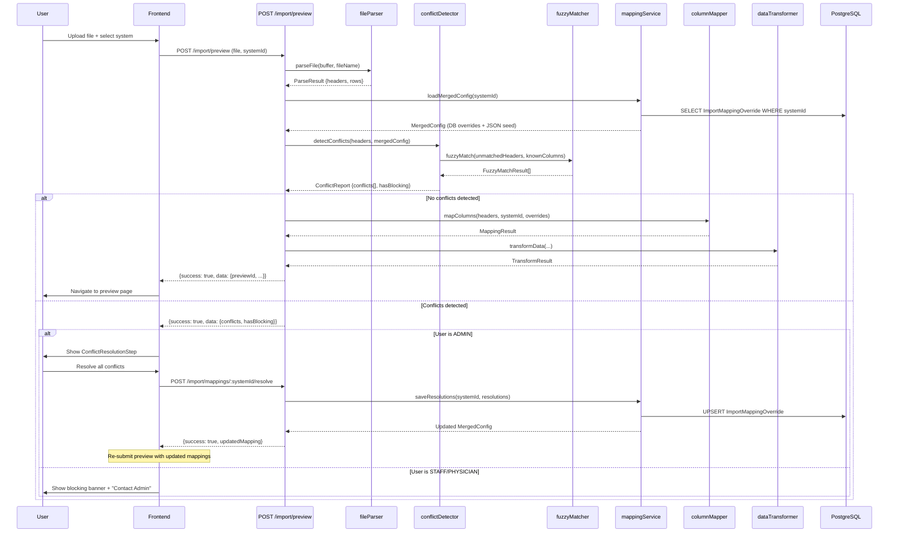
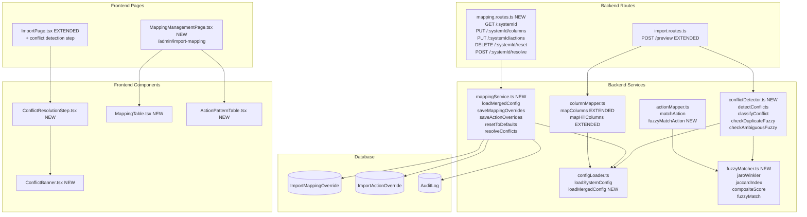
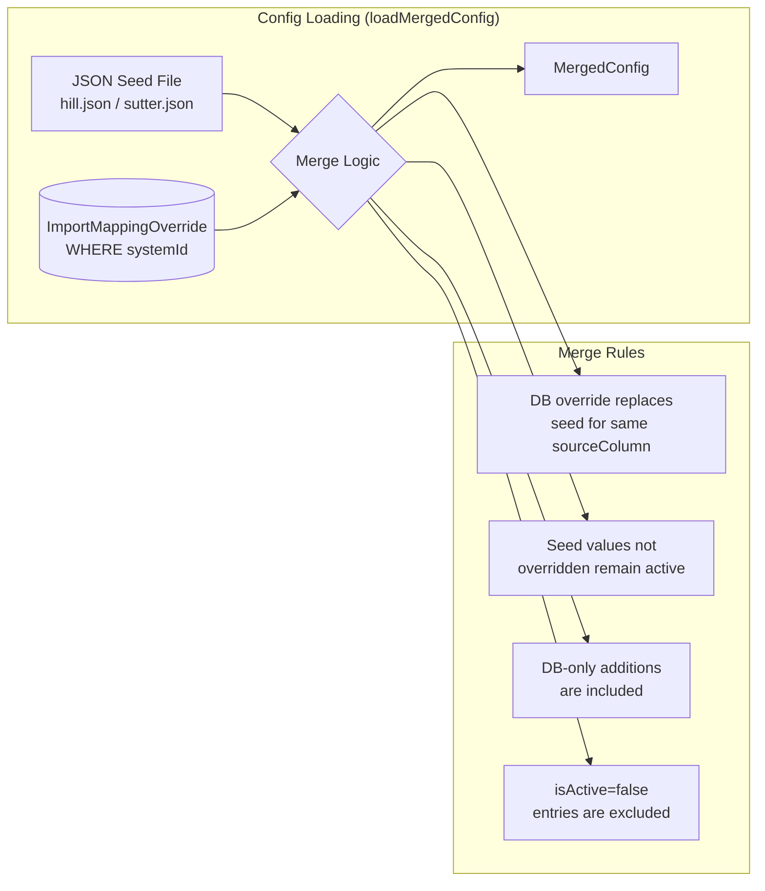

# Design Document -- Smart Column Mapping

## Overview

This design replaces the current exact-match column mapping with an intelligent, insurance-agnostic fuzzy matching system. The architecture introduces three new backend modules (fuzzy matcher, mapping service, conflict detector), two new Prisma models (ImportMappingOverride, ImportActionOverride), five new API endpoints under `/api/import/mappings`, and two new frontend components (inline conflict resolution step within the import flow, and a dedicated admin mapping management page at `/admin/import-mapping`). The existing import pipeline is extended -- not replaced -- with an optional conflict detection phase between file parsing and column mapping.

## Steering Document Alignment

### Technical Standards (tech.md)

- **Backend**: Node.js 20 LTS, Express.js, TypeScript, Prisma ORM, PostgreSQL -- all new backend modules follow these standards
- **Frontend**: React 18, Vite, TypeScript, Zustand for global state, Tailwind CSS for styling, Axios for HTTP
- **Testing**: Jest for backend (unit + API), Vitest for frontend components, Playwright for E2E (general UI), Cypress for AG Grid interactions
- **Module system**: ESM with `.js` extensions in imports, consistent with the existing codebase
- **Error handling**: `createError(message, statusCode, code?)` pattern for backend, try/catch with `setError()` state for frontend
- **Authentication**: JWT + `requireAuth` + `requireRole(['ADMIN'])` middleware for write endpoints; `requirePatientDataAccess` for read endpoints

### Project Structure (structure.md)

New files follow the established directory layout and naming conventions:

| New File | Location | Convention |
|----------|----------|------------|
| `fuzzyMatcher.ts` | `backend/src/services/import/` | camelCase service |
| `mappingService.ts` | `backend/src/services/import/` | camelCase service |
| `conflictDetector.ts` | `backend/src/services/import/` | camelCase service |
| `mapping.routes.ts` | `backend/src/routes/` | kebab-case + .routes |
| `fuzzyMatcher.test.ts` | `backend/src/services/import/__tests__/` | Same name + .test |
| `mappingService.test.ts` | `backend/src/services/import/__tests__/` | Same name + .test |
| `conflictDetector.test.ts` | `backend/src/services/import/__tests__/` | Same name + .test |
| `mapping.routes.test.ts` | `backend/src/routes/__tests__/` | Same name + .test |
| `MappingManagementPage.tsx` | `frontend/src/pages/` | PascalCase + Page suffix |
| `ConflictResolutionStep.tsx` | `frontend/src/components/import/` | PascalCase component |
| `ConflictBanner.tsx` | `frontend/src/components/import/` | PascalCase component |
| `MappingTable.tsx` | `frontend/src/components/import/` | PascalCase component |
| `ActionPatternTable.tsx` | `frontend/src/components/import/` | PascalCase component |
| `MappingManagementPage.test.tsx` | `frontend/src/pages/` | Same name + .test |
| `ConflictResolutionStep.test.tsx` | `frontend/src/components/import/` | Same name + .test |

## Code Reuse Analysis

### Existing Components to Leverage

- **`configLoader.ts`**: Existing `loadSystemConfig()`, `listSystems()`, `isSutterConfig()`, `isHillConfig()` type guards, `SystemConfig` types -- extended with new `loadMergedConfig()` function
- **`columnMapper.ts`**: Existing `mapColumns()`, `mapHillColumns()`, `ColumnMapping`, `MappingResult` types -- extended to accept an optional `overrides` parameter
- **`sutterColumnMapper.ts`**: Existing `mapSutterColumns()` -- extended to accept overrides
- **`actionMapper.ts`**: Existing `buildActionMapperCache()`, `matchAction()` -- extended with fuzzy fallback
- **`fileParser.ts`**: Existing `parseFile()`, `ParseResult` -- used as-is, no changes needed
- **`validator.ts`**: Existing `validateRows()`, `ValidationResult` -- used as-is
- **`auth.ts` middleware**: Existing `requireAuth`, `requireRole`, `requirePatientDataAccess` -- reused on new routes
- **`errorHandler.ts`**: Existing `createError()` -- reused for error responses
- **`AuditLog` model**: Existing flexible `action`/`entity`/`changes` JSON structure -- no schema change needed
- **`ProtectedRoute.tsx`**: Existing role-based route guard -- reused for admin mapping page
- **`SheetSelector.tsx`**: Existing component for import flow -- will render alongside the new conflict resolution step
- **`ImportPage.tsx` / `ImportTabContent`**: Existing import flow component -- modified to include conflict resolution step
- **`authStore.ts`**: Existing `useAuthStore`, `isAdmin()`, `hasRole()` helpers -- reused for role checks in UI
- **`dropdownConfig.ts`**: Existing `QUALITY_MEASURE_TO_STATUS` -- reused for mapping target dropdowns
- **`UnmappedActionsBanner.tsx`**: Existing pattern for showing import warnings -- referenced for conflict banner design

### Integration Points

- **Import Pipeline**: New conflict detection inserts between `parseFile()` and `mapColumns()` in the preview endpoint
- **Database**: Two new Prisma models added via migration; existing `AuditLog` used for tracking
- **Route Registration**: New `mapping.routes.ts` registered in `routes/index.ts` as `router.use('/import/mappings', mappingRoutes)` (separate from `import.routes.ts` to keep files small)
- **Frontend Routing**: New `/admin/import-mapping` route added to `App.tsx`; `/hill-mapping` redirects to it
- **Import Flow UI**: New `ConflictResolutionStep` component inserted into `ImportTabContent` between file upload (Step 3/4) and preview navigation

---

## Architecture

### Import Flow with Conflict Detection



### Component Architecture



### Database Override + JSON Seed Merge Strategy



---

## Components and Interfaces

### 1. fuzzyMatcher.ts (New Module)

- **Purpose**: Standalone string similarity utility module with zero import-specific dependencies. Implements Jaro-Winkler distance, Jaccard token overlap, and a composite scoring function.
- **Location**: `backend/src/services/import/fuzzyMatcher.ts`
- **Reuses**: None (standalone utility)

```typescript
// ---- Public API ----

/**
 * Normalize a string for comparison:
 * lowercase, trim whitespace, remove common suffixes (" E", " Q1", " Q2").
 */
export function normalizeHeader(header: string): string;

/**
 * Calculate Jaro-Winkler similarity between two strings.
 * Returns a value between 0.0 (no match) and 1.0 (exact match).
 * Uses a prefix scale factor of 0.1 with max prefix length 4.
 */
export function jaroWinklerSimilarity(s1: string, s2: string): number;

/**
 * Calculate Jaccard index on word tokens.
 * Splits both strings on whitespace, computes |intersection| / |union|.
 * Returns 0.0 to 1.0.
 */
export function jaccardTokenSimilarity(s1: string, s2: string): number;

/**
 * Composite similarity score: 60% Jaro-Winkler + 40% Jaccard.
 * Both inputs are normalized before scoring.
 */
export function compositeScore(source: string, candidate: string): number;

/**
 * Find the best fuzzy matches for a source string against a list of candidates.
 * Returns matches above the threshold, sorted by descending score.
 */
export function fuzzyMatch(
  source: string,
  candidates: string[],
  threshold?: number  // default 0.80
): FuzzyMatchResult[];

export interface FuzzyMatchResult {
  candidate: string;
  score: number;       // 0.0 - 1.0
  normalizedSource: string;
  normalizedCandidate: string;
}
```

### 2. conflictDetector.ts (New Module)

- **Purpose**: Compares file headers against a merged mapping config and classifies each difference as a conflict. Handles all 16 use cases specified in requirements.
- **Location**: `backend/src/services/import/conflictDetector.ts`
- **Dependencies**: `fuzzyMatcher.ts`, `configLoader.ts` types

```typescript
// ---- Types ----

export type ConflictType = 'NEW' | 'MISSING' | 'CHANGED' | 'DUPLICATE' | 'AMBIGUOUS';
export type ConflictSeverity = 'BLOCKING' | 'WARNING' | 'INFO';
export type ColumnCategory = 'PATIENT' | 'MEASURE' | 'DATA' | 'SKIP' | 'ACTION';

export interface ColumnConflict {
  id: string;                        // Unique ID for UI tracking (e.g., "conflict-0")
  type: ConflictType;
  severity: ConflictSeverity;
  category: ColumnCategory;
  sourceHeader: string;              // File header (for NEW/CHANGED) or config column (for MISSING)
  configColumn: string | null;       // Known config column (for CHANGED/MISSING)
  suggestions: FuzzySuggestion[];    // Top 3 fuzzy matches (for NEW/CHANGED)
  resolution: ConflictResolution | null;  // Admin's chosen resolution (null = unresolved)
  message: string;                   // Human-readable description
}

export interface FuzzySuggestion {
  columnName: string;
  score: number;                     // 0.0 - 1.0
  targetType: 'PATIENT' | 'MEASURE' | 'DATA' | 'SKIP';
  measureInfo?: {
    requestType: string;
    qualityMeasure: string;
  };
}

export interface ConflictResolution {
  action: 'ACCEPT_SUGGESTION' | 'MAP_TO_MEASURE' | 'MAP_TO_PATIENT' | 'IGNORE' | 'KEEP' | 'REMOVE';
  targetMeasure?: {
    requestType: string;
    qualityMeasure: string;
  };
  targetPatientField?: string;
  suggestionIndex?: number;          // Which suggestion was accepted
}

export interface ConflictReport {
  systemId: string;
  conflicts: ColumnConflict[];
  summary: {
    total: number;
    new: number;
    missing: number;
    changed: number;
    duplicate: number;
    ambiguous: number;
    blocking: number;
    warnings: number;
  };
  hasBlockingConflicts: boolean;     // True if any BLOCKING severity conflicts exist
  isWrongFile: boolean;              // True if zero headers match (Use Case 13)
  wrongFileMessage?: string;         // "No recognizable columns found..."
}

// ---- Public API ----

/**
 * Detect conflicts between file headers and the merged mapping configuration.
 * This is the main entry point, called from the preview route.
 */
export function detectConflicts(
  fileHeaders: string[],
  mergedConfig: MergedSystemConfig,
  systemId: string,
  options?: {
    headerThreshold?: number;        // default 0.80
    actionThreshold?: number;        // default 0.75
  }
): ConflictReport;
```

#### Conflict Classification Logic (All 16 Use Cases)

The `detectConflicts` function processes headers through a classification pipeline:

| # | Scenario | Detection Logic | Conflict Type | Severity |
|---|----------|----------------|---------------|----------|
| 1 | Exact/case/whitespace/reorder match | `normalizeHeader(fileHeader) === normalizeHeader(configColumn)` | None (auto-mapped) | -- |
| 2 | Renamed column (high fuzzy, >=80%) | No exact match, `compositeScore >= 0.80` | CHANGED | WARNING (measure) or BLOCKING (patient required) |
| 3 | Renamed column (low similarity, <80%) | No exact match, `compositeScore < 0.80` | NEW | WARNING |
| 4 | New column in file | No exact match, no fuzzy match above threshold | NEW | WARNING |
| 5 | Missing column (measure) | Config measure column not found in file headers | MISSING | WARNING |
| 6 | Missing column (patient, required) | Config patient column (`memberName`/`memberDob`) not in file | MISSING | BLOCKING |
| 7 | Required patient column renamed | Patient column not exact-matched but fuzzy-matched | CHANGED | BLOCKING |
| 8 | Two file headers match same config column | Two file headers both fuzzy-match the same config column | DUPLICATE | BLOCKING |
| 9 | One file header matches multiple config columns | `fuzzyMatch()` returns 2+ candidates above threshold with scores within 5% of each other | AMBIGUOUS | BLOCKING |
| 10 | Column split (one became two) | Original column is MISSING + two NEW columns appear | MISSING + NEW | WARNING |
| 11 | Column merge (two became one) | Two config columns MISSING + one NEW column matches both | MISSING + CHANGED | WARNING |
| 12 | Suffix changed ("Eye Exam" to "Eye Exam E") | Handled by `normalizeHeader()` stripping " E" suffix before comparison | None (auto-mapped after normalization) | -- |
| 13 | Wrong file entirely | `matchedCount / totalConfigColumns < 0.10` (less than 10% match) | ERROR | BLOCKING (entire import) |
| 14 | Duplicate headers in file | `new Set(headers).size < headers.length` detected before conflict analysis | ERROR | BLOCKING |
| 15 | Skip column renamed | Skip column not exact-matched but fuzzy-matched to a known skip column | CHANGED (skip) | INFO |
| 16 | Sutter action text wording change | Regex fails in `matchAction()`, fuzzy fallback in `fuzzyMatchAction()` | Reported via `unmappedActions` | WARNING |

**Classification Pipeline:**

```
Step 1: Normalize all file headers (trim, lowercase, strip suffixes)
Step 2: Check for duplicate headers in file -> BLOCKING error if found
Step 3: Build lookup sets from merged config (patient columns, measure columns, skip columns, data columns)
Step 4: For each file header:
  4a: Check exact match against all config column sets -> mapped (no conflict)
  4b: If no exact match, run fuzzyMatch() against all known columns
  4c: If best score >= threshold -> CHANGED conflict
  4d: If best score < threshold -> NEW conflict
  4e: Check if multiple file headers fuzzy-matched same config column -> DUPLICATE
  4f: Check if one file header has 2+ close-scoring matches -> AMBIGUOUS
Step 5: For each config column NOT matched by any file header -> MISSING conflict
Step 6: Classify severity:
  - MISSING patient required (memberName/memberDob targets) -> BLOCKING
  - CHANGED patient required -> BLOCKING
  - DUPLICATE -> BLOCKING
  - AMBIGUOUS -> BLOCKING
  - Everything else -> WARNING or INFO
Step 7: Wrong file check: if matched < 10% of config columns -> isWrongFile = true
```

### 3. mappingService.ts (New Module)

- **Purpose**: Encapsulates all CRUD operations for mapping overrides. Provides the merge logic that combines database overrides with JSON seed defaults. Used by both API routes and the import flow.
- **Location**: `backend/src/services/import/mappingService.ts`
- **Dependencies**: Prisma client, `configLoader.ts`

```typescript
// ---- Types ----

export interface MergedColumnMapping {
  sourceColumn: string;
  targetType: 'PATIENT' | 'MEASURE' | 'DATA' | 'IGNORED';
  targetField: string | null;        // For patient columns (e.g., "memberName")
  requestType: string | null;        // For measure columns
  qualityMeasure: string | null;     // For measure columns
  isOverride: boolean;               // true = from DB, false = from JSON seed
  isActive: boolean;
  overrideId: number | null;         // DB record ID if override
}

export interface MergedActionMapping {
  pattern: string;
  requestType: string;
  qualityMeasure: string;
  measureStatus: string;
  isOverride: boolean;
  isActive: boolean;
  overrideId: number | null;
}

export interface MergedSystemConfig {
  systemId: string;
  systemName: string;
  format: 'wide' | 'long';
  patientColumns: MergedColumnMapping[];
  measureColumns: MergedColumnMapping[];  // Hill: from measureColumns; Sutter: from requestTypeMapping
  dataColumns: MergedColumnMapping[];     // Sutter only
  skipColumns: MergedColumnMapping[];
  actionMappings: MergedActionMapping[];  // Sutter only
  skipActions: string[];                  // Sutter only
  statusMapping: Record<string, { compliant: string; nonCompliant: string }>;  // Hill only
  lastModifiedAt: Date | null;
  lastModifiedBy: string | null;          // Display name of last modifier
}

// ---- Public API ----

/**
 * Load merged config: DB overrides + JSON seed fallback.
 * Returns the complete mapping configuration for a system.
 * Falls back to JSON-only if DB is unavailable (logs warning).
 */
export async function loadMergedConfig(systemId: string): Promise<MergedSystemConfig>;

/**
 * Save column mapping overrides from admin edits or conflict resolution.
 * Upserts ImportMappingOverride records, creates AuditLog entry.
 * Uses optimistic locking via updatedAt comparison.
 */
export async function saveMappingOverrides(
  systemId: string,
  changes: MappingChangeRequest[],
  userId: number,
  expectedUpdatedAt?: Date  // For optimistic locking
): Promise<MergedSystemConfig>;

/**
 * Save action pattern overrides (Sutter format only).
 * Upserts ImportActionOverride records, creates AuditLog entry.
 */
export async function saveActionOverrides(
  systemId: string,
  changes: ActionChangeRequest[],
  userId: number
): Promise<MergedSystemConfig>;

/**
 * Delete all DB overrides for a system, reverting to JSON seed defaults.
 * Creates AuditLog entry recording the reset.
 */
export async function resetToDefaults(
  systemId: string,
  userId: number
): Promise<MergedSystemConfig>;

/**
 * Save conflict resolutions from inline import flow.
 * Converts ConflictResolution[] to MappingChangeRequest[] and saves.
 * Returns the updated MergedSystemConfig for immediate use.
 */
export async function resolveConflicts(
  systemId: string,
  resolutions: ResolvedConflict[],
  userId: number
): Promise<MergedSystemConfig>;

export interface MappingChangeRequest {
  sourceColumn: string;
  targetType: 'PATIENT' | 'MEASURE' | 'DATA' | 'IGNORED';
  targetField?: string;
  requestType?: string;
  qualityMeasure?: string;
  isActive?: boolean;
}

export interface ActionChangeRequest {
  pattern: string;
  requestType: string;
  qualityMeasure: string;
  measureStatus: string;
  isActive?: boolean;
}

export interface ResolvedConflict {
  conflictId: string;
  resolution: ConflictResolution;  // From conflictDetector types
}
```

### 4. mapping.routes.ts (New Route Module)

- **Purpose**: RESTful API endpoints for mapping CRUD operations.
- **Location**: `backend/src/routes/mapping.routes.ts`
- **Dependencies**: `mappingService.ts`, auth middleware
- **Registration**: Mounted at `/api/import/mappings` in `routes/index.ts` (under the existing `/api/import` prefix, or as a sub-router of import.routes.ts)

### 5. Extended columnMapper.ts

- **Purpose**: Extend existing `mapColumns()` to accept an optional `overrides` parameter so the import pipeline can use the merged config.
- **Changes**: Minimal -- add an optional `MergedSystemConfig` parameter. If provided, use the merged config instead of calling `loadSystemConfig()` directly.

```typescript
// Extended signature (backward-compatible)
export function mapColumns(
  headers: string[],
  systemId: string,
  mergedConfig?: MergedSystemConfig  // NEW optional param
): MappingResult;
```

### 6. Extended configLoader.ts

- **Purpose**: Add `loadMergedConfig()` as a convenience re-export, preserving the existing `loadSystemConfig()` for backward compatibility.
- **Changes**: Add one new exported function that delegates to `mappingService.loadMergedConfig()`.

### 7. ConflictResolutionStep.tsx (New Component)

- **Purpose**: Interactive conflict resolution UI displayed within the import flow (between file upload and preview navigation) when conflicts are detected and the user has ADMIN role.
- **Location**: `frontend/src/components/import/ConflictResolutionStep.tsx`
- **Dependencies**: Zustand auth store, API client

```typescript
interface ConflictResolutionStepProps {
  conflicts: ColumnConflict[];
  systemId: string;
  isAdmin: boolean;
  onResolved: (updatedMapping: MergedSystemConfig) => void;
  onCancel: () => void;
}
```

**UI Elements:**
- Summary banner with color-coded counts (blue=NEW, amber=CHANGED, red=MISSING)
- Table of conflicts grouped by type, each row showing:
  - Source header name
  - Conflict type badge
  - Fuzzy match suggestion(s) with similarity percentage
  - Resolution dropdown (Admin only) or read-only display (non-admin)
- "Save & Continue" button (disabled until all conflicts resolved)
- "Cancel" button (aborts import, no changes saved)
- "Copy Details" button (non-admin: copies conflict summary to clipboard)

### 8. ConflictBanner.tsx (New Component)

- **Purpose**: Read-only blocking banner shown to non-admin users when conflicts exist.
- **Location**: `frontend/src/components/import/ConflictBanner.tsx`

```typescript
interface ConflictBannerProps {
  conflicts: ColumnConflict[];
  systemName: string;
  onCancel: () => void;
  onCopyDetails: () => void;
}
```

### 9. MappingManagementPage.tsx (New Page)

- **Purpose**: Dedicated admin page for proactive mapping management.
- **Location**: `frontend/src/pages/MappingManagementPage.tsx`
- **Route**: `/admin/import-mapping` (protected by ADMIN role check)
- **Replaces**: `HillMeasureMapping.tsx` at `/hill-mapping`

```typescript
// Page state
interface MappingPageState {
  selectedSystemId: string;
  mergedConfig: MergedSystemConfig | null;
  loading: boolean;
  saving: boolean;
  error: string | null;
  editingRow: string | null;    // sourceColumn being edited
}
```

**UI Sections:**
1. **System Selector**: Dropdown populated from `listSystems()` API
2. **Patient Column Mappings**: Table with source header, target field dropdown
3. **Measure Column Mappings**: Table with source header, requestType + qualityMeasure dropdowns
4. **Ignored Columns**: List with "Un-ignore" button
5. **Action Pattern Mappings** (Sutter only): Table with regex pattern, target measure, edit/delete
6. **Skip Actions** (Sutter only): List with add/remove
7. **Metadata**: Last modified timestamp and admin name
8. **Actions**: "Add Mapping", "Reset to Defaults" (with confirmation)

### 10. MappingTable.tsx (New Component)

- **Purpose**: Reusable table for displaying and editing column mappings. Used by both MappingManagementPage and ConflictResolutionStep.
- **Location**: `frontend/src/components/import/MappingTable.tsx`

```typescript
interface MappingTableProps {
  mappings: MergedColumnMapping[];
  mode: 'view' | 'edit' | 'resolve';   // resolve = conflict resolution
  qualityMeasures: QualityMeasureOption[];
  patientFields: PatientFieldOption[];
  onMappingChange?: (sourceColumn: string, change: MappingChangeRequest) => void;
  onDelete?: (sourceColumn: string) => void;
}
```

### 11. ActionPatternTable.tsx (New Component)

- **Purpose**: Table for viewing/editing Sutter action regex patterns.
- **Location**: `frontend/src/components/import/ActionPatternTable.tsx`

```typescript
interface ActionPatternTableProps {
  actionMappings: MergedActionMapping[];
  skipActions: string[];
  mode: 'view' | 'edit';
  qualityMeasures: QualityMeasureOption[];
  onActionChange?: (index: number, change: ActionChangeRequest) => void;
  onSkipActionAdd?: (actionText: string) => void;
  onSkipActionRemove?: (actionText: string) => void;
}
```

---

## Data Models

### ImportMappingOverride (New Prisma Model)

```prisma
model ImportMappingOverride {
  id              Int      @id @default(autoincrement())
  systemId        String   @map("system_id")
  sourceColumn    String   @map("source_column")
  targetType      ImportTargetType @map("target_type")
  targetField     String?  @map("target_field")
  requestType     String?  @map("request_type")
  qualityMeasure  String?  @map("quality_measure")
  isActive        Boolean  @default(true) @map("is_active")
  createdBy       Int      @map("created_by")
  creator         User     @relation("MappingCreator", fields: [createdBy], references: [id])
  createdAt       DateTime @default(now()) @map("created_at")
  updatedAt       DateTime @updatedAt @map("updated_at")

  @@unique([systemId, sourceColumn])
  @@index([systemId])
  @@map("import_mapping_overrides")
}

enum ImportTargetType {
  PATIENT
  MEASURE
  DATA
  IGNORED
}
```

**Fields Explained:**

| Field | Type | Purpose |
|-------|------|---------|
| `id` | Int, auto-increment | Primary key |
| `systemId` | String, indexed | References the system in `systems.json` (e.g., "hill", "sutter") |
| `sourceColumn` | String | The header name from the spreadsheet file |
| `targetType` | Enum | What kind of mapping: PATIENT field, MEASURE column, DATA column, or IGNORED |
| `targetField` | String, nullable | For PATIENT type: the target field name (e.g., "memberName", "memberDob") |
| `requestType` | String, nullable | For MEASURE type: the request type (e.g., "AWV", "Screening", "Quality") |
| `qualityMeasure` | String, nullable | For MEASURE type: the quality measure name (e.g., "Annual Wellness Visit") |
| `isActive` | Boolean | Soft delete -- inactive overrides are excluded from merged config |
| `createdBy` | Int, FK to User | Admin who created/last modified the override |
| `updatedAt` | DateTime | Used for optimistic locking |

**Unique Constraint**: `[systemId, sourceColumn]` -- prevents duplicate entries for the same column in the same system. An upsert on this constraint handles both create and update.

### ImportActionOverride (New Prisma Model)

```prisma
model ImportActionOverride {
  id              Int      @id @default(autoincrement())
  systemId        String   @map("system_id")
  pattern         String
  requestType     String   @map("request_type")
  qualityMeasure  String   @map("quality_measure")
  measureStatus   String   @map("measure_status")
  isActive        Boolean  @default(true) @map("is_active")
  createdBy       Int      @map("created_by")
  creator         User     @relation("ActionCreator", fields: [createdBy], references: [id])
  createdAt       DateTime @default(now()) @map("created_at")
  updatedAt       DateTime @updatedAt @map("updated_at")

  @@unique([systemId, pattern])
  @@index([systemId])
  @@map("import_action_overrides")
}
```

**Fields Explained:**

| Field | Type | Purpose |
|-------|------|---------|
| `id` | Int, auto-increment | Primary key |
| `systemId` | String, indexed | References the system (currently only "sutter" uses actions) |
| `pattern` | String | Regex pattern string (validated before save) |
| `requestType` | String | Target request type |
| `qualityMeasure` | String | Target quality measure |
| `measureStatus` | String | Resulting measure status (typically "Not Addressed") |
| `isActive` | Boolean | Soft delete |
| `createdBy` | Int, FK to User | Admin who created the pattern |

**Unique Constraint**: `[systemId, pattern]` -- prevents duplicate regex patterns for the same system.

### User Model Extension

Add two new relations to the existing `User` model:

```prisma
model User {
  // ... existing fields ...

  // Import mapping overrides created by this admin
  mappingOverrides  ImportMappingOverride[] @relation("MappingCreator")
  actionOverrides   ImportActionOverride[]  @relation("ActionCreator")
}
```

### Migration Strategy

1. Create a new Prisma migration file: `backend/prisma/migrations/YYYYMMDDHHMMSS_add_import_mapping_overrides/migration.sql`
2. The migration adds two new tables and the enum type
3. No data migration needed -- existing imports continue to work with JSON seed files as-is
4. The migration is purely additive and can be run with zero downtime

---

## API Endpoints

### GET /api/import/mappings/:systemId

**Purpose**: Load merged mapping configuration for a system.

**Auth**: `requireAuth` + `requirePatientDataAccess`

**Response 200**:
```json
{
  "success": true,
  "data": {
    "systemId": "hill",
    "systemName": "Hill Healthcare",
    "format": "wide",
    "patientColumns": [
      {
        "sourceColumn": "Patient",
        "targetType": "PATIENT",
        "targetField": "memberName",
        "isOverride": false,
        "isActive": true,
        "overrideId": null
      }
    ],
    "measureColumns": [
      {
        "sourceColumn": "BP Control",
        "targetType": "MEASURE",
        "requestType": "Quality",
        "qualityMeasure": "Hypertension Management",
        "isOverride": true,
        "isActive": true,
        "overrideId": 42
      }
    ],
    "skipColumns": [...],
    "dataColumns": [],
    "actionMappings": [],
    "skipActions": [],
    "lastModifiedAt": "2026-02-20T10:30:00Z",
    "lastModifiedBy": "Dr. Smith"
  }
}
```

**Error 404**: `{ "success": false, "error": { "message": "System not found: xyz", "code": "NOT_FOUND" } }`

---

### PUT /api/import/mappings/:systemId/columns

**Purpose**: Upsert column mapping overrides.

**Auth**: `requireAuth` + `requireRole(['ADMIN'])`

**Request Body**:
```json
{
  "changes": [
    {
      "sourceColumn": "Blood Pressure Control",
      "targetType": "MEASURE",
      "requestType": "Quality",
      "qualityMeasure": "Hypertension Management"
    },
    {
      "sourceColumn": "Old Column Name",
      "targetType": "IGNORED"
    }
  ],
  "expectedUpdatedAt": "2026-02-20T10:30:00Z"
}
```

**Response 200**: Updated merged config (same format as GET response)

**Error 400**: Validation errors (empty sourceColumn, invalid targetType, target measure does not exist)

**Error 409**: Optimistic locking conflict -- another admin modified the mapping

**Error 403**: Non-admin user

---

### PUT /api/import/mappings/:systemId/actions

**Purpose**: Upsert action pattern overrides (Sutter-format systems only).

**Auth**: `requireAuth` + `requireRole(['ADMIN'])`

**Request Body**:
```json
{
  "changes": [
    {
      "pattern": "^FOBT in \\d{4} or colonoscopy",
      "requestType": "Screening",
      "qualityMeasure": "Colon Cancer Screening",
      "measureStatus": "Not Addressed"
    }
  ]
}
```

**Response 200**: Updated merged config

**Error 400**: Invalid regex pattern, catastrophic backtracking detected, or target measure does not exist

**Error 403**: Non-admin user

**Regex Validation**: The endpoint validates regex patterns before saving:
1. Attempt to compile the regex with a 100ms timeout (using `new RegExp(pattern)` in a try/catch)
2. Reject patterns containing nested quantifiers like `(a+)+`, `(a*)*`, `(a+)*` (ReDoS protection via simple regex-based check for `(\w+[+*])[+*]` patterns)

---

### DELETE /api/import/mappings/:systemId/reset

**Purpose**: Delete all DB overrides for a system, reverting to JSON seed defaults.

**Auth**: `requireAuth` + `requireRole(['ADMIN'])`

**Response 200**:
```json
{
  "success": true,
  "data": { ... },
  "message": "Reset to defaults. Deleted 15 column overrides and 3 action overrides."
}
```

**Error 403**: Non-admin user

---

### POST /api/import/mappings/:systemId/resolve

**Purpose**: Save conflict resolutions from inline import flow and return updated config.

**Auth**: `requireAuth` + `requireRole(['ADMIN'])`

**Request Body**:
```json
{
  "resolutions": [
    {
      "conflictId": "conflict-0",
      "resolution": {
        "action": "ACCEPT_SUGGESTION",
        "suggestionIndex": 0
      }
    },
    {
      "conflictId": "conflict-1",
      "resolution": {
        "action": "MAP_TO_MEASURE",
        "targetMeasure": {
          "requestType": "Quality",
          "qualityMeasure": "Diabetic Eye Exam"
        }
      }
    },
    {
      "conflictId": "conflict-2",
      "resolution": {
        "action": "IGNORE"
      }
    }
  ]
}
```

**Response 200**: Updated merged config for immediate use in the import pipeline

**Error 400**: Incomplete resolutions (not all conflicts addressed), invalid resolution action

---

### POST /api/import/preview (Extended)

**Purpose**: Existing endpoint, extended to include conflict detection.

**Changes to response**: When conflicts are detected, the endpoint returns a `conflicts` field instead of the full preview. The response shape changes based on whether conflicts exist:

**Response with conflicts (short-circuit)**:
```json
{
  "success": true,
  "data": {
    "hasConflicts": true,
    "conflicts": {
      "systemId": "hill",
      "conflicts": [...],
      "summary": {
        "total": 5,
        "new": 2,
        "missing": 1,
        "changed": 2,
        "blocking": 1
      },
      "hasBlockingConflicts": true,
      "isWrongFile": false
    }
  }
}
```

**Response without conflicts**: Existing response format unchanged (backward compatible).

---

## Fuzzy Matching Algorithm Design

### Composite Scoring (60% Jaro-Winkler + 40% Jaccard)

The composite approach handles both character-level edits and word-level rearrangements:

**Jaro-Winkler (60% weight)** -- good for:
- Typos: "BP Contrl" vs "BP Control"
- Prefix changes: "Eye Exam" vs "Diabetic Eye Exam" (prefix bonus)
- Short edits: "Has Sticket" vs "Has Sticker"

**Jaccard Token Overlap (40% weight)** -- good for:
- Word rearrangement: "Cancer Screening Breast" vs "Breast Cancer Screening"
- Word additions: "Eye Exam" vs "Diabetic Retinal Eye Exam"
- Multi-word descriptions: Sutter action text with extra words

### Normalization Before Scoring

```typescript
function normalizeHeader(header: string): string {
  let normalized = header.trim().toLowerCase();
  // Remove common suffixes that don't affect meaning
  normalized = normalized.replace(/\s+e$/i, '');          // " E" suffix (Hill eligibility)
  normalized = normalized.replace(/\s+q[12]$/i, '');      // " Q1" / " Q2" suffixes
  // Collapse multiple spaces
  normalized = normalized.replace(/\s+/g, ' ');
  return normalized;
}
```

### Thresholds

| Context | Threshold | Rationale |
|---------|-----------|-----------|
| Header matching | 80% | Balances false positives (random columns matching) vs false negatives (missing renames). At 80%, "BP Control" vs "Blood Pressure Control" = ~72% (below, flagged as NEW), while "Eye Exam" vs "Diabetic Eye Exam" = ~82% (above, flagged as CHANGED). |
| Action text matching | 75% | Action text has more variation (year numbers, date ranges). Lower threshold catches wording changes while year-only changes are handled by regex first. |
| Ambiguity window | 5% | If two candidates are within 5% of each other (e.g., 85% and 82%), the match is AMBIGUOUS and requires manual resolution. |

### Performance

For a file with 100 headers and a config with 200 known columns:
- Normalization: O(n) for each string
- Jaro-Winkler: O(max(|s1|, |s2|)) per pair
- Jaccard: O(tokens1 + tokens2) per pair
- Total: 100 * 200 = 20,000 comparisons, each ~O(100 chars) = well under 500ms

---

## Database Override + JSON Seed Merge Strategy

### Merge Algorithm (in mappingService.ts)

```
Input: systemId
Output: MergedSystemConfig

1. Load JSON seed config via loadSystemConfig(systemId)
   - On FileNotFoundError: if DB overrides exist, use DB-only; else throw
   - On ParseError: if DB overrides exist, use DB-only; else throw

2. Query DB: SELECT * FROM import_mapping_overrides WHERE system_id = systemId AND is_active = true
   - On DB error: log warning, return JSON-only config (graceful fallback)

3. Build merged column list:
   For each JSON seed column (patient + measure + skip + data):
     - Check if DB has override for same sourceColumn
     - If yes: use DB values (isOverride = true)
     - If no: use JSON values (isOverride = false)
   For each DB override NOT in JSON seed:
     - Add to merged list (isOverride = true) -- these are admin-added columns

4. Build merged action list (Sutter only):
   Same merge logic for actionMapping and skipActions

5. Get metadata:
   - lastModifiedAt = MAX(updatedAt) from DB overrides for this system
   - lastModifiedBy = creator.displayName for the most recent override

6. Return MergedSystemConfig
```

### Fallback Priority

```
Priority 1: DB override (isActive = true)
Priority 2: JSON seed file
Priority 3: Error (no config available)
```

If the DB is unavailable, the system falls back to JSON-only mode, which is identical to the current behavior. This ensures zero-downtime upgrade and backward compatibility.

---

## Extended Import Flow in ImportPage.tsx

The existing import flow steps are:
1. Select Healthcare System
2. Choose Import Mode
3. Upload File
4. Select Tab & Physician (SheetSelector)
5. Submit -> Navigate to Preview

The new flow inserts Step 4.5 (Conflict Resolution) between step 4 and step 5:

```
Step 1: Select Healthcare System
Step 2: Choose Import Mode
Step 3: Upload File
Step 4: Select Tab & Physician (SheetSelector)
--> Step 4.5: Conflict Resolution (NEW, shown only when conflicts detected)
    - ADMIN: Interactive resolution form
    - Non-Admin: Blocking banner with "Contact Admin"
Step 5: Submit -> Navigate to Preview
```

**Implementation Approach:**

The `ImportTabContent` component's `handleSubmit` function currently calls `POST /api/import/preview` and navigates to the preview page on success. The change:

1. `handleSubmit` calls `POST /api/import/preview` as before
2. If the response contains `hasConflicts: true`:
   - Set `conflicts` state with the conflict data
   - Render `ConflictResolutionStep` (admin) or `ConflictBanner` (non-admin)
   - Do NOT navigate to preview
3. When admin resolves conflicts and clicks "Save & Continue":
   - Call `POST /api/import/mappings/:systemId/resolve` with resolutions
   - On success, re-submit `POST /api/import/preview` (now with updated mappings, should have no conflicts)
   - Navigate to preview page
4. When admin clicks "Cancel" or non-admin clicks "Cancel":
   - Clear conflicts state, return to file upload step

---

## Frontend Routing Changes

### App.tsx Modifications

```typescript
// NEW: Admin mapping management route
<Route
  path="/admin/import-mapping"
  element={
    <ProtectedRoute allowedRoles={['ADMIN']}>
      <div className="min-h-screen bg-gray-50 flex flex-col">
        <Header />
        <main className="flex-1 flex flex-col">
          <MappingManagementPage />
        </main>
      </div>
    </ProtectedRoute>
  }
/>

// CHANGED: Redirect old /hill-mapping to new page
<Route
  path="/hill-mapping"
  element={<Navigate to="/admin/import-mapping?system=hill" replace />}
/>
```

---

## Import Date Default Behavior (REQ-SCM-08)

This requirement is functionally independent from fuzzy mapping but is bundled here as it was decided in the same session.

### Changes Required

**Module: `dataTransformer.ts`** (Hill wide-format)
- In `transformHillRow()`, after column mapping extracts `statusDate` from Q1 columns:
  - IF `statusDate` is empty/null/unparseable → set `statusDate = new Date().toISOString().slice(0, 10)` (today's date, ISO YYYY-MM-DD)
  - IF `statusDate` has a valid value from the file → use it as-is (file takes precedence)
- After `statusDate` is set (from file or default), compute `dueDate` using existing `DueDayRule` logic from `dueDateCalculator.ts`
- Compute `timeIntervalDays = daysBetween(statusDate, dueDate)` consistent with `useGridCellUpdate.ts`

**Module: `sutterDataTransformer.ts`** (Sutter long-format)
- Sutter already extracts dates via `measureDetailsParser.ts` (`scanForEmbeddedDates()`)
- IF no date was extracted from Measure Details → set `statusDate = today's date`
- Same `dueDate` and `timeIntervalDays` calculation as above

**Preview Display**:
- Add a `statusDateSource` field to the preview row data: `'file' | 'default'`
- Preview table shows a small badge "(default)" next to defaulted dates so users can see which dates came from the file vs. import date

### No New Modules Required
This change modifies existing transformer modules only. No new files, no new API endpoints.

---

## Error Handling

### Error Scenarios

1. **Wrong file uploaded (zero headers match)**
   - **Detection**: `ConflictReport.isWrongFile = true` (less than 10% match rate)
   - **Handling**: Return error in preview response, not hundreds of individual conflicts
   - **User Impact**: "No recognizable columns found. This file may not be from the selected insurance system." with a "Cancel" button

2. **Duplicate headers in file**
   - **Detection**: Pre-check in `detectConflicts()` before any fuzzy matching
   - **Handling**: Return BLOCKING conflict with list of duplicate header names
   - **User Impact**: "Duplicate column headers detected: [names]. Please fix the source file."

3. **Database unavailable during config load**
   - **Detection**: Prisma query throws connection error
   - **Handling**: Catch error, log warning, fall back to JSON-only config
   - **User Impact**: Import proceeds normally using seed defaults; admin mapping page shows warning "Unable to load database overrides"

4. **Optimistic locking conflict on save**
   - **Detection**: `expectedUpdatedAt` does not match current `MAX(updatedAt)` in DB
   - **Handling**: Return 409 Conflict with message
   - **User Impact**: "Another administrator has modified this mapping. Please reload and try again."

5. **Invalid regex pattern in action override**
   - **Detection**: `new RegExp(pattern)` throws SyntaxError, or ReDoS pattern detected
   - **Handling**: Return 400 Bad Request with specific error
   - **User Impact**: "Invalid regex pattern: [error message]" inline validation

6. **Target measure does not exist**
   - **Detection**: Query `config_quality_measures` table, no match found
   - **Handling**: Return 400 Bad Request
   - **User Impact**: "Quality measure 'XYZ' not found for request type 'ABC'" inline validation

7. **Session timeout during conflict resolution**
   - **Detection**: 401 response from resolve endpoint
   - **Handling**: Axios interceptor catches 401, redirects to login
   - **User Impact**: Unsaved changes lost; user logs in and re-starts import

8. **Non-admin attempts to access mapping page**
   - **Detection**: `ProtectedRoute` with `allowedRoles={['ADMIN']}` blocks access
   - **Handling**: Redirect to `/` (existing ProtectedRoute behavior)
   - **User Impact**: Redirected to main page; toast notification "Admin access required"

---

## Testing Strategy

### Unit Testing (Jest -- Backend)

| Module | Key Test Cases | Approx Tests |
|--------|---------------|--------------|
| `fuzzyMatcher.ts` | Jaro-Winkler: identical strings, complete mismatch, single char edit, prefix bonus; Jaccard: identical tokens, no overlap, partial overlap; compositeScore: weighted average; normalizeHeader: whitespace trim, suffix strip, case fold | 25-30 |
| `conflictDetector.ts` | All 16 use cases from requirements; empty headers; wrong file detection; duplicate header detection; BLOCKING vs WARNING severity; ambiguous match detection | 30-35 |
| `mappingService.ts` | loadMergedConfig: DB-only, JSON-only, merged, DB fallback on error; saveMappingOverrides: create, update, optimistic lock conflict; resetToDefaults: deletes overrides; resolveConflicts: converts resolutions to overrides; audit log creation | 20-25 |
| `mapping.routes.ts` | Auth: 401 without token, 403 non-admin on write endpoints; CRUD: GET returns merged, PUT upserts, DELETE resets; Validation: empty sourceColumn, invalid targetType, regex validation; 404 for unknown system | 15-20 |

### Component Testing (Vitest -- Frontend)

| Component | Key Test Cases | Approx Tests |
|-----------|---------------|--------------|
| `ConflictResolutionStep.tsx` | Renders conflict list; color-coded badges; resolution dropdowns; "Save & Continue" disabled until all resolved; cancel button; loading state | 10-12 |
| `ConflictBanner.tsx` | Read-only display; "Contact Admin" message; "Copy Details" button copies to clipboard; no resolution controls shown | 5-6 |
| `MappingManagementPage.tsx` | System selector loads systems; tables render patient/measure/skip columns; edit mode; add mapping form; reset to defaults confirmation; Sutter actions section shown for long-format; last-modified metadata | 15-18 |
| `MappingTable.tsx` | View mode: read-only cells; Edit mode: dropdowns; Resolve mode: suggestion display with scores; Change callback | 8-10 |
| `ActionPatternTable.tsx` | Renders action patterns; edit regex; add/remove skip actions; regex validation UI | 6-8 |

### E2E Testing (Playwright)

| Test File | Key Scenarios |
|-----------|---------------|
| `smart-column-mapping.spec.ts` | Admin navigates to mapping management page; selects system; views mappings; edits a mapping; adds a new mapping; resets to defaults |
| `import-conflict-resolution.spec.ts` | Admin uploads file with renamed columns; conflict step appears; resolves conflicts; proceeds to preview |

### E2E Testing (Cypress)

| Test File | Key Scenarios |
|-----------|---------------|
| `import-conflict-admin.cy.ts` | Admin: conflict resolution dropdowns, save & continue, table interactions |
| `import-conflict-nonadmin.cy.ts` | Staff/Physician: blocking banner shown, no resolution controls, copy details button |
| `mapping-management.cy.ts` | Admin: full CRUD on mapping management page, system switching |

### Visual Review (MCP Playwright -- Layer 5)

- Conflict resolution step visual review: badge colors, layout, responsive behavior
- Mapping management page visual review: table layout, system selector, edit mode
- Non-admin blocking banner visual review: proper messaging and styling

---

## Non-Functional Considerations

### Performance

- Fuzzy matching runs server-side only (no client bundle impact)
- Database queries use indexed `systemId` lookups
- Config loading is synchronous for JSON (existing pattern), async for DB merge
- Mapping management page loads all config in a single API call

### Security

- All write endpoints require ADMIN role
- Regex patterns are validated for ReDoS before storage
- Prisma parameterized queries prevent SQL injection
- Audit log tracks all mapping changes with user identity

### Reliability

- Per-header fail-open: if fuzzy matching throws for a specific header, that header is classified as "unmapped" and remaining headers continue processing (NFR-SCM-R2)
- Database fallback: if DB query fails in `loadMergedConfig()`, fall back to JSON config files and log a warning (NFR-SCM-R1)

### Accessibility (WCAG 2.1 AA)

- ConflictResolutionStep: all resolution dropdowns are keyboard-navigable, focus management moves to first conflict on load, aria-live region announces "X of Y conflicts resolved"
- MappingManagementPage: tables support keyboard navigation, edit mode traps focus in the form, ARIA labels on all interactive elements
- ConflictBanner: role="alert" for the blocking message, "Copy Details" button has aria-label

### Backward Compatibility

- Existing JSON config files continue to work without any database seeding
- `loadSystemConfig()` remains unchanged; `loadMergedConfig()` is additive
- `mapColumns()` signature is backward-compatible (optional parameter)
- Existing import API response format is maintained; `conflicts` field is additive
- `/hill-mapping` redirects to `/admin/import-mapping?system=hill`

---

## Last Updated

February 20, 2026
