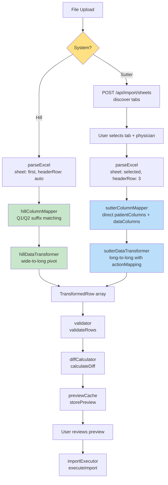
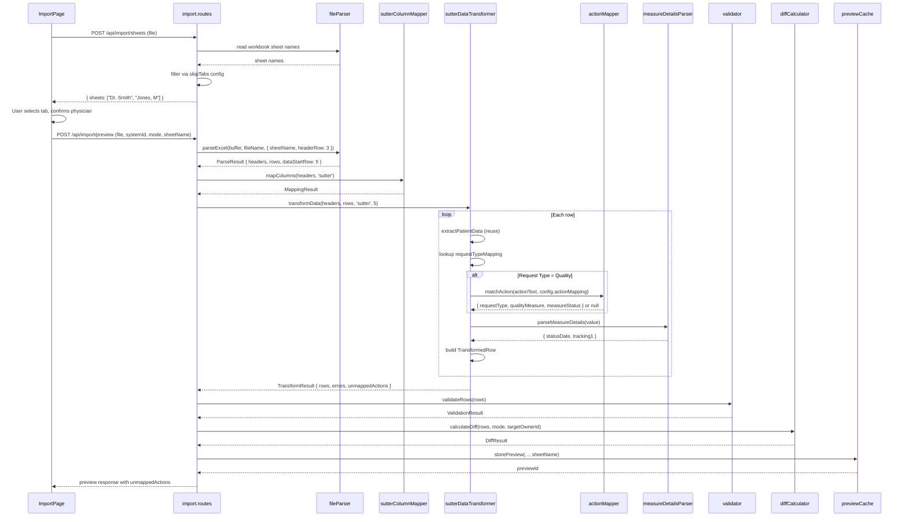
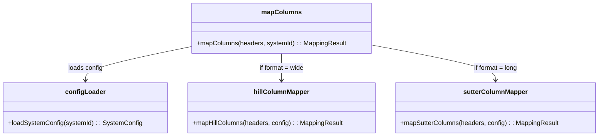
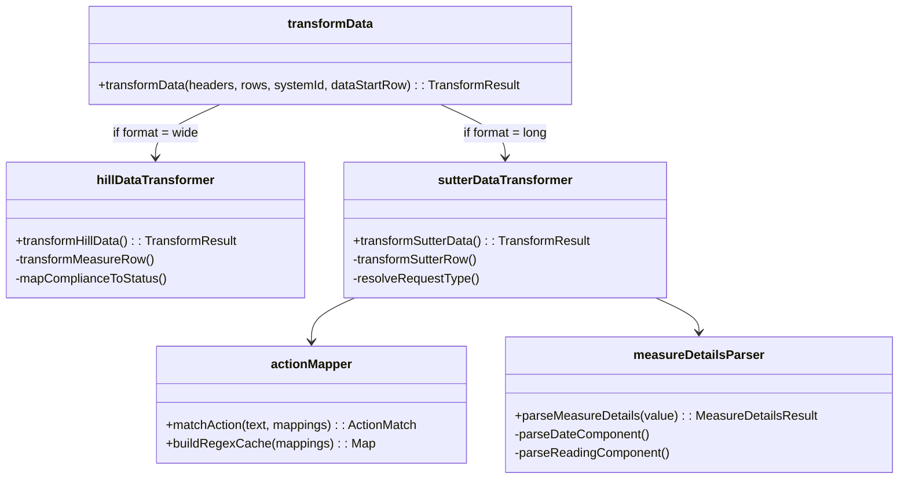

# Design Document: Sutter/SIP Import

## Overview

This feature extends the existing import pipeline to support Sutter Independent Physicians (SIP) as a second healthcare system alongside Hill Healthcare. The core challenge is that Sutter uses a fundamentally different spreadsheet format: **long format** (one row per quality measure per patient) versus Hill's **wide format** (one row per patient with multiple measure columns). Sutter files are multi-tab Excel workbooks where each tab represents a physician's patient panel, and the measure data is encoded in free-text "Possible Actions Needed" values that must be parsed via regex-based action mappings.

The design uses a **strategy pattern** to make the column mapper and data transformer system-aware, while keeping the downstream pipeline (diffCalculator, importExecutor, previewCache, validator) shared between both systems with minimal extensions. A new `POST /api/import/sheets` endpoint handles multi-tab discovery, and the frontend gains a conditional sheet selector step.

## Steering Document Alignment

### Technical Standards (tech.md)

- **Runtime**: Node.js 20 LTS with TypeScript 5.4, Express 4.21 -- no new runtime dependencies
- **Excel parsing**: SheetJS (XLSX) ^0.18.5 already supports multi-sheet workbooks via `workbook.SheetNames` and `workbook.Sheets[name]`
- **Frontend**: React 18 + Vite + Tailwind CSS + Zustand -- sheet selector uses existing patterns
- **Testing**: Jest (backend), Vitest (frontend components), Playwright (E2E flows), Cypress (AG Grid interactions)
- **Database**: PostgreSQL via Prisma -- no schema changes required (Patient and PatientMeasure models already have `notes`, `tracking1`, `insuranceGroup` columns)
- **Config**: JSON config files in `backend/src/config/import/` -- new `sutter.json` follows `hill.json` patterns
- **Module system**: ESM throughout (`"type": "module"`)

### Project Structure (structure.md)

New files follow existing conventions:

| New File | Convention | Location |
|----------|-----------|----------|
| `sutter.json` | Config file (camelCase) | `backend/src/config/import/sutter.json` |
| `sutterColumnMapper.ts` | Service (camelCase) | `backend/src/services/import/sutterColumnMapper.ts` |
| `sutterDataTransformer.ts` | Service (camelCase) | `backend/src/services/import/sutterDataTransformer.ts` |
| `actionMapper.ts` | Service (camelCase) | `backend/src/services/import/actionMapper.ts` |
| `measureDetailsParser.ts` | Utility (camelCase) | `backend/src/services/import/measureDetailsParser.ts` |
| `SheetSelector.tsx` | React component (PascalCase) | `frontend/src/components/import/SheetSelector.tsx` |
| Tests | Same name + `.test` | `backend/src/services/import/__tests__/` and `frontend/src/components/import/` |

## Code Reuse Analysis

### Existing Components to Leverage

- **`configLoader.ts`**: `loadSystemConfig()`, `loadSystemsRegistry()`, `listSystems()` -- extended with union type for Sutter config fields
- **`fileParser.ts`**: `parseExcel()` -- extended to accept optional `sheetName` and `headerRow` parameters
- **`columnMapper.ts`**: `mapColumns()` -- becomes a dispatcher that delegates to system-specific mappers
- **`dataTransformer.ts`**: `transformData()` -- becomes a dispatcher that delegates to system-specific transformers; `extractPatientData()` and `normalizePhone()` must be exported (currently private) so `sutterDataTransformer.ts` can reuse them; `getUniquePatients()`, `groupByPatient()` are reused directly
- **`diffCalculator.ts`**: `calculateDiff()`, `calculateMergeDiff()`, `applyMergeLogic()`, `categorizeStatus()` -- reused as-is; `DiffChange` interface extended with optional `notes` and `tracking1`
- **`importExecutor.ts`**: `executeImport()`, `insertMeasure()`, `updateMeasure()` -- extended to persist `notes` and `tracking1` from `DiffChange`
- **`previewCache.ts`**: `storePreview()`, `PreviewEntry` -- extended with optional `sheetName` field
- **`validator.ts`**: `validateRows()` -- reused as-is for core validation; `VALID_REQUEST_TYPES` already includes `Screening` and `Chronic DX`. Note: per REQ-SI-14 AC6, invalid `requestType` severity should remain `'error'` for Hill but become `'warning'` for Sutter imports -- this requires making the validator system-aware by accepting an optional `systemId` parameter
- **`errorReporter.ts`**: `generateErrorReport()`, `getCondensedReport()` -- reused as-is
- **`dateParser.ts`**: `parseDate()`, `toISODateString()` -- reused for DOB and Measure Details date parsing
- **`ImportPage.tsx`**: Extended with conditional sheet selector step; existing state management pattern preserved

### Integration Points

- **`systems.json`**: Add `sutter` entry to the registry
- **`GET /api/import/systems`**: Automatically returns Sutter once registered
- **`GET /api/users/physicians`**: Already exists; used for physician dropdown in sheet selector
- **`POST /api/import/preview`**: Extended to accept `sheetName` in request body
- **Insurance group filter**: Existing `insuranceGroup` field and filter dropdown already support dynamic values from `systems.json`
- **Audit logging**: Existing audit infrastructure; Sutter imports logged with `systemId = 'sutter'`
- **Socket.IO events**: Existing `import:started`/`import:completed` events work without changes

## Architecture

### High-Level Import Pipeline (Hill vs Sutter)



### Sutter Data Transformation Flow



### Strategy Pattern: Column Mapper



### Strategy Pattern: Data Transformer



## Components and Interfaces

### 1. System Configuration Extension (`configLoader.ts`)

- **Purpose**: Extend the `SystemConfig` type to support Sutter-specific configuration fields while preserving Hill compatibility.
- **Approach**: Use a union/discriminated type based on the `format` field.
- **Dependencies**: Existing `configLoader.ts`
- **Reuses**: `loadSystemConfig()`, `loadSystemsRegistry()`, `listSystems()`

```typescript
// Shared base fields
interface SystemConfigBase {
  name: string;
  version: string;
  patientColumns: Record<string, string>;  // column header -> internal field name
}

// Hill-specific config (wide format)
interface HillSystemConfig extends SystemConfigBase {
  format?: 'wide';  // optional for backwards compatibility
  measureColumns: Record<string, MeasureColumnMapping>;
  statusMapping: Record<string, StatusMapping>;
  skipColumns: string[];
}

// Sutter-specific config (long format)
interface SutterSystemConfig extends SystemConfigBase {
  format: 'long';
  headerRow: number;  // 0-indexed row where headers are (3 for Sutter)
  dataColumns: string[];  // Sutter data column names
  requestTypeMapping: Record<string, {
    requestType: string | null;
    qualityMeasure: string | null;
  }>;
  actionMapping: ActionMappingEntry[];
  skipActions: string[];  // documented but unmapped actions
  skipTabs: SkipTabPattern[];
  // Hill-only fields not present
}

interface ActionMappingEntry {
  pattern: string;  // regex pattern string
  requestType: string;
  qualityMeasure: string;
  measureStatus: string;
}

interface SkipTabPattern {
  type: 'suffix' | 'prefix' | 'exact' | 'contains';
  value: string;
}

// Discriminated union
type SystemConfig = HillSystemConfig | SutterSystemConfig;

// Type guard
function isSutterConfig(config: SystemConfig): config is SutterSystemConfig {
  return (config as SutterSystemConfig).format === 'long';
}
```

### 2. Sutter Configuration File (`sutter.json`)

- **Purpose**: Data-driven configuration for Sutter column mapping, action-to-measure translation, and tab filtering.
- **Dependencies**: `configLoader.ts`
- **Reuses**: Same JSON config pattern as `hill.json`

```json
{
  "name": "Sutter/SIP",
  "version": "1.0",
  "format": "long",
  "headerRow": 3,

  "patientColumns": {
    "Member Name": "memberName",
    "Member DOB": "memberDob",
    "Member Telephone": "memberTelephone",
    "Member Home Address": "memberAddress"
  },

  "dataColumns": [
    "Health Plans",
    "Race-Ethnicity",
    "Possible Actions Needed",
    "Request Type",
    "Measure Details",
    "High Priority"
  ],

  "requestTypeMapping": {
    "AWV": { "requestType": "AWV", "qualityMeasure": "Annual Wellness Visit" },
    "APV": { "requestType": "AWV", "qualityMeasure": "Annual Wellness Visit" },
    "HCC": { "requestType": "Chronic DX", "qualityMeasure": "Chronic Diagnosis Code" },
    "Quality": { "requestType": null, "qualityMeasure": null }
  },

  "actionMapping": [
    {
      "pattern": "^FOBT in \\d{4} or colonoscopy",
      "requestType": "Screening",
      "qualityMeasure": "Colon Cancer Screening",
      "measureStatus": "Not Addressed"
    },
    {
      "pattern": "^HTN - Most recent \\d{4} BP less than",
      "requestType": "Quality",
      "qualityMeasure": "Hypertension Management",
      "measureStatus": "Not at goal"
    },
    {
      "pattern": "^DM - Urine albumin/creatine? ratio",
      "requestType": "Quality",
      "qualityMeasure": "Diabetic Nephropathy",
      "measureStatus": "Not Addressed"
    },
    {
      "pattern": "^DM - Most recent \\d{4} HbA1c",
      "requestType": "Quality",
      "qualityMeasure": "Diabetes Control",
      "measureStatus": "HgbA1c NOT at goal"
    },
    {
      "pattern": "^DM - Eye exam in \\d{4}",
      "requestType": "Quality",
      "qualityMeasure": "Diabetic Eye Exam",
      "measureStatus": "Not Addressed"
    },
    {
      "pattern": "^Pap in \\d{4} - \\d{4} -OR- Pap & HPV",
      "requestType": "Screening",
      "qualityMeasure": "Cervical Cancer Screening",
      "measureStatus": "Not Addressed"
    },
    {
      "pattern": "^Mammogram in \\d{4}",
      "requestType": "Screening",
      "qualityMeasure": "Breast Cancer Screening",
      "measureStatus": "Not Addressed"
    },
    {
      "pattern": "^Chlamydia test in \\d{4}",
      "requestType": "Quality",
      "qualityMeasure": "GC/Chlamydia Screening",
      "measureStatus": "Not Addressed"
    },
    {
      "pattern": "^Need dispensing events for RAS Antagonists",
      "requestType": "Quality",
      "qualityMeasure": "ACE/ARB in DM or CAD",
      "measureStatus": "Not Addressed"
    },
    {
      "pattern": "^Vaccine:",
      "requestType": "Quality",
      "qualityMeasure": "Vaccination",
      "measureStatus": "Not Addressed"
    }
  ],

  "skipActions": [
    "Annual Child and Young Adult Well-Care Visits",
    "Order and/or schedule patient for osteoporosis screening tests",
    "DM - One prescription for any intensity statin medication",
    "Screen for Lung Cancer with low-dose computed tomography",
    "Well-Child Visit (15-30 mos)",
    "Need dispensing events for statin medications",
    "Prenatal Vaccine: Influenza",
    "One prescription for a high-intensity or moderate-intensity statin",
    "Prenatal Vaccine: Tdap",
    "Asthma Medication Ratio",
    "Need dispensing events for oral diabetes medication",
    "Well-Child Visit (first 15 mos)"
  ],

  "skipTabs": [
    { "type": "suffix", "value": "_NY" },
    { "type": "prefix", "value": "Perf by Measure" },
    { "type": "suffix", "value": "Perf by Measure" },
    { "type": "exact", "value": "CAR Report" }
  ]
}
```

### 3. File Parser Extension (`fileParser.ts`)

- **Purpose**: Extend `parseExcel()` to support parsing a specific sheet from a multi-tab workbook and using a configurable header row.
- **Interfaces**:

```typescript
interface ParseOptions {
  sheetName?: string;   // which sheet to parse (default: first sheet)
  headerRow?: number;   // 0-indexed row for headers (default: auto-detect)
}

// Extended signatures
function parseExcel(buffer: Buffer, fileName: string, options?: ParseOptions): ParseResult;
function getSheetNames(buffer: Buffer): string[];
```

- **Dependencies**: SheetJS (XLSX)
- **Reuses**: Existing `parseExcel()` logic, `isTitleRow()` helper

**Key changes:**
1. New `getSheetNames(buffer)` function that reads workbook and returns `workbook.SheetNames`.
2. `parseExcel()` accepts optional `ParseOptions`. When `sheetName` is provided, it reads that specific sheet instead of the first. When `headerRow` is provided, it uses that row index for headers instead of auto-detection.
3. The existing default behavior (first sheet, auto-detect header row) is preserved when no options are passed.

### 4. Sutter Column Mapper (`sutterColumnMapper.ts`)

- **Purpose**: Map Sutter column headers to internal fields using direct lookup (no Q1/Q2 suffix logic).
- **Interfaces**:

```typescript
function mapSutterColumns(
  headers: string[],
  config: SutterSystemConfig
): MappingResult;
```

- **Dependencies**: `configLoader.ts`, `columnMapper.ts` (reuses `ColumnMapping`, `MappingResult` types)
- **Reuses**: `ColumnMapping` interface (extended with `'data'` type), `MappingResult` interface

**Key logic:**
1. Match each header against `config.patientColumns` -- if found, map as `columnType: 'patient'`.
2. Match each header against `config.dataColumns` -- if found, map as `columnType: 'data'`.
3. All other headers go to `unmappedColumns`.
4. Required column check: `Member Name` and `Member DOB` must be present.
5. No Q1/Q2 suffix matching, no measure column grouping.

**ColumnMapping extension:**
```typescript
interface ColumnMapping {
  sourceColumn: string;
  targetField: string;
  columnType: 'patient' | 'measure' | 'data';  // 'data' added for Sutter
  measureInfo?: { requestType: string; qualityMeasure: string; };
}
```

### 5. Column Mapper Dispatcher (`columnMapper.ts` modification)

- **Purpose**: Make `mapColumns()` system-aware by checking the config format and delegating.
- **Dependencies**: `configLoader.ts`, `sutterColumnMapper.ts`

```typescript
export function mapColumns(headers: string[], systemId: string): MappingResult {
  const config = loadSystemConfig(systemId);

  if (isSutterConfig(config)) {
    return mapSutterColumns(headers, config);
  }

  // Existing Hill column mapping logic (unchanged)
  return mapHillColumns(headers, config as HillSystemConfig);
}
```

The existing Hill-specific logic is extracted into a `mapHillColumns()` function (refactor, not rewrite). The public API is unchanged.

### 6. Action Mapper (`actionMapper.ts`)

- **Purpose**: Map "Possible Actions Needed" text to `{ requestType, qualityMeasure, measureStatus }` using regex patterns from config.
- **Interfaces**:

```typescript
interface ActionMatch {
  requestType: string;
  qualityMeasure: string;
  measureStatus: string;
  patternIndex: number;  // which pattern matched (for debugging)
}

interface ActionMapperCache {
  compiledPatterns: Array<{
    regex: RegExp;
    requestType: string;
    qualityMeasure: string;
    measureStatus: string;
  }>;
}

// Build cache from config (called once per import)
function buildActionMapperCache(
  actionMapping: ActionMappingEntry[]
): ActionMapperCache;

// Match action text against cached patterns
function matchAction(
  actionText: string,
  cache: ActionMapperCache
): ActionMatch | null;
```

- **Dependencies**: None (pure function)
- **Performance**: Regex patterns are compiled once into `RegExp` objects and cached for the import session. Matching is O(n) where n = 10 patterns per row (worst case), which is effectively O(1) for the fixed set of 10 patterns. The requirements specify O(1) lookup (NFR-SI-3), but with only 10 patterns, sequential regex matching is functionally equivalent to constant-time and simpler than a hash-map approach (which would not support regex).

**Key logic:**
1. `buildActionMapperCache()` compiles each `pattern` string into a `RegExp` with the `'i'` flag (case-insensitive).
2. `matchAction()` trims and normalizes the input text (trim whitespace, normalize line breaks to spaces), then tests each compiled regex in order. First match wins.
3. Returns `null` if no pattern matches (row will be skipped).
4. Handles malformed regex patterns gracefully: logs a warning and skips that entry (NFR-SI-11).

### 7. Measure Details Parser (`measureDetailsParser.ts`)

- **Purpose**: Parse the `Measure Details` column into `statusDate` and `tracking1` values.
- **Interfaces**:

```typescript
interface MeasureDetailsResult {
  statusDate: string | null;   // ISO date string or null
  tracking1: string | null;    // reading value or raw text
}

function parseMeasureDetails(value: string | undefined | null): MeasureDetailsResult;
```

- **Dependencies**: `dateParser.ts` (`parseDate`, `toISODateString`)
- **Reuses**: Existing date parsing infrastructure

**Key logic (format detection order):**
1. Empty/null/undefined -> `{ statusDate: null, tracking1: null }`
2. Semicolon-separated (`"date; reading"` or `"date; reading; unit"`) -> split on `;`, parse first part as date (if valid), remaining parts joined as `tracking1`
3. Comma-separated dates (`"01/15/2025, 03/20/2025"`) -> parse each, pick latest as `statusDate`
4. Single numeric value -> set as `tracking1`, leave `statusDate` null
5. Single date value -> set as `statusDate`, leave `tracking1` null
6. Unrecognized format -> store entire value as `tracking1`, leave `statusDate` null

**Important**: Only `Member DOB` values undergo Excel serial number conversion. Numeric values in `Measure Details` are treated as readings (tracking1), not dates (EC-SI-7).

### 8. Sutter Data Transformer (`sutterDataTransformer.ts`)

- **Purpose**: Transform Sutter long-format rows into `TransformedRow[]` with action mapping and measure details parsing.
- **Interfaces**:

```typescript
interface SutterTransformResult extends TransformResult {
  unmappedActions: UnmappedAction[];
}

interface UnmappedAction {
  actionText: string;
  count: number;
}

function transformSutterData(
  headers: string[],
  rows: ParsedRow[],
  config: SutterSystemConfig,
  mapping: MappingResult,
  dataStartRow: number
): SutterTransformResult;
```

- **Dependencies**: `actionMapper.ts`, `measureDetailsParser.ts`, `dataTransformer.ts` (reuses `extractPatientData`, `normalizePhone`, type definitions)
- **Reuses**: `TransformedRow` (extended), `TransformResult`, `TransformError`, `PatientWithNoMeasures` types

**Key logic per row:**
1. Extract patient data using reused `extractPatientData()`.
2. Skip row if `Member Name` missing (add transform error).
3. Look up `Request Type` in `config.requestTypeMapping`:
   - `AWV` / `APV` -> `requestType = "AWV"`, `qualityMeasure = "Annual Wellness Visit"`, `measureStatus` from action mapping or default `"Not Addressed"`.
   - `HCC` -> `requestType = "Chronic DX"`, `qualityMeasure = "Chronic Diagnosis Code"`, `notes = actionText`.
   - `Quality` -> call `matchAction()` to resolve from action text.
   - Unknown -> skip row, add error.
4. For `Quality` rows where `matchAction()` returns null -> skip row, record in unmapped actions map.
5. Parse `Measure Details` via `parseMeasureDetails()` -> set `statusDate` and `tracking1` on `TransformedRow`.
6. Each input row produces at most one `TransformedRow` (no pivoting).

### 9. Data Transformer Dispatcher (`dataTransformer.ts` modification)

- **Purpose**: Make `transformData()` system-aware by checking config format.
- **Dependencies**: `configLoader.ts`, `sutterDataTransformer.ts`

```typescript
export function transformData(
  headers: string[],
  rows: ParsedRow[],
  systemId: string,
  dataStartRow: number = 2
): TransformResult {
  const config = loadSystemConfig(systemId);

  if (isSutterConfig(config)) {
    const mapping = mapColumns(headers, systemId);
    return transformSutterData(headers, rows, config, mapping, dataStartRow);
  }

  // Existing Hill transformation logic (unchanged)
  return transformHillData(headers, rows, config, systemId, dataStartRow);
}
```

The existing Hill-specific logic is extracted into a `transformHillData()` function (refactor). The public API signature is unchanged.

### 10. TransformedRow Extension

- **Purpose**: Add optional `notes` and `tracking1` fields for Sutter data.

```typescript
interface TransformedRow {
  // Patient data (unchanged)
  memberName: string;
  memberDob: string | null;
  memberTelephone: string | null;
  memberAddress: string | null;

  // Measure data (unchanged)
  requestType: string;
  qualityMeasure: string;
  measureStatus: string | null;
  statusDate: string | null;

  // NEW: Sutter-specific fields (optional, null for Hill)
  notes: string | null;
  tracking1: string | null;

  // Source info (unchanged)
  sourceRowIndex: number;
  sourceMeasureColumn: string;
}
```

For Hill imports, `notes` and `tracking1` will default to `null` (no change to Hill behavior -- REQ-SI-9 AC6).

### 11. DiffChange Extension

- **Purpose**: Carry `notes` and `tracking1` through the diff pipeline.

```typescript
interface DiffChange {
  // ... all existing fields unchanged ...

  // NEW: optional fields for Sutter data
  notes?: string | null;
  tracking1?: string | null;
}
```

**Changes to `diffCalculator.ts`:**
- `calculateReplaceAllDiff()`: Propagate `notes` and `tracking1` from `TransformedRow` to `DiffChange` for INSERT actions.
- `calculateMergeDiff()`: Propagate `notes` and `tracking1` from `TransformedRow` to `DiffChange` for INSERT/UPDATE/BOTH actions.
- `applyMergeLogic()`: Include `notes` and `tracking1` in the `baseChange` spread.

These are additive changes. Existing Hill behavior is unchanged because Hill's `TransformedRow` will have `notes: null` and `tracking1: null`.

### 12. Import Executor Extension

- **Purpose**: Persist `notes` and `tracking1` from `DiffChange` to database.

**Changes to `importExecutor.ts`:**

In `insertMeasure()`:
```typescript
// Calculate due date based on status
const statusDate = change.statusDate ? new Date(change.statusDate) : new Date();
const { dueDate, timeIntervalDays } = await calculateDueDate(
  statusDate,
  change.newStatus,
  change.tracking1 || null,  // pass tracking1 for due date calculation
  null   // tracking2
);

await tx.patientMeasure.create({
  data: {
    // ... existing fields ...
    notes: change.notes || null,
    tracking1: change.tracking1 || null,
  }
});
```

In `updateMeasure()`:
```typescript
const updateData: Record<string, unknown> = {
  measureStatus: change.newStatus,
  statusDate: statusDate,
  dueDate: dueDate,
  timeIntervalDays: timeIntervalDays,
};

// Only update notes/tracking1 if provided (non-null)
if (change.notes !== undefined && change.notes !== null) {
  updateData.notes = change.notes;
}
if (change.tracking1 !== undefined && change.tracking1 !== null) {
  updateData.tracking1 = change.tracking1;
}
```

### 13. Preview Cache Extension

- **Purpose**: Store `sheetName` and `unmappedActions` alongside existing preview data.

```typescript
interface PreviewEntry {
  // ... all existing fields unchanged ...

  // NEW: Sutter-specific metadata
  sheetName?: string;
  unmappedActions?: UnmappedAction[];
}
```

**Changes to `storePreview()`**: Rather than adding more positional parameters to the already 10-parameter function, extend the `PreviewEntry` interface with the optional fields above and set them on the entry object after construction (e.g., `entry.sheetName = sheetName; entry.unmappedActions = unmappedActions;`).

**Note on `GET /api/import/systems/:systemId`**: The existing route handler accesses `config.measureColumns` and `config.skipColumns` in its response. A Sutter config lacks these fields. The route must guard against undefined properties (e.g., `config.measureColumns || []`) or return system-appropriate fields based on `config.format`.

**Note on intermediate endpoints**: The existing `/parse`, `/analyze`, `/transform`, `/validate` debug endpoints also call `parseFile` and `transformData`. These must be updated to accept `sheetName` in the request body for Sutter files, or documented as Hill-only endpoints.

### 14. Sheet Selector Component (`SheetSelector.tsx`)

- **Purpose**: Allow user to select a physician tab and confirm physician assignment for Sutter imports.
- **Dependencies**: `api.get('/users/physicians')`, `api.post('/import/sheets', formData)`

```typescript
interface SheetSelectorProps {
  file: File;
  systemId: string;
  physicians: Physician[];
  onSelect: (sheetName: string, physicianId: number) => void;
  onError: (error: string) => void;
}

interface SheetSelectorState {
  sheets: string[];
  selectedSheet: string | null;
  suggestedPhysicianId: number | null;
  confirmedPhysicianId: number | null;
  loading: boolean;
  error: string | null;
}
```

**UI layout:**
```
+---------------------------------------------------+
| Step 5: Select Physician Tab                       |
|                                                     |
| [Dropdown: Tab Names from Workbook       v]        |
|                                                     |
| Assign to Physician:                                |
| [Dropdown: Physician List               v]          |
|   "Dr. Smith (suggested)"  <-- auto-matched         |
|                                                     |
+---------------------------------------------------+
```

**Auto-matching algorithm** (physician name matching):
1. Extract the selected tab name.
2. For each physician's `displayName`:
   a. Split `displayName` on comma or space to extract parts (last name, first name).
   b. Check if the tab name contains any part (case-insensitive substring match).
   c. Score by longest matching substring length.
3. Pre-select the physician with the highest score.
4. If multiple matches with equal scores, present all matches; pre-select the first alphabetically.
5. If no match, leave dropdown unselected.
6. Display "(suggested)" label next to auto-matched physician.

### 15. ImportPage Extension

- **Purpose**: Add conditional sheet selector step for Sutter imports.
- **Dependencies**: `SheetSelector.tsx`
- **Reuses**: Existing `ImportPage.tsx` state management pattern

**Changes:**
1. Update `HEALTHCARE_SYSTEMS` array to include Sutter:
   ```typescript
   const HEALTHCARE_SYSTEMS: HealthcareSystem[] = [
     { id: 'hill', name: 'Hill Healthcare' },
     { id: 'sutter', name: 'Sutter/SIP' },
   ];
   ```
2. Add state variables: `sheets`, `selectedSheet`, `sheetPhysicianId`.
3. Add conditional step between file upload and preview button when `systemId === 'sutter'`.
4. Dynamic step numbering: steps adjust based on whether sheet selector and physician selection are shown.
5. On file upload with Sutter system: call `POST /api/import/sheets` to discover tabs.
6. On preview submit: include `sheetName` in form data.
7. After preview: show unmapped actions banner if present.

**Step flow for Sutter (STAFF/ADMIN):**
1. Select Healthcare System (Sutter/SIP)
2. Choose Import Mode
3. Select Target Physician
4. Upload File
5. Select Physician Tab (NEW -- conditionally shown)
6. Preview Import

**Step flow for Sutter (PHYSICIAN):**
1. Select Healthcare System (Sutter/SIP)
2. Choose Import Mode
3. Upload File
4. Select Physician Tab (NEW -- conditionally shown)
5. Preview Import

### 16. Unmapped Actions Banner Component

- **Purpose**: Display information about skipped action types in the preview response.
- **Location**: Rendered on the import preview page when `unmappedActions` is non-empty.

```typescript
interface UnmappedActionsBannerProps {
  unmappedActions: UnmappedAction[];
  totalSkippedRows: number;
}
```

**UI:**
```
+---------------------------------------------------+
| (i) 12 rows skipped: action type not yet           |
|     configured (3 action types)                     |
|     [Show details v]                                |
|                                                     |
|     Action Text                          | Count   |
|     ------------------------------------|---------|
|     "Order and/or schedule patient..."   | 37      |
|     "DM - One prescription for..."       | 34      |
|     "Screen for Lung Cancer..."          | 31      |
+---------------------------------------------------+
```

Uses `role="status"` for screen reader announcement (NFR-SI-24).

## API Design

### New Endpoint: POST /api/import/sheets

**Purpose**: Discover valid physician data tabs from an uploaded multi-tab workbook.

**Request:**
```
POST /api/import/sheets
Content-Type: multipart/form-data

Fields:
  file: (binary file)
  systemId: string (e.g., "sutter")
```

**Response (success):**
```json
{
  "success": true,
  "data": {
    "sheets": ["Dr. Smith", "Jones, M", "Williams, R"],
    "totalSheets": 6,
    "filteredSheets": 3,
    "skippedSheets": ["Perf by Measure 2025", "CAR Report", "Smith_NY"]
  }
}
```

**Response (no valid tabs):**
```json
{
  "success": false,
  "error": {
    "message": "No physician data tabs found in the uploaded file",
    "code": "NO_VALID_TABS"
  }
}
```

**Authentication**: Required (requireAuth + requirePatientDataAccess)
**Validation**: File must be .xlsx/.xls. System must exist.

### Modified Endpoint: POST /api/import/preview

**Changes from existing:**

**Request body additions:**
```
Fields (in multipart/form-data):
  sheetName: string (required for Sutter, ignored for Hill)
```

**New validation:**
- If `systemId === 'sutter'` and `sheetName` is missing -> 400 error: `"Sheet name is required for Sutter imports"`
- If `sheetName` does not exist in workbook -> 400 error: `"Sheet not found: {sheetName}"`
- `sheetName` is validated against actual workbook sheet names (exact match) to prevent injection (NFR-SI-6)

**Response additions:**
```json
{
  "data": {
    "sheetName": "Dr. Smith",
    "unmappedActions": [
      { "actionText": "Order and/or schedule...", "count": 37 },
      { "actionText": "DM - One prescription...", "count": 34 }
    ],
    "unmappedActionsSummary": {
      "totalTypes": 3,
      "totalRows": 102
    }
  }
}
```

### Modified Endpoint: GET /api/import/preview/:previewId

**Response additions:**
```json
{
  "data": {
    "sheetName": "Dr. Smith",
    "unmappedActions": [...]
  }
}
```

## Data Models

### No Database Schema Changes

The existing Prisma schema already has all required fields:

- `Patient.insuranceGroup` -- set to `'sutter'` for Sutter imports
- `PatientMeasure.notes` -- populated from HCC action text
- `PatientMeasure.tracking1` -- populated from Measure Details parsed reading values
- `PatientMeasure.statusDate` -- populated from Measure Details parsed dates
- `PatientMeasure.requestType` -- supports `'AWV'`, `'Quality'`, `'Screening'`, `'Chronic DX'`
- `PatientMeasure.qualityMeasure` -- all mapped quality measures already exist in the system

No new migrations are needed.

### New Configuration File

`sutter.json` is a static JSON configuration file, not a database model. See Component 2 for its structure.

### Extended In-Memory Types

| Type | Change | Impact |
|------|--------|--------|
| `SystemConfig` | Union type with Hill/Sutter variants | `configLoader.ts` |
| `ColumnMapping.columnType` | Add `'data'` value | `columnMapper.ts` |
| `TransformedRow` | Add `notes`, `tracking1` fields | `dataTransformer.ts` |
| `DiffChange` | Add optional `notes`, `tracking1` | `diffCalculator.ts` |
| `PreviewEntry` | Add optional `sheetName`, `unmappedActions` | `previewCache.ts` |
| `TransformResult` | Add `unmappedActions` in Sutter variant | `sutterDataTransformer.ts` |

## Error Handling

### Error Scenarios

1. **Missing sutter.json config file**
   - **Handling**: `loadSystemConfig('sutter')` throws `Error('Config file not found for system sutter: sutter.json')` (existing behavior)
   - **User Impact**: User sees "Failed to load system config" error on import page

2. **Malformed action mapping regex in sutter.json**
   - **Handling**: `buildActionMapperCache()` wraps `new RegExp()` in try-catch; logs warning and skips the malformed entry (NFR-SI-11)
   - **User Impact**: Rows matching the malformed pattern are treated as unmapped; other patterns work normally

3. **Sheet not found in workbook**
   - **Handling**: `parseExcel()` checks `workbook.Sheets[sheetName]` existence; throws `Error('Sheet not found: {sheetName}')`
   - **User Impact**: 400 error with descriptive message

4. **No valid physician tabs**
   - **Handling**: `POST /api/import/sheets` returns 400 with `NO_VALID_TABS` code
   - **User Impact**: Error message displayed; import cannot proceed

5. **Empty physician tab (headers only, no data rows)**
   - **Handling**: `parseExcel()` returns `rows: []`; `transformSutterData()` produces 0 rows; route handler returns error
   - **User Impact**: Error: "Selected tab has no patient data rows"

6. **Unrecognized Request Type value**
   - **Handling**: `transformSutterRow()` skips the row and adds a `TransformError`
   - **User Impact**: Row appears in transform errors; import proceeds with remaining rows

7. **Unmapped Quality action text**
   - **Handling**: Row skipped; action text recorded in `unmappedActions` array (NFR-SI-15)
   - **User Impact**: Preview shows unmapped actions banner with counts; import proceeds with mapped rows

8. **Invalid Measure Details date format**
   - **Handling**: `parseMeasureDetails()` stores entire value as `tracking1`; `statusDate` defaults to null (EC-SI-13)
   - **User Impact**: No error; data preserved in tracking column

9. **Corrupted or password-protected Excel sheet**
   - **Handling**: SheetJS throws; caught by route handler; returns 400 with descriptive message (NFR-SI-12)
   - **User Impact**: "Failed to parse file: [SheetJS error message]"

10. **Header row not at expected index 3**
    - **Handling**: If `headerRow` is configured but headers not found at that row, scan first 10 rows for known column names (`Member Name`, `Request Type`). If found, adjust. If not found, return error. (NFR-SI-13)
    - **User Impact**: Graceful recovery or descriptive error

11. **Hill file uploaded with Sutter system selected (EC-SI-10)**
    - **Handling**: Sutter column mapper reports `Member Name` and `Member DOB` in `missingRequired`; preview fails with validation error
    - **User Impact**: "Missing required columns: Member Name, Member DOB"

12. **sheetName injection attempt (NFR-SI-6)**
    - **Handling**: `sheetName` is validated against the workbook's actual `SheetNames` array using exact string match; no filesystem access based on user input
    - **User Impact**: 400 error if sheet name does not match

## Testing Strategy

### Unit Testing (Jest -- Backend)

| Test File | Tests | Covers |
|-----------|-------|--------|
| `actionMapper.test.ts` | ~25 | All 10 regex patterns, unmapped text, edge cases (whitespace, line breaks, case variations), malformed regex handling |
| `measureDetailsParser.test.ts` | ~20 | Semicolon format, comma dates, single numeric, single date, empty, invalid, multi-part semicolon, Excel serial in non-DOB |
| `sutterColumnMapper.test.ts` | ~15 | Patient column mapping, data column mapping, unmapped columns, missing required, no Q1/Q2 logic |
| `sutterDataTransformer.test.ts` | ~30 | AWV/APV/HCC/Quality request types, action mapping integration, measure details integration, missing name skip, unmapped action tracking, mixed request types |
| `configLoader.test.ts` | ~10 | Sutter config loading, type guards, missing fields, SystemConfig union |
| `fileParser.test.ts` | ~10 | Multi-sheet parsing, specific sheet selection, headerRow parameter, getSheetNames(), skip tab filtering |
| `diffCalculator.test.ts` | ~8 | notes/tracking1 propagation through INSERT/UPDATE/SKIP/BOTH |
| `importExecutor.test.ts` | ~8 | notes/tracking1 persistence in insertMeasure/updateMeasure |
| `previewCache.test.ts` | ~5 | sheetName/unmappedActions storage and retrieval |
| **Subtotal** | **~131** | |

### Component Testing (Vitest -- Frontend)

| Test File | Tests | Covers |
|-----------|-------|--------|
| `SheetSelector.test.tsx` | ~15 | Tab dropdown rendering, physician auto-matching, manual override, loading state, error state, keyboard accessibility |
| `UnmappedActionsBanner.test.tsx` | ~8 | Banner display, expand/collapse, empty state, ARIA role |
| `ImportPage.test.tsx` | ~12 | Sutter system selection, conditional step display, step numbering, sheet selector integration, sheetName in form data |
| **Subtotal** | **~35** | |

### E2E Testing (Playwright)

| Test File | Tests | Covers |
|-----------|-------|--------|
| `sutter-import.spec.ts` | ~10 | Full Sutter import flow: system select -> file upload -> sheet discovery -> tab select -> physician match -> preview -> execute |
| **Subtotal** | **~10** | |

### Integration Testing (Jest -- API Routes)

| Test File | Tests | Covers |
|-----------|-------|--------|
| `import.routes.test.ts` | ~10 | POST /api/import/sheets endpoint, modified POST /api/import/preview with sheetName, auth requirements |
| **Subtotal** | **~10** | |

### Total Estimated New Tests: ~186

## Performance Considerations

- **Regex compilation**: Action mapping regexes compiled once per import via `buildActionMapperCache()`, not per-row
- **Sheet discovery**: `getSheetNames()` reads only workbook metadata, not sheet data -- completes within 2 seconds (NFR-SI-2)
- **Single-tab parsing**: Only the selected sheet is parsed, not the entire workbook
- **Measure Details parsing**: Lightweight string operations per row -- well within 1-second target for 1,000 rows (NFR-SI-4)
- **Overall preview**: Parse + map + transform + validate + diff for 1,000 rows targets under 10 seconds (NFR-SI-5)
- **Memory**: Sutter files processed in memory (Multer `memoryStorage`) -- consistent with existing approach (NFR-SI-9)

## Security Considerations

- **sheetName validation**: Exact match against workbook's `SheetNames` array; no filesystem path construction from user input (NFR-SI-6)
- **RBAC enforcement**: Same `requireAuth` + `requirePatientDataAccess` middleware as Hill imports (NFR-SI-7)
- **Configuration safety**: `sutter.json` contains only mapping rules, no credentials or patient data (NFR-SI-8)
- **Audit logging**: Sutter imports logged with `systemId = 'sutter'` using existing audit infrastructure (NFR-SI-10)
- **Atomicity**: Import execution uses existing transaction wrapper with 5-minute timeout (NFR-SI-14)
