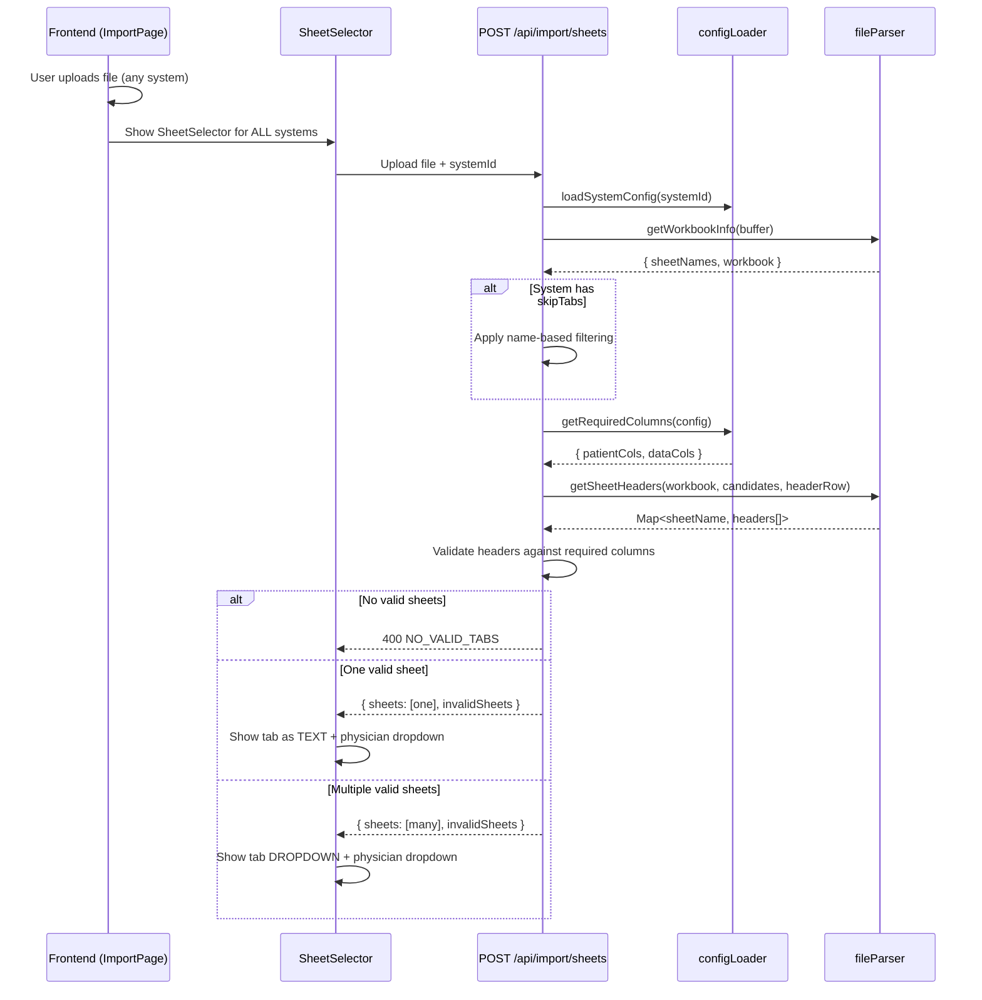
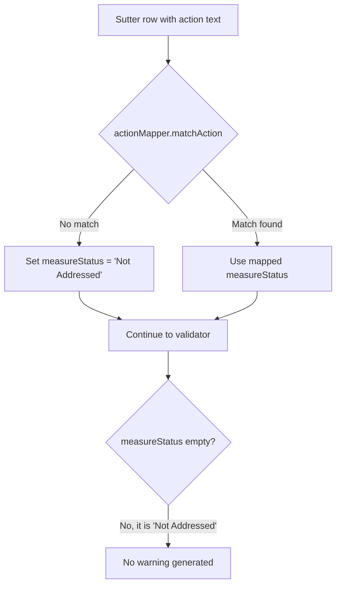
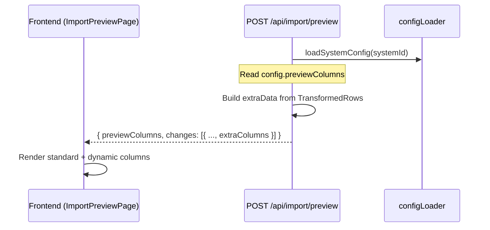
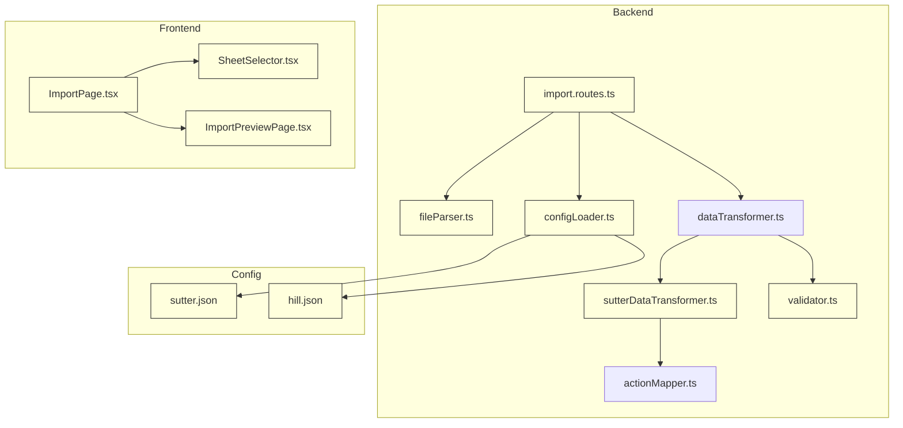

# Design Document: Import Sheet Validation & Flexible Import Steps

## Overview

This feature enhances the import pipeline in three areas:

1. **Universal header-based sheet validation** (REQ-SV-1 through REQ-SV-7): For ALL systems (Hill, Sutter, future), validate each sheet's header row against the system's required columns. Only valid tabs appear in the sheet selector. The sheet selector and physician assignment step is shown for ALL systems after file upload — not just Sutter.

2. **Default "Not Addressed" status** (REQ-SV-8): When the Sutter action mapper cannot map an action text, silently default `measureStatus` to `"Not Addressed"` instead of generating validator warnings.

3. **Configurable preview columns per system** (REQ-SV-9): System JSON configs declare additional columns for the import preview; frontend renders them dynamically.

No database schema changes required.

## Steering Document Alignment

### Technical Standards (tech.md)

- **TypeScript strict typing**: All new interfaces follow existing patterns.
- **Express route pattern**: Uses `try/catch -> next(createError(...))`.
- **SheetJS (XLSX) library**: Single `XLSX.read()` call reused via `getWorkbookInfo()`.
- **JSON configuration**: System-specific behavior driven by config files.
- **Jest/Vitest/Cypress**: Tests follow established patterns.

### Project Structure (structure.md)

| Change Area | File Location |
|-------------|---------------|
| Workbook info + header reading | `backend/src/services/import/fileParser.ts` |
| Route handler (sheets + preview) | `backend/src/routes/import.routes.ts` |
| Config types + required columns | `backend/src/services/import/configLoader.ts` |
| System configs | `backend/src/config/import/sutter.json`, `hill.json` |
| Validator warning suppression | `backend/src/services/import/validator.ts` |
| Transformer status default | `backend/src/services/import/sutterDataTransformer.ts` |
| Import page (generalized steps) | `frontend/src/pages/ImportPage.tsx` |
| Sheet selector (single/multi) | `frontend/src/components/import/SheetSelector.tsx` |
| Preview page (dynamic columns) | `frontend/src/pages/ImportPreviewPage.tsx` |

## Code Reuse Analysis

### Existing Components to Leverage

- **`getSheetNames(buffer)`** in `fileParser.ts`: Will delegate to new `getWorkbookInfo()`.
- **`parseExcel()`** in `fileParser.ts`: Already supports `headerRow` option. Pattern reused for header reading.
- **`matchesSkipPattern()`** in `import.routes.ts`: Unchanged; name-based filtering runs first.
- **`isSutterConfig()` / `isHillConfig()` type guards**: Used for system-specific branching.
- **`loadSystemConfig()`** in `configLoader.ts`: Loads system config; extended with `getRequiredColumns()`.
- **`SheetSelector.tsx`**: Generalized to handle all systems, single-tab text, multi-tab dropdown.
- **`ImportPage.tsx`**: Sheet selector step moved from Sutter-only to universal.

## Architecture

### Area 1: Universal Sheet Validation Flow



### Area 2: Default "Not Addressed" Status Flow



### Area 3: Configurable Preview Columns Flow



### System Context



Yellow-highlighted nodes are files that will be modified.

## Components and Interfaces

### Component 1: `getWorkbookInfo()` and `getSheetHeaders()` (fileParser.ts)

```typescript
/**
 * Read workbook from buffer. Returns sheet names + workbook object.
 * Single XLSX.read() call — reused for both sheet names and headers.
 */
export function getWorkbookInfo(buffer: Buffer): {
  sheetNames: string[];
  workbook: XLSX.WorkBook;
};

/**
 * Read header rows from specified sheets in an already-loaded workbook.
 * NO second XLSX.read() call (satisfies REQ-SV-7 AC 3).
 */
export function getSheetHeaders(
  workbook: XLSX.WorkBook,
  sheetNames: string[],
  headerRowIndex: number
): Map<string, string[]>;
```

**Implementation notes:**
- `getWorkbookInfo()` calls `XLSX.read(buffer, { type: 'buffer' })` once.
- `getSheetHeaders()` accepts the workbook object — no re-parsing.
- Existing `getSheetNames()` preserved for backward compatibility, delegates to `getWorkbookInfo()`.
- For each sheet, uses `XLSX.utils.sheet_to_json(worksheet, { header: 1, range: headerRowIndex })` to read only the header row.
- If a sheet has fewer rows than `headerRowIndex + 1`, returns empty array.
- If reading a sheet throws, catches error, logs, returns empty array.
- Trims whitespace from each header value.

### Component 2: `getRequiredColumns()` (configLoader.ts)

```typescript
interface RequiredColumns {
  patientColumns: string[];  // e.g., ["Patient", "DOB"] for Hill, ["Member Name", "Member DOB"] for Sutter
  dataColumns: string[];     // e.g., first 3 measureColumns keys for Hill, dataColumns for Sutter
  minDataColumns: number;    // How many data columns must match (1)
}

/**
 * Derive required columns from any system config.
 * Works for both Hill-style (measureColumns) and Sutter-style (dataColumns) configs.
 */
export function getRequiredColumns(config: HillSystemConfig | SutterSystemConfig): RequiredColumns;
```

**Implementation:**
- For Hill: `patientColumns` = keys from `config.patientColumns` mapped to `memberName` and `memberDob` (currently `"Patient"` and `"DOB"`). `dataColumns` = first N keys from `config.measureColumns` (enough to identify the sheet — e.g., 3 measure column names).
- For Sutter: `patientColumns` = keys mapped to `memberName` and `memberDob` (currently `"Member Name"` and `"Member DOB"`). `dataColumns` = `config.dataColumns` entries (e.g., `"Request Type"`, `"Possible Actions Needed"`).
- `minDataColumns = 1` for both systems (sheet must have at least one data column).

### Component 3: `validateSheetHeaders()` (import.routes.ts)

```typescript
interface InvalidSheet {
  name: string;
  reason: string;
}

/**
 * Validate sheet headers against required columns from system config.
 * Case-insensitive, whitespace-trimmed comparison.
 */
function validateSheetHeaders(
  sheetName: string,
  headers: string[],
  required: RequiredColumns
): InvalidSheet | null;
```

**Implementation:**
- Build a set of lowercase trimmed headers.
- Check minimum non-empty cells (>= 3).
- Check all `required.patientColumns` present (case-insensitive).
- Check at least `required.minDataColumns` from `required.dataColumns` present.
- Return null if valid, `{ name, reason }` if invalid.

### Component 4: Updated `POST /api/import/sheets` handler

**Algorithm (generalized for all systems):**

```
1. { sheetNames: allSheets, workbook } = getWorkbookInfo(buffer)
2. IF config has skipTabs:
     skippedSheets = allSheets filtered by skipTabs patterns
     candidateSheets = allSheets - skippedSheets
   ELSE:
     skippedSheets = []
     candidateSheets = allSheets
3. required = getRequiredColumns(config)
4. headerMap = getSheetHeaders(workbook, candidateSheets, config.headerRow ?? 0)
5. For each candidate:
     result = validateSheetHeaders(sheet, headerMap.get(sheet), required)
     If invalid: add to invalidSheets
     If valid: add to validSheets
6. IF validSheets is empty:
     IF skippedSheets.length > 0 AND invalidSheets.length > 0:
       Return 400: "No valid data tabs found. {X} excluded by name, {Y} excluded due to missing columns."
     ELSE IF invalidSheets.length > 0:
       Return 400: "No valid data tabs found. {N} tab(s) excluded due to missing required columns."
     ELSE:
       Return 400: "No valid tabs found in the uploaded file."
7. Return { sheets: validSheets, totalSheets, filteredSheets: validSheets.length,
            skippedSheets, invalidSheets }
```

**Updated response schema:**

```typescript
interface SheetsResponse {
  sheets: string[];               // Valid sheets (passed all filters)
  totalSheets: number;            // Total sheets in workbook
  filteredSheets: number;         // Count of valid sheets
  skippedSheets: string[];        // Excluded by name-based filtering
  invalidSheets?: InvalidSheet[]; // Excluded by header validation (NEW)
}
```

### Component 5: Generalized `ImportPage.tsx`

**Current behavior:**
- Sheet selector step only shown for Sutter (`isSutter && file`)
- Hill goes directly from file upload to preview
- Physician selection is a separate step for Hill STAFF/ADMIN

**New behavior:**
- Sheet selector step shown for ALL systems after file upload
- Physician selection is INSIDE the sheet selector (unified)
- Remove the separate physician step (Step 3) — it's now part of the sheet selector
- `isSutter` checks removed from sheet selector visibility

**Key changes:**
```typescript
// OLD: {isSutter && file && (<SheetSelector .../>)}
// NEW: {file && (<SheetSelector .../>)}

// OLD: const showPhysicianStep = needsPhysicianSelection && !isSutter;
// NEW: Remove showPhysicianStep — physician selection is always in SheetSelector

// SheetSelector now handles:
// - Auto-detect single tab vs. multi tab
// - Physician dropdown (for STAFF/ADMIN) or auto-assign (for PHYSICIAN)
```

**Step numbering simplification:**
```
Step 1: Select Healthcare System
Step 2: Choose Import Mode
Step 3: Upload File
Step 4: Select Tab & Physician  ← Always shown after file upload, for ALL systems
```

### Component 6: Updated `SheetSelector.tsx`

**Current:** Always shows a dropdown, only used for Sutter.

**New behavior:**

```typescript
interface SheetSelectorProps {
  file: File;
  systemId: string;
  physicians: Physician[];
  userRole: 'PHYSICIAN' | 'STAFF' | 'ADMIN';
  onSelect: (sheetName: string, physicianId: number) => void;
  onError: (error: string) => void;
}
```

**Display logic:**
- If `sheets.length === 1`: Show tab name as **static text** (e.g., "Importing from: Sheet1")
- If `sheets.length > 1`: Show **dropdown** for tab selection
- After tab is identified: Show **physician dropdown** (for STAFF/ADMIN) or auto-assign (for PHYSICIAN role — no dropdown, show physician name as text)
- If `invalidSheets.length > 0`: Show expandable info note below tab display

**Single tab display:**
```tsx
{sheets.length === 1 ? (
  <div className="px-4 py-2 bg-gray-50 rounded-lg text-gray-900 font-medium">
    Importing from: {sheets[0]}
  </div>
) : (
  <select ...>
    <option value="">-- Select a tab --</option>
    {sheets.map(s => <option key={s} value={s}>{s}</option>)}
  </select>
)}
```

**Physician auto-assign for PHYSICIAN role:**
```tsx
{userRole === 'PHYSICIAN' ? (
  <div className="px-4 py-2 bg-gray-50 rounded-lg text-gray-700">
    Importing for: {currentPhysicianName}
  </div>
) : (
  <select ...>  {/* physician dropdown */}
  </select>
)}
```

**Invalid sheets note (unchanged from earlier design):**
```tsx
{invalidSheets.length > 0 && (
  <div role="note" className="mt-2 text-sm text-gray-500">
    <button onClick={toggleExpand} className="text-blue-600 hover:underline" aria-expanded={expanded}>
      {invalidSheets.length} tab(s) excluded: missing required import columns
    </button>
    {expanded && (
      <ul className="mt-1 text-xs text-gray-400 list-disc list-inside">
        {invalidSheets.map(s => <li key={s.name}>{s.name}: {s.reason}</li>)}
      </ul>
    )}
  </div>
)}
```

### Component 7: Updated `validateRow()` in `validator.ts`

Suppress "measure status is empty" warning for Sutter:

```typescript
// For Sutter: transformer defaults unmapped actions to "Not Addressed",
// so warning is suppressed. For Hill/other: keep warning.
if (!row.measureStatus && systemId !== 'sutter') {
  errors.push({ ... warning ... });
}
```

`validateRows()` calls in `import.routes.ts` must pass `systemId`.

### Component 8: Updated `sutterDataTransformer.ts`

Safety net: if action mapper match has empty measureStatus, default it:

```typescript
measureStatus = match.measureStatus || 'Not Addressed';
```

### Component 9: Config schema for `previewColumns`

**New types in `configLoader.ts`:**

```typescript
export interface PreviewColumnDef {
  field: string;   // Internal field name
  label: string;   // Display header
  source: string;  // Source column in import file
}

// SystemConfigBase gains:
previewColumns?: PreviewColumnDef[];
```

**Updated `sutter.json`:**
```json
{
  "previewColumns": [
    { "field": "statusDate", "label": "Status Date", "source": "Measure Details" },
    { "field": "possibleActionsNeeded", "label": "Possible Actions Needed", "source": "Possible Actions Needed" }
  ]
}
```

**`hill.json`** unchanged (no `previewColumns` = standard columns only).

### Component 10: Preview columns data pipeline

**Data flow:**

1. **Transform phase** (`sutterDataTransformer.ts`): `TransformedRow` already has `statusDate`, `notes`, `tracking1`. Add `sourceActionText?: string | null` for raw action text.

2. **Diff phase** (`diffCalculator.ts`): `DiffChange` extended with `extraData?: Record<string, string | null>`. When building a change, `extraData` is copied from `TransformedRow` using the `previewColumns` config.

3. **Preview cache** (`previewCache.ts`): Stores serialized response including `previewColumns` and `extraData`. No schema change needed.

4. **Preview response** (`import.routes.ts`):
```typescript
function buildExtraColumns(
  change: DiffChange,
  previewColumns: PreviewColumnDef[]
): Record<string, string | null> {
  const result: Record<string, string | null> = {};
  for (const col of previewColumns) {
    result[col.field] = change.extraData?.[col.field] ?? null;
  }
  return result;
}
```

5. **GET preview endpoint**: Same `previewColumns` and `extraColumns` in response.

**Updated response schema:**

```typescript
// POST /api/import/preview and GET /api/import/preview/:previewId
{
  // ... existing fields ...
  previewColumns?: PreviewColumnDef[];
  changes: [{
    // ... existing fields ...
    extraColumns?: Record<string, string | null>;
  }]
}
```

### Component 11: Updated `ImportPreviewPage.tsx`

Renders dynamic columns from `previewColumns` metadata:

```typescript
interface PreviewChangesTableProps {
  changes: PreviewChange[];
  previewColumns?: PreviewColumnDef[];  // NEW
}

interface PreviewChange {
  // ... existing fields ...
  extraColumns?: Record<string, string | null>;  // NEW
}
```

Extra `<th>` and `<td>` elements rendered for each `previewColumns` entry.

## Data Models

### No Database Schema Changes

All changes in: JSON configs, TypeScript interfaces, API response shapes, frontend state.

### Configuration Schema Changes

**`hill.json` addition (optional):**
```json
{
  "headerRow": 0
}
```
Note: `headerRow` defaults to 0 if not specified, so Hill doesn't need this explicitly. But it can be added for clarity.

**`sutter.json` addition:**
```json
{
  "previewColumns": [
    { "field": "statusDate", "label": "Status Date", "source": "Measure Details" },
    { "field": "possibleActionsNeeded", "label": "Possible Actions Needed", "source": "Possible Actions Needed" }
  ]
}
```

### API Response Schema Changes

**`POST /api/import/sheets` (additive):**
```typescript
{
  sheets: string[];
  totalSheets: number;
  filteredSheets: number;
  skippedSheets: string[];
  invalidSheets?: { name: string; reason: string; }[];  // NEW
}
```

**`POST /api/import/preview` (additive):**
```typescript
{
  // ... existing fields ...
  previewColumns?: { field: string; label: string; source: string; }[];  // NEW
  changes: [{ /* existing */ extraColumns?: Record<string, string | null>; }]  // NEW
}
```

## Error Handling

### Error 1: All sheets fail header validation
Return 400 `NO_VALID_TABS` with counts of excluded sheets and expected columns. Works for all systems.

### Error 2: Corrupted sheet header
Catch error in `getSheetHeaders()`, log, return empty array for that sheet. Treated as invalid. Other sheets unaffected.

### Error 3: Header row out of bounds
Returns empty array. Sheet treated as invalid with reason "Header row not found or empty".

### Error 4: CSV with wrong system
Single-sheet CSV uploaded for wrong system. Header validation catches mismatched columns. Returns NO_VALID_TABS.

### Error 5: Preview columns missing data
`extraColumns` value is `null`. Frontend renders empty cell.

## Design Decisions

### DD-1: Sheet selector for ALL systems
Previously sheet selection was Sutter-only. Now ALL systems get the sheet selector step. This provides a consistent UX and lets Hill users confirm which tab is being imported. For single-tab files, the tab is shown as text (no dropdown), so there's minimal added friction.

### DD-2: Physician selection moved into SheetSelector
Previously STAFF/ADMIN physician selection was a separate step (Step 3) for Hill, and inside SheetSelector for Sutter. Now it's always inside SheetSelector, simplifying the flow to 4 consistent steps for all systems.

### DD-3: PHYSICIAN role auto-assigns
When a PHYSICIAN user imports, there's no physician dropdown — they're auto-assigned. The SheetSelector shows their name as text.

### DD-4: No header-row fallback during discovery
Fallback scanning (checking multiple rows for headers) only applies during the full parse in the preview step. Sheet discovery reads only the configured `headerRow` index for performance.

## Testing Strategy

### Unit Testing (Jest — Backend)

**New:** `backend/src/services/import/__tests__/sheetValidation.test.ts`

| Test Case | Description |
|-----------|-------------|
| `getWorkbookInfo` returns sheet names + workbook | Single XLSX.read() |
| `getSheetHeaders` reads correct row index | Headers at row 3 for Sutter, row 0 for Hill |
| `getSheetHeaders` returns empty for out-of-bounds | Sheet with fewer rows than headerRow |
| `getSheetHeaders` trims whitespace | `"  Patient  "` → `"Patient"` |
| `getRequiredColumns` for Hill config | Derives Patient, DOB, measure columns |
| `getRequiredColumns` for Sutter config | Derives Member Name, Member DOB, data columns |
| `validateSheetHeaders` accepts valid Hill tab | Patient + DOB + measure column present |
| `validateSheetHeaders` accepts valid Sutter tab | Member Name + DOB + data column present |
| `validateSheetHeaders` rejects invalid tab | Missing required columns |
| `validateSheetHeaders` is case-insensitive | `"patient"` matches `"Patient"` |
| Sutter: no warning for defaulted measureStatus | systemId='sutter' suppresses warning |
| Hill: warning still generated | Default behavior unchanged |

**Updated:** `backend/src/services/import/__tests__/import.routes.test.ts`

| Test Case | Description |
|-----------|-------------|
| POST /sheets for Hill: validates headers | Hill tabs filtered by column structure |
| POST /sheets for Sutter: validates headers after skipTabs | Two-stage filtering |
| POST /sheets: returns invalidSheets in response | New field present |
| POST /sheets: returns 400 when all sheets invalid | NO_VALID_TABS for any system |
| POST /preview: includes previewColumns for Sutter | Metadata in response |
| POST /preview: no previewColumns for Hill | Standard columns only |

### Component Testing (Vitest — Frontend)

**Updated:** `SheetSelector.test.tsx`

| Test Case | Description |
|-----------|-------------|
| Single tab: shows text, not dropdown | Tab name as static text |
| Multiple tabs: shows dropdown | Tab selection dropdown |
| PHYSICIAN role: no physician dropdown | Auto-assigned |
| STAFF/ADMIN: physician dropdown shown | Selection required |
| Invalid sheets note shown when present | Expandable detail |
| Invalid sheets note hidden when empty | No note |
| Works for Hill system | Not Sutter-specific |
| Works for Sutter system | Existing behavior preserved |

**Updated:** `ImportPage.test.tsx`

| Test Case | Description |
|-----------|-------------|
| Sheet selector shown for Hill after file upload | Universal step |
| Sheet selector shown for Sutter after file upload | Existing behavior |
| No separate physician step | Merged into SheetSelector |

**Updated:** `ImportPreviewPage.test.tsx`

| Test Case | Description |
|-----------|-------------|
| Extra columns rendered when previewColumns present | Dynamic headers |
| No extra columns when previewColumns absent | Backward compatible |
| Empty cells for null extraColumns values | No placeholder |

### E2E Testing

**Cypress:** `sutter-sheet-validation.cy.ts`

| Test Case | Description |
|-----------|-------------|
| Hill import: single tab shown as text | No dropdown |
| Sutter import: dropdown excludes invalid tabs | Header validation |
| Sutter import: invalid sheets note displayed | UI verification |
| Sutter preview: extra columns shown | statusDate + Actions |

**Visual browser review (MCP Playwright):**

| Verification | Description |
|--------------|-------------|
| Hill import: single tab as text + physician selector | Screenshot |
| Sutter import: multi-tab dropdown + physician selector | Screenshot |
| Invalid sheets expandable note | Screenshot |
| Preview with dynamic columns | Screenshot |

## Implementation Order

1. **Area 2: Default "Not Addressed" status** (smallest, isolated to validator + transformer)
2. **Area 1: Universal sheet validation** (backend: fileParser, configLoader, routes → frontend: ImportPage, SheetSelector)
3. **Area 3: Configurable preview columns** (config + preview endpoint + frontend rendering)
